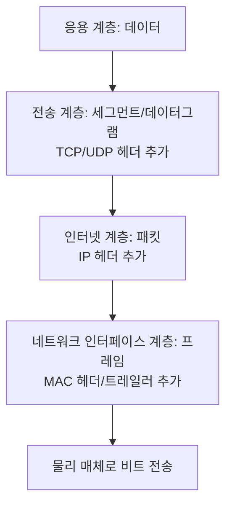

# OSI 7계층과 TCP-IP 4계층

## 핵심 정의
OSI(Open Systems Interconnection) 7계층은 국제표준화기구(ISO)가 네트워크 통신 과정을 7개의 계층으로 나눠 정의한 참조 모델(reference model)이다. 물리 계층부터 응용 계층까지 각 계층이 독립적인 역할을 수행하며, 하위 계층은 상위 계층에 서비스를 제공하는 구조다. ISO/IEC 7498-1 및 ITU-T X.200으로 표준화된 참조 모델이며, 인터넷 구현에서는 네트워크 통신을 설명하고 문제를 계층별로 분리해 분석하기 위한 개념적 틀로 주로 활용된다.

TCP/IP 4계층은 실제 인터넷에서 사용되는 프로토콜 스택으로, OSI보다 먼저 실무에서 구현되었고 이후 OSI 모델과 매핑되어 설명되는 경우가 많다. 네트워크 인터페이스(링크), 인터넷, 전송, 응용 계층으로 구성되며, OSI의 여러 계층 개념을 압축해서 포함한다.

## 동작 원리 / 구조

### 계층 대응표

| OSI 7계층 | 역할 | 대표 프로토콜/장비 | TCP/IP 4계층 |
|---|---|---|---|
| 7. 응용(Application) | 사용자 서비스 제공 | HTTP, FTP, SMTP, DNS | 응용 계층 |
| 6. 표현(Presentation) | 인코딩, 암호화, 압축 | SSL/TLS, JPEG, ASCII | 응용 계층 |
| 5. 세션(Session) | 연결 수립/유지/종료 | 세션 관리(RPC, NetBIOS) | 응용 계층 |
| 4. 전송(Transport) | 종단 간 신뢰성/흐름 제어 | TCP, UDP | 전송 계층 |
| 3. 네트워크(Network) | 경로 설정, 논리 주소 | IP, ICMP, 라우터 | 인터넷 계층 |
| 2. 데이터링크(Data Link) | 프레임 전송, MAC 주소 | Ethernet, 스위치 | 네트워크 인터페이스 계층 |
| 1. 물리(Physical) | 비트 전송, 전기 신호 | 케이블, 허브(NIC는 L1·L2 기능 포함) | 네트워크 인터페이스 계층 |

### 데이터 캡슐화(encapsulation) 흐름

송신 측에서는 상위 계층 데이터에 각 계층 헤더가 순차적으로 추가되는 캡슐화(encapsulation)가 일어나고, 수신 측에서는 역순으로 헤더를 제거하는 역캡슐화(decapsulation)가 일어난다. 각 계층은 같은 계층끼리만 통신한다고 가정하는 논리적 통신(peer-to-peer communication) 모델을 따른다.

### 자바 애플리케이션 관점 예시
Spring Boot 애플리케이션에서 `RestTemplate`이나 `WebClient`로 외부 API를 호출할 때, 개발자가 다루는 것은 응용 계층(HTTP 요청/응답)뿐이지만 실제로는 OS의 TCP 스택이 전송 계층, 커널의 네트워킹 서브시스템이 인터넷/링크 계층을 처리한다. `Connection reset`, `SocketTimeoutException` 같은 예외는 전송/인터넷 계층 문제가 응용 계층까지 올라온 결과다.

계층 대응표의 TLS·RPC 등은 역할을 이해하기 위한 비유이며 TCP/IP 프로토콜을 OSI 계층 하나에 규범적으로 고정한 분류가 아니다. 타임아웃·연결 reset은 애플리케이션 지연이나 프록시 정책 때문에도 발생하므로 예외 이름만으로 네트워크 계층 장애를 확정하지 않는다.

## 실무 관점
- 장애 분석 시 계층별로 원인을 좁혀나가는 사고방식이 유용하다. 예: "핑(ICMP)은 되는데 애플리케이션 응답이 없다" → 해당 ICMP 경로는 동작하므로, 4계층(포트 차단, 방화벽) 또는 7계층(애플리케이션 로직) 문제로 좁힘.
- L4 로드밸런서와 L7 로드밸런서의 차이는 이 모델에서 나온다. L4는 IP/포트 기반으로 라우팅하고, L7(예: Nginx, ALB의 HTTP 리스너)은 URL 경로, 헤더, 쿠키 기반으로 라우팅한다. 마이크로서비스 환경에서 API Gateway를 L7 장비로 두는 이유가 여기 있다.
- `tcpdump`, `Wireshark` 같은 패킷 캡처 도구는 계층별 헤더를 그대로 보여주므로, 계층 개념을 알아야 캡처 결과를 해석할 수 있다.
- 흔한 실수: "TCP는 3계층, IP는 4계층"처럼 순서를 혼동하는 경우. TCP는 전송(4계층/OSI 기준), IP는 네트워크(3계층)다. TCP/IP라는 이름 때문에 순서를 헷갈리기 쉽다.
- MTU(Maximum Transmission Unit) 설정, Jumbo Frame 같은 튜닝은 2계층/3계층 경계에서 발생하며, 컨테이너 오버레이 네트워크(예: Docker, Kubernetes CNI)에서 캡슐화 오버헤드로 인한 MTU 불일치 문제가 실무에서 종종 발생한다.

## 심화 Q&A

### Q. OSI 7계층 모델이 실제로 그대로 구현되어 쓰이지 않는데도 왜 계속 배우고 참조하는가?
A. OSI 기본 모델은 특정 프로토콜의 구현 명세가 아니라 통신 문제를 계층별로 분리해서 사고하기 위한 참조 모델이기 때문이다. 장애의 원인을 "이건 물리적 단선 문제인지, IP 라우팅 문제인지, 애플리케이션 로직 문제인지" 식으로 좁혀나가는 데 유용한 공용 어휘를 제공한다. TCP/IP 4계층은 실제 구현 스택이고, OSI는 그 위에 얹어 설명하는 개념 도구라고 보면 된다.

### Q. 세션 계층, 표현 계층이 TCP/IP 모델에서는 왜 응용 계층으로 통합되었는가?
A. TCP/IP는 실무에서 필요에 의해 만들어진 스택이라, 세션 관리(연결 유지)나 데이터 표현(암호화, 인코딩)은 별도 계층으로 분리하지 않고 각 응용 프로토콜이나 라이브러리(TLS, 애플리케이션의 세션 관리 로직)가 알아서 처리하도록 두었다. 예를 들어 HTTPS의 TLS 암호화는 OSI 기준 표현 계층 역할을 하지만, TCP/IP 모델에서는 전송 계층 위, 응용 계층 아래에 위치하는 것으로 취급되며 엄밀한 계층 구분보다는 실용성을 택한 결과다.

### Q. L4 로드밸런서와 L7 로드밸런서를 선택할 때 트레이드오프는 무엇인가?
A. L4는 IP/포트만 보고 라우팅하므로 처리 속도가 빠르고 오버헤드가 적지만, HTTP 헤더나 URL 기반 라우팅, 콘텐츠 기반 캐싱 같은 세밀한 제어가 불가능하다. L7은 HTTP 요청 내용을 분석해 라우팅하므로 마이크로서비스의 경로 기반 라우팅, A/B 테스트, 세션 어피니티(sticky session) 등에 유리하지만 패킷을 더 깊이 파싱해야 해서 지연과 CPU 비용이 늘어난다. 대규모 트래픽에서는 L4로 1차 분산 후 L7로 세부 라우팅하는 계층적 구조를 쓰기도 한다.

### Q. 같은 물리 네트워크 안에서 캡슐화된 패킷이 계층을 오갈 때, 스위치와 라우터는 각각 어느 계층까지 헤더를 확인하는가?
A. 일반 L2 스위치의 기본 전달은 MAC 주소와 VLAN에 기반한다. ACL·QoS·멀티캐스트 처리 등으로 IP/포트도 살펴볼 수 있고 L3 스위치는 라우팅도 수행한다. 라우터(3계층 장비)는 IP 헤더의 목적지 주소를 보고 경로를 결정하며, 이 과정에서 프레임 헤더(2계층)를 벗기고 다시 씌우는 작업(재캡슐화)이 매 홉(hop)마다 일어난다. 반면 TCP/UDP 헤더(4계층)는 라우터가 일반적으로 건드리지 않으며, NAT 장비처럼 포트 정보까지 확인해야 하는 경우에만 예외적으로 4계층 정보를 참조한다.

### Q. 컨테이너 오버레이 네트워크에서 MTU 문제가 왜 발생하며 어느 계층 이슈인가?
A. VXLAN을 사용하는 일부 CNI 구현 등 오버레이 네트워크는 원본 패킷을 다시 캡슐화해서 전송하는데, 이 과정에서 추가 헤더(예: 외부 IPv4 20 + UDP 8 + VXLAN 8 + 내부 Ethernet 14 = 총 50바이트; VXLAN 헤더 자체는 8바이트)가 붙어 실제 전송되는 프레임 크기가 물리 네트워크의 MTU(보통 1500바이트)를 초과할 수 있다. 이는 2~3계층 경계의 문제로, 초과분은 단편화(fragmentation)되거나 드롭되어 간헐적인 통신 실패나 큰 페이로드에서만 발생하는 타임아웃으로 나타난다. 실무에서는 오버레이 네트워크의 인터페이스 MTU를 물리 MTU보다 낮게(예: 1450) 설정해 예방한다.

### Q. 애플리케이션 레벨에서 커넥션 풀(connection pool)을 튜닝하는 것이 계층 모델과 어떤 관련이 있는가?
A. HTTP 커넥션 풀(예: HikariCP는 DB 커넥션이지만 같은 원리, Apache HttpClient의 커넥션 풀)은 매 요청마다 TCP 3-way handshake(전송 계층)와 TLS handshake(표현 계층에 해당하는 작업)를 반복하는 비용을 줄이기 위한 응용 계층의 최적화다. 즉 하위 계층(전송/보안 핸드셰이크)의 비용이 비싸다는 것을 알기 때문에, 상위 계층에서 연결을 재사용하는 전략을 쓰는 것이다. 계층 모델을 이해하면 왜 커넥션 재사용이 성능에 큰 영향을 미치는지 근본 원인을 설명할 수 있다.

## 관련 개념
- [[3-way handshake와 4-way handshake]]
- [[TCP 신뢰성 보장 메커니즘]]
- [[TLS Handshake 과정]]

## 참고 자료

- [ITU-T X.200 (1994)](https://www.itu.int/rec/T-REC-X.200-199407-I/en) — OSI 기본 참조 모델. 확인: 2026-09-08.
- [RFC 1122: Internet Host Requirements](https://www.rfc-editor.org/rfc/rfc1122.html) — TCP/IP 계층. 확인: 2026-09-08.
- [RFC 7348: VXLAN](https://www.rfc-editor.org/rfc/rfc7348.html) — 외부 Ethernet/IP/UDP/VXLAN 캡슐화. 확인: 2026-09-08.
