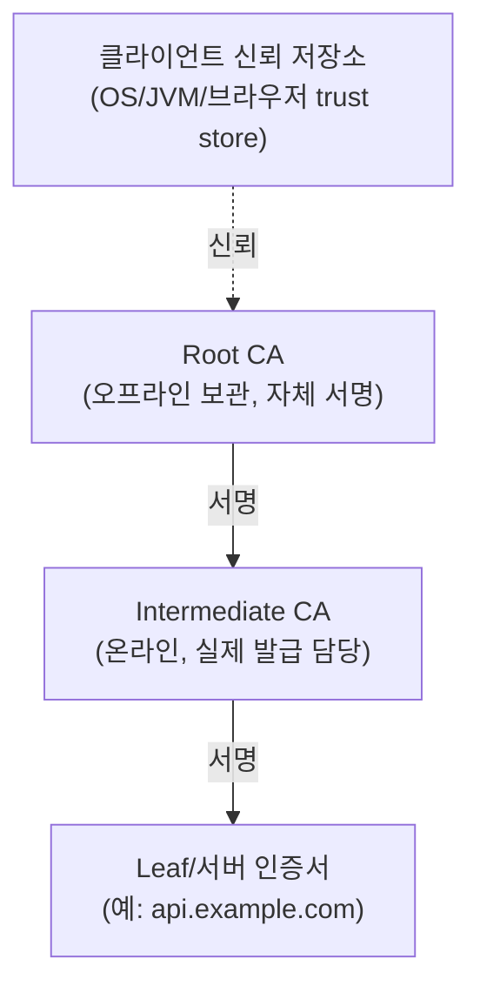
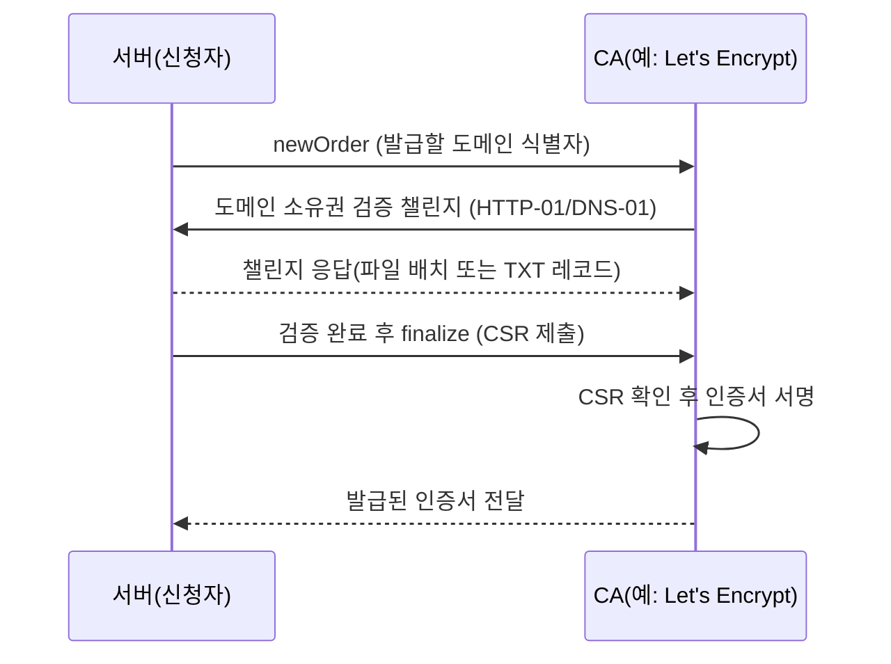

# PKI와 인증서 체계

## 핵심 정의
PKI(Public Key Infrastructure, 공개키 기반구조)는 공개키와 소유자(사람, 서버, 서비스)를 신뢰할 수 있게 연결하기 위한 정책, 절차, 소프트웨어의 집합이다. 핵심 산출물은 X.509 인증서(certificate)로, 공개키·주체(subject)·유효기간·발급자(issuer) 서명을 담고 있으며, 이를 발급·검증·폐기하는 CA(Certificate Authority, 인증기관)와 검증 체계 전체를 묶어 PKI라고 부른다. TLS Handshake에서 서버(또는 클라이언트) 인증에 쓰이는 인증서가 신뢰할 수 있는지 판단하는 근거가 바로 이 PKI 체계다.

## 동작 원리 / 구조

### 신뢰 체인 (Chain of Trust)

- **Root CA**: 자체 서명(self-signed) 인증서를 가진 최상위 신뢰점. 유출 위험을 최소화하기 위해 평소 오프라인 상태로 보관하고, 발급 작업은 하위 Intermediate CA에 위임한다.
- **Intermediate CA**: Root의 서명을 받아 실제 리프 인증서 발급 업무를 수행한다. Root가 손상되지 않아도 Intermediate만 폐기하고 재발급할 수 있어 피해 범위를 격리한다.
- **Leaf 인증서**: 실제 서버/서비스가 사용하는 인증서. 검증자는 Leaf → Intermediate → Root 순으로 서명을 거슬러 올라가며, 최종적으로 자신의 신뢰 저장소(trust store)에 있는 Root와 일치하는지 확인한다.
- 서버는 Leaf 인증서만 배포하면 안 되고, 검증자가 Intermediate를 별도로 갖고 있지 않을 수 있으므로 **Leaf + Intermediate 체인 전체**를 함께 전송해야 한다(TLS Certificate 메시지).

### 인증서 발급 절차 (예: ACME 프로토콜)

- CSR(Certificate Signing Request)은 신청자가 개인키로 서명하고 공개키·주체 정보를 담은 요청서다. **개인키는 절대 CA에 전송하지 않는다.**
- 도메인 검증(DV, Domain Validation)은 HTTP-01(지정 경로에 파일 배치) 또는 DNS-01(TXT 레코드 등록) 방식이 흔하다. EV(Extended Validation)/OV(Organization Validation)는 조직 실체 확인까지 요구하지만, 주요 브라우저 UI에서 차별적 표시를 제거한 지 오래라 실무 비중은 낮아지는 추세다.

### 인증서 폐기 확인

| 방식 | 동작 | 한계 |
|---|---|---|
| CRL (Certificate Revocation List) | CA가 폐기 목록을 주기적으로 배포 | 목록이 커지고 갱신 지연 발생 |
| OCSP (Online Certificate Status Protocol) | 검증자가 개별 인증서 상태를 실시간 조회 | CA에 조회 트래픽 집중, 조회 시점에 사용자가 어떤 사이트에 접속하는지 CA에 노출되는 프라이버시 문제 |
| OCSP Stapling | 서버가 미리 받아둔 OCSP 응답을 핸드셰이크에 첨부 | 클라이언트가 CA에 직접 묻지 않아도 됨, 서버가 주기적으로 갱신 필요 |

### 인증서 유효기간 단축 추세
CA/Browser Forum이 2025년 승인한 정책(SC-081v3)에 따라 공개 신뢰 TLS 인증서의 최대 유효기간이 단계적으로 단축된다: 2026-03-15 이후 발급분 200일, 2027-03-15 이후 발급분 100일, 2029-03-15 이후 발급분 47일로 줄어든다. 이는 자동 발급/갱신(ACME 기반 자동화)을 사실상 필수로 만드는 변화이며, 수동으로 인증서를 관리하던 조직은 이 시점 전에 자동 갱신 파이프라인을 갖춰야 한다.

유효기간 단축은 공개 신뢰 TLS subscriber 인증서에 대한 CA/Browser Forum 규칙이며 사설 PKI에 자동 적용되는 보편적 X.509 제한은 아니다. 체인 서명 확인 외에도 Basic Constraints·Key Usage/EKU·이름 제약과 TLS 서비스 이름 검증이 필요하다. 신뢰 앵커는 로컬 정책으로 신뢰하므로 자체 서명이라는 사실만으로 신뢰가 생기지 않는다.

## 실무 관점
- 사내 서비스 간 통신에는 공개 CA 대신 **사설 PKI(private CA)**를 구축해 내부 도메인/서비스 인증서를 발급하는 경우가 많다. Vault PKI secrets engine, cert-manager(쿠버네티스), AWS Private CA 등이 대표적이다. 사설 CA의 Root 인증서는 조직 내 신뢰 저장소에 별도로 배포해야 한다.
- **자체 서명 인증서(self-signed certificate)**를 개발/스테이징 환경에서 쓰다가 신뢰 저장소 등록을 빼먹으면 `PKIX path building failed` 같은 에러로 서버 간 호출이 실패한다. Java 애플리케이션에서는 전용 truststore나 SSL bundle에 사설 Root를 등록할 수 있다. JVM 전역 cacerts를 직접 수정하면 적용 범위와 JDK 교체 영향을 관리해야 한다.
- 중간 인증서 누락은 브라우저에서는 다른 사이트 방문 이력으로 인해 우연히 넘어가기도 하지만, curl이나 Java `HttpClient` 같은 서버 간 통신에서는 그대로 핸드셰이크 실패로 드러난다. 배포 시 풀 체인(full chain)을 배포했는지 `openssl s_client -showcerts`로 확인하는 것이 표준 점검 절차다.
- 인증서 만료로 인한 장애는 반복되는 사고 패턴이다. 만료일을 모니터링(예: Prometheus의 `ssl_exporter`, Datadog SSL 체크)에 편입시키고, 인증서 유효기간 단축 추세에 맞춰 수동 갱신에서 ACME 자동화로 전환하는 것이 권장된다.
- 폐기 확인 방식은 CA와 클라이언트 정책에 따라 다르다. Let’s Encrypt는 2025년에 OCSP 지원을 종료하고 CRL을 제공한다. OCSP를 제공하는 CA에서는 Nginx ssl_stapling을 검토하되 모든 인증서에 적용 가능한 기본 해법으로 간주하지 않는다.
- 키 알고리즘 선택(RSA 2048/4096 vs ECDSA P-256)도 실무 트레이드오프다. ECDSA는 키/서명 크기가 작아 핸드셰이크 오버헤드가 낮지만, 일부 레거시 클라이언트/미들박스 호환성 문제가 있을 수 있어 RSA와 ECDSA 인증서를 동시에 발급해 SNI로 서버 이름을 고르고 지원 서명 알고리즘에 따라 선택하는 이중 인증서(dual cert) 구성을 쓰기도 한다.

### 체인 검증 성공과 서버 이름 일치

신뢰한 CA가 서명한 인증서라도 접속하려는 서비스의 인증서인지는 별도로 확인해야 한다. RFC 6125를 대체한 RFC 9525는 DNS 서비스 이름을 SAN의 `dNSName`으로 검증하고, Subject의 Common Name(CN)에 있는 도메인 문자열로 대체 검증하지 않도록 한다. 레거시 라이브러리의 CN fallback을 현대 명세의 보장으로 이해하지 않는다.

- `*.example.com`의 와일드카드는 맨 왼쪽의 한 레이블만 대체한다. `api.example.com`에는 대응하지만 `example.com`이나 `a.b.example.com`까지 허용하지 않는다.
- IP 주소로 서비스를 식별하면 SAN의 `iPAddress`와 주소 바이트가 일치해야 한다. DNS 이름 인증서가 있다는 이유로 그 이름이 해석된 모든 IP를 IP 식별자로 신뢰하지 않는다.
- SNI는 서버가 인증서를 선택하도록 이름을 전달하는 기능이다. 신뢰 경로 검증이나 클라이언트의 서비스 이름 검증을 대신하지 않는다. 사설 Root를 truststore에 추가한 뒤 hostname verification까지 끄는 방식으로 연결 오류를 덮지 않는다.

JDK 25에서 `SSLSocket`·`SSLEngine`을 직접 사용한다면 TLS 연결 성공만으로 이름 검증까지 켜졌다고 판단하지 않는다. HTTPS 대상의 이름 규칙을 적용하려면 핸드셰이크 전에 `SSLParameters.setEndpointIdentificationAlgorithm("HTTPS")`를 설정해 연결에 적용한다. `HttpClient` 같은 상위 클라이언트의 기본 검증과 raw TLS API의 설정 책임은 다르므로, 신뢰한 인증서이지만 접속 이름이 다른 대조 사례로 확인한다.

## 심화 Q&A

### Q. Root CA를 오프라인으로 보관하고 Intermediate CA로 발급을 위임하는 구조는 어떤 문제를 해결하는가?
Root의 개인키가 유출되면 그 Root 아래의 모든 인증서 체인이 무효화되어야 하는 재앙적 피해가 발생한다. 발급 작업을 온라인 Intermediate CA에 위임하면 공격 표면이 Intermediate로 국한되고, Intermediate가 손상되어도 Root로 새 Intermediate를 재발급해 피해를 격리할 수 있다. Root를 오프라인/HSM으로 보호하면 네트워크 공격 표면을 줄이지만 운영자·백업·서명 절차의 위험은 별도로 관리해야 한다.

### Q. 인증서 유효기간이 47일로 단축되면 운영상 어떤 변화가 필요한가?
수동 갱신 프로세스로는 47일 주기를 감당할 수 없으므로 ACME 같은 프로토콜로 발급-배포-리로드까지 완전 자동화해야 한다. 또한 자동화 파이프라인 자체의 장애(도메인 검증 실패, DNS 전파 지연 등)가 곧바로 서비스 장애로 이어질 위험이 커지므로, 만료 며칠 전 알림뿐 아니라 갱신 실패 시 즉시 재시도하는 로직과 충분한 리드타임 확보가 중요해진다.

### Q. CRL과 OCSP는 각각 어떤 상황에서 폐기 확인이 실패할 수 있는가?
CRL은 목록 크기가 커지면 다운로드/파싱 비용이 늘고, CA가 목록 갱신을 지연하면 최근 폐기된 인증서가 여전히 유효한 것처럼 보일 수 있다. OCSP는 CA 서버가 응답하지 않을 때 클라이언트가 "soft-fail"(검증 실패를 무시하고 통과)하는 구현이 많아, 가용성 장애가 보안 우회로 이어지는 역설이 있다. OCSP Stapling은 서버가 응답을 미리 캐싱해 첨부하므로 이 문제를 완화하지만, 서버가 스테이플된 응답을 갱신하지 않으면 오히려 오래된 상태를 계속 제공하게 된다.

### Q. 사설 PKI를 도입할 때 공개 PKI 대비 추가로 고려해야 할 위험은 무엇인가?
공개 CA는 브라우저/OS 벤더의 감사(CA/Browser Forum 정책, 신뢰 저장소 프로그램)를 거치지만 사설 CA는 조직이 스스로 Root 보호, 키 로테이션, 폐기 처리를 책임져야 한다. Root 개인키 보관 방식(HSM 사용 여부), 신뢰 저장소 배포 자동화(신규 서버/컨테이너에 Root를 어떻게 심을지), Intermediate 로테이션 절차가 갖춰지지 않으면 사설 PKI 자체가 단일 장애점이자 보안 취약점이 된다.

### Q. ECDSA 인증서와 RSA 인증서를 동시에 발급하는 dual cert 구성은 왜 필요한가?
ECDSA는 동일 보안 강도에서 키와 서명 크기가 작아 핸드셰이크 트래픽과 CPU 연산을 줄이지만, 일부 구형 클라이언트나 미들박스가 ECDSA 암호 스위트를 지원하지 않을 수 있다. 서버가 SNI와 ClientHello의 signature_algorithms 및 TLS 버전별 인증서 호환 정보를 보고 RSA와 ECDSA 인증서 중 적합한 것을 선택해 응답하면, 신형 클라이언트는 성능 이득을 보고 구형 클라이언트는 호환성을 유지할 수 있다.

### Q. 인증서 피닝(certificate pinning)은 PKI의 신뢰 체인 검증과 어떻게 다르고, 왜 최근에는 신중하게 쓰이는가?
일반적인 TLS 서버 인증은 허용된 신뢰 앵커까지의 경로·유효기간·용도·제약과 접속 호스트명을 각각 검증하지만, 피닝은 특정 인증서(또는 공개키)만 명시적으로 허용해 CA 침해나 오발급으로 인한 공격을 방어한다. 다만 인증서 로테이션 시 피닝된 값을 갱신하지 않으면 서비스가 완전히 마비되는 자체 장애를 유발하기 쉽고, 유효기간이 짧아지는 최근 추세와도 상성이 나빠 모바일 앱 등 제한된 영역에서만 신중히 적용하는 편이다.

## 관련 개념
- [[TLS Handshake 과정]]
- [[mTLS와 상호 인증]]
- [[시크릿 관리]]

## 참고 자료

- [RFC 5280: X.509 PKI](https://www.rfc-editor.org/rfc/rfc5280.html) — 경로 검증·확장·CRL. 확인: 2026-09-08.
- [RFC 8555: ACME](https://www.rfc-editor.org/rfc/rfc8555.html) — newOrder·authorization·finalize CSR 순서. 확인: 2026-09-08.
- [CA/Browser Forum TLS Baseline Requirements](https://cabforum.org/working-groups/server/baseline-requirements/requirements/) — §6.3.2 공개 신뢰 subscriber 인증서 유효기간. 확인: 2026-09-08.
- [Let’s Encrypt Ending OCSP Support](https://letsencrypt.org/2024/12/05/ending-ocsp/) — 2025 OCSP 종료·CRL 사용. 확인: 2026-09-08.
- [RFC 8446: TLS 1.3](https://www.rfc-editor.org/rfc/rfc8446.html) — signature_algorithms·인증서 체인. 확인: 2026-09-08.

부분 재확인: 2026-09-23. [RFC 9525 §1.3·§6](https://www.rfc-editor.org/rfc/rfc9525.html)의 SAN·CN 배제·와일드카드·IP 식별자 검증을 확인했다. TLS 서버 이름 검증 범위이며 클라이언트 인증서의 업무 신원 매핑 규칙은 별도다. 기존 CA 정책·발급/폐기·라이브러리 구현 전체는 재검증하지 않아 `verified`는 유지한다.

부분 재검증: 2026-10-04. [Java SE 25 JSSE Guide](https://docs.oracle.com/en/java/javase/25/security/java-secure-socket-extension-jsse-reference-guide.html)와 [SSLParameters endpoint identification](https://docs.oracle.com/en/java/javase/25/docs/api/java.base/javax/net/ssl/SSLParameters.html#setEndpointIdentificationAlgorithm(java.lang.String))의 raw TLS 신원 검증 책임을 확인했다. JDK 25.0.4+7·SunJSSE 25의 loopback TLS 1.3에서 임시 CA가 서명한 DNS SAN localhost 인증서를 사용했다. 기본 SSLSocket은 다른 이름도 연결됐고 HTTPS 이름 검증을 켜면 거부했으며, HttpClient 기본 경로는 localhost를 허용하고 IP SAN이 없는 127.0.0.1 접속을 거부했다. SSLEngine·공개 CA·폐기 확인·프록시·다른 TLS 구현은 실행하지 않았고 기존 `verified`는 유지한다.
