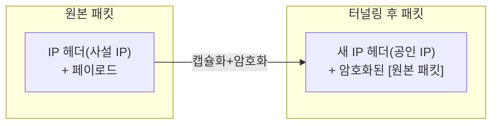
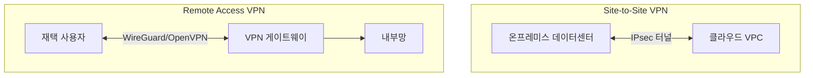

# VPN 기초

## 핵심 정의
이 노트는 암호화 VPN(Virtual Private Network, 가상 사설망)을 다룬다. 공용 네트워크(인터넷) 위에 암호화된 터널(tunnel)을 만들어, 물리적으로 분리된 두 지점(사용자-사내망, 데이터센터-클라우드 VPC 등)이 마치 같은 사설망에 있는 것처럼 통신하게 해주는 기술이다. 터널을 통과하는 패킷은 캡슐화(encapsulation)되어 암호화되므로, 중간 구간의 네트워크 장비는 원본 패킷의 내용과 실제 목적지를 볼 수 없다.

## 동작 원리 / 구조

### 터널링의 기본 개념: 캡슐화

VPN 게이트웨이(또는 클라이언트)는 원본 IP 패킷 전체를 암호화한 뒤, 인터넷에서 라우팅 가능한 새로운 IP 헤더로 감싸서 전송한다. 수신측 게이트웨이가 이를 복호화하고 원본 패킷을 꺼내 내부망으로 전달한다.

### 주요 VPN 방식 비교

| 방식 | 계층 | 특징 |
|---|---|---|
| IPsec (키 교환: IKEv2) | 네트워크 계층(L3) | 표준화가 오래되어 라우터/방화벽 하드웨어 지원이 넓음. 사이트 간(site-to-site) VPN의 사실상 표준 |
| OpenVPN | 애플리케이션 계층 위 TLS 기반 | TCP 443 사용 가능; DPI나 프록시가 OpenVPN을 차단할 수 있음, OTP/LDAP 등 인증 방식이 유연 |
| WireGuard | 네트워크 계층(L3), 커널 통합 | 설계와 암호 구성이 단순하고, ChaCha20-Poly1305 등 현대 암호만 지원해 설정 실수 여지가 적음. 실제 성능은 플랫폼과 경로에서 측정 |

- **IPsec**: AH(Authentication Header)와 ESP(Encapsulating Security Payload) 두 프로토콜로 구성되며, 실무에서는 기밀성까지 제공하는 ESP를 사용한다. 키 교환은 IKE(Internet Key Exchange, 현재는 IKEv2)가 담당한다. 라우터/방화벽 벤더(Cisco, Palo Alto 등) 하드웨어에 광범위하게 내장되어 사이트 간 연결의 기본값으로 쓰인다.
- **OpenVPN**: 제어 채널에서 TLS를 사용하고 별도 데이터 채널로 패킷을 보호하며 인증서 기반 인증, 사용자명/패스워드, MFA 등 다양한 인증 방식을 조합할 수 있다. UDP를 차단하는 제한적인 네트워크에서도 TCP 443 사용을 선택할 수 있다. 이는 HTTPS와 동일한 프로토콜이라는 뜻도 통과 보장도 아니며 TCP-over-TCP 재전송 간섭도 고려한다.
- **WireGuard**: Noise 프로토콜 프레임워크 기반으로 설계가 단순하다. 암호 스위트를 협상하지 않고 Curve25519, ChaCha20-Poly1305로 고정해 설정 실수(약한 암호 스위트 선택 등)를 원천 차단한다. 리눅스 커널에 통합되어 있어 커널 공간에서 암호화가 이뤄지므로 오버헤드가 적다.

### 배치 패턴

- **Site-to-Site VPN**: 두 네트워크(예: 사내 데이터센터와 AWS VPC) 전체를 연결. AWS Site-to-Site VPN, GCP Cloud VPN 등 클라우드 제공사가 관리형으로 제공하며 대부분 IPsec 기반이다.
- **Remote Access VPN**: 개별 사용자의 단말이 원격으로 내부망에 접속. 재택/원격 근무 환경에서 사내 리소스(내부 API, DB 등)에 접근할 때 쓰인다.

VPN이라는 이름 자체가 암호화를 보장하지는 않는다(예: 일부 사업자 사설망 서비스). 여기서는 IPsec ESP 터널·OpenVPN·WireGuard를 가정한다. 터널의 외부 IP와 트래픽 크기·타이밍은 관찰 가능하며, VPN 종료 지점 이후의 보호에는 TLS와 애플리케이션 인가가 필요하다.

## 실무 관점
- 클라우드 인프라 관점에서는 VPN이 온프레미스와 VPC를 잇는 하이브리드 클라우드 연결의 기본 수단이다. AWS의 Site-to-Site VPN, Transit Gateway와 조합해 여러 VPC/온프레미스를 연결하는 허브-스포크(hub-and-spoke) 구성이 흔하다. 더 안정적인 대역폭이 필요하면 VPN 대신 전용선(Direct Connect, Dedicated Interconnect)을 병행한다.
- 원격 근무 확산 이후 Remote Access VPN의 성능/보안 한계(모든 트래픽을 사내망으로 우회시키는 풀 터널링의 대역폭 부담, VPN 게이트웨이 자체가 공격 표면이 되는 문제)로 인해 ZTNA(Zero Trust Network Access)로 전환하는 조직이 늘고 있다. ZTNA는 네트워크 전체를 터널로 묶는 대신 애플리케이션 단위로 접근을 중개하고 매 요청마다 신원/디바이스 상태를 검증한다.
- VPN 게이트웨이 소프트웨어(OpenVPN, IPsec 데몬 등)의 알려진 취약점이 인터넷에 노출된 VPN 엔드포인트를 통해 침투 경로로 악용된 사고 사례가 반복적으로 보고된다. VPN 소프트웨어 패치 적용을 최우선 순위로 관리해야 하는 이유다.
- WireGuard는 공개키 기반 피어 설정이 간결하지만 사용자 인증·MFA·장치 등록·권한 관리 체계는 별도로 구성해야 한다. 신규/기존 환경의 지원 장비와 운영 요구에 따라 IPsec·OpenVPN과 비교한다.
- MTU(Maximum Transmission Unit) 문제는 VPN 운영에서 흔한 트러블슈팅 대상이다. 캡슐화로 헤더가 추가되면 원본 패킷 크기가 경로 MTU를 초과해 단편화(fragmentation)나 블랙홀(패킷 드롭)이 발생할 수 있다. 터널 인터페이스의 MTU를 낮추거나 TCP MSS(Maximum Segment Size) 클램핑으로 대응한다.
- VPN은 네트워크 계층의 암호화 채널일 뿐, 애플리케이션 레벨 인증/인가를 대체하지 않는다. "사내망에 들어왔으니 안전하다"는 암묵적 신뢰(perimeter-based trust)에 의존하면, VPN 계정 하나가 탈취됐을 때 내부망 전체가 노출되는 위험이 있다. 이는 mTLS 기반 제로 트러스트 아키텍처가 대두된 배경이기도 하다.

### WireGuard AllowedIPs와 방화벽을 구분한다

`AllowedIPs`는 송신할 때 **목적지 IP로 피어(peer)를 선택**하고, 수신할 때는 인증·복호화한 패킷의 **출발지 IP가 해당 피어에 허용됐는지 검사**한다. 서버에서 클라이언트 피어에 `10.0.0.2/32`를 지정했다고 해서 그 클라이언트가 `10.0.0.2`라는 목적지에만 접근하도록 제한한 것은 아니다. 내부 서비스의 목적지·포트 제한은 터널 인터페이스의 방화벽과 애플리케이션 인가로 따로 적용한다.

클라이언트의 서버 피어에 `0.0.0.0/0`을 두면 해당 피어에서 온 임의의 IPv4 출발지를 허용하는 의미도 갖는다. OS가 패킷을 터널 인터페이스로 보내는 라우트, WireGuard가 그 안에서 피어를 고르는 설정, 게이트웨이의 전달·방화벽 정책을 나눠 확인해야 한다. 연결 성립만으로 스플릿 터널이나 내부 접근 범위가 의도대로 제한됐다고 판단하지 않는다.

## 심화 Q&A

### Q. VPN과 mTLS는 둘 다 암호화 터널을 제공하는데, 어떤 기준으로 선택하는가?
VPN은 네트워크 계층에서 두 지점(또는 두 네트워크) 사이의 모든 트래픽을 하나의 터널로 묶어 IP 단위로 신뢰를 부여하는 반면, mTLS는 애플리케이션/서비스 단위로 매 연결마다 개별 신원을 증명한다. 사내망-클라우드 인프라 연결처럼 네트워크 전체를 잇는 경우는 VPN이, 마이크로서비스 간 세밀한 신원 기반 통신 제어가 필요한 경우는 mTLS가 적합하다. 제로 트러스트 아키텍처에서는 VPN의 "터널 안은 신뢰" 가정을 줄이고 mTLS/ZTNA로 신뢰 단위를 잘게 쪼개는 방향으로 진화하고 있다.

### Q. WireGuard가 암호 스위트를 협상하지 않고 고정하는 설계는 어떤 장단점이 있는가?
TLS처럼 다양한 암호 스위트를 협상하면 구현 실수나 레거시 호환성 요구로 약한 알고리즘이 허용될 위험이 있다. WireGuard는 현재 안전하다고 검증된 알고리즘 하나만 지원해 이 위험을 원천 차단하고 코드도 단순해진다. 단점은 해당 알고리즘에 심각한 취약점이 발견되면 구현과 프로토콜의 변경·배포가 필요하다는 점이다. 알고리즘 협상을 통한 현장 선택의 유연성은 줄어든다.

### Q. Site-to-Site VPN 대신 클라우드 전용선(Direct Connect 등)을 선택해야 하는 경우는 언제인가?
VPN은 인터넷 경로를 통해 암호화 터널을 만들기 때문에 인터넷 혼잡/장애의 영향을 받고 대역폭 보장이 어렵다. 대용량 데이터 마이그레이션, 낮고 예측 가능한 지연이 필수인 실시간 서비스, 규제상 인터넷 경유 자체가 허용되지 않는 경우에는 물리적으로 격리된 전용선이 필요하다. 다만 전용선은 구축 리드타임과 비용이 크므로, 이중화(VPN을 백업 경로로 병행)하는 구성이 일반적이다.

### Q. Remote Access VPN에서 풀 터널링(full tunneling)과 스플릿 터널링(split tunneling)의 트레이드오프는 무엇인가?
풀 터널링은 사용자의 모든 트래픽(사내 리소스 접근뿐 아니라 일반 웹 서핑까지)을 VPN 게이트웨이로 우회시켜 중앙에서 트래픽을 감시/필터링할 수 있지만, 게이트웨이 대역폭 부담이 크고 사용자 체감 속도가 느려진다. 스플릿 터널링은 사내 리소스로 가는 트래픽만 터널을 태우고 나머지는 로컬 인터넷으로 직접 나가게 해 성능은 좋지만, 감시/보안 정책이 적용되지 않는 트래픽이 생겨 데이터 유출 경로가 될 수 있다.

### Q. VPN 게이트웨이가 침해당했을 때 피해 범위가 큰 이유는 무엇이고 어떻게 완화하는가?
전통적인 VPN은 인증만 통과하면 내부망 전체에 대한 광범위한 네트워크 접근권을 부여하는 경우가 많아, 게이트웨이나 계정 하나가 뚫리면 공격자가 내부망을 자유롭게 스캔/이동(lateral movement)할 수 있다. 이를 완화하려면 VPN 접속 후에도 세그멘테이션(내부 방화벽/[[NAT와 방화벽 기초]] 정책)으로 접근 가능한 자원을 제한하고, MFA를 강제하며, 궁극적으로는 애플리케이션 단위로 접근을 중개하는 ZTNA로 전환해 "접속하면 전체가 보이는" 구조 자체를 없애는 것이 근본적인 대응이다.

### Q. IPsec의 IKE 키 교환 단계가 실패하거나 느려지는 원인은 실무에서 주로 무엇인가?
NAT 뒤에 있는 두 게이트웨이 간 IPsec 협상 시 NAT-T 협상·UDP 4500 통과에 문제가 있으면 IKE가 성립해도 ESP 데이터 통신이 실패할 수 있다. 또한 양쪽 게이트웨이가 지원하는 암호 스위트/DH 그룹 조합이 일치하지 않으면 IKE 협상 단계에서 반복적으로 재시도하다 타임아웃되는 경우가 흔해, 사이트 간 VPN 신규 구축 시 양측 설정의 IKE SA·CHILD SA 파라미터(IKEv1의 Phase 1/2 명칭과 구분)를 사전에 맞춰보는 점검이 필요하다.

## 관련 개념
- [[NAT와 방화벽 기초]]
- [[mTLS와 상호 인증]]
- [[TLS Handshake 과정]]
- [[3-way handshake와 4-way handshake]]

## 참고 자료

- [RFC 7296: IKEv2](https://www.rfc-editor.org/rfc/rfc7296.html) — IKE_SA_INIT·IKE_AUTH·NAT-T. 확인: 2026-09-08.
- [WireGuard Protocol & Cryptography](https://www.wireguard.com/protocol/) — Noise·고정 알고리즘 구성. 확인: 2026-09-08.
- [OpenVPN 2.6 Manual](https://openvpn.net/community-docs/community-articles/openvpn-2-6-manual.html) — control/data channel·UDP/TCP transport. 확인: 2026-09-08.

부분 재검증: 2026-10-04. [WireGuard Cryptokey Routing](https://www.wireguard.com/#cryptokey-routing)의 공식 설계를 기준으로 AllowedIPs의 송신 목적지 선택·수신 출발지 검사와 일반 인터페이스 라우팅의 구분을 확인했다. 특정 커널·wireguard-tools 버전의 기본값은 주장하지 않으며, 실제 VPN·라우팅·방화벽 동작은 실행하지 않았다. 기존 프로토콜·성능 비교 전체는 재검증하지 않아 `verified`는 유지했다.
