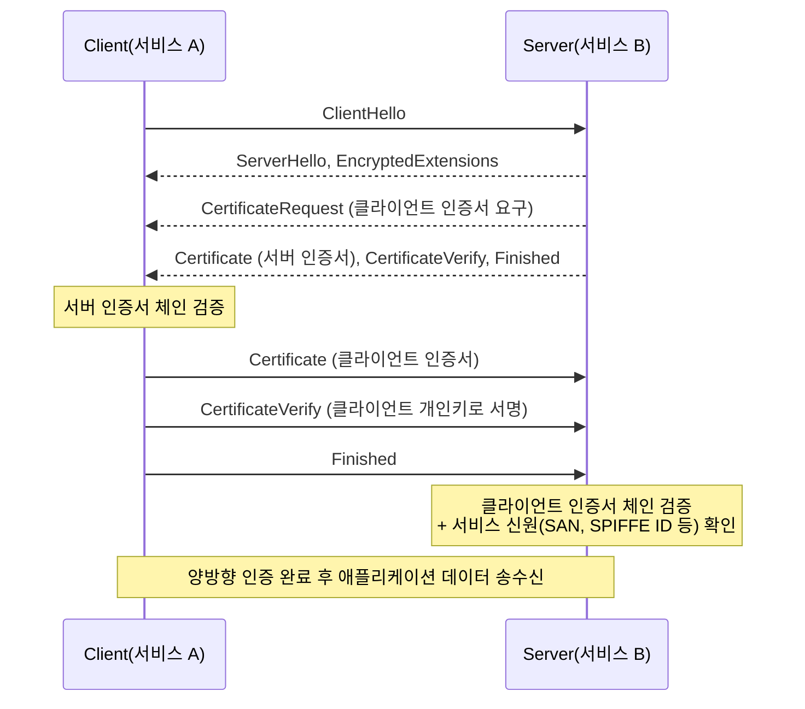
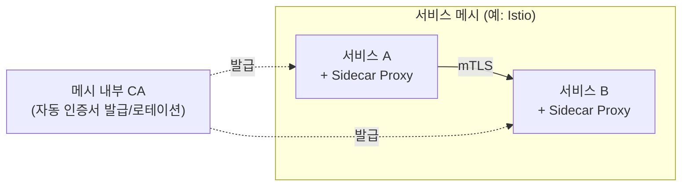

# mTLS와 상호 인증

## 핵심 정의
mTLS(mutual TLS, 상호 TLS)는 일반 TLS와 달리 서버뿐 아니라 클라이언트도 인증서를 제시해 상대방을 검증하는 방식이다. 일반 TLS는 클라이언트가 서버 신원만 확인하지만, mTLS에서는 서버도 클라이언트의 인증서 체인을 검증해 "누가 접속했는지"를 암호학적으로 확인한다. 서비스 간 통신(service-to-service)에서 API 키나 정적 토큰 대신 인증서 기반으로 신원을 증명하고 싶을 때 쓰인다.

## 동작 원리 / 구조

### mTLS 핸드셰이크 흐름 (TLS 1.3 기준)



일반 TLS와의 차이는 서버가 `CertificateRequest`를 추가로 보내고, 클라이언트가 자신의 `Certificate`/`CertificateVerify`를 `Finished` 이전에 함께 전송한다는 점뿐이다. 나머지 키 교환·암호화 메커니즘은 [[TLS Handshake 과정]]과 동일하다.

### 신원 확인 방식
- 서버는 클라이언트 인증서가 신뢰 체인(사설 CA 등)에서 유효한지 확인한 뒤, 인증서의 주체(subject) 또는 SAN(Subject Alternative Name)을 애플리케이션 신원으로 매핑한다.
- 서비스 메시(service mesh) 환경에서는 SPIFFE(Secure Production Identity Framework For Everyone) 표준의 X.509-SVID(SPIFFE Verifiable Identity Document) 인증서 URI SAN에 SPIFFE ID를 담아, "이 워크로드가 어떤 서비스인지"를 URI 형태(`spiffe://cluster.local/ns/default/sa/order-service`)로 표현하는 방식을 Istio 등에서 사용한다. 메시마다 신원 표현은 같지 않으며 Linkerd의 Kubernetes 워크로드 신원은 Pod의 ServiceAccount에 연결된다.

### 아키텍처 배치 패턴



- **애플리케이션 레벨 mTLS**: Spring Boot 등에서 직접 SSL 컨텍스트를 구성해 클라이언트 인증서 검증을 수행. 구현이 애플리케이션 코드/설정에 결합된다.
- **인프라 레벨 mTLS(서비스 메시)**: Istio, Linkerd 같은 서비스 메시가 사이드카 프록시(sidecar proxy) 간 통신에 mTLS를 자동 적용하고, 인증서 발급/로테이션도 메시가 대신 처리한다. 애플리케이션 코드는 mTLS를 전혀 인지하지 않고 평문으로 통신하는 것처럼 작성해도 된다.

## 실무 관점
- 제로 트러스트(Zero Trust) 아키텍처의 핵심 구성 요소로 자주 언급된다. 네트워크 위치(사내망 여부)를 신뢰의 근거로 삼지 않고, 매 연결마다 인증서로 신원을 증명하게 강제한다.
- 서비스 개수가 많아지면 인증서 발급/로테이션을 수동으로 관리하기 불가능해지므로, 사설 PKI 자동화(내부 CA + 짧은 유효기간 + 자동 로테이션)가 사실상 전제 조건이다. 이 부분은 [[PKI와 인증서 체계]]에서 다루는 자동 발급 파이프라인과 직결된다.
- Spring Boot에서 mTLS를 직접 구성할 경우 `server.ssl.client-auth=need`로 클라이언트 인증서를 필수화하고, 트러스트 저장소(truststore)에 허용할 CA를 등록한다. 아래는 개념적인 설정 예시다.

```yaml
server:
  ssl:
    enabled: true
    client-auth: need
    trust-store: classpath:truststore.p12
    trust-store-password: ${TRUSTSTORE_PASSWORD}
    key-store: classpath:keystore.p12
    key-store-password: ${KEYSTORE_PASSWORD}
```

- 흔한 실수는 클라이언트 인증서 검증까지만 하고 애플리케이션 레벨 인가(authorization)를 생략하는 것이다. mTLS는 "누구인지"만 증명할 뿐, "무엇을 할 수 있는지"는 별도의 인가 로직(예: Spring Security의 `X509AuthenticationFilter`로 인증서 주체를 `Authentication` 객체로 매핑한 뒤 권한 부여)이 필요하다. 이 부분은 [[Security Filter Chain]]과 연결된다.
- Istio에서 mTLS를 `PERMISSIVE` 모드로 켜두면 mTLS와 평문 트래픽이 혼재된 과도기를 지원하지만, 이를 "strict"로 전환하지 않고 방치하면 평문 우회 경로가 계속 열려 있는 상태로 남는다. 마이그레이션 후 평문을 금지하려는 범위에는 `STRICT`를 적용한다. Linkerd는 같은 모드명을 사용하는 것으로 가정하지 말고 비메시 소스의 평문 허용 여부를 authorization policy로 제한한다.
- 인증서 회전에 실패하면 기존 인증서가 유효한 동안은 재사용할 수 있지만 만료 후 새 handshake는 실패해야 한다. 이미 성립한 연결은 인증서 만료만으로 즉시 종료되지 않을 수 있으므로 연결 최대 수명과 긴급 신원 차단 정책도 마련한다. 만료 인증서 검증을 끄는 fail-open을 통상적인 복구 수단으로 삼지 않는다.
- 성능 관점에서 mTLS는 TLS 1.3 기준으로도 추가 왕복(RTT)이 발생하지는 않지만(클라이언트 인증서/CertificateVerify가 기존 플로우에 포함됨), 검증해야 할 인증서 체인이 두 배로 늘고 클라이언트 측 서명·서버 측 검증 연산이 추가되므로 CPU 비용이 커진다. 따라서 커넥션 재사용(HTTP Keep-Alive, 커넥션 풀)이 특히 중요해진다.

### ALB의 mTLS passthrough와 L4 TLS 통과를 구분한다

AWS ALB의 `mutual TLS passthrough`는 TLS 암호문을 그대로 백엔드로 보내는 L4 passthrough가 아니다. ALB가 클라이언트 연결을 처리하고, 전체 인증서 체인을 URL 인코딩된 PEM 형식의 `X-Amzn-Mtls-Clientcert` 헤더로 전달하며 체인 검증은 대상 애플리케이션이 맡는다. 반면 `verify` 모드는 ALB가 클라이언트 인증서를 검증한다. 따라서 passthrough 모드에서 헤더의 subject만 추출해 인증 성공으로 처리하면 검증 책임을 빠뜨린다.

어느 모드든 백엔드가 인증서 정보를 신뢰하려면 요청이 신뢰하는 ALB 경로를 통해 왔음을 보장해야 한다. 백엔드 직접 접근과 위조 헤더를 차단하고, 인증서에서 얻은 신원을 실제 업무 권한에 매핑한다. 인증서를 전달받는 것, 유효한 체인을 확인하는 것, 해당 작업을 허용하는 것은 각각 확인해야 할 단계다.

## 심화 Q&A

### Q. mTLS가 있으면 애플리케이션 레벨 인증(JWT 등)이 필요 없는가?
아니다. mTLS는 전송 계층에서 "이 연결의 상대가 누구인지"를 증명하지만, 요청 단위의 세밀한 권한(특정 리소스에 대한 읽기/쓰기 권한, 사용자별 컨텍스트)까지는 표현하지 못한다. 서비스 간 통신에서는 mTLS로 서비스 신원을 확인한 뒤, 최초 요청을 보낸 사용자의 신원/권한은 여전히 JWT 같은 토큰으로 전파하는 조합이 일반적이다. mTLS와 [[JWT 인증]]은 대체 관계가 아니라 계층이 다른 보완 관계다.

### Q. 서비스 메시가 mTLS를 자동화해주는데, 왜 애플리케이션이 자체적으로 mTLS를 구현하는 경우가 여전히 있는가?
서비스 메시 도입 자체가 사이드카 프록시 운영 부담, 레이턴시 오버헤드, 학습 비용을 수반하므로 서비스 수가 적거나 특정 언어/프레임워크 생태계에 국한된 조직은 애플리케이션 레벨 mTLS로 충분한 경우가 많다. 반대로 다국어 마이크로서비스가 많고 신원 정책을 중앙에서 일관되게 강제해야 하는 조직은 메시 레벨이 유리하다. 선택은 조직 규모와 운영 성숙도에 달려 있다.

### Q. mTLS 환경에서 로드밸런서가 TLS를 종단(termination)하면 어떤 문제가 생기는가?
로드밸런서가 클라이언트와의 mTLS를 종단해버리면 백엔드 서버는 원래 클라이언트가 누구였는지 알 수 없다. 이를 해결하려면 로드밸런서가 검증한 클라이언트 인증서 정보(주체, SAN)를 커스텀 헤더(예: `X-Client-Cert-CN`)로 백엔드에 전달하거나, 아예 TLS Passthrough로 로드밸런서가 암호문을 그대로 전달해 백엔드가 직접 mTLS를 종단하게 해야 한다. 헤더 전달 방식을 쓸 경우 그 헤더가 외부에서 위조되지 않도록 로드밸런서 이전 구간에서 반드시 제거/덮어써야 한다.

### Q. 클라이언트 인증서의 개인키가 유출되면 API 키 유출과 비교해 대응이 어떻게 다른가?
인증서는 공개 정보이므로 인증서 파일만 공개된 것은 신원 도용이 아니다. 대응 대상은 개인키 유출이다. 새 키/인증서로 교체하고, 지원하는 폐기 확인·짧은 수명·신원 차단 정책을 적용한다. CRL/OCSP를 검사하지 않는 메시에서는 목록 게시만으로 차단되지 않는다. API 키 역시 실제 검증 지점에서 기존 키를 폐기해야 한다. 다만 mTLS는 개인키가 서명 연산에만 쓰이고 네트워크로 노출되지 않으며, 짧은 유효기간과 자동 로테이션을 전제로 운영하는 경우가 많아 유출되더라도 노출 창이 API 키보다 훨씬 짧게 설계할 수 있다.

### Q. permissive 모드에서 strict 모드로 전환할 때 흔히 겪는 장애 패턴은 무엇인가?
전환 전에 메시 밖에서 들어오는 레거시 클라이언트나, 사이드카가 주입되지 않은 배치 작업/크론잡이 남아 있으면 strict 전환 즉시 그 트래픽이 전부 거부된다. 전환 전에 모든 워크로드의 mTLS 적용 현황을 관측(observability)하고, 트래픽 미러링이나 단계적 네임스페이스 단위 롤아웃으로 누락된 워크로드를 먼저 찾아내는 절차가 필요하다.

## 관련 개념
- [[TLS Handshake 과정]]
- [[PKI와 인증서 체계]]
- [[Security Filter Chain]]
- [[JWT 인증]]

## 참고 자료

- [RFC 8446: TLS 1.3](https://www.rfc-editor.org/rfc/rfc8446.html) — 클라이언트 인증·CertificateVerify. 확인: 2026-09-08.
- [SPIFFE Concepts](https://spiffe.io/docs/latest/spiffe-about/spiffe-concepts/) — SPIFFE ID와 X.509-SVID. 확인: 2026-09-08.
- [Istio Security](https://istio.io/latest/docs/concepts/security/) — peer authentication·인증서 회전. 확인: 2026-09-08.
- [Spring Boot Web Servers](https://docs.spring.io/spring-boot/how-to/webserver.html) — SSL key/trust store 구성. 확인: 2026-09-08.

부분 재검증: 2026-09-22. [Istio Security](https://istio.io/latest/docs/concepts/security/)의 SPIFFE 신원·PeerAuthentication과 [Linkerd Automatic mTLS](https://linkerd.io/docs/features/automatic-mtls/)의 ServiceAccount 신원·비메시 평문 기본 허용을 대조했다. 적용 범위는 열람 문서의 신원·정책 계약이다. 그 외 서술은 이번 확인 범위 밖이므로 `verified`는 유지했다.

부분 재검증: 2026-10-04. [AWS ALB Mutual authentication](https://docs.aws.amazon.com/elasticloadbalancing/latest/application/mutual-authentication.html)의 passthrough/verify 책임 분담과 X-Amzn-Mtls-Clientcert 형식을 확인했다. 적용 범위는 AWS ALB의 관리형 mTLS 기능이며 NLB/L4 TLS passthrough와 구분한다. 백엔드 경로·헤더 신뢰는 이 구조에 따른 운영 설계 조건이다. 실제 ALB·인증서 체인·우회 요청 시험과 Spring SSL 예제 재실행은 하지 않았고 `verified`는 유지했다.
