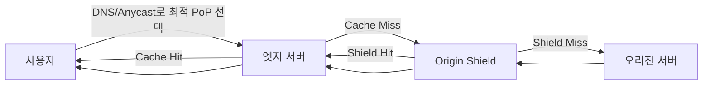

# CDN 동작 원리

## 핵심 정의
CDN(Content Delivery Network)은 오리진(origin) 서버의 콘텐츠 사본을 지리적으로 분산된 엣지 서버(edge server, PoP: Point of Presence)에 캐싱해두고, 사용자의 요청을 라우팅 정책과 지연·부하에 따라 선택된 엣지에서 처리하는 분산 캐싱 인프라다. 목적은 두 가지다. 사용자 체감 지연시간(latency)을 줄이는 것, 그리고 오리진 서버가 모든 요청을 직접 처리하지 않도록 부하를 흡수하는 것.

정적 자원(이미지, JS/CSS, 동영상)뿐 아니라, 라우팅 경로 최적화와 커넥션 재사용을 통해 동적 API 응답도 일부 가속할 수 있다는 점은 자주 간과된다.

## 동작 원리 / 구조

### 요청 흐름과 캐시 계층

- **사용자를 가까운 PoP로 유도**: 크게 두 가지 방식이 쓰인다.
  - **DNS 기반 라우팅**: CDN의 DNS가 요청자의 위치(resolver IP 기반 추정)에 따라 다른 엣지 IP를 응답. GeoDNS와 결합해 지역별 트래픽 분산.
  - **Anycast**: 여러 PoP가 동일한 IP 주소를 광고(BGP)하고, 라우팅 프로토콜이 BGP 정책상 선호하는 경로의 PoP로 패킷을 보내게 한다. 서비스 상태와 경로 철회를 연동하면 DNS TTL에 의존하지 않는 failover가 가능하지만 감지·BGP 수렴 시간이 필요.
- **Cache Hit / Miss**: 엣지에 캐시가 있으면(Hit) 바로 응답하고, 없으면(Miss) 상위 계층(Origin Shield, 없으면 오리진)에 요청을 전달한다.
- **Origin Shield**: 여러 엣지가 동시에 캐시 미스를 겪을 때 오리진에 직접 몰리지 않도록, 엣지와 오리진 사이에 단일 집결 계층을 둬 오리진으로 가는 요청 수를 줄인다.
- **Pull 방식 vs Push 방식**
  - Pull(On-demand): 첫 요청이 들어올 때 엣지가 오리진에서 가져와 캐싱(대부분의 CDN 기본 동작).
  - Push: 콘텐츠를 미리 CDN에 업로드해두는 방식. 트래픽이 예측 가능한 대용량 정적 파일(대규모 배포 자산, 동영상 원본)에 적합.
- **캐시 키(Cache Key)**: 기본은 URL이지만, 쿼리스트링/헤더/쿠키 포함 여부를 CDN 설정으로 조정한다. `Vary` 헤더 값을 캐시 키에 반영하지 않으면 서로 다른 응답(예: 압축 여부, 언어별 응답)이 하나의 캐시 엔트리로 뒤섞일 수 있다.
- **TTL과 무효화(Invalidation/Purge)**: `Cache-Control: max-age`, `s-maxage`로 캐시 유효 시간을 지정한다. 배포 직후 즉시 갱신이 필요하면 CDN의 퍼지(purge) API를 호출해 특정 경로/태그 단위로 캐시를 강제 삭제한다.

### 동적 콘텐츠 가속
CDN은 캐시가 불가능한 동적 응답(API 응답, 개인화 페이지)에도 성능 이점을 준다.
- **TCP/TLS 세션 재사용**: 사용자-엣지 구간은 이미 연결된 커넥션을 재사용하고, 엣지-오리진 구간도 CDN이 장기 유지 커넥션 풀을 관리해 매 요청마다 handshake를 반복하지 않는다.
- **경로 최적화**: CDN 사업자의 백본망을 통해 공인 인터넷보다 안정적인 경로로 엣지-오리진 트래픽을 우회시켜(Route Optimization) 홉 수와 패킷 손실을 줄인다.

CDN이 모든 Vary 헤더를 자동으로 캐시 키에 반영한다고 가정하지 않는다. CloudFront에서는 cache policy로 필요한 헤더·쿠키·쿼리를 명시한다. 특히 Minimum TTL이 0보다 크면 origin의 no-cache, no-store, private에도 최소 기간 캐시할 수 있다고 문서화되어 있으므로 개인화 경로는 캐시 정책 자체를 점검한다.

## 실무 관점
- **언제 쓰는지**: 정적 자원 서빙, 이미지/동영상 트래픽 분산, 글로벌 사용자를 대상으로 한 지연시간 단축, DDoS 흡수(대량 트래픽을 엣지 레벨에서 필터링), TLS Termination을 엣지에서 처리해 오리진 부담 경감.
- **캐시 정합성 트레이드오프**: 캐시는 항상 "최신성 vs 성능"의 트레이드오프를 가진다. TTL을 길게 두면 오리진 부하는 줄지만 배포 후 오래된 콘텐츠가 노출될 위험이 커지고, TTL을 짧게 두면 오리진 부하 감소 효과가 줄어든다.
- **흔한 실수/장애 패턴**
  - 배포 시 정적 자산의 파일명을 그대로 두고 내용만 바꿔서, 퍼지 없이는 사용자가 계속 이전 버전을 받는 문제(해시가 포함된 파일명 전략(fingerprinting)으로 예방).
  - `Cache-Control: private`이 필요한 개인화 응답을 CDN이 공용 캐시로 캐싱해 다른 사용자에게 노출되는 사고. 이 부분은 [[리버스 프록시]] 노트의 캐싱 위험 논의와 동일한 원인 구조를 공유한다.
  - CDN 장애나 특정 PoP 이상 시 오리진 IP가 그대로 공개되어 있으면 CDN을 우회한 직접 공격에 노출됨(오리진 방화벽에서 CDN IP 대역만 허용해야 함).
  - 캐시 미스가 특정 시점(콘텐츠 만료, 신규 배포)에 몰려 오리진에 순간적으로 트래픽이 집중되는 캐시 스탬피드(cache stampede).
- **관련 설정/튜닝 포인트**: `Cache-Control`/`Vary`/`ETag` 헤더 설계, 캐시 키 정규화(쿼리스트링 정렬, 불필요한 파라미터 제외), Origin Shield 활성화, 퍼지 API 자동화(CI/CD 배포 파이프라인에 연동), WAF/Rate Limiting 룰.

### 오리진 전달 정책과 캐시 키를 따로 검토한다

CloudFront의 캐시 정책(cache policy)에 포함한 헤더·쿠키·쿼리는 캐시 키에 들어가고 오리진에도 전달된다. 반면 오리진 요청 정책(origin request policy)은 값을 오리진으로 전달하면서 캐시 키에는 넣지 않을 수 있다. 따라서 “사용자 구분 헤더를 전달했다”는 사실만으로 사용자별 캐시가 분리되지는 않는다. 오리진이 그 값에 따라 응답을 바꾸는데 동일 캐시 키를 쓰면, 첫 요청이 만든 응답을 다른 요청이 캐시 적중(hit)으로 받을 수 있다.

예를 들어 통화·언어별 응답을 캐시하려면 실제 응답을 바꾸는 값을 키에 반영하고, 인증된 개인화 경로는 공유 캐시 허용 여부부터 결정한다. 키 정규화·파라미터 제외도 오리진이 같은 응답으로 취급하는 값에만 적용한다. 검증은 사용자 A의 캐시 미스(miss) 뒤 사용자 B가 같은 경로로 접근하는 순서와 그 역순을 모두 포함한다. 오리진 로그에서 전달값만 확인하지 말고, 적중 응답의 본문·계정 경계까지 확인한다.

## 심화 Q&A

### Q. 캐시 스탬피드(cache stampede)는 왜 발생하고, CDN 레벨에서는 어떻게 완화하는가?
A. 인기 콘텐츠의 캐시가 동시에 만료되거나, 신규 배포로 다수의 엣지가 동시에 캐시 미스를 겪으면, 그 순간 여러 엣지가 동시에 오리진으로 요청을 보내면서 오리진에 순간적인 부하 폭증이 발생한다. 완화 방법은 크게 두 가지다. Origin Shield로 오리진에 도달하는 요청 경로를 하나로 집중시키는 것, 그리고 Request Coalescing(같은 리소스에 대해 이미 갱신 요청이 진행 중이면 후속 요청은 대기시켰다가 하나의 응답을 공유하는 방식)이다. 둘 다 "동일 리소스에 대한 중복 오리진 요청을 하나로 합친다"는 공통 원리를 갖는다.

### Q. Anycast 기반 라우팅과 DNS 기반 GeoDNS 라우팅의 차이는 무엇이고 장애 조치 속도에 어떤 영향을 주는가?
A. DNS 기반 라우팅은 리졸버가 캐싱한 DNS 응답의 TTL이 만료되기 전까지는 장애가 발생한 PoP로 계속 트래픽이 흘러갈 수 있다. 반면 Anycast는 IP 주소 자체를 여러 PoP가 공유하고 BGP 라우팅 광고를 철회하고 다른 경로로 수렴하면 트래픽이 이동한다. 애플리케이션 장애 감지와 라우팅 연동이 필요하므로 즉시 전환을 보장하지 않는다. 다만 Anycast는 라우팅 변경(경로 재수렴) 중 짧은 순간 세션이 다른 PoP로 옮겨가며 TCP 연결이 끊길 수 있다는 트레이드오프가 있다.

### Q. CDN 퍼지(purge)를 호출해도 사용자에게 오래된 콘텐츠가 계속 보이는 경우가 있는 이유는?
A. 퍼지는 CDN 엣지 캐시만 지운다. 브라우저 자체 캐시나 중간 경로의 다른 캐시(사내 프록시, ISP 캐시)에 남아있는 사본, 혹은 아직 퍼지가 전파되지 않은 일부 PoP가 원인일 수 있다. 퍼지 범위·전파 시간·완료 보장은 CDN별 API 계약을 확인한다. 배포 직후 정합성이 중요한 리소스는 퍼지에만 의존하지 말고 파일명에 버전/해시를 포함시켜 애초에 캐시 키 자체를 바꾸는 전략이 더 안전하다.

### Q. 동적 API 응답처럼 캐싱이 불가능한 트래픽에도 CDN을 앞에 두는 것이 의미가 있는가?
A. 있다. 캐시 히트가 나지 않아도 사용자-엣지 구간의 TLS handshake가 물리적으로 가까운 지점에서 끝나 왕복 지연이 줄고, 엣지-오리진 구간은 CDN이 미리 유지해둔 커넥션 풀과 최적화된 백본 경로를 재사용하므로 매 요청마다 공인 인터넷을 거쳐 새 커넥션을 맺는 것보다 빠르다. 다만 이 이점은 캐싱 자체의 이점보다는 작고, 오리진 로직 실행 시간이 지배적인 경우 효과가 제한적이다.

### Q. `Cache-Control: max-age`와 CDN 콘솔에서 별도로 지정한 TTL이 다르면 어떤 값이 우선하는가?
A. 일반적으로 오리진이 응답 헤더에 `s-maxage`(공유 캐시 전용 지시자)를 명시하면 CDN은 이를 최우선으로 따르고, 없으면 `max-age`를 사용한다. CDN 콘솔에서 강제로 지정한 TTL(오버라이드 규칙)이 있으면 그 설정이 헤더보다 우선하도록 구성하는 경우도 많다. 정합성 문제를 피하려면 "오리진이 응답 헤더로 캐시 정책을 명시하고, CDN 콘솔 설정은 기본값/예외 케이스에만 사용"하는 원칙을 팀 내에서 합의해두는 것이 중요하다.

### Q. 오리진 서버가 CDN을 거치지 않고 직접 공격받는 상황을 막으려면 어떤 조치가 필요한가?
A. 오리진의 공인 IP가 노출되면 공격자가 CDN의 보호(WAF, Rate Limiting, DDoS 흡수)를 우회해 직접 트래픽을 보낼 수 있다. 이를 막으려면 오리진 방화벽/보안 그룹에서 CDN 사업자가 공개하는 IP 대역에서 오는 트래픽만 허용하고, 추가로 CDN이 오리진에 요청 시 특정 비밀 헤더(예: `X-CDN-Secret`)를 함께 보내도록 설정해 오리진이 이를 검증하는 이중 방어를 두는 것이 일반적이다.

## 관련 개념
- [[리버스 프록시]]
- [[DNS 조회 과정]]
- [[L4와 L7 로드밸런싱]]
- [[TLS Handshake 과정]]

## 참고 자료

- [RFC 4786: Anycast Services](https://www.rfc-editor.org/rfc/rfc4786.html) — 경로 선택·철회·수렴. 확인: 2026-09-08.
- [RFC 9111: HTTP Caching](https://www.rfc-editor.org/rfc/rfc9111.html) — 공유 캐시·Vary·Cache-Control. 확인: 2026-09-08.
- [CloudFront expiration](https://docs.aws.amazon.com/AmazonCloudFront/latest/DeveloperGuide/Expiration.html) — min/default/max TTL·origin 헤더 우선 관계. 확인: 2026-09-08.
- [CloudFront cache policies](https://docs.aws.amazon.com/AmazonCloudFront/latest/DeveloperGuide/cache-key-understand-cache-policy.html) — cache key·Minimum TTL 예외. 확인: 2026-09-08.

부분 재검증: 2026-10-04. [CloudFront: Control origin requests](https://docs.aws.amazon.com/AmazonCloudFront/latest/DeveloperGuide/controlling-origin-requests.html)에서 cache policy 값의 자동 전달과 origin request policy 값의 캐시 키 제외를 확인했다. 적용 범위는 AWS CloudFront의 두 정책을 사용하는 배포이며 관리형 서비스 문서에는 고정 제품 버전이 없다. 사용자별 오응답 사례는 이 동작에서 도출한 설정 검토 기준이다. 실제 배포·캐시 적중·무효화 시험은 하지 않았으며 노트 전체의 `verified`는 유지했다.
