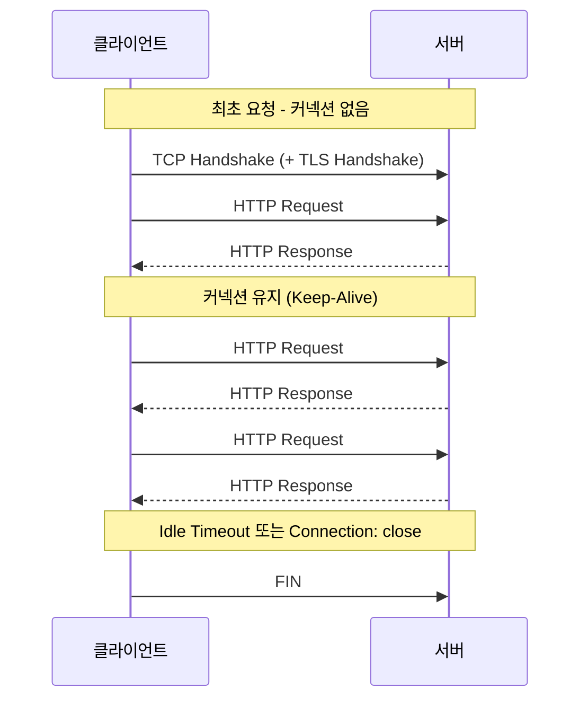

# HTTP Keep-Alive와 커넥션 풀링

## 핵심 정의
HTTP Keep-Alive는 하나의 TCP 커넥션 위에서 여러 요청/응답을 연속으로 주고받아, 매 요청마다 TCP 3-way handshake(및 HTTPS라면 TLS handshake)를 반복하지 않도록 하는 지속 연결(persistent connection) 방식이다. HTTP/1.1부터는 명시적인 `Connection: keep-alive` 헤더 없이도 지속 연결이 기본 동작이며, 연결을 끊고 싶은 쪽이 오히려 `Connection: close`를 명시해야 한다.

커넥션 풀링(Connection Pooling)은 이 지속 연결을 클라이언트(또는 서버 간 통신의 호출 측)가 필요에 따라 생성하거나 예열해 재사용 가능한 풀로 관리하는 기법이다. Keep-Alive가 "연결 하나를 재사용하자"는 프로토콜 차원의 약속이라면, 커넥션 풀링은 "재사용 가능한 연결 여러 개를 애플리케이션 레벨에서 효율적으로 관리하자"는 클라이언트 구현 전략이다.

## 동작 원리 / 구조

### 연결 재사용 흐름


- 지속 연결이 없다면 매 요청마다 TCP handshake(1 RTT) + TLS handshake(TLS 1.2는 추가 1~2 RTT, TLS 1.3은 1 RTT 또는 0-RTT 재개)를 반복해야 해, 연속된 여러 요청에서는 지연시간이 크게 누적된다. [[TLS Handshake 과정]], [[3-way handshake와 4-way handshake]] 참고.
- HTTP/1.1의 Keep-Alive는 한 커넥션 위에서 요청을 파이프라이닝(pipelining)할 수는 있지만, 응답은 요청 순서대로 와야 해서 앞선 응답이 늦으면 뒤 응답도 막히는 HOL(Head-of-Line) Blocking이 존재한다. HTTP/2는 하나의 TCP 커넥션 위에 여러 스트림을 멀티플렉싱해 이 문제를 애플리케이션 계층에서 해결한다([[HTTP 1.1과 HTTP 2 HTTP 3 비교]] 참고). 즉 HTTP/2에서는 "커넥션 하나 재사용"이 아니라 "커넥션 하나 안에서 여러 요청을 동시에" 처리하는 방식으로 진화한 것이며, 커넥션 풀 자체도 호스트당 필요한 연결 수가 크게 줄어든다.

### 서버/클라이언트 측 파라미터
| 계층 | 설정 항목 | 의미 |
|---|---|---|
| 서버(WAS) | Idle Timeout | 요청 없이 유지할 수 있는 최대 시간, 넘으면 서버가 먼저 커넥션을 닫음 |
| 서버(WAS) | Max Keep-Alive Requests | 하나의 커넥션에서 처리할 수 있는 최대 요청 수, 넘으면 닫고 새 연결 유도 |
| 클라이언트/풀 | Max Connections (per route/host) | 호스트당 동시에 유지할 최대 커넥션 수 |
| 클라이언트/풀 | Max Idle Time | 풀에서 유휴 상태로 보관할 최대 시간 |
| 클라이언트/풀 | Pending Acquire Timeout | 풀에 여유 커넥션이 없을 때 대기하는 최대 시간 |

### Java/Spring 생태계 예시
Reactor Netty release 문서의 HttpClient.create()는 host:port별 최대 활성 channel 500개·대기 acquire 1000개의 shared pool을 설명한다. Reactor Netty를 기본 connector로 쓰는 WebClient에 해당하며 custom ConnectionProvider.builder()의 기본값이나 다른 connector에 일반화하지 않는다. 커스텀 풀은 다음과 같이 구성한다.

```java
ConnectionProvider provider = ConnectionProvider.builder("custom-pool")
    .maxConnections(100)
    .maxIdleTime(Duration.ofSeconds(20))
    .maxLifeTime(Duration.ofMinutes(5))
    .pendingAcquireTimeout(Duration.ofSeconds(10))
    .build();

HttpClient httpClient = HttpClient.create(provider);
WebClient webClient = WebClient.builder()
    .clientConnector(new ReactorClientHttpConnector(httpClient))
    .build();
```

Apache HttpClient5나 OkHttp 같은 동기 클라이언트도 동일한 개념(`maxConnPerRoute`, `maxConnTotal`, `keepAliveDuration` 등)의 풀 설정을 제공한다.

예제의 custom ConnectionProvider는 애플리케이션 종료 시 dispose해야 한다. maxIdleTime/maxLifeTime은 진행 중 요청의 deadline이 아니며 백그라운드 정리는 evictInBackground 등의 정책을 별도 확인한다. 응답 본문을 소비하거나 release하지 않으면 연결/버퍼가 반환되지 않아 풀 고갈이 발생할 수 있다. 생존 검사만으로 검사 직후 peer가 닫는 경쟁 조건을 없앨 수는 없다.

## 실무 관점
- **언제/왜 쓰는지**: 외부 API나 내부 마이크로서비스 호출이 잦은 서비스에서는 커넥션 풀링 없이 매 호출마다 새 연결을 맺으면 handshake 지연이 응답 시간에 그대로 누적되고, TIME_WAIT 소켓이 급증해 포트 자원을 고갈시킬 수 있다.
- **클라이언트-서버 타임아웃 정합성**: 클라이언트의 `maxIdleTime`이 서버의 Keep-Alive 타임아웃보다 길면, 서버가 먼저 연결을 끊었는데 클라이언트는 그 연결이 살아있다고 착각하고 재사용을 시도해 `Connection reset by peer`나 `EOFException` 같은 간헐적 오류가 발생한다. 원칙은 "클라이언트 유휴 시간 < 서버 Keep-Alive 타임아웃"으로 여유를 둬 클라이언트가 먼저 커넥션을 회수하게 하는 것이다.
- **중간 계층(로드밸런서/리버스 프록시) 존재 시**: 클라이언트-프록시, 프록시-서버 구간의 타임아웃을 각각 맞춰야 한다. 이 부분의 흔한 실수 패턴은 [[리버스 프록시]] 노트에서 이미 다룬 프록시-백엔드 지속 연결 비활성화 이슈와 같은 맥락이다.
- **흔한 실수/장애 사례**
  - 풀에서 커넥션을 꺼낼 때 살아있는지 검증(validate-on-borrow)하지 않으면, 이미 서버가 닫은 죽은 커넥션을 재사용하려다 요청이 실패한다.
  - 커넥션 풀 크기를 무작정 키우면 서버 측 연결·파일 디스크립터·버퍼 사용량과 실제 동시 요청 부하가 늘어나 오히려 서버가 자원 고갈로 무너질 수 있다. 풀 크기는 "호출 대상 서버가 감당 가능한 동시 연결 수"를 기준으로 정해야 한다.
  - 톰캣(Tomcat) 등 WAS의 `maxKeepAliveRequests`를 넘겨서까지 커넥션을 재사용하려는 클라이언트가 갑작스러운 연결 종료를 자주 겪는 경우, 원인 파악 없이 재시도 로직만 늘리는 미봉책으로 대응하는 경우가 흔하다.
- **관련 설정/튜닝 포인트**: Tomcat `server.tomcat.keep-alive-timeout`, `server.tomcat.max-keep-alive-requests`, Reactor Netty `ConnectionProvider`의 `maxConnections`/`maxIdleTime`/`maxLifeTime`/`pendingAcquireTimeout`, Apache HttpClient5의 `PoolingHttpClientConnectionManager`.

### idle timeout과 연결 최대 수명의 차이

유휴 시간 제한(idle timeout)은 데이터가 오가지 않은 시간을, 연결 최대 수명은 연결 생성 이후의 경과 시간을 제한한다. AWS ALB의 `idle_timeout.timeout_seconds`와 `client_keep_alive.seconds`도 서로 다르다. 후자는 클라이언트 연결에 적용되고 트래픽이 있어도 수명이 다시 시작되지 않으며, 만료 후 추가 요청 하나에 응답하면서 HTTP/1.x는 `Connection: close`, HTTP/2는 `GOAWAY`로 정상 종료를 알린다. 설정을 바꿔도 기존 연결에는 처음 부여한 값이 남는다.

ALB의 HTTP/2 PING은 idle timeout을 갱신하지 않는다. 따라서 keepalive라는 이름의 설정이나 heartbeat를 켰다는 사실만으로 장기 스트림이 유지된다고 판단하지 않는다. 실제 프로토콜·LB의 데이터 판정·재연결 동작을 확인한다. 수명을 짧게 하면 새 경로로 재연결되는 시간이 줄 수 있지만 연결 수립 비용은 늘어나므로 장애 전환 목표와 함께 정한다.

## 심화 Q&A

### Q. 클라이언트의 커넥션 풀 유휴 시간이 서버의 Keep-Alive 타임아웃보다 길면 왜 위험한가?
A. 서버는 자신의 타임아웃 시점에 도달하면 유휴 상태로 판단한 TCP 연결을 닫는다(FIN 전송). 이벤트 기반 클라이언트는 FIN을 감지해 풀에서 제거할 수 있지만, 종료와 재사용이 경쟁하거나 중간 장비가 조용히 상태를 버리면 다음 요청 시점에 그 커넥션을 여전히 유효하다고 믿고 재사용을 시도한다. 이 타이밍에 마침 서버가 막 연결을 닫았다면 클라이언트는 요청을 보내다가 `Connection reset` 오류를 받는 경쟁 조건(race condition)이 발생한다. 이 문제는 트래픽이 적어 유휴 시간이 자주 타임아웃에 걸리는 새벽 시간대에 간헐적으로 나타나는 경우가 많아 재현이 어렵고, 원인을 놓치기 쉽다.

### Q. Keep-Alive를 통한 커넥션 재사용과 HTTP/2의 멀티플렉싱은 근본적으로 무엇이 다른가?
A. 파이프라이닝을 사용하지 않는 HTTP/1.1 클라이언트는 같은 커넥션을 순차 재사용하므로 여러 요청을 동시에 진행하려면 연결을 여러 개 사용한다. HTTP/1.1도 파이프라이닝으로 응답을 기다리지 않고 여러 요청을 보낼 수 있지만, 응답은 요청 순서를 따라야 한다. HTTP/2는 하나의 TCP 커넥션 안에 여러 논리적 스트림을 만들어 요청/응답을 동시에 인터리빙(interleaving)해서 보낼 수 있어, 애초에 호스트당 커넥션을 여러 개 열 필요성 자체를 줄인다. 다만 HTTP/2는 여전히 하나의 TCP 커넥션에 의존하므로, TCP 계층에서 패킷 유실이 발생하면 그 커넥션의 모든 스트림이 함께 지연되는 전송 계층 HOL Blocking은 남아있고, 이는 HTTP/3(QUIC)에서야 스트림별 순서 전달로 완화된다. 연결 수준 혼잡 제어의 영향은 공유한다.

### Q. 커넥션 풀 크기를 과도하게 크게 잡으면 어떤 부작용이 생기는가?
A. 클라이언트가 열 수 있는 커넥션이 늘어난 만큼 대상 서버의 파일 디스크립터·연결 상태·버퍼 메모리 사용량이 늘어난다. Tomcat NIO/NIO2처럼 다음 요청을 비동기로 기다리는 서버는 idle 연결마다 전용 요청 스레드를 하나씩 점유하지 않는다. 연결 상한과 실제 요청 처리 스레드 상한을 구분해야 한다. 다수의 클라이언트 인스턴스가 동시에 풀을 최대치까지 채우면, 개별 클라이언트는 여유로워 보여도 서버 전체 관점에서는 동시 연결 수가 감당 범위를 넘어서 오히려 응답 지연이나 연결 거부가 발생할 수 있다. 풀 크기는 클라이언트의 처리량 목표뿐 아니라 서버가 감당 가능한 총 동시 연결 예산을 함께 고려해 정해야 한다.

### Q. 커넥션 풀에서 꺼낸 연결의 유효성을 검증하지 않으면 어떤 문제가 발생하고, 어떻게 방지하는가?
A. 서버가 유휴 타임아웃이나 재시작 등으로 이미 닫아버린 커넥션이 풀에 그대로 남아있다가 다음 요청에 재사용되면, 요청 전송 시점에야 연결이 끊겼다는 것이 드러나 예외가 발생한다. 이를 막으려면 풀에서 커넥션을 꺼낼 때 가볍게 생존 여부를 확인(validate-on-borrow)하거나, `maxIdleTime`을 서버 타임아웃보다 여유 있게 짧게 잡아 애초에 죽은 커넥션이 풀에 남아있을 가능성 자체를 줄이는 방법을 함께 쓴다. 검증 자체에도 약간의 오버헤드가 있으므로 트레이드오프를 고려해 검증 주기를 둔다.

### Q. 리버스 프록시나 로드밸런서가 중간에 있을 때 Keep-Alive 타임아웃을 어떻게 정합시켜야 하는가?
A. 각 TCP 구간별로 풀을 소유한 호출 측의 maxIdleTime을 맞은편 서버와 중간 장비의 idle timeout보다 짧게 둔다. 프록시의 downstream 수신 timeout과 upstream 풀 timeout은 다른 설정이다. 프록시가 유휴 upstream 연결을 먼저 정상 회수하는 것은 오류가 아니며, 전체 계층에 하나의 대소 관계를 강제할 필요가 없다. 검사 직후 종료될 경쟁 조건은 남으므로 멱등성에 맞는 제한적 재시도가 필요하다.

### Q. 커넥션 풀의 반환 전략으로 FIFO 대신 LIFO를 쓰면 어떤 이점이 있는가?
A. FIFO(First In First Out)는 가장 오래 쉰 커넥션을 우선 재사용해 풀 내 모든 커넥션이 고르게 순환되지만, 트래픽이 적은 시간대에는 필요 이상으로 많은 커넥션이 계속 활성 상태로 유지되는 경향이 있다. LIFO(Last In First Out)는 가장 최근에 반환된 커넥션을 먼저 재사용해 특정 커넥션 일부만 반복적으로 쓰이게 되고, 나머지는 유휴 타임아웃에 의해 자연스럽게 정리되어 유휴 커넥션 수를 줄이는 효과가 있다. 트래픽 패턴이 버스트성이라면 LIFO가 전체 커넥션 수를 더 적게 유지하면서도 필요할 때 빠르게 대응할 수 있다.

## 관련 개념
- [[리버스 프록시]]
- [[TCP 신뢰성 보장 메커니즘]]
- [[HTTP 1.1과 HTTP 2 HTTP 3 비교]]
- [[3-way handshake와 4-way handshake]]

## 참고 자료

- [RFC 9112: HTTP/1.1](https://www.rfc-editor.org/rfc/rfc9112.html) — §9.3 persistent connections·메시지 소비. 확인: 2026-09-08.
- [Reactor Netty HTTP Client](https://projectreactor.io/docs/netty/release/reference/http-client.html) — release 문서 §7 shared pool 500/1000·custom provider·eviction. 확인: 2026-09-08.
- [RFC 9000: QUIC](https://www.rfc-editor.org/rfc/rfc9000.html) — 스트림별 순서 전달. 확인: 2026-09-08.

부분 재검증: 2026-09-22. [Tomcat 11.0.26 HTTP Connector](https://tomcat.apache.org/tomcat-11.0-doc/config/http.html)의 NIO/NIO2 next-request 대기 방식과 maxConnections/maxThreads 구분을 대조했다. 노트 전체의 버전 의존 서술을 재검증한 것은 아니므로 `verified`는 유지했다.

부분 재검증: 2026-10-04. [AWS ALB attributes](https://docs.aws.amazon.com/elasticloadbalancing/latest/application/edit-load-balancer-attributes.html) — 관리형 서비스 문서(별도 제품 버전 없음), idle timeout과 client keepalive duration의 차이·기존 연결의 값 유지·HTTP/2 PING 및 정상 종료 방식을 확인했다. [RFC 9112 §9.3.2](https://www.rfc-editor.org/rfc/rfc9112.html#section-9.3.2)의 HTTP/1.1 pipelining 허용과 응답 순서 제약도 대조해 기존 본문과 Q&A를 맞췄다. 실제 ALB 스트리밍·재연결·HTTP/1.1 pipelining 시험과 Reactor Netty 등의 기존 설정 기본값은 이번에 재검증하지 않아 `verified`를 유지했다.
