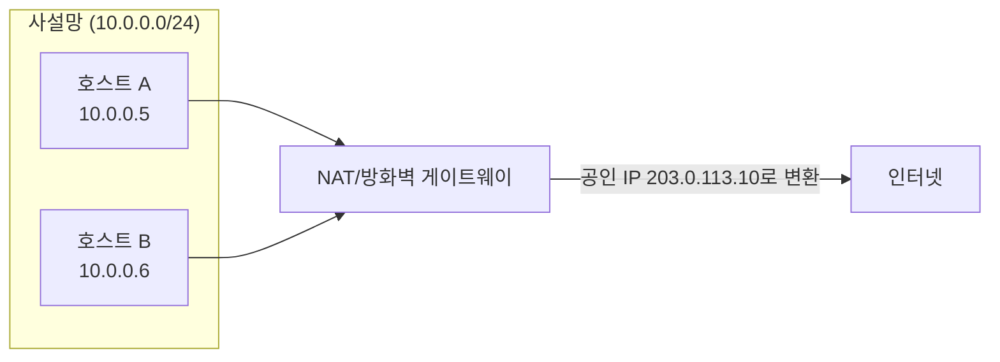

# NAT와 방화벽 기초

## 핵심 정의
NAT(Network Address Translation)는 패킷이 네트워크 경계를 통과할 때 IP 주소(와 필요하면 포트)를 변환하는 기술로, 사설 IP 대역을 쓰는 내부 네트워크가 소수의 공인 IP만으로 외부 인터넷과 통신할 수 있게 해준다. 원래는 IPv4 주소 고갈 문제를 완화하기 위해 도입됐고(RFC 3022 등), 부수적으로 내부 IP 구조를 외부에서 직접 볼 수 없게 감춰 보안적인 이점도 준다.

방화벽(Firewall)은 사전에 정의한 정책(허용/차단 규칙)에 따라 네트워크 트래픽을 필터링하는 장치 또는 소프트웨어다. NAT와 방화벽은 서로 다른 목적을 가진 별개의 기능이지만, 실무 장비(공유기, 클라우드 게이트웨이)에서는 대부분 함께 구현되어 있어 개념이 혼동되기 쉽다.

## 동작 원리 / 구조

### NAT 매핑 테이블
NAT 장비는 내부(사설) 주소:포트와 외부(공인) 주소:포트 간 매핑을 테이블로 관리한다. 가장 흔한 형태는 PAT(Port Address Translation, NAPT라고도 함)로, 여러 내부 호스트가 하나의 공인 IP를 포트 번호로 구분해 공유한다.

| 내부 IP:Port | 외부 IP:Port | 목적지 IP:Port |
|---|---|---|
| 10.0.0.5:51000 | 203.0.113.10:40001 | 8.8.8.8:443 |
| 10.0.0.6:51000 | 203.0.113.10:40002 | 8.8.8.8:443 |

### NAT 종류
- **Static NAT**: 내부 IP 1개 : 외부 IP 1개를 고정으로 매핑. 외부에 서비스를 노출해야 하는 서버에 사용.
- **Dynamic NAT**: 내부 다수 IP를 공인 IP 풀에서 그때그때 하나씩 배정.
- **PAT/NAPT**: 포트 번호까지 활용해 다수의 내부 IP가 하나의 공인 IP를 동시에 공유(가장 일반적인 형태, 가정용 공유기와 클라우드 NAT Gateway가 기본으로 사용).

### 필터링/매핑 동작 방식 (RFC 4787)
과거에는 Full Cone, Restricted Cone, Port Restricted Cone, Symmetric NAT라는 4분류(RFC 3489 기반)가 널리 쓰였지만, 실제 장비 동작이 이 분류에 깔끔하게 들어맞지 않는 경우가 많아 현재는 RFC 4787이 정의한 두 가지 축으로 NAT 동작을 더 정밀하게 설명한다.
- **Mapping Behavior**: 같은 내부 IP:Port에서 나가는 트래픽에 대해, 목적지가 달라져도 항상 같은 외부 IP:Port를 재사용하는지(Endpoint-Independent) 아니면 목적지마다 다른 매핑을 새로 만드는지(Address/Port-Dependent).
- **Filtering Behavior**: 외부에서 들어오는 패킷을 받아줄지 판단하는 기준이 기존 매핑에 대해 외부 송신자의 IP/포트와 관계없이 허용하는지(Endpoint-Independent), 내부에서 이전에 보낸 목적지 IP로 제한하는지(Address-Dependent), 그 IP와 포트 모두로 제한하는지(Address-and-Port-Dependent)로 나눈다.
- 매핑/필터링이 목적지마다 새로 생성되는 방식(옛 용어로 Symmetric NAT에 가까움)일수록 P2P 연결 수립(NAT Traversal)이 어려워지고, STUN만으로는 외부에서 접근 가능한 주소를 예측할 수 없어 TURN 같은 중계 서버가 필요해진다.

### 방화벽 종류
| 종류 | 판단 기준 | 특징 |
|---|---|---|
| 패킷 필터링(Stateless) | 개별 패킷의 출발지/목적지 IP·포트 | 빠르지만 연결 상태를 기억하지 못해 왕복 트래픽 규칙을 양방향으로 명시해야 함 |
| Stateful Inspection | 연결(세션) 단위 상태 추적 | 요청에 대한 응답 트래픽을 자동으로 허용, 대부분의 현대 방화벽/보안 그룹이 채택 |
| L7/애플리케이션 방화벽(WAF) | HTTP 메서드, URL 패턴, 페이로드 내용 | SQL Injection, XSS 등 애플리케이션 계층 공격 탐지 |

클라우드 환경에서는 이 구분이 "보안 그룹(Security Group, Stateful)"과 "네트워크 ACL(NACL, Stateless)"이라는 두 계층으로 나타나는 경우가 흔하다. 보안 그룹은 인바운드를 허용하면 그에 대한 아웃바운드 응답이 자동으로 허용되지만, NACL은 인바운드/아웃바운드 규칙을 양방향으로 각각 명시해야 한다.

RFC 4787은 UDP NAT 요구사항이며 TCP는 별도 상태·timeout을 고려한다. AWS NAT Gateway 문서는 IPv4 주소 하나당 고유 목적지(IP·port·protocol)별 동시 연결 55,000개를 설명한다. NAT 장비의 외부 IP를 알아도 인바운드 전달이 자동으로 열리는 것은 아니므로 웹훅은 LB/명시적 전달 엔드포인트에 등록한다. 방화벽은 NAT와 별도의 접근 제어다.

## 실무 관점
- **아웃바운드 전용 NAT 게이트웨이**: 클라우드의 프라이빗 서브넷에 있는 서버가 외부 API를 호출해야 하지만 외부에서의 인바운드 접근은 막고 싶을 때, NAT Gateway를 통해 아웃바운드만 허용하는 구성이 표준 패턴이다.
- **컨테이너/오케스트레이션 환경의 NAT**: Kubernetes의 외부 통신에서 CNI·ip-masq-agent·서비스 프록시 등 구현과 설정에 따라 SNAT(Source NAT)로 파드의 내부 IP를 노드 IP로 변환하는 경우가 많다. 이 계층을 이해하지 못하면 외부 서비스 로그에 실제 파드 IP 대신 노드 IP만 찍혀 트래픽 출처 추적이 어려워지는 문제를 겪는다.
- **NAT Gateway 유휴 타임아웃**: 클라우드 NAT Gateway는 일정 시간(수 분) 이상 트래픽이 없는 커넥션을 자체적으로 정리한다. DB 커넥션 풀이나 장시간 유지되는 gRPC 스트리밍 연결이 이 타임아웃에 걸려 갑자기 끊기는 사고가 흔하며, TCP Keep-Alive 패킷을 주기적으로 보내 유휴 상태로 오인되지 않게 하거나 애플리케이션 레벨에서 재연결 로직을 갖추는 것이 대응책이다.
- **SNAT 포트 고갈(Port Exhaustion)**: 하나의 공인 IP를 공유하는 PAT 구조에서는 특정 목적지에 사용할 외부 IP·포트 조합이 유한하다. 같은 외부 포트를 서로 다른 목적지에 재사용할 수 있어 게이트웨이 전체 연결 수를 약 6만으로 단정할 수 없다. 대규모 아웃바운드 트래픽(대량의 외부 API 병렬 호출)이 몰리면 신규 커넥션을 위한 포트가 고갈되어 새 연결이 실패하는 장애로 이어질 수 있다. 완화책은 NAT Gateway를 여러 개로 분산하거나 공인 IP를 추가해 포트 예산을 늘리는 것이다.
- **흔한 실수/장애 패턴**
  - 보안 그룹만 확인하고 NACL의 아웃바운드 규칙을 빠뜨려, 인바운드는 열려 있는데 응답이 나가지 못해 타임아웃이 발생하는 경우.
  - 방화벽 규칙을 추가할 때 기존 규칙보다 뒤에 배치해, 앞선 규칙에서 이미 차단/허용이 확정되어 새 규칙이 무시되는 경우(예: AWS NACL의 첫 매치(first-match) 평가).
  - NAT 뒤의 서버가 자신의 사설 IP를 외부에 알려야 하는 상황(웹훅 콜백 URL, 헬스체크 등록)에서 사설 IP를 그대로 노출해 접근이 불가능해지는 설계 실수.

### 규칙 변경과 이미 성립한 연결

AWS EC2 보안 그룹의 연결 추적(connection tracking) 대상 흐름은 허용 규칙을 제거해도 즉시 중단되지 않고 기존 연결의 timeout까지 허용될 수 있다. 반대로 문서가 정의하는 비추적(untracked) 흐름은 이를 허용하던 규칙 변경으로 즉시 끊길 수 있다. "SG 수정은 항상 기존 연결을 끊는다"와 "항상 유지한다" 모두 부정확하다.

침해 대응에서 새 연결 차단과 이미 연결된 공격자 차단을 구분한다. AWS는 추적 상태와 무관한 즉시 네트워크 차단에 NACL을 사용할 수 있다고 설명한다. NACL은 서브넷 전체에 영향을 주므로 대응 절차에서는 대상·양방향 경로·운영 접근 경로를 검토한다.

SNAT 포트와 EC2 연결 추적 엔트리도 별개 용량이다. 외부 포트가 남아 있어도 인스턴스의 추적 한도를 소진하면 새 연결의 패킷이 드롭될 수 있다. 지원되는 ENA 지표의 `conntrack_allowance_available`·`conntrack_allowance_exceeded`를 NAT 포트 할당 지표와 구분해 원인을 좁힌다.

### AWS NAT의 유휴 종료와 포트 할당 실패를 나눠 본다

AWS NAT Gateway 문서의 유휴 제한은 350초다. 이를 넘긴 연결을 뒤쪽 자원이 다시 사용하려 하면 NAT가 FIN이 아닌 RST를 반환할 수 있으므로, 상대 애플리케이션이 정상 종료한 연결로만 해석하지 않는다. 풀에 남은 오래된 연결의 재사용 오류인지, 새 연결 자체의 실패인지 먼저 구분한다.

CloudWatch의 `IdleTimeoutCount`는 정상 종료되지 않은 연결이 350초 비활성 뒤 유휴 상태로 전환된 횟수이고, `ErrorPortAllocation`은 새 소스 포트를 할당하지 못한 횟수다. 전자의 증가만으로 요청 실패나 포트 고갈을 확정하지 않는다. 같은 시각의 풀 재사용 오류·신규 연결 수·목적지별 집중도를 대조한다. 유지 패킷으로 기존 연결을 오래 살리는 것과, 너무 많은 동시 연결 때문에 새 포트가 부족한 문제는 대응이 다르다.

## 심화 Q&A

### Q. Symmetric에 가까운 NAT 환경에서 WebRTC 같은 P2P 연결이 실패하는 이유는 무엇이고 어떻게 해결하는가?
A. 매핑이 목적지별로 새로 생성되는 NAT(옛 용어로 Symmetric NAT)에서는, 내부 호스트가 STUN 서버로 나간 요청에 대해 관측된 외부 주소:포트가 실제로 상대방과 통신할 때 쓰일 주소:포트와 다르다. STUN은 "내가 밖에서 어떻게 보이는지"만 알려줄 뿐, 그 정보로 상대방이 직접 접근 가능하다는 보장을 해주지 못하는 것이다. 이 경우 두 피어가 직접 연결을 수립할 수 없으므로, TURN 서버를 중계 지점으로 두고 양쪽 모두 TURN을 거쳐 통신하는 방식으로 우회한다. ICE(Interactive Connectivity Establishment) 프레임워크가 STUN으로 먼저 직접 연결을 시도하고 실패하면 TURN으로 자동 전환하는 과정을 관리한다.

### Q. Stateful 방화벽(보안 그룹)과 Stateless 방화벽(NACL)의 차이가 실무 설정에서 어떤 실수를 유발하는가?
A. Stateful 방화벽은 나간 요청에 대한 응답 트래픽을 연결 상태 추적을 통해 자동으로 허용하므로 인바운드 규칙만 신경 쓰면 되는 경우가 많다. 반면 Stateless인 NACL은 상태를 기억하지 않으므로 인바운드를 열었어도 그에 대한 응답이 나가는 아웃바운드 규칙(대개 임시 포트 범위, ephemeral port range)을 별도로 열어줘야 한다. 이를 놓치면 요청은 서버에 도달하지만 응답이 클라이언트로 돌아가지 못해 클라이언트 쪽에서는 타임아웃으로만 보이는, 원인 파악이 까다로운 장애가 발생한다.

### Q. NAT Gateway의 유휴 타임아웃이 장시간 유지되는 DB 커넥션이나 스트리밍 연결에 어떤 영향을 주는가?
A. NAT는 매핑 테이블 엔트리를 무한정 유지할 수 없어 일정 시간 트래픽이 없으면 해당 매핑을 회수한다. 애플리케이션 입장에서는 커넥션이 여전히 열려 있다고 믿고 있는데, NAT가 매핑을 지워버려 다음 패킷을 보낼 때 응답이 오지 않거나 연결이 끊긴 것처럼 동작하는 문제가 생긴다. 이는 [[HTTP Keep-Alive와 커넥션 풀링]]에서 다루는 "클라이언트와 서버 간 타임아웃 불일치" 문제와 유사한 구조이며, TCP 레벨 Keep-Alive(주기적인 소켓 유지 패킷)를 NAT 타임아웃보다 짧은 간격으로 보내도록 설정해 매핑이 회수되지 않게 하는 것이 표준 대응이다.

### Q. PAT 구조에서 SNAT 포트 고갈이 발생하는 원리와 이를 완화하는 방법은?
A. PAT는 하나의 공인 IP 뒤에서 내부 호스트마다, 그리고 목적지 조합마다 서로 다른 포트를 할당해 구분한다. 사용 가능한 포트 수는 유한하므로, 짧은 시간에 매우 많은 아웃바운드 커넥션(예: 대량의 외부 API 병렬 호출, 커넥션 재사용 없이 매번 새 연결을 여는 안티패턴)이 발생하면 신규 매핑을 만들 포트가 부족해져 새 연결이 거부된다. 완화책은 공인 IP를 추가해 게이트웨이당 부담을 분산하거나, 애플리케이션 쪽에서 [[HTTP Keep-Alive와 커넥션 풀링]]으로 연결을 재사용해 애초에 필요한 신규 커넥션 수 자체를 줄이는 것이다.

### Q. 방화벽 규칙에서 순서(rule order)가 왜 중요한가?
A. 평가 모델부터 구분한다. AWS NACL은 낮은 규칙 번호부터 첫 매치를 적용하지만 AWS Security Group은 적용된 그룹의 허용 규칙들을 합쳐 평가하며 명시적 deny와 first-match 순서가 없다. first-match 방식의 방화벽에서 넓은 범위를 차단하는 규칙을 세밀한 허용 규칙보다 앞에 두면, 뒤에 추가한 허용 규칙이 아무리 정확해도 절대 도달하지 못하고 무시된다. 규칙을 추가/변경할 때는 항상 전체 규칙 목록에서의 상대적 위치와 평가 방식을 함께 확인해야 한다.

### Q. NAT 뒤에 있는 서버가 자신의 공인 IP를 알아야 하는 상황(외부 서비스에 콜백 URL 등록 등)은 어떻게 처리하는가?
A. 로컬 소켓 주소만으로 NAT 매핑된 외부 IP:Port를 알 수는 없다. 다만 클라우드 메타데이터나 명시적 설정으로 배정 정보를 제공할 수도 있다. 이런 상황에서는 외부에 노출된 자기 자신의 공인 IP를 알려주는 외부 서비스(STUN 서버, 또는 단순히 공인 IP 확인용 HTTP 엔드포인트)에 질의하거나, 애초에 콜백을 받는 엔드포인트는 고정 공인 IP를 가진 Static NAT/로드밸런서 뒤에 두고 그 주소를 등록하는 설계로 우회한다. 사설 IP를 그대로 외부에 등록하는 것은 접근 불가능한 주소를 알려주는 것과 같아 반드시 피해야 한다.

## 관련 개념
- [[OSI 7계층과 TCP-IP 4계층]]
- [[리버스 프록시]]
- [[L4와 L7 로드밸런싱]]
- [[HTTP Keep-Alive와 커넥션 풀링]]

## 참고 자료

- [RFC 4787: NAT UDP Requirements](https://www.rfc-editor.org/rfc/rfc4787.html) — 매핑/필터링 독립성. 확인: 2026-09-08.
- [AWS NAT gateway basics](https://docs.aws.amazon.com/vpc/latest/userguide/nat-gateway-basics.html) — 고유 목적지별 포트 예산·프로토콜·MTU. 확인: 2026-09-08.
- [Linux IP sysctl](https://docs.kernel.org/networking/ip-sysctl.html) — 연결 추적·네트워크 설정. 확인: 2026-09-08.

부분 재검증: 2026-09-22. [AWS Security Group 규칙](https://docs.aws.amazon.com/vpc/latest/userguide/security-group-rules.html)과 [NACL 규칙](https://docs.aws.amazon.com/vpc/latest/userguide/nacl-rules.html)의 합집합/번호순 평가를 대조했다. 노트 전체의 버전 의존 서술을 재검증한 것은 아니므로 `verified`는 유지했다.

부분 재확인: 2026-09-23. [AWS EC2 Security Group Connection Tracking](https://docs.aws.amazon.com/AWSEC2/latest/UserGuide/security-group-connection-tracking.html)의 추적/비추적 연결 규칙 변경, NACL 차단, ENA conntrack 지표를 확인했다. 특정 인스턴스의 추적 용량이나 timeout 기본값을 일반화하지 않았다. 기존 NAT 명세·한도 전체는 재검증하지 않아 `verified`는 유지한다.

부분 재검증: 2026-10-04. [AWS NAT Gateway troubleshooting](https://docs.aws.amazon.com/vpc/latest/userguide/nat-gateway-troubleshooting.html)의 350초 유휴·재사용 시 RST와 [NAT gateway metrics](https://docs.aws.amazon.com/vpc/latest/userguide/metrics-dimensions-nat-gateway.html)의 IdleTimeoutCount·ErrorPortAllocation 정의를 확인했다. 적용 범위는 조회일 AWS 관리형 NAT Gateway이며 일반 NAT 장비의 보편적인 timeout은 아니다. AWS 계정·실제 소켓·CloudWatch 지표를 실행 관측하지 않았고 `verified`는 유지했다.
