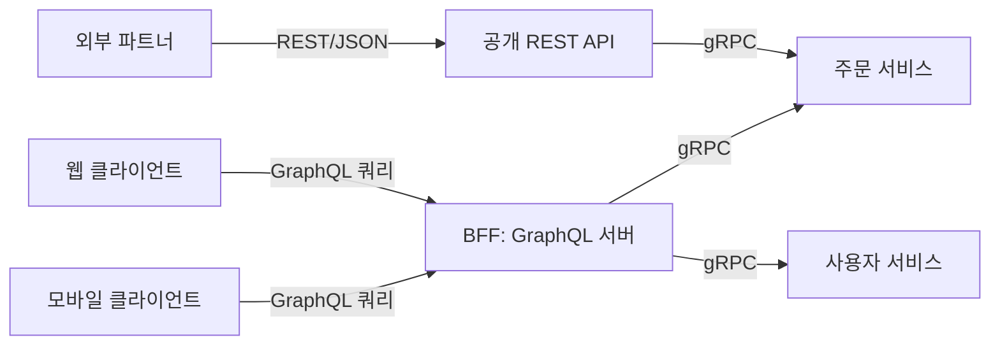

# REST와 GraphQL과 gRPC 비교

## 핵심 정의
REST, GraphQL, gRPC는 API를 설계하는 서로 다른 철학의 통신 방식이다. REST(Representational State Transfer)는 자원(resource)을 URI로 식별하고 HTTP 메서드로 행위를 표현하는 아키텍처 스타일이고, GraphQL은 클라이언트가 필요한 데이터의 형태를 쿼리 언어로 직접 지정해 서버로부터 정확히 그만큼만 받아오는 쿼리 언어이자 런타임이며, gRPC는 강타입 스키마(protobuf) 기반으로 원격 메서드를 함수처럼 호출하는 RPC 프레임워크다. 셋 중 하나가 절대적으로 우월하지 않고, API를 소비하는 대상(불특정 다수 외부 클라이언트인지, 프론트엔드인지, 내부 서비스인지)에 따라 적합도가 갈린다.

## 동작 원리 / 구조

### 핵심 비교표
| 항목 | REST | GraphQL | gRPC |
|---|---|---|---|
| 통신 스타일 | 자원 중심(URI + HTTP 메서드) | 쿼리 언어(단일 엔드포인트) | RPC(원격 메서드 호출) |
| 전송 방식 | HTTP/1.1·2·3 등 | 주로 HTTP(POST 위주) | HTTP/2 필수 |
| 데이터 포맷 | JSON(주로), XML 등 | JSON | Protocol Buffers(바이너리) |
| 스키마 강제 | 스타일 자체는 스키마를 요구하지 않음; OpenAPI와 검증·코드 생성 도구로 강제 가능 | 강함(GraphQL Schema, 타입 시스템) | 강함(.proto, 컴파일 타임 검증) |
| 오버페칭/언더페칭 | 발생하기 쉬움 | 클라이언트가 필요한 필드만 요청해 해결 | 응답 구조가 고정(메시지 스키마 기준) |
| 캐싱 | HTTP 캐시(GET, ETag, Cache-Control) 활용 용이 | POST 위주라 HTTP 캐시 어려움, 애플리케이션 레벨 캐싱 필요 | HTTP 캐시 개념이 사실상 없음 |
| 스트리밍 | 제한적(청크 전송, SSE 별도 조합) | 구독(Subscription)으로 실시간 지원(WebSocket 등과 결합) | Unary + 세 가지 스트리밍 방식 |
| 브라우저 지원 | 네이티브 | 네이티브 | 표준 gRPC 직접 호출 제약; gRPC-Web 호환 서버/프록시 활용 |
| 대표 사용처 | 공개 API, 외부 파트너 연동 | 프론트엔드 다양한 클라이언트 대응, BFF | 내부 마이크로서비스 간 고성능 통신 |
| N+1 문제 | API 조합·ORM 로딩에서 발생 가능 | 필드별 resolver 조회에서 발생 가능(DataLoader/@BatchMapping) | 내부 조회·반복 RPC에서 발생 가능 |

### 같은 요구사항을 세 방식으로 처리하는 예
"주문 목록과 각 주문의 고객 이름만" 필요한 화면을 예로 들면:
- **REST**: `/orders` 호출 후 각 주문의 `customerId`로 `/customers/{id}`를 N번 더 호출하거나(언더페칭), 서버가 미리 조인된 확장 엔드포인트(`/orders?include=customer`)를 별도로 만들어야 한다.
- **GraphQL**: 클라이언트가 `{ orders { id, customer { name } } }`처럼 필요한 필드만 한 번의 요청으로 지정한다. 서버는 `@BatchMapping`/DataLoader로 고객 조회를 배치 처리해 N+1을 방지한다.
- **gRPC**: `OrderService.ListOrders`가 이미 응답 메시지에 고객 이름 필드를 포함하도록 스키마가 설계돼 있어야 하며, 화면마다 요구사항이 다르면 메서드나 필드를 추가하는 방식으로 대응한다.

### 아키텍처 조합 패턴

실무에서는 세 방식을 배타적으로 택일하기보다, 프론트엔드 대응은 GraphQL(BFF, Backend For Frontend), 내부 서비스 간은 gRPC, 외부 파트너/불특정 다수 대상 공개 API는 REST로 계층을 나눠 함께 쓰는 경우가 흔하다.

REST는 본래 HTTP에만 한정된 규격이 아닌 아키텍처 스타일이며 uniform interface·stateless·cache 등 제약을 포함한다. 표는 흔한 HTTP API 구현을 비교한다. GraphQL 핵심 명세는 JSON·HTTP·WebSocket이나 단일 URL을 강제하지 않고, 전송 바인딩과 subscription 배포 방식은 별도다. 어느 방식에서도 데이터베이스 N+1과 인가를 따로 설계해야 한다.

## 실무 관점
- **불특정 다수가 소비하는 공개 API**는 REST가 여전히 기본 선택이다. HTTP 캐싱, 브라우저/툴 생태계(Postman, curl, OpenAPI/Swagger), 진입 장벽 낮은 문서화가 강점이며, 파트너사 입장에서도 학습 비용이 가장 낮다.
- **다양한 클라이언트(웹/모바일/워치 등)가 서로 다른 데이터 형태를 요구할 때** GraphQL이 오버페칭/언더페칭 문제를 줄여준다. 다만 서버가 임의 조합의 쿼리를 받아들이므로 쿼리 복잡도 공격(resource exhaustion)에 대비해 깊이 제한(depth limit), 복잡도 계산(cost analysis), 타임아웃을 반드시 걸어야 한다.
- **내부 마이크로서비스 간 고성능 통신**은 gRPC가 유리하다. 다만 팀 전체가 protobuf 스키마 관리 프로세스(버전 정책, 코드 생성 파이프라인)에 익숙해야 이점을 제대로 살릴 수 있다.
- **캐싱 전략이 아키텍처 선택에 큰 영향을 준다.** REST의 GET + `Cache-Control`/`ETag`는 CDN/브라우저 캐시를 그대로 활용할 수 있지만, GraphQL을 POST 단일 엔드포인트로 제공하면 일반적인 HTTP 캐시 활용이 어려워지고, 영속 쿼리(persisted query) + GET 조합이나 클라이언트 라이브러리(Apollo Client 등)의 정규화 캐시로 보완해야 한다. gRPC는 HTTP 캐시 개념 자체가 거의 적용되지 않아 애플리케이션 레벨 캐싱(Redis 등)에 의존한다.
- **버전 관리 철학이 다르다.** REST는 URI(`/v2/orders`)나 헤더로 버전을 명시하는 것이 일반적이고, GraphQL은 스키마에 필드를 추가하고 기존 필드는 deprecate만 하는 점진적 진화(evolutionary schema)를 지향하며, gRPC는 protobuf의 필드 번호·타입·presence·JSON 표현과 애플리케이션 의미까지 고려해 호환 가능한 변경을 선택한다.

### GraphQL의 부분 실패와 null 전파

GraphQL은 실행 중 일부 필드가 실패해도 `data`와 `errors`를 함께 반환할 수 있다. 실패한 위치가 nullable이면 해당 위치가 `null`이 되고, `Non-Null`이면 가장 가까운 nullable 부모까지 오류가 전파된다. 루트까지 모두 Non-Null인 경로라면 `data` 전체가 `null`이 될 수 있다. 따라서 필드에 `!`를 붙이는 것은 값의 보장뿐 아니라 장애가 다른 데이터에 미치는 범위도 바꾼다.

클라이언트는 전송 성공만으로 모든 필드가 정상이라고 판단하거나, 오류 하나만 보고 유효한 부분 데이터를 무조건 버리지 않도록 화면별 정책을 정한다. `errors.path`로 실패 위치를 식별하고 null이 실제 값인지 실행 오류인지 구분한다. 파싱·검증 등 실행 전 요청 오류는 `data` 자체가 없는 결과이므로 부분 실행 실패와 별도로 집계한다. 이 구분은 GraphQL 핵심 응답 계약이며 HTTP 상태 코드 매핑은 전송 바인딩에서 따로 확인한다.

## 심화 Q&A

### Q. GraphQL이 오버페칭/언더페칭을 해결하면서 새로 떠안게 되는 트레이드오프는 무엇인가?
클라이언트가 쿼리 형태를 자유롭게 구성할 수 있다는 것은, 서버가 어떤 조합의 쿼리가 들어올지 사전에 통제하기 어렵다는 뜻이다. 그 결과 (1) 중첩된 필드마다 리졸버(resolver)가 개별 실행되면서 N+1 쿼리 문제가 구조적으로 발생하기 쉽고, (2) 악의적이거나 비효율적인 깊은 중첩 쿼리 하나가 백엔드에 과도한 부하를 줄 수 있어 깊이/복잡도 제한이 필수이며, (3) 응답 형태가 요청마다 달라 HTTP 캐싱이나 CDN 캐싱을 REST만큼 단순하게 적용하기 어렵다. 즉 클라이언트의 유연성을 얻는 대가로 서버 쪽 방어 로직과 캐싱 전략의 복잡도가 늘어난다.

### Q. REST의 GET 캐싱 이점을 GraphQL/gRPC에서는 어떻게 대체하는가?
GraphQL은 자주 쓰이는 쿼리를 서버에 등록해 해시값만 GET으로 요청하는 영속 쿼리(persisted query)를 활용하면 URL 기반 캐싱이 가능해지고, 클라이언트 라이브러리의 정규화 캐시(정규화된 엔티티 단위 캐시)로 중복 조회를 줄인다. gRPC는 HTTP 캐시 개념이 거의 적용되지 않으므로, 애플리케이션 레벨에서 Redis 같은 별도 캐시 계층을 두거나, 클라이언트 스텁 레벨에서 결과를 메모이제이션하는 방식으로 보완한다.

### Q. 대용량 파일 업로드나 실시간 스트리밍이 필요할 때 세 방식은 어떻게 다르게 대응하는가?
REST는 파일 업로드를 `multipart/form-data`로 처리하지만 진행 중 양방향 상호작용은 어렵고, 실시간성이 필요하면 별도로 SSE나 WebSocket을 붙여야 한다. GraphQL은 표준 사양 자체에 파일 업로드가 없어 커뮤니티 확장(예: multipart request spec)이나 별도 REST 엔드포인트에 위임하는 경우가 많고, 실시간은 Subscription을 WebSocket 위에 얹어 구현한다. gRPC는 client streaming으로 대용량 데이터를 청크 단위로 스트리밍 업로드할 수 있고, bidirectional streaming으로 실시간 양방향 통신을 프레임워크 차원에서 지원해 별도 프로토콜을 조합할 필요가 없다.

### Q. BFF(Backend For Frontend) 패턴에서 GraphQL과 gRPC를 함께 쓰는 이유는 무엇인가?
프론트엔드(웹/모바일)는 화면마다 필요한 데이터 형태가 자주 바뀌므로 GraphQL로 유연하게 대응하고, BFF 뒤편의 내부 서비스들은 스키마가 안정적이고 성능이 중요한 서비스 간 호출이므로 gRPC로 통신하는 계층 분리가 합리적이다. 이렇게 하면 프론트엔드 요구사항 변화가 내부 서비스의 API 계약까지 직접 흔들지 않고 BFF 레벨에서 흡수되며, 내부 통신은 gRPC의 성능/타입 안정성 이점을 그대로 누릴 수 있다.

### Q. GraphQL 쿼리 복잡도 공격은 구체적으로 어떤 방식으로 방어하는가?
공격자는 깊게 중첩된 쿼리(예: 사용자 → 친구 → 친구의 친구 → ... 를 반복)나 별칭(alias)을 이용해 같은 무거운 필드를 한 요청에 수십 번 반복 요청하는 방식으로 서버 자원을 고갈시킬 수 있다. 방어책으로는 쿼리 깊이 제한(depth limiting), 필드별 비용을 매겨 합산하는 복잡도 분석(cost analysis)으로 임계값을 넘으면 거부, 쿼리 실행 타임아웃, 그리고 프로덕션에서는 임의 쿼리를 막고 사전 등록된 영속 쿼리만 허용하는 방식을 함께 적용한다.

### Q. REST API에서도 GraphQL이나 gRPC처럼 스키마 계약을 강제할 수 있는가?
가능하다. REST는 특정 스키마 언어를 필수로 정하지 않을 뿐이다. OpenAPI로 요청·응답의 구조를 정의하고 이를 입력 검증, 클라이언트·서버 코드 생성, 계약 테스트와 연결할 수 있다. 대조한 OpenAPI 3.1.1의 Schema Object는 JSON Schema 2020-12를 기반으로 한다. 문서를 작성하는 것만으로 런타임 검증이 생기지는 않으므로 실제 검증 경로와 스키마 지원 범위를 확인한다. gRPC/GraphQL은 스키마를 코드/실행 계층에 내장시켜 일부 구조적 드리프트를 줄이지만 업무 의미나 독립 배포된 버전 간 호환성까지 보장하지는 않으며, 스키마 관리와 클라이언트-서버 간 버전 동기화라는 추가 운영 부담을 진다. 결국 "유연성과 진입 장벽" 대 "계약 안정성과 관리 부담" 사이의 트레이드오프다.

## 관련 개념
- [[gRPC]]
- [[WebSocket]]
- [[MSA와 모놀리식 비교]]
- [[API Gateway]]

## 참고 자료

- [GraphQL September 2025 Specification](https://spec.graphql.org/September2025/) — 타입·검증·실행·subscription. 확인: 2026-09-08.
- [gRPC Core Concepts](https://grpc.io/docs/what-is-grpc/core-concepts/) — 4가지 RPC 방식·기본 protobuf. 확인: 2026-09-08.
- [Protocol Buffers proto3 guide](https://protobuf.dev/programming-guides/proto3/#updating) — wire-safe 변경과 reserved. 확인: 2026-09-08.
- [RFC 9110: HTTP Semantics](https://www.rfc-editor.org/rfc/rfc9110.html) — 캐싱·메서드와 리소스. 확인: 2026-09-08.

부분 재검증: 2026-09-22. [OpenAPI 3.1.1](https://spec.openapis.org/oas/v3.1.1.html)의 Schema Object와 도구 활용 범위로 REST의 스키마 강제 가능성을 대조했다. 노트 전체의 버전 의존 서술을 재검증한 것은 아니므로 `verified`는 유지했다.

부분 재검증: 2026-10-04. [GraphQL September 2025 §6.4.4](https://spec.graphql.org/September2025/#sec-Handling-Execution-Errors)와 [§7.1 응답 형식](https://spec.graphql.org/September2025/#sec-Response-Format)을 기준으로 실행 오류의 부분 data·Non-Null 전파·errors.path와 실행 전 오류의 data 부재를 확인했다. 실제 HTTP 서버·클라이언트 캐시·HTTP 바인딩과 기존 세 방식 비교 전체는 재검증하지 않아 `verified`는 유지했다.

실행 확인: 2026-10-04, Node.js v26.5.0과 graphql-js 16.11.0의 메모리 내 실행기로 검증했다. 같은 resolver 오류가 nullable 필드에서는 해당 값만 null, Non-Null 필드에서는 nullable 부모 null, 루트까지 Non-Null이면 data 전체 null이 되는 결과와 검증 오류 때 data 속성이 없음을 assertion으로 확인했다. errors.path는 응답 별칭을 사용하고 부모가 null이 되어도 원래 실패 위치를 유지했다. [graphql-js v16.11.0 execute 소스](https://raw.githubusercontent.com/graphql/graphql-js/v16.11.0/src/execution/execute.ts)와 대조한 핵심 실행 범위이며 전송 계층이나 September 2025 명세 전체의 구현 적합성을 검증한 것은 아니다.
