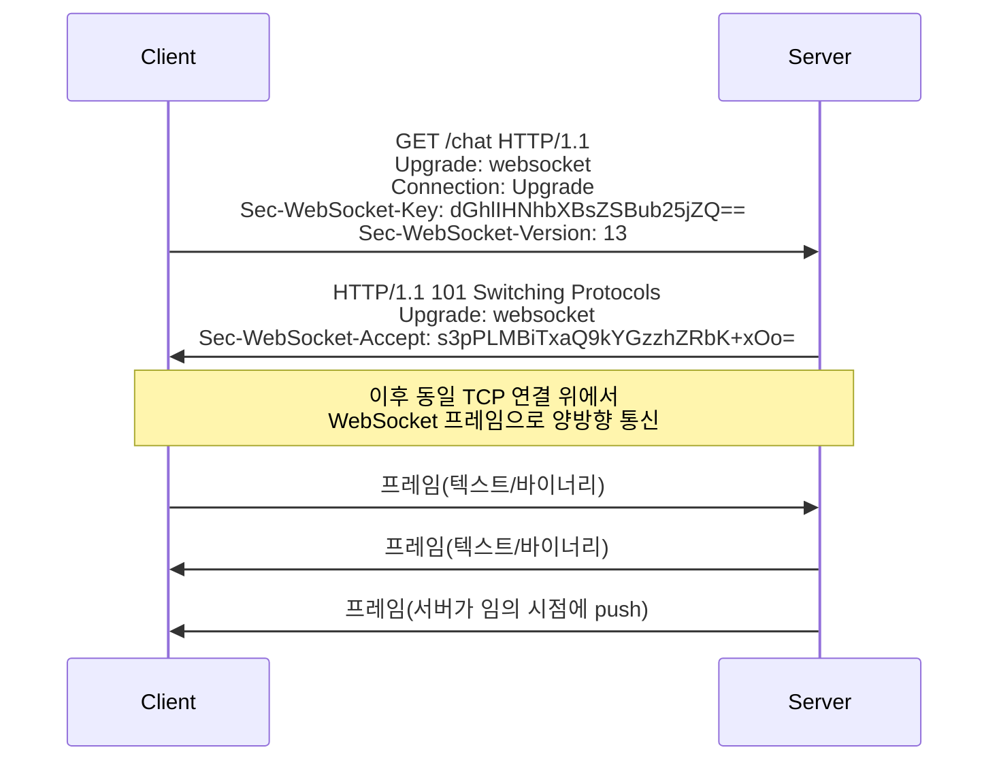

# WebSocket

## 핵심 정의
WebSocket(RFC 6455)은 하나의 TCP 연결 위에서 클라이언트와 서버가 양방향으로 자유롭게 메시지를 주고받을 수 있는 전이중(full-duplex) 통신 프로토콜이다. HTTP 요청으로 연결을 시작해 프로토콜을 업그레이드(Upgrade)한 뒤에는 HTTP의 요청-응답 제약을 벗어나, 서버가 클라이언트 요청 없이도 임의 시점에 데이터를 보낼 수 있다. 채팅, 실시간 알림, 협업 편집, 시세/주문 스트리밍처럼 서버 주도 푸시(push)가 빈번한 상황에 적합하다.

## 동작 원리 / 구조

### 핸드셰이크(handshake)

- 클라이언트는 일반 HTTP GET 요청에 `Upgrade: websocket`, `Connection: Upgrade`, `Sec-WebSocket-Key`(무작위 16바이트를 base64로 인코딩한 값)를 담아 보낸다.
- 서버는 `Sec-WebSocket-Key`에 고정 GUID(`258EAFA5-E914-47DA-95CA-C5AB0DC85B11`)를 붙여 SHA-1 해시 후 base64 인코딩한 값을 `Sec-WebSocket-Accept`로 응답하며 상태 코드 `101 Switching Protocols`를 반환한다.
- 이 핸드셰이크가 일반 HTTP 요청 형태이기 때문에 기존 웹 인프라(포트 80/443, 프록시, 로드밸런서)를 그대로 통과할 수 있다는 것이 설계 의도다.

### 프레임 구조
WebSocket은 핸드셰이크 이후 데이터를 프레임(frame) 단위로 주고받는다. 각 프레임은 FIN 비트, opcode(텍스트/바이너리/ping/pong/close 구분), 마스킹 여부, 페이로드 길이, 페이로드로 구성된다. 클라이언트→서버 프레임은 반드시 마스킹(masking)되어야 하며, 이는 프록시 캐시 오염 공격을 막기 위한 규정이다. ping/pong 프레임으로 연결 생존 여부를 확인(heartbeat)한다.

### Spring에서의 구현 계층
- **Raw WebSocket**: `WebSocketHandler`를 구현해 메시지·연결 이벤트를 처리. 와이어 프레임 파싱은 서버 구현이 담당.
- **STOMP(Simple Text Oriented Messaging Protocol)**: WebSocket 위에 얹는 서브 프로토콜로 `/topic`(발행-구독), `/queue`(1:1), `/app`(서버 라우팅) 같은 목적지(destination) 기반 메시징을 제공. `@EnableWebSocketMessageBroker` + `@MessageMapping`으로 구현.
- **SockJS**: WebSocket을 지원하지 않거나 프록시가 Upgrade 헤더를 제거하는 환경을 위한 폴백(long-polling 등). 현재는 대부분의 브라우저/모바일 클라이언트가 WebSocket을 기본 지원하므로, 특정 기업망 프록시 대응이 필요한 경우가 아니면 생략하는 추세다.

위 handshake는 RFC 6455의 HTTP/1.1 방식이다. HTTP/2(RFC 8441)와 HTTP/3(RFC 9220)는 지원되는 경우 extended CONNECT로 WebSocket을 열며 101 Upgrade를 그대로 사용하지 않는다. 클라이언트 masking은 암호화가 아니므로 전송 기밀성에는 wss/TLS를 사용한다. STOMP destination의 /topic·/queue·/app 의미는 브로커와 Spring 설정의 관례이지 STOMP 핵심 명세가 강제하는 주소 체계가 아니다.

## 실무 관점
- **가능하면 HTTP handshake에서 인증하고, STOMP CONNECT 인증을 쓴다면 미인증 연결의 시간·수를 제한한다.** `@MessageMapping` 레벨의 Spring Security 검증은 연결이 이미 열린 뒤에 동작하므로, 미인증 클라이언트가 연결을 붙잡고 자원을 소비할 수 있다. HTTP 업그레이드 요청 단계(`HandshakeInterceptor`)에서 토큰을 검증해 거부하거나, STOMP를 쓴다면 `ChannelInterceptor`로 `CONNECT` 프레임의 인증 헤더를 검사해 `accessor.setUser(...)`를 채워야 이후 메시지에서 `Principal`이 정상적으로 전파된다.
  ```java
  @Override
  public void configureClientInboundChannel(ChannelRegistration registration) {
      registration.interceptors(new ChannelInterceptor() {
          @Override
          public Message<?> preSend(Message<?> message, MessageChannel channel) {
              StompHeaderAccessor accessor =
                  MessageHeaderAccessor.getAccessor(message, StompHeaderAccessor.class);
              if (accessor != null && StompCommand.CONNECT.equals(accessor.getCommand())) {
                  // Authorization 헤더 검증 후 accessor.setUser(authentication) 설정
              }
              return message;
          }
      });
  }
  ```
- **다중 인스턴스 확장이 REST보다 까다롭다.** WebSocket은 상태 저장(stateful) 연결이므로, 인스턴스를 여러 대로 늘리면 클라이언트가 어느 서버에 붙어 있는지가 문제가 된다. 열린 WebSocket 연결은 해당 서버에 유지된다. sticky session은 재연결·SockJS의 여러 HTTP 요청을 같은 서버로 보내는 용도이며 서버 간 메시지 전파를 대신하지 못한다. 여러 서버에 연결된 구독자에게 이벤트를 전달하려면  `enableStompBrokerRelay("/topic", "/queue").setRelayHost("rabbitmq-host").setRelayPort(61613)`처럼 STOMP 브로커 릴레이(RabbitMQ)를 붙이거나 Redis Pub/Sub으로 인스턴스 간 메시지를 전파해 어느 서버에 붙어 있든 브로드캐스트가 도달하게 만든다.
- **Origin 검증을 생략하면 CSWSH(Cross-Site WebSocket Hijacking)에 노출된다.** WebSocket 핸드셰이크는 fetch와 같은 CORS preflight/응답 허용 절차가 적용되지 않고 쿠키 정책이 허용하면 인증 쿠키가 전송되므로, 서버가 `Origin` 헤더를 검사하지 않으면 악성 사이트가 사용자의 인증된 세션으로 WebSocket 연결을 열 수 있다.
- **커넥션 수는 곧 자원이다.** 연결마다 파일 디스크립터와 메모리(버퍼, 세션 객체)를 점유하므로, 유휴 연결을 정리하는 idle timeout, ping/pong 기반 좀비 연결 감지, 클라이언트 재연결 시 지수 백오프(exponential backoff)를 반드시 설계해야 한다. 방치하면 파일 디스크립터 고갈로 신규 연결이 전부 실패하는 장애로 이어진다.
- 일부 기업 프록시/로드밸런서는 WebSocket Upgrade를 지원하지 않거나 유휴 연결을 짧은 타임아웃으로 강제 종료하므로, 배포 환경의 L7 로드밸런서/프록시 타임아웃 설정을 WebSocket keepalive 주기와 맞춰야 한다.

### 연결 뒤에도 인증 수명과 메시지 권한을 확인한다

핸드셰이크 인증 성공은 연결이 유지되는 동안의 모든 작업을 허용한다는 뜻이 아니다. 세션 만료·로그아웃·계정 정지 뒤에도 이미 열린 연결이 자동으로 닫힌다고 가정하지 않는다. 서버에서 인증 만료 시각을 연결과 함께 관리하고, 로그아웃이나 권한 회수 때 해당 사용자의 연결·구독을 찾을 수 있도록 한다. 다중 인스턴스에서는 연결이 있는 서버까지 회수 이벤트가 전달되는지 확인한다. 검증 주기는 서비스가 허용하는 권한 회수 지연에 맞추며, ping/pong 성공은 인증이 유효하다는 증거가 아니다.

각 메시지의 작업·대상 리소스에 대해 인가(authorization)를 수행한다. 연결 시 확인한 사용자 ID만 믿고 메시지의 계정 ID·채팅방 ID·STOMP 목적지를 그대로 사용하면 다른 사용자의 구독이나 작업이 허용될 수 있다. 구독 후 권한이 바뀌는 경우에는 이미 등록된 구독과 서버 푸시도 중단해야 한다. 만료·로그아웃 이후 기존 연결의 송신과 수신이 모두 차단되는지를 재접속 시험과 분리해 확인한다.

## 심화 Q&A

### Q. WebSocket은 왜 처음부터 별도 프로토콜로 만들지 않고 HTTP 업그레이드 방식을 택했는가?
기존 웹 인프라(방화벽, 리버스 프록시, 로드밸런서, 포트 80/443)는 HTTP 트래픽을 통과시키도록 설계돼 있다. 완전히 새로운 프로토콜이 새 포트를 쓴다면 방화벽 정책 변경 없이는 통과하지 못하는 경우가 많다. HTTP GET + Upgrade 헤더로 시작하면 기존 HTTP 인프라를 그대로 통과한 뒤 연결만 프로토콜을 전환하므로 배포 마찰이 훨씬 적다.

### Q. WebSocket과 SSE(Server-Sent Events)의 차이는 무엇이고 언제 SSE를 선택하는가?
SSE는 HTTP 위에서 서버→클라이언트 단방향 스트림만 지원하며(`text/event-stream`), 클라이언트는 일반 HTTP 요청으로만 응답할 수 있다. 반면 WebSocket은 양방향 통신을 지원한다. 클라이언트가 서버에 자주 데이터를 보낼 필요가 없고(알림, 실시간 피드, 진행률 표시 등) 단순한 재연결/이벤트 ID 기반 복구(Last-Event-ID)가 필요하다면 SSE가 구현이 단순하고 기존 HTTP 인프라(프록시, 캐시, 로드밸런서)와 궁합이 좋다. 채팅처럼 양방향 상호작용이 핵심이면 WebSocket이 적합하다.

### Q. WebSocket과 롱폴링(long polling)의 근본적 차이는 무엇인가?
롱폴링은 여전히 매 응답마다 새 HTTP 요청-응답 사이클을 반복한다(서버가 데이터를 줄 때까지 연결을 붙잡고 있다가 응답 후 클라이언트가 즉시 재요청). WebSocket은 한 번 연결을 맺으면 그 연결 위에서 매번 HTTP 헤더를 보내지 않고 WebSocket 프레임 헤더와 함께 메시지를 주고받으므로, 메시지 빈도가 높을수록 오버헤드 차이가 커진다. 다만 롱폴링은 순수 HTTP이므로 인프라 호환성 문제가 거의 없다는 장점이 있다.

### Q. 다중 서버 인스턴스 환경에서 STOMP 메시지 브로커 릴레이를 쓰지 않고 sticky session만으로 확장하면 어떤 문제가 생기는가?
sticky session은 특정 클라이언트를 항상 같은 서버로 라우팅해 세션 문제는 피하지만, 서버 A에 연결된 클라이언트에게 서버 B에서 발생한 이벤트를 전달할 방법이 없다. 예를 들어 사용자 A(서버1 연결)가 보낸 채팅을 사용자 B(서버2 연결)에게 브로드캐스트해야 하는 경우, 인스턴스 간 메시지 전파 체계(RabbitMQ 릴레이, Redis Pub/Sub, Kafka 등)가 없으면 서버2에 연결된 클라이언트는 메시지를 받지 못한다. sticky session은 연결 재수립이나 SockJS 다중 HTTP 요청의 서버 고정 문제를, 메시지 브로커는 인스턴스 간 전파 문제를 해결하는 것으로 서로 대체재가 아니다.

### Q. 프론트엔드 개발 시 WebSocket 재연결 로직을 잘못 설계하면 어떤 장애 패턴이 나타나는가?
연결이 끊길 때마다 즉시 재연결을 시도하는 클라이언트를 다수 배포하면, 서버 재시작이나 일시적 장애 직후 모든 클라이언트가 동시에 재연결을 시도하는 "재연결 폭풍(reconnect storm)"이 발생해 서버가 복구되자마자 다시 과부하로 쓰러질 수 있다. 지수 백오프와 지터(jitter)를 섞은 재연결 전략이 필요하다.

### Q. gRPC의 스트리밍 RPC와 WebSocket은 둘 다 지속 연결·양방향 통신을 지원하는데 언제 무엇을 선택하는가?
gRPC 스트리밍은 강타입 스키마(protobuf)와 서비스 간 RPC 의미론에 최적화돼 있어 내부 마이크로서비스 간 통신에 적합하고, WebSocket은 브라우저를 포함한 임의의 클라이언트와의 실시간 상호작용에 적합하다. 브라우저는 gRPC를 네이티브로 호출할 수 없어(gRPC-Web 프록시 필요) 웹 클라이언트 대상 실시간 기능은 WebSocket이 기본 선택지가 된다. 자세한 비교는 [[REST와 GraphQL과 gRPC 비교]] 참고.

## 관련 개념
- [[HTTP 1.1과 HTTP 2 HTTP 3 비교]]
- [[L4와 L7 로드밸런싱]]
- [[Spring WebFlux와 리액티브 스트림]]
- [[gRPC]]

## 참고 자료

- [RFC 6455: WebSocket](https://www.rfc-editor.org/rfc/rfc6455.html) — HTTP/1.1 handshake·16바이트 nonce·masking·control frame. 확인: 2026-09-08.
- [RFC 8441: WebSockets over HTTP/2](https://www.rfc-editor.org/rfc/rfc8441.html) — extended CONNECT. 확인: 2026-09-08.
- [RFC 9220: WebSockets with HTTP/3](https://www.rfc-editor.org/rfc/rfc9220.html) — HTTP/3 extended CONNECT. 확인: 2026-09-08.
- [Spring Framework STOMP Token Authentication](https://docs.spring.io/spring-framework/reference/web/websocket/stomp/authentication-token-based.html) — 7.0 계열 ChannelInterceptor 인증 순서. 확인: 2026-09-08.
- [Spring Framework WebSocket API](https://docs.spring.io/spring-framework/reference/web/websocket/server.html) — origin·handler 메시지 모델. 확인: 2026-09-08.

부분 재검증: 2026-09-22. [Spring Framework 외부 브로커](https://docs.spring.io/spring-framework/reference/web/websocket/stomp/handle-broker-relay.html)와 [성능·확장 안내](https://docs.spring.io/spring-framework/reference/web/websocket/stomp/configuration-performance.html)의 simple broker 다중 인스턴스 한계와 broker relay 역할을 대조해 본문을 기존 Q&A와 일치시켰다. 노트 전체의 버전 의존 서술을 재검증한 것은 아니므로 `verified`는 유지했다.

부분 재검증: 2026-10-04. [OWASP WebSocket Security Cheat Sheet](https://cheatsheetseries.owasp.org/cheatsheets/WebSocket_Security_Cheat_Sheet.html)의 세션 수명 관리·로그아웃 시 연결 종료·메시지별 인가 권고를 확인했다. 적용 범위는 WebSocket 애플리케이션의 인증·인가 설계이며 특정 Spring 버전이 이를 자동 제공한다는 의미가 아니다. 실제 세션 만료·권한 회수·다중 인스턴스 전파 시험은 수행하지 않았고, 기존 Spring 예제 전체를 재검증하지 않아 `verified`는 유지했다.
