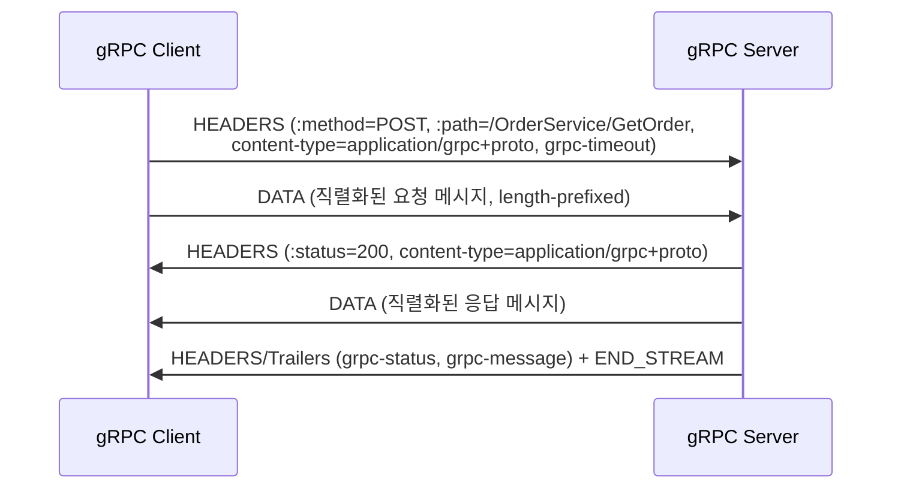

# gRPC

## 핵심 정의
gRPC는 Google이 만들고 CNCF 프로젝트인 오픈소스 RPC(Remote Procedure Call) 프레임워크로, 전송 계층으로 HTTP/2를 쓰고 기본 인터페이스 정의 언어(Interface Definition Language, IDL) 및 직렬화 포맷으로 Protocol Buffers(protobuf)를 사용한다. 클라이언트가 원격 서비스의 메서드를 마치 로컬 함수처럼 호출하는 방식(RPC)을 지향하며, 서비스 계약을 `.proto` 파일로 명시하고 이를 컴파일해 클라이언트 스텁(stub)과 서버 스켈레톤(skeleton) 코드를 자동 생성한다. 강타입 스키마와 바이너리 직렬화, HTTP/2 기반 스트리밍을 갖춰 내부 마이크로서비스 간 고성능 통신에 널리 쓰인다.

## 동작 원리 / 구조

### 개발 흐름
```protobuf
// order.proto
service OrderService {
  rpc GetOrder (OrderRequest) returns (OrderResponse);           // Unary
  rpc StreamOrders (OrderQuery) returns (stream OrderResponse);   // Server streaming
  rpc UploadItems (stream ItemRequest) returns (UploadSummary);   // Client streaming
  rpc Chat (stream ChatMessage) returns (stream ChatMessage);     // Bidirectional streaming
}
```
`.proto` 파일을 `protoc`(또는 Gradle/Maven 플러그인)로 컴파일하면 언어별 메시지 클래스와 서비스 스텁이 생성된다. 서버는 스켈레톤을 상속해 비즈니스 로직만 구현하고, 클라이언트는 생성된 스텁을 통해 원격 메서드를 로컬 함수처럼 호출한다.

### 4가지 통신 방식
| 방식 | 설명 | 사용 예 |
|---|---|---|
| Unary | 요청 1개, 응답 1개 (일반 함수 호출과 동일) | 단건 조회 |
| Server streaming | 요청 1개, 응답 스트림 | 대량 조회 결과 순차 전송 |
| Client streaming | 요청 스트림, 응답 1개 | 파일/이벤트 업로드 후 요약 |
| Bidirectional streaming | 요청/응답 모두 스트림 | 실시간 채팅, 양방향 동기화 |

### HTTP/2 매핑

gRPC는 하나의 RPC 호출을 HTTP/2의 스트림 하나에 매핑한다. 실제 애플리케이션 레벨 상태(성공/실패, 에러 메시지)는 HTTP 상태 코드가 아니라 **트레일러(trailer)**의 `grpc-status`, `grpc-message`에 실린다. 따라서 HTTP 레벨에서는 대부분 `200 OK`를 반환하면서도 `grpc-status`는 실패(`NOT_FOUND`, `DEADLINE_EXCEEDED` 등)일 수 있다. `grpc-timeout` 헤더로 클라이언트가 지정한 데드라인(deadline)이 전파되어, 서버 체인을 거치며 남은 시간을 계속 갱신할 수 있다.

gRPC는 기본적으로 deadline을 설정하지 않으므로 호출자가 명시해야 한다. Java/Go 등 일부 구현은 받은 deadline을 하위 호출에 자동 전파하지만 모든 언어에 공통인 보장은 아니다. 취소가 DB 트랜잭션 rollback이나 외부 부작용 취소를 보장하지 않으므로 멱등성도 필요하다. proto 예시는 서비스 선언 발췌이며 실제 컴파일에는 syntax/edition과 참조 message 정의 및 gRPC protoc 플러그인이 필요하다.

## 실무 관점

### 재시도와 스트리밍의 완료 경계

gRPC의 내장 재시도는 실패 호출의 이력을 새 스트림에 재생하는 방식이다. 기본 재시도 정책은 없으며, 명시적 정책이 없어도 서버 애플리케이션이 처리하지 않았다고 판단할 수 있는 일부 전송 실패에는 투명 재시도(transparent retry)가 가능하다. 응답 헤더를 받으면 호출이 확정(committed)되어 내장 재시도를 더 수행하지 않는다. 여기서 확정은 gRPC 재시도 경계이며 DB 커밋을 뜻하지 않는다.

서버 스트림을 일부 받은 뒤 끊겼다면 단순 재호출로 이어받기가 보장되지 않는다. 업무 수준의 커서·이벤트 ID·중복 처리 규칙을 정하고 남은 deadline 안에서 재개해야 한다. 상태 코드만으로 쓰기 RPC의 중복 실행 안전성을 판단하지 않는다.

스트림에 쓰기를 넘긴 것은 네트워크 전송이나 상대 업무 처리의 완료를 뜻하지 않는다. 양쪽이 읽기를 멈춘 채 대량 쓰기만 기다리면 흐름 제어로 교착될 수 있으므로 읽기·쓰기를 함께 진행하고 대기 버퍼를 제한한다. 실제 수신·처리 확인이 필요하면 애플리케이션 응답 계약으로 표현한다.

- **내부 서비스 간 통신에 강점이 있다.** 스키마가 코드로 강제되어 로컬 코드와 생성된 타입의 불일치를 컴파일 시 발견할 수 있고, 바이너리 직렬화라 JSON보다 페이로드가 작고 파싱이 빠르며, HTTP/2 멀티플렉싱으로 커넥션 하나로 다수 요청을 처리한다. 반면 사람이 눈으로 바로 읽을 수 없고(디버깅 시 별도 도구 필요), 브라우저에서 네이티브 호출이 불가능해 공개 API보다는 서비스 간(server-to-server) 통신에 적합하다.
- **브라우저 호출은 gRPC-Web을 거쳐야 한다.** 브라우저는 HTTP/2 트레일러를 직접 다루는 API를 제공하지 않으므로, gRPC-Web 프록시(Envoy 등)가 트레일러를 헤더나 별도 프레임으로 변환해준다. 웹 프론트엔드에서는 gRPC-Web을 처리하는 프록시 또는 이를 직접 지원하는 서버가 필요하다.
- **장수명 커넥션과 L4 로드밸런서의 궁합 문제.** HTTP/2 연결은 한 번 맺으면 오래 유지되므로, L4(연결 단위) 로드밸런서 뒤에서는 새 연결이 생성될 때만 분산이 일어나 트래픽이 특정 인스턴스에 쏠릴 수 있다. 쿠버네티스 환경에서는 클라이언트 사이드 로드밸런싱(gRPC의 pick-first/round-robin 정책)이나 xDS 기반 서비스 메시(Istio 등), 또는 L7 프록시(Envoy)로 요청/스트림 단위 분산을 구성하는 것이 일반적이다.
- **Spring Boot 연동**은 Spring 팀이 공식 관리하는 Spring gRPC의 해당 버전 starter와 BOM으로 자동 설정을 받을 수 있고, 그 외에 커뮤니티 프로젝트(`net.devh:grpc-spring-boot-starter` 등)도 널리 쓰인다. gRPC 서버를 별도 포트로 띄우고 기존 REST 서버(Tomcat/Netty)와 공존시키는 구성이 흔하다.
- **스키마 진화(schema evolution) 규칙을 지켜야 한다.** protobuf 필드 번호는 한 번 배포되면 절대 재사용하거나 변경하면 안 되고, 필드를 제거할 때는 `reserved`로 번호를 예약해 실수로 재사용되는 것을 막는다. 이를 어기면 롤링 배포 중 신버전과 구버전이 같은 필드 번호를 다른 의미로 해석해 데이터가 오염될 수 있다.
- **에러 처리**는 gRPC 표준 상태 코드(`INVALID_ARGUMENT`, `NOT_FOUND`, `UNAVAILABLE`, `DEADLINE_EXCEEDED` 등)를 사용하고, 재시도 가능 여부를 이 코드 기준으로 판단하도록 클라이언트 정책(retry, backoff)을 설계한다.

### 바이너리 호환성과 JSON 중계 경로는 따로 검증한다

proto3에서 새 필드를 추가한 메시지를 구버전 코드가 읽으면, 모르는 필드는 unknown field로 보존되어 바이너리 재직렬화에 포함될 수 있다. 그러나 중간 서비스가 JSON으로 바꾸거나 아는 필드만 하나씩 새 메시지에 복사하면 그 정보가 사라진다. 구버전 중계 서비스를 거치는 갱신 API에서는 이 손실이 신버전 필드의 덮어쓰기·초기화로 이어지는지 확인한다.

ProtoJSON은 바이너리와 같은 unknown field 보존 계약이 없다. 기본적으로 모르는 필드를 거부하며, 무시 옵션을 켜도 그 값을 다음 홉에 보존한다는 뜻은 아니다. REST 변환 게이트웨이가 있으면 필드 번호만 유지하는 것으로 호환성 검토를 끝내지 말고, 필드·enum 이름과 구버전 파서의 처리 정책까지 확인한다. 신버전 메시지를 구버전 중계 경로로 왕복시킨 뒤 새 필드가 유지되는지 검증한다.

## 심화 Q&A

### Q. 내부 마이크로서비스 통신에서 gRPC가 REST/JSON보다 유리한 이유는 구체적으로 무엇인가?
세 가지가 결합된다. 첫째, protobuf 바이너리 직렬화는 JSON 텍스트보다 페이로드가 작고 인코딩/디코딩이 빠르다. 둘째, `.proto`로 계약을 강제하므로 로컬 코드와 생성 스키마 사이의 타입 오류를 컴파일 시 찾을 수 있다. 독립 배포된 원격 버전의 불일치·업무 의미 오류는 런타임 검증과 호환성 시험이 필요하다. 셋째, HTTP/2 기반이라 커넥션 하나로 다수 요청을 멀티플렉싱하고 스트리밍 RPC를 표준으로 지원해, REST에서 별도로 구현해야 하는 서버 푸시/양방향 스트림을 프레임워크 차원에서 얻는다. 다만 이 이점은 스키마를 공유하고 관리할 수 있는 내부 서비스 간 통신에서 극대화되며, 불특정 다수 클라이언트를 상대하는 공개 API에서는 스키마 배포/버전 관리 부담이 오히려 커질 수 있다.

### Q. 브라우저에서 gRPC를 직접 호출할 수 없는 이유는 무엇이고, gRPC-Web은 이를 어떻게 우회하는가?
gRPC는 HTTP/2의 트레일러(trailer)에 최종 상태(`grpc-status`)를 싣는데, 브라우저의 `fetch`/`XMLHttpRequest` API는 트레일러에 접근하는 표준 방법을 제공하지 않고, 스트림을 세밀하게 제어하는 저수준 HTTP/2 프레임 접근도 허용하지 않는다. gRPC-Web은 클라이언트 라이브러리가 HTTP/1.1 또는 제한된 HTTP/2 위에서 요청을 보내고, 서버 앞단의 프록시(Envoy 등)가 이를 표준 gRPC(HTTP/2 + 트레일러)로 변환해 백엔드에 전달하며 응답도 반대로 변환해준다. 즉 브라우저 호환성 문제를 프록시 계층으로 흡수하는 구조다.

### Q. HTTP/2의 장수명 연결 특성이 로드밸런싱에서 왜 문제가 되고, 어떻게 대응하는가?
L4 로드밸런서는 연결(connection) 단위로 트래픽을 분산하는데, gRPC 클라이언트가 커넥션을 한 번 맺으면 그 위로 수많은 RPC를 멀티플렉싱해 계속 사용하므로, 새 연결이 생기는 시점에만 로드밸런싱이 일어난다. 그 결과 트래픽 패턴이 바뀌거나 인스턴스 수가 늘어도 기존 연결은 재분배되지 않아 부하가 특정 인스턴스에 쏠릴 수 있다. 대응책은 서버가 주기적으로 연결 최대 수명(`MAX_CONNECTION_AGE`)을 설정해 강제로 재연결을 유도하거나, 클라이언트 사이드 로드밸런싱(각 RPC를 여러 백엔드 주소 중에서 직접 분산)을 쓰거나, Envoy/Istio 같은 L7 프록시가 스트림 단위로 라우팅하도록 구성하는 것이다.

### Q. protobuf 필드 번호를 잘못 다루면 어떤 장애로 이어지는가?
필드 번호는 와이어 포맷(wire format)에서 실제 필드를 식별하는 키다. 이미 배포된 필드의 번호를 재사용해 다른 타입/의미의 새 필드에 붙이면, 구버전 클라이언트/서버가 그 번호를 예전 의미로 역직렬화해 잘못된 값을 읽거나 타입 불일치로 파싱이 깨진다. 특히 롤링 배포 중에는 신버전과 구버전이 동시에 트래픽을 처리하므로, 필드 제거 시 번호를 재사용하지 않도록 `reserved` 예약을 걸어두는 것이 필수적이다.

### Q. 마이크로서비스 호출 체인에서 데드라인(deadline) 전파가 안 되면 어떤 문제가 생기는가?
서비스 A→B→C로 이어지는 호출에서 A가 5초 타임아웃을 걸었는데 B가 자체적으로 새로운 5초 타임아웃을 C에 거는 방식이면, A는 이미 타임아웃으로 요청을 포기했는데도 B와 C는 계속 자원을 소비하며 작업을 이어간다. gRPC는 `grpc-timeout`으로 남은 시간을 다음 홉에 전파해, 남은 시간 예산을 전달할 수 있게 한다. 언어별 자동 전파 지원을 확인하고, 취소를 받은 애플리케이션도 자체 작업을 중단해야 한다. 이게 없으면 이미 무의미해진 요청이 하위 서비스 자원을 계속 점유해 장애가 전파(cascading failure)되기 쉽다.

### Q. gRPC 응답이 HTTP 레벨에서는 200 OK인데 실패로 처리해야 하는 경우가 있다는 것은 무엇을 의미하는가?
gRPC는 애플리케이션 레벨의 성공/실패를 HTTP 상태 코드가 아니라 트레일러의 `grpc-status`로 표현한다. 요청이 서버에 정상적으로 도달해 처리됐다면 HTTP 상태는 200이지만, 비즈니스 로직 상 실패(예: `NOT_FOUND`, `PERMISSION_DENIED`)라면 `grpc-status`가 0이 아닌 값을 가진다. 따라서 gRPC 클라이언트/프록시/모니터링 도구를 만들 때 HTTP 상태 코드만 보고 성공 여부를 판단하면 안 되고, 반드시 `grpc-status` 트레일러를 확인해야 한다. 이는 REST에서 HTTP 상태 코드 자체가 성공/실패를 표현하는 것과 대비된다.

## 관련 개념
- [[HTTP 1.1과 HTTP 2 HTTP 3 비교]]
- [[MSA와 모놀리식 비교]]
- [[REST와 GraphQL과 gRPC 비교]]
- [[서킷 브레이커와 장애 격리]]

## 참고 자료

- [gRPC Core Concepts](https://grpc.io/docs/what-is-grpc/core-concepts/) — RPC lifecycle·message ordering·status. 확인: 2026-09-08.
- [gRPC Deadlines](https://grpc.io/docs/guides/deadlines/) — deadline 기본 없음·언어별 전파·취소 처리. 확인: 2026-09-08.
- [gRPC Keepalive](https://grpc.io/docs/guides/keepalive/) — HTTP/2 PING·server policy. 확인: 2026-09-08.
- [Protocol Buffers proto3 guide](https://protobuf.dev/programming-guides/proto3/#updating) — 스키마 호환성. 확인: 2026-09-08.
- [Spring gRPC Getting Started](https://docs.spring.io/spring-grpc/reference/getting-started.html) — 조회한 1.1.2-SNAPSHOT reference의 BindableService·channel·BOM 구성; 정식 도입은 선택한 release의 Boot 호환표 확인. 확인: 2026-09-08.

부분 재검증: 2026-09-23. [gRPC Retry](https://grpc.io/docs/guides/retry/)의 투명 재시도·응답 헤더 이후 확정, [gRPC Flow Control](https://grpc.io/docs/guides/flow-control/)의 스트리밍 쓰기 완료·교착 조건을 확인했다. 버전 고정이 없는 공통 가이드 범위이며 언어별 API·Spring gRPC 호환 버전은 이번 범위 밖이므로 `verified`는 유지했다.

부분 재검증: 2026-10-04. [Protocol Buffers proto3 — Unknown Fields](https://protobuf.dev/programming-guides/proto3/#unknowns)의 바이너리 보존·JSON/필드별 복사 시 손실과 [ProtoJSON Format](https://protobuf.dev/programming-guides/json/)의 unknown field 기본 거부·무시 옵션·JSON wire safety를 확인했다. 적용 범위는 proto3/ProtoJSON 공식 가이드 계약이며 특정 언어 런타임의 기본 옵션 전체를 일반화하지 않는다. gRPC-Web/JSON 게이트웨이 통합과 기존 Spring gRPC 버전은 재검증하지 않아 `verified`는 유지했다.

실행 확인: 2026-10-04, JDK 25.0.4와 protobuf-java/protobuf-java-util 4.33.1의 DynamicMessage·JsonFormat으로 동일 proto3 메시지의 구·신 스키마 왕복을 검증했다. 바이너리는 새 필드 값을 보존했고, 구버전 JSON 출력·필드별 복사는 잃었다. 기본 JSON 파서는 새 필드를 거부하며 `ignoringUnknownFields()`는 허용하되 보존하지 않는 것을 assertion으로 확인했다. [v33.1 JsonFormat 소스](https://raw.githubusercontent.com/protocolbuffers/protobuf/v33.1/java/util/src/main/java/com/google/protobuf/util/JsonFormat.java)의 파서 동작도 대조했다. 이 시험은 메모리 내 메시지 변환이며 실제 RPC 전송·protoc 생성 코드·다른 언어 런타임은 실행하지 않았다.
