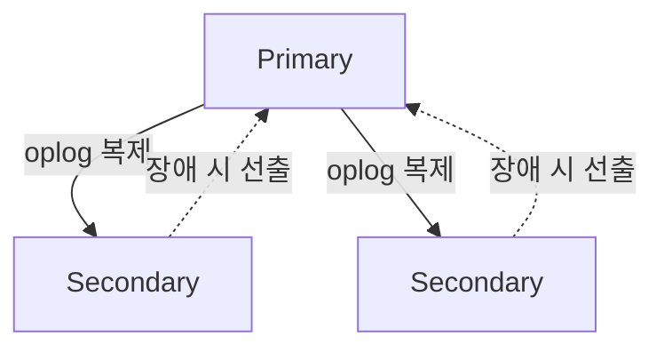

# MongoDB 기본 구조

## 핵심 정의

MongoDB는 BSON(Binary JSON) 형식의 문서(document)를 저장 단위로 하는 문서 지향(document-oriented) 데이터베이스다. 관계형 DB의 테이블-행-열 구조 대신 컬렉션(collection)-문서(document)-필드(field) 구조를 쓰며, 같은 컬렉션 안에서도 문서마다 필드 구성이 다를 수 있다. 저장 엔진(storage engine)으로는 WiredTiger를 기본 저장 엔진으로 사용하며(Enterprise에는 특수 목적의 in-memory 엔진도 있다), 문서 단위 동시성 제어(document-level concurrency control)를 통해 컬렉션 내 여러 문서를 동시에 갱신할 수 있게 한다.

고가용성은 레플리카 셋(replica set), 수평 확장은 샤딩(sharding)으로 처리하며, 검색·벡터 검색(Vector Search)은 별도 `mongot` 프로세스가 담당한다. Atlas와 self-managed 배포는 설치·운영 조건이 다르므로 DB 버전만으로 검색 기능 지원을 판단하지 않는다.

## 동작 원리 / 구조

**논리 구조 계층**

```
Database
 └─ Collection (RDB의 테이블에 대응)
     └─ Document (RDB의 행에 대응, BSON 형식)
         └─ Field (RDB의 컬럼에 대응, 중첩 객체/배열 가능)
```

```javascript
// mongosh 문서 예시: ObjectId는 JSON 리터럴이 아닌 BSON 생성자다.
{
  "_id": ObjectId("64f1a2b3c4d5e6f7a8b9c0d1"),
  "name": "홍길동",
  "orders": [
    { "productId": 101, "qty": 2 },
    { "productId": 205, "qty": 1 }
  ],
  "address": { "city": "서울", "zip": "04524" }
}
```

**저장 엔진: WiredTiger**
- 문서 단위 낙관적 동시성 제어(optimistic concurrency)를 사용해 같은 컬렉션의 서로 다른 문서를 동시에 쓸 수 있다.
- 60초 주기로 체크포인트(checkpoint)를 생성해 디스크에 스냅샷을 기록하며, 새 체크포인트 작성 중에도 이전 체크포인트가 유효하게 유지되어 중단 시에도 복구가 가능하다.
- 7.0 이상부터는 읽기/쓰기 티켓(ticket) 수를 부하 상황에 맞춰 동적으로 조정하는 알고리즘이 기본 적용되어, 과부하 시 처리량을 자동으로 조절한다.

**복제: 레플리카 셋**



- 쓰기는 Primary 노드 하나만 받아들이고, oplog(operation log)를 통해 Secondary로 비동기 복제된다.
- Primary 장애 시 나머지 노드가 투표(election)로 새 Primary를 선출하며, 이 기간 동안 쓰기 가용성이 일시 중단된다.
- 읽기 선호도(read preference: primary, primaryPreferred, secondary 등) 설정으로 읽기 부하를 분산하거나 최종 일관성을 감수하고 지연을 줄일 수 있다.

**수평 확장: 샤딩**
- 샤드 키(shard key) 기준으로 데이터를 청크(chunk) 단위로 나누어 여러 샤드에 분산한다.
- mongos 라우터가 클라이언트 요청을 받아 적절한 샤드로 라우팅하고, config server가 청크 분포 메타데이터를 관리한다.
- 샤드 키의 카디널리티(cardinality)와 쓰기 분산도가 낮으면 특정 샤드에 트래픽이 몰리는 핫스팟(hot shard) 문제가 발생한다.

### 선택 필드의 unique 인덱스: 누락과 null

MongoDB 8.3에서 일반 단일 필드 unique 인덱스는 필드 누락과 명시적 `null`을 모두 `null` 인덱스 키로 저장한다. 따라서 둘을 합쳐 한 문서만 허용하며, 선택 입력인 `email`에 단순히 `{unique: true}`를 붙이면 이메일 없는 두 번째 사용자의 저장이 실패할 수 있다. `sparse: true`는 필드가 없는 문서만 제외하고 명시적 `null`은 인덱싱하므로, unique sparse 인덱스도 여러 `null`을 허용하는 해법은 아니다.

다음은 샤딩하지 않은 컬렉션에서 이메일이 입력된 문자열일 때만 중복을 막는 예다. 스키마 검증으로 `email`을 단일 문자열·`null`·누락 중 하나로 제한한 것을 전제로 한다.

```javascript
db.users.createIndex(
  { email: 1 },
  {
    name: "uq_email_string",
    unique: true,
    partialFilterExpression: { email: { $type: "string" } }
  }
);
```

부분 인덱스(partial index)의 unique 제약은 필터에 들어오는 문서에만 적용된다. 빈 문자열도 문자열이므로 중복이 제한되고, 숫자 같은 잘못된 타입을 거부하는 책임은 별도 스키마 검증에 있다. 기존 데이터가 해당 제약을 위반하면 인덱스 생성도 실패한다. 샤딩된 컬렉션에는 샤드 키와 unique 인덱스 제약을 별도로 검토해야 하므로 이 예를 그대로 전역 유일성 보장으로 사용하지 않는다.

## 실무 관점

- 스키마가 자주 바뀌는 도메인(상품 속성이 카테고리마다 다른 커머스, 로그성 데이터)에 적합하다. 반대로 여러 엔티티 간 강한 참조 무결성과 다중 문서 트랜잭션이 핵심인 도메인(정산, 결제 원장)은 신중히 검토해야 한다. MongoDB도 다중 문서 ACID 트랜잭션을 지원하지만 일반적으로 단일 문서 쓰기보다 비용이 크므로, 함께 변경할 데이터를 embedding해 트랜잭션 범위를 줄일 수 있는지 검토한다. 제품 종류만으로 RDB보다 느리다고 단정하지 않는다.
- 인덱스 설계가 성능의 대부분을 좌우한다. 복합 인덱스(compound index)의 필드 순서, 커버드 쿼리(covered query) 여부, `explain()`을 통한 실행 계획 확인은 운영 초기부터 습관화해야 한다.
- 흔한 실수: 배열 필드가 무한정 커지는 embedding 설계(예: 게시글 문서에 댓글을 계속 push). BSON 문서 크기 제한(16 MiB)에 걸리거나, 큰 문서의 전송·갱신·인덱스 유지 비용이 커진다. WiredTiger가 모든 수정에서 문서 전체를 반드시 재기록한다고 일반화할 수는 없다.
- 흔한 실수 2: 샤드 키를 단조 증가 값(예: 생성 시각, auto-increment 유사 값)으로 잡아 최신 데이터가 항상 같은 청크/샤드에 몰리는 핫스팟을 만드는 패턴. 해시 기반 샤드 키(hashed shard key)나 카디널리티가 높은 복합 키로 완화한다.
- 튜닝 포인트: WiredTiger 캐시 크기(기본값은 `(RAM - 1GB)의 50%`와 `0.256GB` 중 큰 값), 읽기 선호도와 읽기 관심(read concern) 조합, 쓰기 확인(write concern) 수준(w: 1 vs majority)은 일관성-지연-내구성 트레이드오프를 직접 조절하는 지점이다.
- Java/Spring 환경에서는 Spring Data MongoDB를 통해 `MongoTemplate` 또는 Repository 인터페이스로 접근하는 경우가 많은데, 이 경우도 내부적으로 생성되는 쿼리와 인덱스 사용 여부를 `explain()`으로 별도 확인해야 한다. Repository 추상화가 비효율적인 쿼리를 감출 수 있다.

## 심화 Q&A

### Q. MongoDB의 문서 단위 동시성 제어는 RDB의 행 단위 락(row-level lock)과 어떻게 다른가?
개념적으로는 유사하게 "충돌 범위를 최소화한다"는 목표를 공유하지만, MongoDB의 WiredTiger는 대부분의 읽기/쓰기에 낙관적 동시성 제어(MVCC 기반)를 사용해 락을 잡기보다 스냅샷 격리로 충돌을 감지한다. 반면 전통적 RDB의 행 단위 락은 비관적 잠금(pessimistic locking) 방식이 흔하다. 일반 연산의 쓰기 충돌은 MongoDB가 내부적으로 재시도할 수 있다. 다중 문서 트랜잭션의 충돌·일시적 오류는 오류 레이블에 따라 트랜잭션 전체 또는 커밋 재시도가 필요하다. InnoDB와 PostgreSQL도 MVCC를 쓰므로 MongoDB만 읽기와 쓰기를 분리한다고 이해하면 안 된다.

### Q. Primary 선출(election) 도중 애플리케이션은 어떤 영향을 받는가?
선출이 진행되는 동안 클러스터에는 쓰기를 받을 수 있는 Primary가 없으므로 쓰기 요청이 실패하거나 드라이버 재시도 로직에 의해 대기한다. 최신 드라이버는 재시도 가능한 쓰기(retryable writes)를 기본 지원해 일시적 실패를 자동 재시도하지만, 애플리케이션 타임아웃 설정이 너무 짧으면 이 재시도가 완료되기 전에 예외가 전파될 수 있다. 따라서 선출 소요 시간과 클라이언트 타임아웃 설정을 함께 고려해야 한다.

### Q. 왜 MongoDB에서는 조인을 지양하고 embedding을 권장하는가? `$lookup`은 언제 쓰는가?
문서 모델은 한 번의 조회로 필요한 데이터를 전부 가져오는 것을 지향하도록 설계되어 있다. `$lookup`(aggregation의 join 유사 연산)은 실행 가능하지만 인덱스·조인 형태·실행 엔진에 따라 비용이 달라진다. 제품 분류만으로 RDB 조인보다 느리다고 판단할 수는 없다. 자주 함께 조회되는 1:1, 1:소수 관계는 embedding으로, 다대다 관계나 대량 데이터를 참조하는 경우에만 `$lookup`을 제한적으로 사용하는 것이 일반적 가이드다.

### Q. 샤딩된 클러스터에서 샤드 키를 잘못 고르면 어떤 문제가 실제로 발생하는가?
카디널리티가 낮은 필드(예: 국가 코드 몇 개)를 샤드 키로 쓰면 청크 분포가 소수 샤드에 쏠려 데이터가 균등하게 나뉘지 않는 점보 청크(jumbo chunk) 문제가 생긴다. 단조 증가 필드(타임스탬프, auto-increment)를 쓰면 신규 데이터가 항상 마지막 청크/샤드에 몰려 핫스팟이 발생하고, 다른 샤드는 유휴 상태가 된다. 이는 운영 중 샤드 키를 변경하기 매우 어렵다는 점(MongoDB 4.4에서는 `refineCollectionShardKey`로 기존 샤드 키에 접미 필드를 추가하는 제한적 개선만 가능했고, 샤드 키 자체를 바꾸는 `reshardCollection`은 5.0에서야 도입됐다)과 맞물려 초기 설계 단계의 신중한 선택이 중요하다.

### Q. read concern과 write concern의 조합이 실무에서 왜 중요한가?
MongoDB 8.3의 `write concern: majority`는 정해진 수의 데이터 보유 투표 멤버가 쓰기를 oplog에 기록할 때까지 기다린다. 필요한 수는 중재자(arbiter)를 포함한 전체 투표 멤버의 과반수와 데이터 보유 투표 멤버 수 중 작은 값이며 `rs.status().writeMajorityCount`로 확인한다. 기본 `writeConcernMajorityJournalDefault=true`에서는 저널의 내구 저장도 기다린다. 복제본의 실제 데이터 적용은 이후 비동기로 진행될 수 있어 쓰기 승인만으로 모든 복제본에서 즉시 새 값을 읽는다고 가정하지 않는다. `read concern: majority`와 함께 쓰면 "커밋되어 롤백되지 않을 데이터만 읽는다"는 보장을 얻을 수 있다. 반대로 `w: 1`과 `local` read concern 조합은 지연은 짧지만 Primary 장애 시 아직 복제되지 않은 데이터가 롤백될 수 있다. `majority` 읽기도 항상 최신값을 의미하지는 않는다. 자신의 쓰기 읽기 보장은 인과 일관성 세션·적절한 concern 조합까지 포함해 설계하고, 허용 가능한 유실·읽기 지연을 기준으로 설정을 선택한다. `wtimeout` 오류는 이미 성공한 쓰기를 되돌리지 않으므로 결과 불확실성을 처리하고 재시도 시 중복 효과를 막는다.

### Q. MongoDB 8.x에서 도입된 벡터 검색(Vector Search)이 기존 문서 모델과 결합되는 방식은 무엇이며 어떤 경우에 검토할 만한가?
2026-09-08 확인한 self-managed Search 1.x 문서는 Community와 Enterprise에서 별도 `mongot` 배포를 지원한다. `$scoreFusion`은 MongoDB 8.3+에 제공되는 기능으로 문서화되어 있다. 이는 기존 문서에 임베딩(embedding) 벡터 필드를 추가하고 별도 벡터 인덱스를 생성해, 하나의 데이터베이스 안에서 정형 쿼리와 의미 기반 검색을 함께 수행할 수 있게 한다. RAG(retrieval-augmented generation) 기반 검색 기능을 이미 MongoDB에 저장된 데이터 위에 얹어야 하는 경우, 별도의 전용 벡터 DB를 추가하지 않고 기존 인프라를 재사용할 수 있다는 점에서 검토 가치가 있다. 다만 아직 상대적으로 신생 기능이므로 프로덕션 도입 전 `mongod`·`mongot` 호환성, 에디션별 배포 지원, 라이선스 조건을 확인해야 한다. 검색 인덱스는 change stream으로 비동기 동기화되므로 일반 문서 읽기와 같은 최신성 보장을 전제하지 않는다.

## 관련 개념
- [[NoSQL 데이터 모델 비교]]
- [[리플리케이션]]
- [[샤딩 전략]]
- [[인덱스 설계 전략]]

## 참고 자료

부분 재검증: 2026-09-23. MongoDB 8.3 공식 문서에서 단일 필드 unique의 누락·null 처리, sparse와 partial의 차이, 필터에 한정되는 유일성 및 기존 중복 데이터의 생성 실패를 확인했다. 예제는 공식 구문과 대조했으며 MongoDB 서버에서 실행하지 않았다. 그 밖의 엔진·Search·복제 서술 전체는 이번 확인 범위가 아니므로 `verified`를 유지했다.

- [Unique Indexes](https://www.mongodb.com/docs/manual/core/index-unique/) — 확인본 MongoDB 8.3, null·누락 키, 생성 실패, 샤딩 시 제약.
- [Sparse Indexes](https://www.mongodb.com/docs/manual/core/index-sparse/) — 확인본 MongoDB 8.3, 누락 필드 제외와 명시적 null 포함.
- [Partial Indexes](https://www.mongodb.com/docs/manual/core/index-partial/) — 확인본 MongoDB 8.3, `$type` 필터 지원과 필터 대상에만 적용되는 unique.

부분 재확인: 2026-09-22. MongoDB 8.3 공식 문서에서 다중 문서 트랜잭션의 비교 대상, majority 계산·oplog 승인·저널 기본값·wtimeout의 비롤백 동작을 확인했다. Search·샤딩 등 나머지 서술 전체를 재검증한 것은 아니므로 기존 `verified`를 유지했다.

- [Write Concern](https://www.mongodb.com/docs/manual/reference/write-concern/) — 확인본 MongoDB 8.3, majority 계산과 승인·타임아웃 범위.
- [Transactions](https://www.mongodb.com/docs/manual/core/transactions/) — 확인본 MongoDB 8.3, 단일 문서 쓰기와 분산 트랜잭션의 비용 비교.

확인일: 2026-09-08. 아래 적용 범위에서 본문·Q&A·예제를 재검증했다. 예제는 문서와 대조했으며 별도 실행 검증은 하지 않았다.

- [MongoDB WiredTiger Storage Engine](https://www.mongodb.com/docs/manual/core/wiredtiger/) — MongoDB 문서 확인본: 동시성, 7.0+ 티켓, 60초 체크포인트, 캐시 기본값.
- [MongoDB Limits](https://www.mongodb.com/docs/manual/reference/limits/) — BSON 16 MiB 제약.
- [MongoDB Data Modeling](https://www.mongodb.com/docs/manual/data-modeling/) — embedding·reference 선택과 문서 설계.
- [MongoDB Shard Keys](https://www.mongodb.com/docs/manual/core/sharding-shard-key/) — 샤딩·카디널리티·키 변경.
- [MongoDB Read Concern majority](https://www.mongodb.com/docs/manual/reference/read-concern-majority/) — 복제 읽기 보장과 최신성 경계.
- [Self-managed MongoDB Search 1.x](https://www.mongodb.com/docs/search/self-managed/current/) — mongot 구조와 Community/Enterprise 배포.
- [$scoreFusion](https://www.mongodb.com/docs/manual/reference/operator/aggregation/scoreFusion/) — MongoDB 8.3+ 적용 범위.
