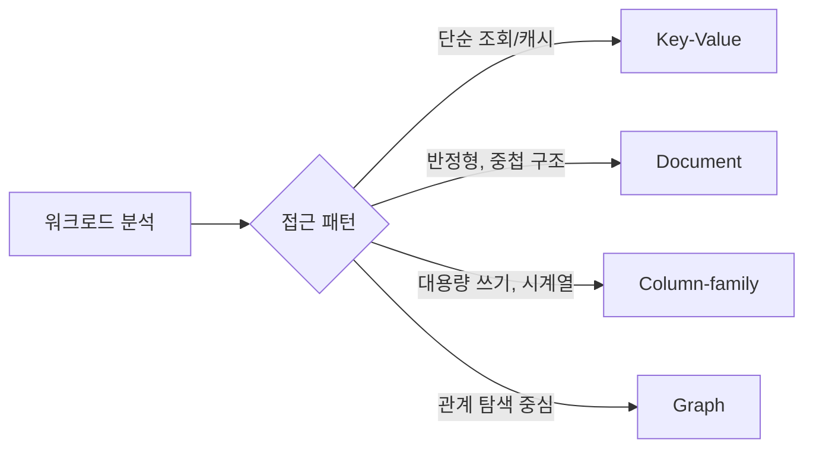

# NoSQL 데이터 모델 비교

## 핵심 정의

NoSQL(Not Only SQL)은 관계형 모델의 고정 스키마와 조인(join) 중심 설계 대신, 데이터 특성과 접근 패턴에 맞춰 저장 구조를 선택할 수 있게 한 데이터베이스 계열이다. 크게 4가지 데이터 모델로 나뉜다: 키-값(Key-Value), 문서(Document), 컬럼 패밀리(Column-family/Wide-column), 그래프(Graph). 각 모델은 데이터 구조뿐 아니라 확장(scale) 전략, 일관성(consistency) 보장 수준, 쿼리 표현력이 서로 다르므로 "NoSQL이 RDB보다 빠르다"는 식의 단순 비교보다는 워크로드에 맞는 모델을 고르는 것이 핵심이다.

스키마 유연성과 수평 확장(horizontal scaling)은 제품별로 다르다. Cassandra CQL처럼 명시적 테이블 스키마를 사용하는 NoSQL도 있다. CAP에서의 일관성·가용성 선택은 데이터 모델의 속성이 아니라 복제 프로토콜과 읽기·쓰기 설정, 네트워크 분단 시 동작으로 판단한다.

## 동작 원리 / 구조

**모델별 데이터 구조**

| 모델 | 저장 단위 | 대표 제품 | 쿼리 방식 |
|---|---|---|---|
| Key-Value | key → value | Redis, DynamoDB, Riak | 기본은 키 조회. Redis 자료구조 연산, DynamoDB 보조 인덱스·문서 필드처럼 제품별 확장이 있음 |
| Document | key → 중첩 가능한 JSON/BSON 문서 | MongoDB, Couchbase | 필드 기반 쿼리, 보조 인덱스 지원 |
| Column-family | row key + column family + column | Cassandra, HBase, Bigtable | row key 범위 스캔, 컬럼 단위 조회 |
| Graph | 노드(node) + 엣지(edge) + 속성 | Neo4j, JanusGraph | 순회(traversal) 쿼리, 관계 탐색 |

**확장 전략 차이**
- Key-Value / Column-family: 키를 기준으로 분산하지만 알고리즘은 제품별로 다르다. Cassandra는 토큰 링(ring)을 쓰고 Redis Cluster는 해시 슬롯을 사용한다. 모델 이름만으로 consistent hashing 사용을 단정하지 않는다.
- Document: 샤드 키(shard key) 선택에 따라 확장성이 크게 갈린다. MongoDB는 샤드 키 기준으로 청크(chunk)를 분산한다.
- Graph: 연결이 파티션을 넘나들면 순회에 네트워크 비용이 추가된다. 확장 난도는 그래프 분할 가능성, 조회 범위와 제품의 분산 실행 방식에 달려 있다.

**일관성 모델**
- Cassandra는 읽기·쓰기 consistency level로 필요한 응답 수를 선택한다. DynamoDB는 읽기 API의 `ConsistentRead` 등 제공되는 옵션을 선택하며 사용자가 읽기·쓰기 쿼럼 수를 지정하지 않는다. 테이블·LSI는 강한 읽기를 지원하고 GSI·Streams는 최종 일관성 읽기다.
- Document DB의 복제 방식은 제품별로 다르다. MongoDB는 primary-secondary 복제를 사용하지만 기본 `local` 읽기와 `majority` 읽기, read preference, 세션 설정의 보장이 다르다. primary에서 읽는다는 사실만으로 모든 연산에 선형성을 보장하지 않는다.
- Graph 모델도 제품의 트랜잭션·복제 설정을 별도로 확인한다. 그래프라는 이유만으로 단일 인스턴스나 특정 일관성 모델로 제한되지는 않는다.

## 실무 관점

- 캐시, 세션 저장소, 카운터처럼 단순 조회가 대부분이면 Key-Value가 가장 단순하고 빠르다. 복잡한 쿼리가 필요해지는 순간 병목이 되므로 초기 설계 단계에서 쿼리 요구사항을 명확히 해야 한다.
- 스키마가 자주 바뀌거나 엔티티마다 필드 구성이 다른 경우(상품 카탈로그, 로그, 설정값) Document 모델이 적합하다. 다만 강한 일관성의 다중 문서 트랜잭션이 필요하면 RDB 대비 설계 복잡도가 올라간다.
- 시계열 데이터, IoT 센서 데이터, 쓰기 처리량이 극도로 높은 경우 Column-family(Cassandra)가 유리하다. 대신 임의 조건 조회(ad-hoc query)가 취약해 조회 패턴을 미리 모델링(query-first design)해야 한다.
- 추천 시스템, 소셜 네트워크, 사기 탐지처럼 관계 자체가 핵심 자산이면 Graph DB를 검토한다. RDB의 다중 조인으로 처리하면 조인 폭발(join explosion)이 발생하는 지점에서 Graph가 강점을 보인다.
- 흔한 실수: "NoSQL이니까 조인이 필요 없다"고 가정하고 설계했다가 애플리케이션 레벨에서 N+1 조회를 반복하는 패턴. 실제로는 조인을 데이터 모델링(비정규화, embedding) 단계로 옮긴 것뿐이며, 잘못 설계하면 애플리케이션 코드가 더 복잡해진다.
- 튜닝 포인트: Cassandra의 replication factor와 read/write consistency level 조합, MongoDB의 샤드 키 카디널리티(cardinality)와 쓰기 분산도, DynamoDB의 파티션 키 핫스팟(hot partition) 여부는 운영 중 반드시 모니터링해야 한다.

## 심화 Q&A

### Q. Document 모델과 Column-family 모델은 둘 다 "스키마리스"라고 불리는데, 실무에서 스키마 유연성을 다루는 방식은 어떻게 다른가?
Document 모델(MongoDB)은 문서 단위로 완전히 다른 필드 구조를 가질 수 있고 중첩 객체/배열을 자유롭게 담는다. 반면 Cassandra CQL은 컬럼 타입을 명시한 테이블 스키마를 사용하고, 컬럼 추가는 `ALTER TABLE` 같은 스키마 변경으로 수행한다. 파티션 키와 클러스터링 키를 기준으로, 쿼리 패턴에 맞춰 테이블을 미리 설계(query-first modeling)해야 한다. 따라서 HBase의 동적 column qualifier와 Cassandra CQL의 컬럼을 같은 스키마리스 개념으로 묶으면 안 된다.

### Q. CAP 이론 관점에서 Cassandra와 MongoDB를 비교하면?
Cassandra는 리더가 없는(leaderless) 구조로 설계되어 있어 파티션 발생 시에도 각 노드가 쓰기를 받아들일 수 있는 AP(가용성 우선) 성향이 기본값이지만, 읽기·쓰기 쿼럼을 요구하면 필요한 복제본에 닿지 못하는 분단에서 요청이 실패한다. `R + W > RF`만으로 동시 쓰기·실패까지 포함한 선형성이 자동 보장되지는 않으며, 비교 후 갱신에는 LWT의 SERIAL 계열 설정도 검토한다. MongoDB는 replica set에서 단일 primary만 쓰기를 받는 구조라 기본적으로 CP(일관성 우선)에 가깝고, primary 장애 시 선출(election) 동안 쓰기 가용성이 일시적으로 끊긴다. 두 시스템 모두 "고정된 CAP 등급"이 아니라 설정으로 조정 가능한 스펙트럼이라는 점이 핵심이다.

### Q. Graph DB가 수평 확장에 취약한 근본적인 이유는 무엇인가?
그래프 순회 쿼리는 노드에서 시작해 엣지를 따라가며 연결된 데이터를 계속 참조한다. 데이터를 여러 샤드로 분산하면 순회 과정에서 샤드 간 네트워크 홉(hop)이 빈번히 발생하는데, 이 비용은 배치·로컬리티·분할 방식에 따라 달라진다. 연결성(connectivity)이 높은 그래프는 분할하기 어렵지만 전체 그래프를 반드시 단일 인스턴스 메모리에 올려야 하는 것은 아니다.

### Q. Key-Value 모델에서 "복잡한 쿼리가 필요해지는 순간 병목"이라는 말의 구체적 의미는?
순수 Key-Value 인터페이스는 키 조회가 중심이지만 DynamoDB처럼 보조 인덱스·조건 검색을 제공하는 제품도 있다. 값(value) 내부 필드로 필터링하거나 정렬하려면 애플리케이션이 전체 스캔을 하거나, 별도의 보조 인덱스(secondary index)를 직접 구축해 관리해야 한다. Redis의 경우 Hash나 Sorted Set 같은 자료구조를 조합해 유사 인덱스를 흉내낼 수는 있지만, 이는 RDB의 인덱스처럼 자동 유지되지 않고 애플리케이션이 일관성을 책임져야 한다.

### Q. 하나의 서비스에서 여러 NoSQL 모델을 함께 쓰는 폴리글랏 퍼시스턴스(polyglot persistence) 전략의 트레이드오프는?
장점은 각 데이터 특성에 최적화된 저장소를 쓸 수 있다는 것이다(세션은 Redis, 상품 카탈로그는 MongoDB, 추천 그래프는 Neo4j). 단점은 운영 복잡도가 저장소 수만큼 곱해진다는 점이다. 각 시스템마다 백업/복구, 모니터링, 장애 대응, 팀의 학습 곡선이 별도로 필요하고, 시스템 간 데이터 정합성을 맞추는 이벤트 기반 동기화(CDC 등) 설계 비용도 추가된다. 초기 단계에서는 검증된 하나의 저장소로 시작하고, 명확한 병목이 확인된 부분만 특화 저장소로 분리하는 점진적 접근이 일반적으로 안전하다.

### Q. MongoDB 같은 Document DB에서 "정규화 대신 embedding"을 선택할 때 판단 기준은?
자주 함께 조회되고(1:1 조회 패턴), 갱신 빈도가 낮으며, 하위 문서가 부모 없이 독립적으로 존재할 필요가 없는 관계라면 embedding이 유리하다(예: 주문과 주문 항목). 반대로 하위 데이터가 독립적으로 자주 갱신되거나, 여러 부모 문서에서 참조되거나(다대다), 문서 크기가 무한정 커질 수 있는 경우(예: 댓글이 수만 개까지 늘어나는 게시글)에는 참조(reference)로 분리해야 한다. 문서 크기 상한(예: MongoDB 16 MiB BSON 제한)도 embedding 여부를 결정하는 실질적 제약이 된다.

## 관련 개념
- [[MongoDB 기본 구조]]
- [[CAP 이론]]
- [[샤딩 전략]]
- [[리플리케이션]]

## 참고 자료

확인일: 2026-09-08. 아래 적용 범위에서 본문·Q&A·예제를 재검증했다. 예제는 문서와 대조했으며 별도 실행 검증은 하지 않았다.

- [DynamoDB Read Consistency](https://docs.aws.amazon.com/amazondynamodb/latest/developerguide/HowItWorks.ReadConsistency.html) — 2026-09-08 서비스 문서: 테이블·LSI·GSI 및 global tables 일관성.
- [Cassandra Dynamo Architecture](https://cassandra.apache.org/doc/stable/cassandra/architecture/dynamo.html) — Cassandra stable 문서: 토큰 분산·쿼럼·last-write-wins.
- [Cassandra Guarantees](https://cassandra.apache.org/doc/stable/cassandra/architecture/guarantees.html) — 일관성 수준 및 LWT 보장.
- [Cassandra Data Modeling](https://cassandra.apache.org/doc/stable/cassandra/developing/data-modeling/intro.html) — query-first 모델링과 CQL 스키마.
- [MongoDB Data Modeling](https://www.mongodb.com/docs/manual/data-modeling/) — 문서 모델과 embedding 선택.
- [MongoDB Read Concern majority](https://www.mongodb.com/docs/manual/reference/read-concern-majority/) — 문서 모델과 일관성 구분.
