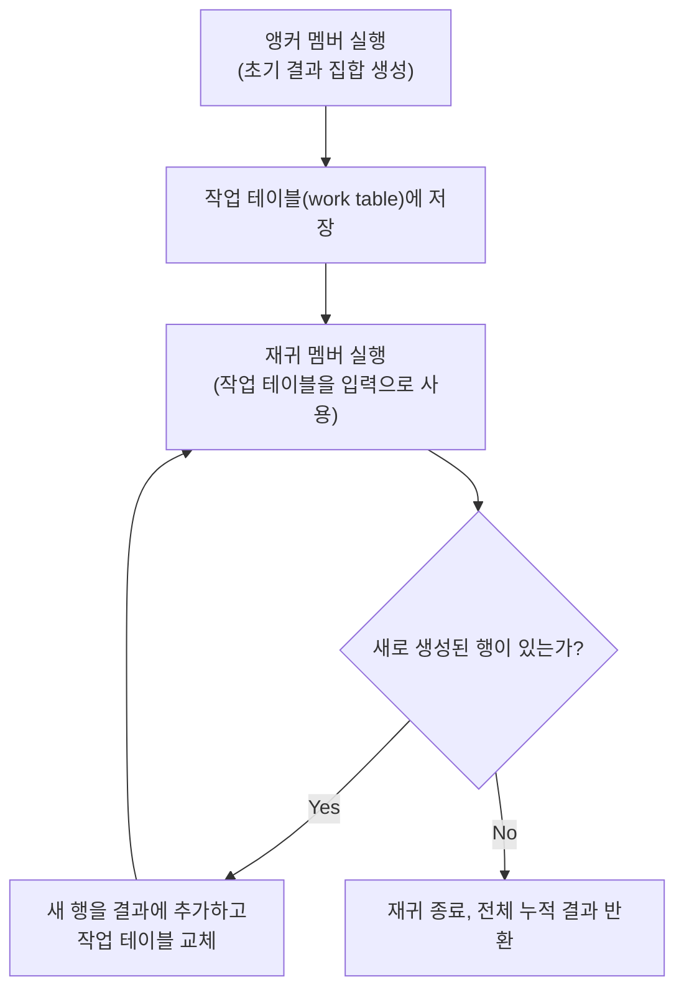

# CTE 공통 테이블 표현식

## 핵심 정의

CTE(Common Table Expression, 공통 테이블 표현식)는 `WITH` 절로 보조 문장을 정의해 하나의 SQL 문장 안에서 그 결과에 이름을 붙여 참조하는 기능이다. 일반적으로 SELECT 결과를 사용하며, PostgreSQL에서는 데이터 변경 문장의 RETURNING 결과도 사용할 수 있다. 뷰(view)처럼 이름으로 참조 가능하지만 저장되지 않고 해당 쿼리 실행 시에만 존재한다. 자기 자신을 참조할 수 있는 재귀 CTE(Recursive CTE)를 이용하면 계층 구조나 그래프 순회처럼 반복적인 참조가 필요한 쿼리도 SQL만으로 표현할 수 있다.

## 동작 원리 / 구조

### 비재귀 CTE: 가독성과 구조화

```sql
WITH high_value_orders AS (
  SELECT customer_id, SUM(amount) AS total
  FROM orders
  WHERE status = 'PAID'
  GROUP BY customer_id
  HAVING SUM(amount) > 1000000
)
SELECT c.name, h.total
FROM high_value_orders h
JOIN customers c ON c.id = h.customer_id;
```

여러 단계의 서브쿼리를 중첩하는 대신 `WITH`로 단계를 나눠 쓰면 쿼리의 논리적 흐름을 위에서 아래로 읽을 수 있다. 하나의 쿼리 안에서 여러 CTE를 콤마로 나열할 수 있고, 뒤에 오는 CTE가 앞의 CTE를 참조할 수도 있다.

### 재귀 CTE: 구조

```sql
WITH RECURSIVE org_chart AS (
  -- 1) 앵커(anchor) 멤버: 재귀의 시작점
  SELECT id, name, manager_id, 1 AS depth
  FROM employees
  WHERE manager_id IS NULL

  UNION ALL

  -- 2) 재귀(recursive) 멤버: 이전 결과를 참조해 다음 단계 생성
  SELECT e.id, e.name, e.manager_id, oc.depth + 1
  FROM employees e
  JOIN org_chart oc ON e.manager_id = oc.id
)
SELECT * FROM org_chart ORDER BY depth, id;
```



엔진은 앵커 멤버를 한 번 실행해 초기 행 집합을 만들고, 그 결과만을 입력으로 재귀 멤버를 반복 실행한다. 매 반복마다 "직전 반복에서 새로 생긴 행"만 다음 입력이 되며, 더 이상 새 행이 생기지 않으면 종료한다. `UNION ALL`을 쓰면 중복 제거 없이 이어붙이고, `UNION`은 이전 누적 결과와 새 행의 전체 컬럼 중복을 제거한다. `depth`·경로처럼 매번 달라지는 컬럼이 있으면 같은 노드를 재방문해도 행이 달라지므로 순환 방지를 대신하지 못한다.

### 순환 방지

계층이 아니라 그래프처럼 순환(cycle)이 있을 수 있는 데이터라면 방문한 노드를 배열/경로로 누적해 순환 여부를 직접 검사해야 한다.

```sql
-- PostgreSQL 18 배열 문법
WITH RECURSIVE path AS (
  SELECT id, manager_id, ARRAY[id] AS visited
  FROM employees WHERE id = 1
  UNION ALL
  SELECT e.id, e.manager_id, p.visited || e.id
  FROM employees e
  JOIN path p ON e.manager_id = p.id
  WHERE NOT (e.id = ANY(p.visited))  -- 이미 방문한 노드면 중단
)
SELECT * FROM path;
```

PostgreSQL 14+는 `CYCLE` 절로 이 패턴을 표준화해 제공한다(`... UNION ALL ... CYCLE id SET is_cycle USING path`). MySQL 8.4에는 `CYCLE` 절과 위 PostgreSQL 배열 문법이 없다. JSON 배열과 `JSON_CONTAINS()` 또는 충분한 길이로 `CAST`한 구분자 포함 문자열 경로로 방문 검사를 구현한다.

### PostgreSQL의 데이터 변경 CTE

CTE가 항상 SELECT 결과만 뜻하는 것은 아니다. PostgreSQL 18은 최상위 문장에 붙는 WITH 안에 INSERT·UPDATE·DELETE·MERGE를 둘 수 있다. 다음 예시는 삭제된 행을 `RETURNING`으로 받아 보관 테이블에 넣는다.

```sql
-- PostgreSQL 18: 두 테이블의 컬럼 타입이 일치한다고 가정
WITH moved AS (
  DELETE FROM jobs
  WHERE status = 'DONE' AND finished_at < DATE '2026-01-01'
  RETURNING id, status, finished_at
)
INSERT INTO jobs_archive (id, status, finished_at)
SELECT id, status, finished_at FROM moved;
```

데이터 변경 CTE는 결과를 읽지 않아도 한 번 끝까지 실행한다. 여러 변경 CTE와 본문은 같은 스냅샷을 사용하며 작성 순서대로 변경을 관찰하는 절차형 코드가 아니다. 변경된 값을 전달하려면 원본 테이블을 다시 조회하지 말고 `RETURNING` 결과를 참조한다. 한 문장에서 같은 행을 둘 이상의 변경 CTE·본문이 수정하도록 구성하지 않는다. 이 PostgreSQL 문법을 MySQL의 WITH 지원과 동일하게 취급하지 않는다.

## 실무 관점

- **가독성 vs 서브쿼리**: 다단계 집계를 순차적으로 표현할 때 중첩 서브쿼리보다 CTE가 훨씬 읽기 쉽다. 코드 리뷰나 유지보수 관점에서 큰 이점이 있다.
- **계층 구조 조회**: 조직도, 카테고리 트리, 댓글의 대댓글 구조처럼 깊이가 가변적인 계층은 재귀 CTE 없이는 애플리케이션 코드에서 반복 조회하거나 깊이를 고정해 여러 번 `JOIN`해야 한다. 재귀 CTE는 이를 DB 레벨에서 한 번에 해결한다.
- **PostgreSQL의 최적화 장벽(옛 동작) 주의**: PostgreSQL 11 이하에는 CTE가 항상 최적화 장벽(optimization fence)으로 동작해, CTE 내부 쿼리가 통째로 먼저 물질화(materialize)된 뒤 바깥 쿼리와 결합됐다. PostgreSQL 12부터는 비재귀·부작용 없는 SELECT CTE가 한 번 참조되면 기본적으로 인라인(inline)되어 일반 서브쿼리처럼 최적화된다. 강제로 물질화하고 싶으면 `AS MATERIALIZED`, 병합을 요청하려면 `AS NOT MATERIALIZED`를 명시할 수 있다. 재귀 CTE나 volatile 함수가 있는 CTE에는 이 요청이 적용되지 않는다.
- **MySQL의 처리 방식**: MySQL 8.0은 비재귀 CTE를 대체로 서브쿼리처럼 취급해 조건에 따라 파생 테이블처럼 병합(merge)하거나 물질화한다. 다만 재귀 CTE는 항상 임시 테이블에 물질화된다.
- **무한 루프 위험**: 재귀 조건이나 순환 방지 로직을 빠뜨리면 재귀 CTE가 끝나지 않거나 매우 오래 걸릴 수 있다. MySQL은 `cte_max_recursion_depth` 시스템 변수(기본값 1000)로 재귀 깊이를 제한해 폭주를 방지한다. PostgreSQL은 별도의 깊이 제한이 없어 애플리케이션/쿼리 레벨에서 종료 조건과 순환 방지를 직접 책임져야 한다.
- **흔한 실수**: 재귀 CTE에서 재귀 멤버 안에 `GROUP BY`, `ORDER BY`, 집계 함수, `LIMIT`(엔진별로 제약 다름)를 섞으려다 문법 오류가 나는 경우가 많다. MySQL 8.4 재귀 멤버는 집계·윈도우 함수·GROUP BY·ORDER BY 등이 제한되지만 `LIMIT`은 지원한다. 엔진별 지원 문법을 확인한다.

## 심화 Q&A

### Q. CTE와 서브쿼리(파생 테이블)의 근본적인 차이는 무엇인가?
문법적 가독성 차이 외에, PostgreSQL 12+ 기준으로는 "자기 참조 가능 여부"가 핵심 차이다. 비재귀 CTE는 옵티마이저가 조건에 따라 서브쿼리처럼 인라인할 수 있어 실행 계획상 동등해질 수 있지만, 재귀 CTE는 서브쿼리로는 원천적으로 표현할 수 없는 반복 참조 구조를 제공한다. 즉 CTE의 진짜 강점은 가독성이 아니라 재귀 표현 능력에 있다.

### Q. CTE와 뷰(View)는 어떻게 다른가?
뷰는 데이터베이스 카탈로그에 정의가 영구 저장되고 여러 쿼리에서 재사용되며 권한 부여 대상도 될 수 있다. CTE는 해당 쿼리 실행 동안에만 존재하고 다른 쿼리에서 재사용할 수 없다. "여러 곳에서 반복 사용"할 로직은 뷰로, "이 쿼리 안에서만 단계를 나누고 싶다"면 CTE로 가는 것이 일반적인 기준이다.

### Q. 같은 CTE를 쿼리 안에서 여러 번 참조하면 매번 재계산되는가?
PostgreSQL은 버전에 따라 다르다. `MATERIALIZED`로 강제하거나 옵티마이저가 물질화를 선택하면 한 번 계산된 결과를 재사용하지만, 인라인되면 참조할 때마다 다시 평가될 수 있다. MySQL 8.4에서 물질화된 CTE는 여러 번 참조해도 쿼리당 한 번 물질화한다. 병합 여부는 `MERGE`/`NO_MERGE` 힌트와 병합 가능 조건으로 제어하며 PostgreSQL의 `AS MATERIALIZED` 문법을 사용할 수 없다.

### Q. 재귀 CTE로 무한 루프에 빠지는 전형적인 상황과 예방법은?
순환 참조가 있는 그래프(A→B→C→A)에서 종료 조건 없이 재귀 멤버를 실행하면 새로운 행이 계속 생성돼 종료되지 않는다. 예방법은 두 가지다. 첫째, 방문 경로를 배열에 누적하고 이미 방문한 노드면 재귀를 중단하는 조건을 추가한다. 둘째, MySQL이라면 `cte_max_recursion_depth`로 안전장치를 걸어 최소한 서버가 무한정 자원을 소모하지 않도록 막는다. 프로덕션에서는 두 가지를 함께 적용하는 것이 안전하다.

### Q. 재귀 CTE 대신 애플리케이션에서 반복 쿼리로 계층을 조회하는 것과 비교하면 어떤 트레이드오프가 있는가?
애플리케이션 반복 조회는 계층 깊이만큼 DB 왕복(round trip)이 발생해 네트워크 지연이 누적되고, N+1 패턴과 유사한 문제를 낳는다. 재귀 CTE는 한 번의 쿼리로 끝나 왕복 비용이 없지만, 깊이가 매우 깊거나 매 단계 결과가 커지는 경우 DB 서버 한 곳에 연산이 집중되고 임시 테이블(작업 테이블) 크기가 커질 수 있다. 계층 깊이가 얕고 트래픽이 많다면 재귀 CTE가, 계층이 매우 깊고 트리 구조를 캐싱해야 한다면 클로저 테이블(closure table) 같은 반정규화 모델이 더 나을 수 있다.

### Q. 카테고리 트리처럼 자주 조회되는 계층 구조에 재귀 CTE만 쓰는 것이 항상 최선인가?
아니다. 조회가 매우 빈번하고 계층 변경은 드물다면, 재귀 CTE로 매번 계산하기보다 각 노드의 상위-하위 관계를 미리 펼쳐 저장하는 클로저 테이블이나, `path`(예: `1/4/12/`) 문자열 컬럼으로 조상/자손 관계를 인덱스 하나로 조회하는 경로 열거(path enumeration) 방식이 읽기 성능에서 유리하다. 재귀 CTE는 유연성이 필요하거나 트리 변경이 잦은 경우에 더 적합하다.

## 관련 개념
- [[윈도우 함수]]
- [[ERD 설계와 다대다 관계 처리]]
- [[정규화와 반정규화]]
- [[실행 계획 읽는 법]]

## 참고 자료

확인일: 2026-09-08. 아래 적용 범위에서 본문·Q&A·예제를 재검증했다. 예제는 문서와 대조했으며 별도 실행 검증은 하지 않았다.

- [PostgreSQL 18 WITH Queries](https://www.postgresql.org/docs/18/queries-with.html) — 반복 평가·중복 제거·배열·CYCLE·물질화.
- [MySQL 8.4 WITH](https://dev.mysql.com/doc/refman/8.4/en/with.html) — 재귀 문법·타입·깊이 기본값·LIMIT.
- [MySQL 8.4 CTE Optimization](https://dev.mysql.com/doc/refman/8.4/en/derived-table-optimization.html) — 1회 물질화 및 MERGE/NO_MERGE.

부분 재검증: 2026-09-23. PostgreSQL 18 데이터 변경 CTE의 실행 횟수·동일 스냅샷·RETURNING 전달 경계를 확인했다. 추가 SQL은 공식 문서와 대조했으며 실제 PostgreSQL에서는 실행하지 않았다. 기존 전체 검증일은 유지한다.

- [PostgreSQL 18 Data-Modifying Statements in WITH](https://www.postgresql.org/docs/18/queries-with.html#QUERIES-WITH-MODIFYING) — 미참조 변경 CTE 실행과 같은 행 중복 변경 제약.
