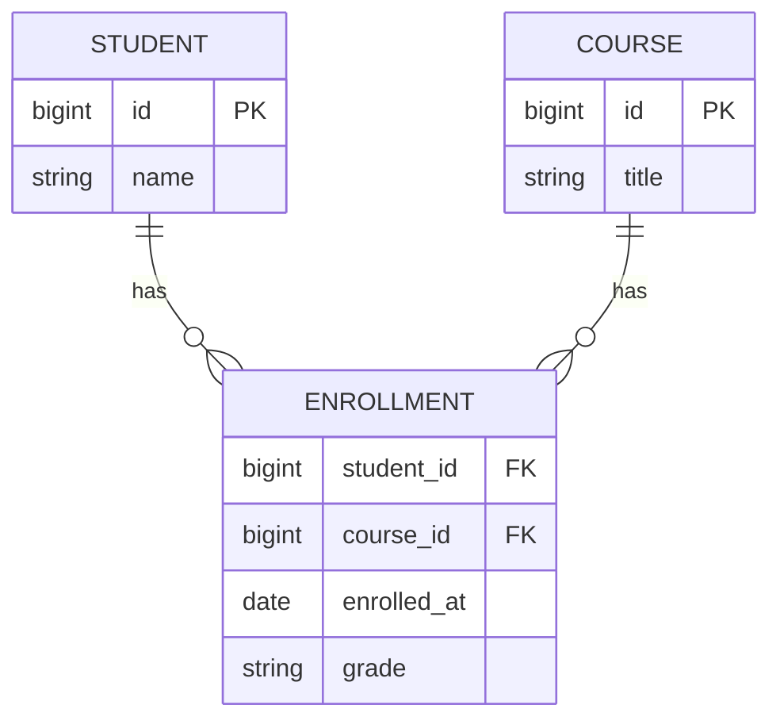

# ERD 설계와 다대다 관계 처리

## 핵심 정의

ERD(Entity-Relationship Diagram, 개체-관계 다이어그램)는 엔티티(테이블이 될 대상)와 그 사이의 관계, 카디널리티(1:1, 1:N, N:M)를 시각적으로 표현한 설계 산출물이다. 관계형 DB는 물리적으로 두 테이블을 직접 다대다(N:M)로 연결할 수 없으므로, 다대다 관계는 반드시 연결 테이블(junction table, 조인 테이블)을 매개로 두 개의 1:N 관계로 분해해서 구현한다.

## 동작 원리 / 구조

### 카디널리티 표기와 분해



학생(Student)과 강좌(Course)는 다대다 관계다. 이를 구현하려면 두 PK를 함께 갖는 연결 테이블 `enrollment`를 만들고, `student_id`, `course_id`를 각각 외래키(FK)로 두면서 (student_id, course_id)를 복합 유니크 제약(또는 복합 PK)으로 지정해 같은 조합의 중복 등록을 막는다.

```sql
CREATE TABLE enrollment (
  student_id BIGINT NOT NULL,
  course_id  BIGINT NOT NULL,
  enrolled_at DATE NOT NULL DEFAULT (CURRENT_DATE),
  grade CHAR(1),
  PRIMARY KEY (student_id, course_id),
  FOREIGN KEY (student_id) REFERENCES student(id),
  FOREIGN KEY (course_id) REFERENCES course(id)
);
```

### 대리 키(surrogate key) vs 복합 자연 키(composite natural key)

연결 테이블의 PK를 두 FK의 조합(복합 키)으로 할지, 별도의 자체 증가 `id` 대리 키로 할지는 설계 선택이다.

| | 복합 키 `(student_id, course_id)` | 대리 키 `enrollment_id` |
|---|---|---|
| 중복 방지 | PK 자체가 유니크 보장 | 별도 유니크 제약 필요 |
| 조인 시 참조 | 두 컬럼을 함께 조건에 사용 | 단일 컬럼으로 참조 가능 |
| 자식 엔티티 필요 시 | 자식이 두 컬럼을 모두 FK로 받아야 함 | 자식이 단일 FK만 받으면 됨 |
| ORM(JPA) 매핑 | `@EmbeddedId`/`@IdClass` 필요, 다소 번거로움 | 엔티티로 자연스럽게 매핑 |

연결 테이블 자체에 속성이 거의 없고(순수 연결) 하위 자식 테이블도 없다면 복합 키가 군더더기 없이 깔끔하다. 반면 연결 테이블이 그 자체로 의미 있는 엔티티(예: "수강 신청"이 취소/이력 관리 대상이 되는 경우)로 커지고 그 밑에 또 다른 자식 테이블이 붙는다면, 대리 키를 두는 편이 이후 확장에 유리하다.

### 다대다 그 자체가 아니라 "관계에 속성이 있는 경우"

연결 테이블에 `enrolled_at`, `grade`처럼 관계 자체에 속하는 속성이 있다면, 이 연결 테이블은 단순 매핑을 넘어 하나의 독립된 엔티티(예: "수강 신청")로 취급하는 것이 맞다. JPA에서는 이런 경우 `@ManyToMany` 대신 두 개의 `@ManyToOne`을 가진 별도 엔티티 클래스로 승격시켜 매핑하는 것이 사실상 표준 관행이다.

### FK가 보장하는 관계의 방향과 인덱스

외래키(Foreign Key, FK)는 자식 행이 가리키는 부모가 존재함을 검사한다. nullable FK는 참조 없는 자식 행을 허용하므로 필수 관계에는 NOT NULL도 필요하다. 자식 FK에 UNIQUE를 더하면 부모당 자식이 최대 하나가 되지만, 모든 부모에 자식이 반드시 하나씩 생기는 것은 아니다. 생성 흐름이나 별도 제약 설계 없이 이를 필수 1:1 관계라고 단정하지 않는다.

PostgreSQL 18의 복합 FK는 기본 `MATCH SIMPLE`에서 구성 컬럼 중 하나라도 NULL이면 참조 검사를 면제한다. `MATCH FULL`은 모두 NULL인 경우만 면제하고 NULL·비NULL 혼합은 거부한다. 연결 테이블의 두 ID를 모두 NOT NULL로 선언하면 이런 빈 관계를 피할 수 있다.

자식 FK 인덱스 생성도 제품마다 다르다. PostgreSQL 18은 FK 선언만으로 자식 인덱스를 만들지 않지만, MySQL 8.4 InnoDB는 FK 컬럼이 앞부분에 같은 순서로 오는 적절한 인덱스가 없으면 자동 생성한다. 위 `PRIMARY KEY(student_id, course_id)`에서 course 기준 조회·삭제 검사를 위한 역방향 인덱스를 검토하되, MySQL에서는 이미 자동 생성됐는지 먼저 확인한다. 참조 부모 삭제가 큰 자식 테이블을 반복 스캔하면 잠금 보유 시간이 늘어날 수 있다.

## 실무 관점

- **`@ManyToMany`를 피하는 이유**: JPA/Hibernate의 `@ManyToMany` 연관관계만으로는 연결 행의 추가 속성을 엔티티 필드로 매핑할 수 없고, 컬렉션 전체를 지우고 다시 쓰는 방식으로 갱신되는 경우가 많아 의도치 않은 대량 DELETE/INSERT가 발생하기 쉽다. 실무에서는 처음부터 연결 테이블을 명시적인 엔티티(예: `Enrollment`)로 만들고 두 방향 `@ManyToOne`으로 매핑하는 것을 기본값으로 삼는 경우가 많다.
- **인덱스 설계**: 연결 테이블에서 `(student_id, course_id)` 복합 PK를 두면 `student_id`로 시작하는 조회는 그 인덱스로 커버되지만, `course_id`만으로 조회(특정 강좌를 듣는 학생 목록)하려면 별도의 `course_id` 단독 인덱스(또는 `(course_id, student_id)` 인덱스)가 필요하다. 양방향 조회 패턴을 미리 파악해 인덱스를 설계해야 한다.
- **삭제 정책**: 학생이나 강좌가 삭제될 때 연결 테이블 행을 어떻게 처리할지(`ON DELETE CASCADE` vs 애플리케이션에서 명시적 처리)를 설계 단계에서 결정해야 한다. `CASCADE`는 편리하지만 실수로 상위 엔티티를 지웠을 때 하위 이력까지 조용히 사라지는 위험이 있다.
- **1:1 관계와의 구분**: 1:1 관계는 굳이 별도 테이블을 만들지 않고 한쪽 테이블에 컬럼을 몰아넣거나, FK에 유니크 제약을 걸어 표현할 수 있다. 다대다와 헷갈려 불필요하게 연결 테이블을 만드는 것은 과도한 설계다.
- **ERD 도구와 정합성**: ERD는 설계 산출물로 끝나는 것이 아니라 실제 스키마와 어긋나지 않도록 지속적으로 갱신해야 한다. `DDL`로부터 ERD를 역생성하는 도구(DataGrip, dbdiagram.io, SchemaSpy 등)를 활용해 문서와 실제 스키마의 드리프트(drift)를 주기적으로 점검하는 것이 실무적으로 안전하다.
- **흔한 실수**: 연결 테이블에 PK를 아예 두지 않거나 유니크 제약을 빠뜨려 같은 조합이 중복 삽입되는 것, FK 인덱스를 한쪽 방향만 만들어 반대 방향 조회가 풀스캔이 되는 것, `@ManyToMany`를 그대로 쓰다가 나중에 속성을 추가해야 해서 마이그레이션 비용이 커지는 것이 대표적이다.

## 심화 Q&A

### Q. 다대다 관계를 관계형 DB가 직접 지원하지 못하는 근본적인 이유는 무엇인가?
관계형 모델의 테이블 행(row)은 하나의 FK 컬럼에 하나의 값만 가질 수 있다는 제약(1차 정규형, 원자값 원칙과 맞닿아 있음) 때문이다. 한 학생이 여러 강좌를 듣고 한 강좌를 여러 학생이 듣는 상황을 하나의 FK 컬럼으로 표현하려면 컬럼에 여러 값을 넣어야 하는데, 이는 정규화 원칙(반복 그룹 금지)에 위배된다. 연결 테이블은 "각 행이 하나의 (학생, 강좌) 조합만 나타낸다"는 방식으로 관계형 모델 안에서 다대다를 표현한다. 관계형 DB가 다대다 관계 자체를 지원하지 않는다는 뜻은 아니다.

### Q. 연결 테이블의 PK를 복합 키로 할지 대리 키로 할지 결정하는 실질적 기준은?
"이 연결 테이블을 참조하는 또 다른 테이블이 생길 가능성이 있는가"가 핵심 기준이다. 없다면 복합 키가 더 간결하고 유니크 제약도 자동으로 따라온다. 있다면(예: 수강 신청에 대한 성적 정정 이력, 결제 내역처럼 연결 테이블 자체가 부모가 되는 구조) 자식 테이블이 두 컬럼을 모두 FK로 받아야 하는 복잡함을 피하기 위해 대리 키를 쓰는 것이 유지보수에 유리하다.

### Q. `@ManyToMany`로 매핑된 컬렉션에 항목을 삭제했는데 SQL 로그에는 여러 개의 DELETE와 INSERT가 찍히는 이유는?
Hibernate의 `@ManyToMany` 컬렉션은 기본적으로 컬렉션 전체를 하나의 단위로 관리하는 경우가 많아, 컬렉션 변경 시 영속성 컨텍스트(persistence context)가 추적하는 방식에 따라 기존 연결을 전부 삭제하고 새로 채워 넣는 방식으로 동기화되기도 한다(특히 `List` 타입에 인덱스가 없는 다대다 조합 등). 이는 트래픽이 많은 테이블에서 불필요한 잠금과 쓰기 비용을 유발하므로, 애초에 연결 엔티티를 명시적으로 만들고 `@OneToMany`/`@ManyToOne`으로 관리해 개별 행 단위로 추가/삭제되도록 설계하는 것이 안전하다.

### Q. 삼항 관계(ternary relationship, 세 엔티티 간의 관계)는 연결 테이블 두 개로 표현할 수 있는가?
일반적으로는 불가능하다. 예를 들어 "학생-강좌-학기"처럼 세 엔티티가 동시에 조합을 이루는 관계는, 두 개의 이항(binary) 연결 테이블로 쪼개면 원래 존재하던 세 엔티티 사이의 결합 제약이 사라져 부정확한 조합(예: 실제로는 없었던 학생-강좌-학기 조합)까지 허용하게 될 수 있다. 이 경우 세 FK를 모두 가진 하나의 연결 테이블로 모델링해야 원래의 제약 관계를 정확히 표현할 수 있다.

### Q. 다대다 연결 테이블에 정규화를 적용하다가 오히려 조회 성능이 나빠지는 경우는 언제인가?
매번 두 엔티티의 이름/속성까지 함께 보여줘야 하는 목록 조회가 매우 빈번하고 트래픽이 큰 경우, 매번 세 테이블 조인(연결 테이블 + 양쪽 테이블)이 필요해 조회 비용이 누적될 수 있다. 이런 경우 자주 함께 보여지는 일부 컬럼(예: 강좌명)을 연결 테이블에 반정규화해 캐싱하듯 중복 저장하는 절충안을 쓰기도 한다. 다만 이는 원본 데이터가 바뀔 때 동기화 책임이 추가되는 트레이드오프를 수반하므로, 조회 성능 이득이 갱신 복잡도 증가를 상쇄할 만큼 명확할 때만 적용해야 한다. 자세한 트레이드오프는 [[정규화와 반정규화]] 참고.

### Q. 대용량 다대다 연결 테이블에서 특정 방향 조회(예: 특정 강좌의 수강생 수 세기)가 느릴 때 어떻게 접근해야 하는가?
먼저 조회 방향에 맞는 인덱스가 있는지 확인한다(위에서 언급한 `course_id` 단독/선두 인덱스). 인덱스가 있는데도 느리다면, 자주 필요한 집계값(예: 강좌별 수강생 수)을 실시간 계산 대신 카운터 컬럼으로 비정규화하고 트리거나 애플리케이션 트랜잭션에서 증분 갱신하는 방식을 검토할 수 있다. 다만 카운터 컬럼은 갱신 시 잠금 경합(hot row)을 유발할 수 있어, 트래픽이 매우 높다면 비동기 집계나 캐시 계층(Redis 등)으로 분리하는 것도 고려 대상이다.

## 관련 개념
- [[정규화와 반정규화]]
- [[CTE 공통 테이블 표현식]]
- [[인덱스 설계 전략]]
- [[NoSQL 데이터 모델 비교]]

## 참고 자료

확인일: 2026-09-08. 아래 적용 범위에서 본문·Q&A·예제를 재검증했다. 예제는 문서와 대조했으며 별도 실행 검증은 하지 않았다.

- [PostgreSQL 18 Constraints](https://www.postgresql.org/docs/18/ddl-constraints.html) — 복합 PK·FK·UNIQUE·다대다 연결 테이블·삭제 정책.
- [Hibernate ORM 7.1 Many-to-many](https://docs.hibernate.org/orm/7.1/userguide/html_single/#associations-many-to-many) — 연결 엔티티·컬렉션 삭제 시 SQL 동작.

부분 재검증: 2026-09-23. PostgreSQL 18·MySQL 8.4의 FK NULL 처리·자식 인덱스 생성을 재검증했다. JPA 예제와 나머지 설계 설명의 전체 검증일은 변경하지 않았다. 기존 전체 검증일은 유지한다.

- [PostgreSQL 18 Constraints](https://www.postgresql.org/docs/18/ddl-constraints.html) — FK의 nullable·MATCH FULL 경계와 자식 인덱스 비자동 생성.
- [MySQL 8.4 Foreign Key Constraints](https://dev.mysql.com/doc/refman/8.4/en/create-table-foreign-keys.html) — InnoDB FK의 인덱스 순서와 자동 생성.
