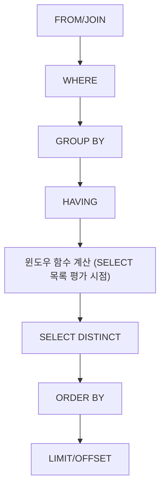

# 윈도우 함수

## 핵심 정의

윈도우 함수(Window Function)는 `GROUP BY`처럼 행을 하나로 뭉치지 않으면서, 지정한 행 집합(윈도우, window) 범위를 기준으로 집계나 순위 계산을 수행하는 SQL 기능이다. `OVER()` 절로 윈도우를 정의하며, 각 행은 원본 그대로 유지된 채 그 행이 속한 윈도우에 대한 계산 결과가 추가 컬럼으로 붙는다. "그룹별 합계를 구하면서 상세 행도 함께 보고 싶다"는 요구를 간결하게 표현한다. `GROUP BY` 집계 결과를 원본에 조인해도 구현 가능하지만 쿼리 구조가 복잡해질 수 있다. 여기서 유지되는 행은 WHERE·GROUP BY·HAVING 처리 후의 입력 행이다.

## 동작 원리 / 구조

### 기본 문법

```sql
함수(인자) OVER (
  [PARTITION BY 파티션_컬럼]
  [ORDER BY 정렬_컬럼]
  [프레임 정의: ROWS|RANGE BETWEEN ... AND ...]
)
```

- **PARTITION BY**: 전체 결과를 그룹으로 나눈다(`GROUP BY`와 비슷하지만 행을 합치지 않음).
- **ORDER BY**: 파티션 내 행의 순서를 정한다. 의미 있는 순위·누적 순서를 정한다. 일부 함수는 생략 문법을 허용하지만 결과 순서가 비결정적이거나 모든 행이 동점이 된다.
- **프레임(frame)**: 집계·FIRST_VALUE·LAST_VALUE 등이 참조할 행 범위를 정한다. 순위 함수와 LAG·LEAD는 프레임에 의해 참조 범위가 제한되지 않는다.

### 실행 순서상의 위치

윈도우 함수는 SQL 논리적 실행 순서에서 `WHERE` → `GROUP BY` → `HAVING` 이후, `SELECT` 목록 평가 단계에서 계산되고, `ORDER BY`(바깥쪽 정렬)보다는 먼저 적용된다. 그래서 윈도우 함수 결과를 조건으로 필터링하려면 `WHERE`에 바로 쓸 수 없고 서브쿼리나 CTE로 감싸야 한다.

```sql
-- 오류: WHERE 절에서 윈도우 함수 직접 참조 불가
SELECT dept, salary, RANK() OVER (PARTITION BY dept ORDER BY salary DESC) AS rnk
FROM employees
WHERE rnk = 1;  -- Error

-- 올바른 방법: 서브쿼리/CTE로 감싸기
WITH ranked AS (
  SELECT dept, salary,
         RANK() OVER (PARTITION BY dept ORDER BY salary DESC) AS rnk
  FROM employees
)
SELECT * FROM ranked WHERE rnk = 1;
```

### 주요 함수 분류

| 분류 | 함수 | 용도 |
|---|---|---|
| 순위 | `ROW_NUMBER()`, `RANK()`, `DENSE_RANK()`, `NTILE(n)` | 동일 값 처리 방식이 다름(아래 Q&A 참조) |
| 집계 | `SUM()`, `AVG()`, `COUNT()`, `MIN()`, `MAX()` + `OVER()` | 파티션별 누적/총합을 원본 행 유지하며 계산 |
| 오프셋 | `LAG()`, `LEAD()`, `FIRST_VALUE()`, `LAST_VALUE()`, `NTH_VALUE()` | 이전/다음 행, 특정 위치 값 참조 |
| 분포 | `PERCENT_RANK()`, `CUME_DIST()` | 상대적 순위 비율 |

### 프레임(Frame) 지정: ROWS vs RANGE

```sql
SELECT order_date, amount,
  SUM(amount) OVER (
    ORDER BY order_date
    ROWS BETWEEN 6 PRECEDING AND CURRENT ROW
  ) AS moving_sum_7rows
FROM daily_sales;
```

- `ROWS BETWEEN`: 물리적 행 개수 기준 (예: "직전 6개 행 + 현재 행" = 7행 이동 합계).
- `RANGE BETWEEN`: `ORDER BY` 값 기준 논리적 범위. 동일 정렬 값을 가진 행들을 하나의 피어(peer) 그룹으로 묶어 같이 포함시킨다는 점이 `ROWS`와 다르다.
- 프레임을 생략하고 `ORDER BY`만 쓰면 기본값은 `RANGE BETWEEN UNBOUNDED PRECEDING AND CURRENT ROW`다. 즉 명시하지 않아도 누적 합계처럼 동작하며, 이는 `SUM() OVER (PARTITION BY x)`(정렬 없음, 전체 파티션 합계)와 결과가 다르므로 주의해야 한다.



### LAST_VALUE와 동점의 프레임

`LAST_VALUE`는 파티션 전체의 마지막 값이 아니라 현재 프레임의 마지막 값이다. PostgreSQL 18에서 ORDER BY만 지정하면 현재 행의 마지막 피어까지만 포함한다. 마지막 기록이 필요하면 완전한 정렬 키와 전체 프레임을 명시한다.

```sql
WITH sales(id, day_no, amount) AS (
  VALUES (1, 1, 10), (2, 1, 20), (3, 2, 5)
)
SELECT id,
       SUM(amount) OVER (ORDER BY day_no) AS peer_sum,
       SUM(amount) OVER (
         ORDER BY day_no, id ROWS UNBOUNDED PRECEDING
       ) AS row_sum,
       LAST_VALUE(amount) OVER (ORDER BY day_no, id) AS frame_last,
       LAST_VALUE(amount) OVER (
         ORDER BY day_no, id
         ROWS BETWEEN UNBOUNDED PRECEDING AND UNBOUNDED FOLLOWING
       ) AS partition_last
FROM sales
ORDER BY id;
```

| id | peer_sum | row_sum | frame_last | partition_last |
|---|---|---|---|---|
| 1 | 30 | 10 | 10 | 5 |
| 2 | 30 | 30 | 20 | 5 |
| 3 | 35 | 35 | 5 | 5 |

행별 누적이나 ROW_NUMBER의 재현성을 위해 고유 키를 추가하는 것과 동점 순위를 유지하는 것은 다른 요구다. `RANK() OVER (ORDER BY salary DESC, id)`로 고유 ID를 넣으면 급여가 같아도 피어가 아니게 된다. 동점 순위는 급여만으로 계산하고 화면 표시 순서는 바깥 ORDER BY에서 ID로 보완한다.

## 실무 관점

- **랭킹/Top-N 조회**: 부서별 최고 급여자, 카테고리별 최신 게시글 N개처럼 "그룹 내 순위" 요구사항을 윈도우 함수로 간결하게 표현할 수 있다. 성능 우위는 입력 행 수·정렬·인덱스와 실제 계획으로 판단한다.
- **이동 평균/누적 집계**: 매출 추이, 재고 누적 등 시계열 분석에서 `LAG()`/`LEAD()`와 이동 합계 프레임을 조합해 전일 대비, 7일 이동 평균 등을 한 쿼리로 계산한다.
- **페이지네이션 대체**: `ROW_NUMBER()` 순번 범위로 페이지를 잘라도 앞선 행의 번호 계산 비용이 남고, 삽입·삭제에 따라 번호가 변한다. 이는 마지막 정렬 키를 검색 조건으로 사용하는 키셋(keyset) 페이징과 다르다. 자세한 내용은 [[페이징 최적화]] 참고.
- **성능 주의**: `PARTITION BY`+`ORDER BY` 조합은 내부적으로 정렬(sort) 연산을 유발한다. PostgreSQL은 적합한 인덱스 순서를 활용해 정렬을 줄일 수 있다. MySQL은 윈도우 정렬·물질화 최적화가 별도 적용되므로 같은 인덱스를 만들었다고 정렬 제거를 보장하지 않는다. 엔진별 실행 계획으로 확인한다.
- **흔한 실수**: `WHERE`에서 윈도우 함수 결과를 바로 필터링하려다 오류가 나는 것, `RANGE`의 기본 프레임을 `ROWS`처럼 오해해 동일 값 그룹의 누적 합계가 예상과 다르게 나오는 것, `COUNT(*) OVER()`(전체 건수)와 `COUNT(*) OVER(PARTITION BY ...)`(그룹별 건수)를 혼동하는 것이 대표적이다.
- **가용성**: MySQL은 8.0부터, PostgreSQL은 8.4부터 윈도우 함수를 지원한다. 다만 기본 문법이 같다고 세부 기능까지 동일한 것은 아니다. MySQL 8.0은 프레임 단위로 `ROWS`, `RANGE`만 지원하고 `GROUPS`와 `EXCLUDE` 절, `LAG()`/`LEAD()`의 `IGNORE NULLS`, `NTH_VALUE()`의 `FROM LAST`는 파서가 인식만 할 뿐 실제로는 오류를 낸다. PostgreSQL 18도 `IGNORE NULLS`와 `NTH_VALUE ... FROM LAST`는 지원하지 않는다. 반면 `GROUPS` 프레임 모드와 `EXCLUDE CURRENT ROW`/`EXCLUDE GROUP`/`EXCLUDE TIES` 절을 표준대로 지원한다. 마이그레이션 시 이런 세부 문법 차이를 놓치기 쉽다.

## 심화 Q&A

### Q. `ROW_NUMBER()`, `RANK()`, `DENSE_RANK()`의 차이는 정확히 무엇인가?
동점(tie)이 있는 데이터에서 차이가 드러난다. 급여가 [100, 100, 90]인 3명에게 `ORDER BY salary DESC`를 적용하면 `ROW_NUMBER()`는 무조건 1,2,3을 부여(동점도 임의 순서로 구분)하고, `RANK()`는 1,1,3(동점 처리 후 다음 순위를 건너뜀)을, `DENSE_RANK()`는 1,1,2(건너뛰지 않음)를 부여한다. "정확히 N등까지"를 뽑을 때 동점 처리 정책에 따라 함수를 선택해야 한다.

### Q. 윈도우 함수로 구현한 쿼리와 자기 조인(self join)+`GROUP BY` 서브쿼리로 구현한 쿼리 중 무엇이 더 유리한가?
윈도우 함수는 자기 조인의 반복 탐색을 줄일 수 있지만, 모든 윈도우를 한 번의 정렬·스캔으로 처리한다고 보장하지 않는다. 서로 다른 PARTITION BY/ORDER BY를 쓰면 정렬 단계가 늘 수 있고, 큰 파티션이나 전체 프레임은 버퍼링 비용을 키울 수 있다. 반대로 소수 그룹에서 인덱스로 상위 몇 건만 찾는 쿼리는 개별 인덱스 탐색이 더 쌀 수 있다. 조인 횟수만 세지 말고 동일한 결과 조건에서 실제 읽은 행 수·정렬·임시 저장·실행 시간을 비교한다.

### Q. `SUM(x) OVER (PARTITION BY dept)`와 `SUM(x) OVER (PARTITION BY dept ORDER BY hire_date)`는 왜 결과가 다른가?
`ORDER BY`가 없으면 프레임 기본값이 파티션 전체(`UNBOUNDED PRECEDING AND UNBOUNDED FOLLOWING`)라 각 행에 부서 전체 합계가 그대로 찍힌다. `ORDER BY`가 있으면 프레임 기본값이 `UNBOUNDED PRECEDING AND CURRENT ROW`로 바뀌어 누적 합계(러닝 토탈)가 된다. `ORDER BY` 존재 여부가 암묵적으로 프레임 기본값을 바꾼다는 점이 실수하기 쉬운 부분이다.

### Q. 대용량 테이블에서 윈도우 함수가 느려질 때 어떤 부분을 먼저 의심해야 하는가?
`PARTITION BY`/`ORDER BY` 대상 컬럼에 적절한 인덱스가 없어 매번 전체 정렬(sort)이 발생하는 경우가 가장 흔하다. `EXPLAIN`에서 `Using filesort`(MySQL) 또는 `Sort` 노드(PostgreSQL)가 큰 비용을 차지하는지 확인하고, 파티션+정렬 컬럼 순서로 복합 인덱스를 구성해 정렬을 인덱스 스캔으로 대체할 수 있는지 검토한다. 또한 계산에 필요한 행을 유지하는 범위에서 `WHERE`로 입력을 줄일 수 있다. 이전 기간의 누적값·이동 평균에 필요한 행까지 제거하면 결과 의미가 바뀐다.

### Q. `LAG()`/`LEAD()`로 전일 대비 증감을 구할 때 날짜에 빈 구간(결측일)이 있으면 어떤 문제가 생기는가?
`LAG(amount, 1)`은 물리적으로 "이전 행"을 가져오지 결측일을 자동으로 채워주지 않는다. 즉 3일치 데이터가 없다면 4일 전 값과 비교하면서도 "전일 대비"로 잘못 해석될 수 있다. 날짜 캘린더 테이블과 `LEFT JOIN`으로 빈 날짜를 명시적으로 채운 뒤 윈도우 함수를 적용해야 정확한 시계열 비교가 된다.

### Q. 윈도우 함수와 `GROUP BY` 집계를 같은 쿼리에서 함께 쓸 수 있는가?
가능하다. `GROUP BY`로 먼저 그룹핑이 끝난 결과(집계된 행들) 위에 윈도우 함수를 추가로 적용할 수 있다. 예를 들어 부서별 평균 급여를 구한 뒤(`GROUP BY dept`), 그 평균 급여들 사이에서 `RANK() OVER (ORDER BY AVG(salary) DESC)`로 순위를 매긴다. 같은 SELECT 목록에 선언한 `avg_salary` 별칭은 윈도우 ORDER BY에서 직접 참조하지 말고, 별칭을 쓰려면 CTE 한 단계를 둔다. SQL 실행 순서상 `GROUP BY`가 윈도우 함수보다 먼저 처리되기 때문에 가능한 조합이다.

## 관련 개념
- [[CTE 공통 테이블 표현식]]
- [[페이징 최적화]]
- [[실행 계획 읽는 법]]
- [[인덱스 설계 전략]]

## 참고 자료

확인일: 2026-09-08. 아래 적용 범위에서 본문·Q&A·예제를 재검증했다. 예제는 문서와 대조했으며 별도 실행 검증은 하지 않았다.

- [PostgreSQL 18 Window Functions](https://www.postgresql.org/docs/18/functions-window.html) — 함수·프레임·미지원 NULL 처리.
- [PostgreSQL 18 Window Tutorial](https://www.postgresql.org/docs/18/tutorial-window.html) — 논리 실행 순서·집계와 조합.
- [MySQL 8.4 Window Restrictions](https://dev.mysql.com/doc/refman/8.4/en/window-function-restrictions.html) — GROUPS·EXCLUDE·FROM LAST 지원 경계.
- [MySQL 8.4 Window Optimization](https://dev.mysql.com/doc/refman/8.4/en/window-function-optimization.html) — 정렬·물질화 최적화.

부분 재검증: 2026-09-23. PostgreSQL 18의 LAST_VALUE·피어·전체 프레임과 윈도우별 비용 판단을 공식 문서로 확인했다. 추가 VALUES 예제의 표는 SQLite 3.51.0에서도 실행 대조했다. 이는 공통 프레임 계산 결과의 확인이며 PostgreSQL·MySQL의 실행 계획 검증은 아니다. 기존 전체 검증일은 유지한다.

- [PostgreSQL 18 Window Functions](https://www.postgresql.org/docs/18/functions-window.html) — LAST_VALUE의 프레임, 피어와 순위. 위 MySQL 8.4 Window Optimization의 여러 윈도우 정렬도 재확인.
- [SQLite Window Functions](https://sqlite.org/windowfunctions.html) — 추가 예제 실행 환경의 프레임·피어 규칙.
