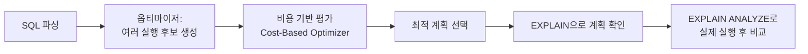

# 실행 계획 읽는 법

## 핵심 정의
실행 계획(execution plan)은 옵티마이저(query optimizer)가 SQL을 실제로 수행하기 위해 선택한 접근 방식(테이블 접근 순서, 인덱스 사용 여부, 조인 알고리즘, 정렬 방식 등)을 트리 또는 표 형태로 보여주는 정보다. `EXPLAIN`(MySQL/PostgreSQL 공통 키워드)으로 예상 계획을, `EXPLAIN ANALYZE`로 실제 실행 결과(실측 시간, 실제 처리 행 수)를 확인할 수 있다. 쿼리가 느릴 때 원인을 추정이 아니라 근거를 갖고 진단하기 위한 1차 도구다.

## 동작 원리 / 구조

### 실행 계획 확인 흐름



### MySQL EXPLAIN 주요 컬럼
| 컬럼 | 의미 | 주목할 값 |
|---|---|---|
| `type` | 테이블 접근 방식 | `ALL`(테이블 전체), `index`(인덱스 전체), `range`, `ref`, `eq_ref`, `const` 등. 접근 범위 분류이며 실행 시간의 절대 순위는 아님 |
| `key` | 실제 사용된 인덱스 | `NULL`이면 인덱스 미사용 |
| `rows` | 예상 스캔 행 수(추정치) | 실제 결과 행 수 대비 과도하게 크면 통계 불일치 의심 |
| `filtered` | 필터 조건 통과 예상 비율(%) | 낮을수록 조건 이후 버려지는 행이 많음 |
| `Extra` | 추가 정보 | `Using filesort`, `Using temporary`, `Using index`(커버링) 등 |

### PostgreSQL EXPLAIN (ANALYZE, BUFFERS) 주요 항목
- `Seq Scan` / `Index Scan` / `Index Only Scan` / `Bitmap Heap Scan`: 접근 방식
- `cost=시작비용..총비용`: 옵티마이저가 추정한 상대적 비용(단위 없음)
- `rows=`, `width=`: 추정 행 수와 평균 행 크기
- `actual time=시작..종료`, `rows=실제행수`, `loops=`: `ANALYZE` 옵션 사용 시 실측값 — 시간은 ms이고 반복 노드의 시간·행 수는 실행당 평균이다. 총 작업량은 loops도 함께 본다
- `Nested Loop` / `Hash Join` / `Merge Join`: 조인 알고리즘
- `BUFFERS` 옵션: shared/local/temp 블록의 hit/read/dirtied/written 횟수. PostgreSQL 18은 `ANALYZE`에 `BUFFERS`가 암묵적으로 포함되며 `BUFFERS OFF`로 끌 수 있다

### 예시 (PostgreSQL)
```sql
EXPLAIN (ANALYZE, BUFFERS)
SELECT o.id, o.status
FROM orders o
JOIN customers c ON o.customer_id = c.id
WHERE c.grade = 'VIP'
ORDER BY o.created_at DESC
LIMIT 20;
```
결과에서 `Sort` 노드가 등장하고 그 아래에 `Seq Scan on orders`가 보인다면, 선택된 접근 경로가 최종 정렬 순서를 제공하지 못한다는 뜻이다. 인덱스가 있어도 VIP 필터의 선택도·조인 방식 때문에 Seq Scan + Sort가 더 싸게 선택될 수 있으므로 인덱스 부재를 단정하지 않는다.

### 실측 수치의 합산 경계

PostgreSQL 18의 상위 노드 시간·버퍼 수에는 하위 노드 작업이 포함된다. 트리의 모든 수치를 합하면 중복 계산된다. 버퍼 수는 고유 페이지 수가 아니라 반복 접근을 포함한 횟수이며 `shared read`도 OS 페이지 캐시에서 읽었을 수 있어 물리 디스크 읽기 횟수와 같지 않다. `actual rows`는 노드가 내보낸 행 수이므로 필터 전 작업량은 `Rows Removed by Filter`와 `loops`도 본다.

`LIMIT`이 하위 노드를 일찍 멈췄다면 전체 수행을 전제로 한 추정 rows와 실제 rows가 달라도 통계 오류가 아닐 수 있다. 노드별 시간 측정 비용이 큰 짧은 쿼리는 `EXPLAIN (ANALYZE, BUFFERS, TIMING OFF)`로 행 수·버퍼·전체 실행 시간을 확인할 수 있다. 기본 EXPLAIN은 결과의 클라이언트 전송 비용을 재현하지 않으므로 애플리케이션 지연과 같다고 가정하지 않는다.

### 확장 통계로 고칠 수 있는 추정 오류의 범위

PostgreSQL 18의 `CREATE STATISTICS`는 수집 대상 정의를 만들 뿐이며, 실제 통계는 이후 수동·자동 `ANALYZE`가 채운다. 완전히 상관된 `(a,b)` 10,000행에서 `a=1 AND b=1`이 실제 100행을 반환하는 예제를 PostgreSQL 18.6으로 실행하면, 단일 컬럼 통계의 추정은 1행이었다. `dependencies` 통계를 만든 직후에도 1행이고, `ANALYZE` 후에야 100행으로 바뀌었다. 통계 객체 존재 여부만 보고 수집까지 끝났다고 판단하지 않는다.

기능별 한계도 구분한다. `dependencies`는 상수와의 단순 동등 비교·상수 IN 조건에 적용되며 범위 조건이나 두 컬럼의 비교를 일반적으로 해결하지 않는다. 또한 PostgreSQL 18의 확장 통계는 테이블 간 조인 선택도 추정에 사용되지 않는다. 실행 계획에서 오차가 처음 커지는 곳이 단일 테이블 필터인지 조인인지 확인한 뒤 통계 대상을 고른다. 입력 필터 추정 개선이 상위 조인 계획에 간접 영향을 주는 것과 조인 조건 자체의 선택도 지원은 다른 주장이다.

## 실무 관점
- 느린 쿼리를 만나면 먼저 `EXPLAIN`으로 예상 계획을, 가능하면 `EXPLAIN ANALYZE`로 실측치를 함께 본다. 운영 DB에서 `ANALYZE`는 쿼리를 실제로 실행하므로 대용량 UPDATE/DELETE에 함부로 쓰지 않도록 주의한다(읽기 전용 SELECT 위주로 사용).
- 추정 행 수(`rows`, MySQL)와 실제 행 수(`actual rows`, PostgreSQL `ANALYZE`)의 차이가 크면 오래된 통계·데이터 편향·컬럼 상관관계·표현식 추정 한계를 의심하고, `ANALYZE TABLE`(MySQL) 또는 `ANALYZE`(PostgreSQL)로 통계를 갱신한다.
- `Using filesort`, `Using temporary`(MySQL)나 `Sort`, `Hash`(PostgreSQL) 노드가 큰 데이터셋에서 반복적으로 나타나면 `ORDER BY`/`GROUP BY` 대상 컬럼에 인덱스를 추가하는 것을 검토한다.
- 조인 순서와 조인 알고리즘도 확인 대상이다. 소량 테이블을 드라이빙 테이블로 삼아 Nested Loop을 태우는 것이 유리한 경우와, 대량 테이블끼리는 Hash Join이 유리한 경우가 갈리므로 무조건 특정 조인 방식이 좋다고 단정하지 않는다.
- 흔한 실수: 실행 계획만 보고 인덱스를 추가했는데, 통계가 갱신되지 않아 옵티마이저가 여전히 새 인덱스를 쓰지 않는 경우가 있다. 인덱스 추가 후에는 통계 갱신 여부까지 확인한다.
- 실행 계획은 데이터 분포와 통계에 따라 달라질 수 있으므로, 스테이징 환경의 계획이 운영 환경과 동일하다고 가정하면 안 된다(데이터 볼륨, 통계 갱신 주기 차이). 운영 데이터 규모에 가까운 환경에서 검증하는 것이 이상적이다.
- Spring Data JPA/QueryDSL 사용 시 생성된 SQL을 그대로 복사해 `EXPLAIN`을 돌려보는 습관이 필요하다. N+1 문제로 인해 예상보다 많은 쿼리가 나가는 경우 실행 계획 하나만 봐서는 문제를 못 잡으므로, `show-sql`/P6Spy 등으로 실제 발행되는 쿼리 수도 함께 확인한다.

## 심화 Q&A

### Q. `rows` 추정치와 실제 처리 행 수가 크게 차이 나면 항상 통계 문제인가?
A. 먼저 LIMIT 등에 의해 노드가 조기 종료된 것인지 구분한다. 끝까지 실행했는데도 차이가 크다면 통계가 오래되었거나 샘플링 크기가 부족할 수 있고, 상관관계가 있는 여러 조건(예: `city='서울' AND district='강남구'`)을 옵티마이저가 독립적인 확률로 곱해서 추정하는 경우에도 오차가 커질 수 있다. 이런 경우 PostgreSQL은 여러 컬럼 간의 상관관계까지 반영하는 확장 통계(extended statistics, `CREATE STATISTICS`)로 보완할 수 있다. MySQL 8.0 이상도 히스토그램 통계(`ANALYZE TABLE ... UPDATE HISTOGRAM ON col`)를 지원하지만 이는 컬럼 하나씩 만드는 단일 컬럼 히스토그램이라, 여러 컬럼 간 상관관계 자체를 통계로 잡아내는 PostgreSQL 확장 통계와는 성격이 다르고 이 문제를 완전히 해결해주지는 못한다.

### Q. Nested Loop Join과 Hash Join 중 어느 것이 더 나은지 어떻게 판단하는가?
A. 절대적인 우열은 없다. Nested Loop은 한쪽(드라이빙) 테이블이 작고 다른 쪽에 조인 컬럼 인덱스가 있을 때 유리하며, 결과를 즉시 스트리밍할 수 있어 `LIMIT`이 있는 쿼리에 특히 좋다. Hash Join은 양쪽 테이블이 크고 인덱스가 없거나 대량 데이터를 한 번에 처리해야 할 때 유리하지만 해시 테이블을 메모리(또는 임시 파일)에 구성하는 비용이 선행된다. 실행 계획의 실측 시간과 데이터 규모를 함께 보고 판단해야 한다.

### Q. `EXPLAIN`(추정)과 `EXPLAIN ANALYZE`(실측) 결과가 다를 때 어느 쪽을 신뢰해야 하는가?
A. 실제 튜닝 판단은 `EXPLAIN ANALYZE`의 실측치를 우선한다. 다만 `EXPLAIN ANALYZE`는 쿼리를 실제로 실행하므로 운영 환경에서 무거운 쿼리에 함부로 실행하면 부하를 유발할 수 있다는 점을 감안해, 부하를 감당할 환경에서 실행한다. PostgreSQL의 변경 쿼리는 BEGIN/ROLLBACK으로 데이터 변경을 취소할 수 있지만 락·I/O 부하나 시퀀스 등 모든 부작용이 없어지는 것은 아니다. 복제본의 데이터·통계·설정 차이도 고려한다.

### Q. 커버링 인덱스가 적용된 것을 실행 계획에서 어떻게 확인하는가?
A. MySQL은 `Extra` 컬럼에 `Using index`가 표시되면 논리적으로 필요한 컬럼을 인덱스에서 얻는 커버링 경로라는 뜻이다. InnoDB MVCC 가시성 확인 등으로 클러스터드 레코드를 확인하는 예외까지 배제하는 표시는 아니다(단, `Using index condition`은 다르게, 인덱스로 조건을 걸러낸 뒤에도 테이블 접근이 필요하다는 의미이므로 혼동하지 않는다). PostgreSQL은 노드 이름 자체가 `Index Only Scan`으로 표시되며, `Heap Fetches`가 0에 가까울수록 실제로 커버링이 잘 되고 있다는 뜻이다.

### Q. 동일한 쿼리인데 특정 파라미터 값에서만 실행 계획이 갑자기 나빠지는 현상(파라미터 스니핑, parameter sniffing)은 왜 발생하는가?
A. 원인은 제품별로 구분해야 한다. PostgreSQL 18의 `plan_cache_mode=auto`는 먼저 5회 custom plan 비용을 수집한 뒤 generic plan 비용과 비교한다. generic plan은 특정 파라미터 분포에 최적이 아닐 수 있어 `EXPLAIN EXECUTE`로 확인한다. MySQL prepared statement를 같은 방식의 첫 실행 계획 재사용으로 설명하면 부정확하다. 값에 따른 선택도 추정과 통계·실제 실행 계획을 비교하고 제품별 계획 캐시 동작을 확인한다.

### Q. 실행 계획상 인덱스를 잘 타고 있는데도 쿼리가 느리다면 무엇을 의심해야 하는가?
A. (1) 인덱스는 잘 타지만 처리해야 하는 행 자체가 많은 경우(선택도가 낮은 조건), (2) 조인 이후 대량의 정렬/집계가 뒤따르는 경우, (3) 락 대기(잠금 경합)로 실행 계획과 무관하게 대기 시간이 큰 경우, (4) 네트워크 왕복이나 애플리케이션 레벨의 N+1 호출이 누적된 경우를 확인한다. 실행 계획은 단일 쿼리의 접근 경로만 보여주므로, 락 대기나 애플리케이션 호출 패턴 문제는 별도로 진단해야 한다.

## 관련 개념
- [[인덱스와 B+Tree]]
- [[정규화와 반정규화]]

## 참고 자료

확인일: 2026-09-08. 아래 적용 범위에서 본문·Q&A·예제를 재검증했다. 예제는 문서와 대조했으며 별도 실행 검증은 하지 않았다.

- [PostgreSQL 18 Using EXPLAIN](https://www.postgresql.org/docs/18/using-explain.html) — 시간·loops·버퍼·실행 부작용·조인.
- [MySQL 8.4 EXPLAIN Output](https://dev.mysql.com/doc/refman/8.4/en/explain-output.html) — 접근 유형·Using index·filesort.
- [PostgreSQL 18 PREPARE](https://www.postgresql.org/docs/18/sql-prepare.html) — 5회 custom plan 및 generic plan 선택.
- [PostgreSQL 18 Statistics](https://www.postgresql.org/docs/18/sql-createstatistics.html) — 다변량 통계·추정 한계.

부분 재검증: 2026-09-23. PostgreSQL 18의 BUFFERS 기본 포함, 상위·하위 노드 집계, LIMIT 조기 종료와 TIMING OFF 측정 범위를 확인했다. MySQL 및 나머지 계획 캐시 서술은 전체 재검증하지 않았다.

- [PostgreSQL 18 EXPLAIN](https://www.postgresql.org/docs/18/sql-explain.html) — BUFFERS·TIMING·SERIALIZE 옵션과 측정 범위. 위 Using EXPLAIN의 LIMIT·버퍼 중복 집계도 재확인.

부분 재검증: 2026-10-04. PostgreSQL 18의 확장 통계 수집 시점·dependencies 조건·조인 선택도 제약을 확인했다. PostgreSQL 18.6·pgJDBC 42.7.13 격리 실행에서 상관 데이터의 CREATE 전/후·ANALYZE 후 추정 1/1/100과 실제 100행을 확인했다. 시험 테이블의 auto-analyze를 꺼 수동 수집 전후를 구분했으며, 조인·다른 통계 종류·MySQL은 이번 실행 범위가 아니다. 전체 `verified`는 유지한다.

- [PostgreSQL 18 Extended Statistics](https://www.postgresql.org/docs/18/planner-stats.html#PLANNER-STATS-EXTENDED) — 정의와 수집의 분리, functional dependencies 적용 조건. 위 CREATE STATISTICS의 조인 추정 제약도 재확인.
