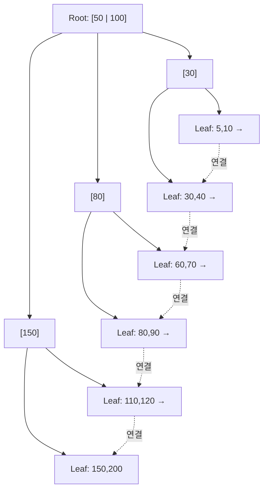

# 인덱스와 B+Tree

## 핵심 정의
인덱스(index)는 테이블의 특정 컬럼 값을 빠르게 찾기 위해 별도로 유지하는 자료구조로, 전체 테이블을 스캔(full scan)하지 않고 원하는 행에 바로 접근할 수 있게 해준다. MySQL InnoDB와 PostgreSQL의 기본 B-tree 계열 인덱스는 B+Tree와 같은 다분기·리프 순차 탐색 구조를 사용하는데, 이는 이진 트리보다 훨씬 낮은 높이(height)로 대량의 데이터를 다룰 수 있고, 리프 노드(leaf node)가 정렬된 상태로 연결되어 있어 범위 검색(range scan)에 강하기 때문이다.

## 동작 원리 / 구조

### B+Tree 구조 특징
- 내부 노드(internal node)는 키 값과 자식 포인터만 가지며, 실제 데이터는 리프 노드에만 저장된다.
- 리프 노드끼리 양방향 또는 단방향 연결 리스트로 연결되어 있어, 범위 조건(`BETWEEN`, `>`, `ORDER BY`)을 순차 탐색으로 처리할 수 있다.
- 팬아웃(fan-out)이 커 트리 높이를 낮게 유지한다. 탐색 페이지 수는 트리 높이에 비례하지만 실제 디스크 I/O는 캐시 적중·키 폭·리프/힙 조회·MVCC 가시성 확인에 따라 달라진다.

### 클러스터드 인덱스 vs 넌클러스터드 인덱스
- 클러스터드 인덱스(clustered index): 리프 노드에 행 데이터가 저장됨(큰 가변 길이 값은 별도 overflow 페이지에 저장될 수 있음). InnoDB는 기본키(PK)가 자동으로 클러스터드 인덱스가 되며, 테이블당 하나만 존재 가능.
- 넌클러스터드(보조) 인덱스(secondary index): 리프 노드에 인덱스 키와 함께 PK 값(또는 row pointer)만 저장. InnoDB에서 보조 인덱스로 조회하면 리프에서 PK를 얻은 뒤 클러스터드 인덱스를 한 번 더 타는 "북마크 조회(lookup)"가 발생한다.

### 복합 인덱스와 컬럼 순서
복합 인덱스 `(a, b, c)`는 `a`, `(a, b)`, `(a, b, c)` 조건의 검색에는 최적화되어 있지만 선두 컬럼이 없는 조건은 보통 탐색 범위를 좁히기 어렵다(리딩 컬럼 원칙, leftmost prefix rule). 다만 인덱스 전체 스캔·커버링·MySQL 8.4와 PostgreSQL 18의 조건부 skip scan으로 활용할 수도 있다. 컬럼 순서는 카디널리티만이 아니라 등호 조건·범위·정렬·다른 조회의 선두 재사용을 함께 보고 정한다.

## 실무 관점
- 인덱스는 조회를 빠르게 하지만 삽입/수정/삭제 시마다 인덱스 트리도 함께 갱신해야 하므로 쓰기 비용이 늘어난다. 인덱스를 무분별하게 추가하면 오히려 쓰기 성능이 저하된다.
- `WHERE`, `JOIN`, `ORDER BY`, `GROUP BY`에 자주 쓰이는 컬럼 위주로 인덱스를 설계하고, 조회 빈도가 낮은 인덱스는 통계의 관찰 기간과 유일성·참조 제약을 함께 점검해 삭제 여부를 결정한다. MySQL의 `sys.schema_unused_indexes`, PostgreSQL의 `pg_stat_user_indexes` 같은 통계의 0만으로 삭제하지 않는다([[인덱스 설계 전략#조회 횟수가 0인 인덱스의 삭제 판단]]).
- 흔한 실수: 인덱스 컬럼에 함수나 형변환을 적용(`WHERE DATE(created_at) = ...`, `WHERE CAST(col AS CHAR) = ...`)하면 일반 인덱스로 그 조건의 탐색 범위를 좁히기 어려워질 수 있다. 전체 인덱스 스캔이나 다른 조건의 인덱스까지 불가능해지는 것은 아니다. 일치하는 표현식 인덱스를 만들거나 원래 컬럼의 범위 조건으로 바꾸고 실행 계획을 비교한다.
- 흔한 실수: 앞에 와일드카드가 붙는 `LIKE '%keyword%'` 검색은 B+Tree 인덱스로 최적화되지 않는다. 이런 경우 전문 검색 인덱스(full-text index)나 검색 엔진(Elasticsearch 등)을 별도로 고려해야 한다.
- 카디널리티가 낮은 컬럼(성별, 상태값 몇 종류 등)에 단독 인덱스를 걸면 옵티마이저가 인덱스를 쓰지 않고 풀스캔을 택하는 경우가 많다. 이런 컬럼은 다른 선택도 컬럼과 복합 인덱스로 묶는 것이 효과적이다.
- 커버링 인덱스(covering index): 조회·필터·정렬 등에 필요한 컬럼이 인덱스에 포함되어 있으면 테이블 본문(클러스터드 인덱스)까지 갈 필요 없이 인덱스만으로 값을 구할 수 있다. PostgreSQL은 visibility map 상태에 따라 heap fetch가 필요하고 InnoDB도 가시성 확인 예외가 있어 물리적 테이블 접근이 항상 0인 것은 아니다. 조회 패턴이 고정된 API라면 커버링 인덱스 설계를 우선 검토한다.
- JPA/Hibernate 환경에서는 `@Table(indexes = ...)`로 스키마 생성 시 인덱스를 명시할 수 있지만, 실제 서비스에서는 마이그레이션 도구(Flyway, Liquibase)로 인덱스를 명시적으로 관리하는 것이 안전하다.

## 심화 Q&A

### Q. B+Tree가 B-Tree보다 범위 검색에 유리한 이유는 정확히 무엇인가?
A. B-Tree는 내부 노드에도 데이터가 저장되어 있어 범위 검색 시 트리를 오르내리며 여러 노드를 방문해야 한다. B+Tree는 데이터를 리프 노드에만 두고 리프끼리 연결 리스트로 이어놓았기 때문에, 시작점만 트리 탐색으로 찾으면 이후는 리프 레벨에서 순차적으로 스캔만 하면 된다. 논리적으로 순차 접근하므로 재탐색을 줄인다. 다만 리프의 논리적 이웃이 디스크에서도 연속 배치된다는 보장은 없다.

### Q. 보조 인덱스로 조회할 때 발생하는 북마크 조회(lookup)의 비용을 줄이는 방법은?
A. 커버링 인덱스를 구성해 보조 인덱스만으로 SELECT 절을 충족시키면 클러스터드 인덱스로 되돌아가는 lookup 자체를 없앨 수 있다. 또는 조회 대상 행 수가 매우 많다면(예: 조건에 맞는 행이 테이블의 상당 비율을 차지) 옵티마이저가 아예 인덱스를 포기하고 풀스캔을 택하는 것이 더 빠를 수 있으므로, 이 경우는 인덱스를 억지로 강제(`FORCE INDEX` 등)하지 않는 것이 낫다.

### Q. 복합 인덱스 `(status, created_at)`이 있을 때 `WHERE created_at > ? ORDER BY status`는 왜 인덱스를 제대로 활용하지 못하는가?
A. 리딩 컬럼이 `status`인데 조건절에서 `status`에 대한 필터가 없어 인덱스의 정렬 순서를 등호 조건으로 좁히지 못한다. B+Tree는 `status`가 같은 값끼리 묶여 정렬되고 그 안에서 `created_at`이 정렬되는 구조이므로, `status` 없이 `created_at`만 범위 검색하면 여러 `status` 그룹을 넘나들며 스캔해야 해 인덱스 효율이 떨어진다. `ORDER BY status`는 이 인덱스의 선두 정렬과 맞아 인덱스 스캔을 택하면 별도 정렬을 피할 수 있다. 범위 탐색 효율과 정렬 제공 여부는 별개다.

### Q. 인덱스를 추가했는데도 옵티마이저가 인덱스를 안 타는 경우, 어떤 원인들을 의심해야 하는가?
A. 대표적으로 (1) 테이블 통계 정보(statistics)가 오래되어 옵티마이저가 카디널리티를 잘못 추정한 경우, (2) 조회 대상 비율이 너무 높아 풀스캔이 더 효율적이라고 판단한 경우, (3) 컬럼에 함수/형변환이 걸려 인덱스를 못 타는 경우, (4) 리딩 컬럼 조건이 빠진 경우를 확인한다. `ANALYZE TABLE`(MySQL) 또는 `ANALYZE`(PostgreSQL)로 통계를 갱신해보는 것이 첫 번째 점검 포인트다.

### Q. 유니크 인덱스(unique index)와 일반 인덱스는 내부 구조상 무엇이 다른가?
A. 구조 자체는 동일한 B+Tree이지만, 유니크 인덱스는 삽입 시마다 중복 값 검사를 위해 잠금 범위가 넓어질 수 있고(예: InnoDB의 넥스트 키 락과 상호작용), 값의 중복이 없다는 것이 보장되므로 옵티마이저가 유니크 키 전체에 대한 비-NULL 등호 조회는 최대 1건이라고 판단하고 실행 계획을 더 저렴하게 추정한다.

### Q. 인덱스가 너무 많은 테이블에서 발생하는 성능 문제를 어떻게 진단하는가?
A. 쓰기 지연(INSERT/UPDATE/DELETE 응답 시간 증가), 저장 엔진의 redo·WAL 증가(행 기반 binlog가 보조 인덱스 수만큼 직접 늘어나는 것은 아님), 버퍼 풀 캐시 히트율 저하 등의 증상이 나타난다. 쿼리 로그와 통계(`performance_schema`, `pg_stat_user_indexes`)의 사용 빈도 외에도 관찰 기간·제약 유지 여부를 확인해 인덱스 삭제 후보를 정하고, 비슷한 컬럼 조합의 인덱스는 하나의 복합 인덱스로 통합할 수 있는지 검토한다.

## 관련 개념
- [[정규화와 반정규화]]
- [[실행 계획 읽는 법]]

## 참고 자료

부분 재확인: 2026-09-22. MySQL 8.4 범위 최적화와 PostgreSQL 18 표현식 인덱스를 기준으로 함수 조건의 접근 경로 설명을 보완했다. 기존 전체 확인일은 유지한다.

- [MySQL 8.4 Range Optimization](https://dev.mysql.com/doc/refman/8.4/en/range-optimization.html) — 범위 조건으로 활용되는 술어와 잔여 필터.
- [PostgreSQL 18 Indexes on Expressions](https://www.postgresql.org/docs/18/indexes-expressional.html) — 표현식 자체를 인덱싱하는 조건.

확인일: 2026-09-08. 아래 적용 범위에서 본문·Q&A·예제를 재검증했다. 예제는 문서와 대조했으며 별도 실행 검증은 하지 않았다.

- [MySQL 8.4 Clustered/Secondary Indexes](https://dev.mysql.com/doc/refman/8.4/en/innodb-index-types.html) — 클러스터드 구조·PK·lookup.
- [MySQL 8.4 Range Optimization](https://dev.mysql.com/doc/refman/8.4/en/range-optimization.html) — skip scan·복합 키 탐색.
- [PostgreSQL 18 Multicolumn Indexes](https://www.postgresql.org/docs/18/indexes-multicolumn.html) — 선두 컬럼 및 skip scan.
- [PostgreSQL 18 Index-only Scans](https://www.postgresql.org/docs/18/indexes-index-only-scans.html) — visibility map과 heap fetch.
- [PostgreSQL 18 Constraints](https://www.postgresql.org/docs/18/ddl-constraints.html) — UNIQUE와 NULL.

부분 재확인: 2026-10-04. 사용 빈도만으로 인덱스를 제거한다는 설명을 관찰 기간·제약 검토로 바로잡았다. PostgreSQL 18의 통계·유니크 인덱스 근거와 18.6의 idx_scan=0 유일성 검사 실행 결과는 [[인덱스 설계 전략#조회 횟수가 0인 인덱스의 삭제 판단]] 및 해당 노트의 참고 자료에 기록했다. MySQL의 통계 카운터를 실행 검증한 것은 아니며 전체 `verified`는 유지한다.

- [PostgreSQL 18 Index Statistics](https://www.postgresql.org/docs/18/monitoring-stats.html#MONITORING-PG-STAT-ALL-INDEXES-VIEW) — 조회 통계의 의미와 관찰 범위.
- [PostgreSQL 18 Unique Indexes](https://www.postgresql.org/docs/18/indexes-unique.html) — 인덱스의 유일성 보장 역할.
