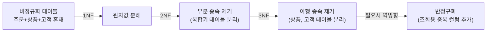

# 정규화와 반정규화

## 핵심 정의
정규화(normalization)는 데이터 중복을 제거하고 삽입/갱신/삭제 이상(anomaly)을 방지하기 위해 테이블을 여러 개로 분해하는 설계 기법이다. 함수 종속성(functional dependency), 다치 종속성(multivalued dependency), 조인 종속성(join dependency) 등을 기준으로 1NF부터 BCNF, 4NF, 5NF까지 정의되며, 실무에서는 보통 3NF 또는 BCNF 수준까지 적용한다.

반정규화(denormalization)는 정규화된 스키마의 조회 성능을 높이기 위해 의도적으로 중복을 허용하거나 테이블을 통합하는 작업이다. 정합성 유지 비용과 조회 성능을 맞바꾸는 트레이드오프이므로, 정규화가 끝난 스키마를 기준으로 필요한 부분만 선택적으로 적용하는 것이 원칙이다.

## 동작 원리 / 구조

### 정규화 단계 요약

| 단계 | 조건 | 방지하는 이상 |
|---|---|---|
| 1NF | 모든 속성이 원자값(atomic value)을 가짐 | 반복 그룹 제거 |
| 2NF | 1NF + 모든 비주요 속성이 모든 후보키 전체에 완전 함수 종속(후보키 일부에 대한 부분 종속 없음) | 부분 종속으로 인한 갱신 이상 |
| 3NF | 모든 비자명 함수 종속 X → A에서 X가 슈퍼키이거나 A가 주요 속성(어느 후보키에 속하는 속성) | 이행 종속으로 인한 갱신 이상 |
| BCNF | 모든 비자명 함수 종속의 결정자(determinant)가 슈퍼키(superkey)여야 함 | 3NF보다 강화된 이상 방지 |

예시: 주문당 상품 하나라는 단순화 아래 `주문번호 → 상품ID`, `상품ID → 현재상품명, 현재상품가격`이면 주문에 현재 상품 속성을 중복 저장할 때 갱신 이상이 생긴다. 이를 주문과 상품으로 분리하면 이행 종속을 제거한다. 반면 `주문당시단가`는 상품의 현재 가격이 아니라 주문 항목에 종속되는 역사적 사실이므로 주문 항목에 보존해야 한다.

### 반정규화 기법
- 컬럼 중복: 자주 조인되는 컬럼을 상위 테이블에 복제 (예: 주문 테이블에 상품명 캐시)
- 테이블 병합: 1:1 관계이거나 항상 함께 조회되는 테이블을 합침
- 파생 컬럼 저장: 집계값(총 주문 금액, 재고 수량 등)을 미리 계산해 저장
- 수직 분할은 함께 검토할 물리 설계 기법이지만 중복·종속성 변화가 없다면 그 자체가 반정규화는 아니다.

## 실무 관점
- 정규화는 기본값으로 가져가고, 실측(느린 쿼리, 과도한 조인)이 확인된 지점만 반정규화한다. 처음부터 반정규화하면 유지보수 비용만 커진다.
- 반정규화한 중복 데이터는 반드시 갱신 경로를 하나로 통일하거나(트리거, 애플리케이션 서비스 계층, 이벤트 기반 동기화) 배치로 재계산하는 정책을 함께 설계해야 한다. 그렇지 않으면 시간이 지나며 원본과 캐시 값이 어긋나는 정합성 버그가 누적된다.
- 흔한 실수: 집계 컬럼(재고수량, 포인트 잔액 등)을 반정규화해두고 동시성 처리(락, 원자적 갱신)를 빼먹어 레이스 컨디션으로 값이 틀어지는 장애가 잦다.
- Hibernate `@Formula`는 조회 시 SQL 계산식을 실행하고 `@OneToOne`은 연관관계 매핑이다. 둘 다 자동으로 테이블을 병합하거나 계산 결과를 저장하지 않는다. 조회 전용 뷰·DTO로 요구를 충족할 수 있는지 확인하고, 실제 테이블 반정규화 전에 애플리케이션 레벨 캐싱이나 읽기 전용 프로젝션(DTO, QueryDSL)으로 먼저 해결 가능한지 검토한다.
- 2NF/3NF 위반은 대개 복합키 설계나 마스터 데이터(상품명, 부서명 등)를 트랜잭션 테이블에 그대로 박아 넣을 때 발생한다. 리뷰 시 "이 컬럼이 다른 컬럼에 종속되는가"를 체크리스트로 쓰면 빠르게 잡아낼 수 있다.

## 심화 Q&A

### Q. 3NF까지만 적용하고 BCNF를 적용하지 않는 경우가 실무에 많은 이유는?
A. 3NF는 대부분의 실무 스키마에서 이상 현상을 충분히 제거하며, BCNF로 가면 후보키가 여러 개 겹치는 복잡한 케이스에서 오히려 테이블이 과도하게 쪼개져 조인 비용이 늘어난다. 또한 BCNF 분해는 무손실 조인을 보장할 수 있어도 함수 종속 보존을 잃어 제약 검사에 조인이 필요할 수 있다. 3NF 합성은 무손실·종속 보존을 함께 달성하는 선택지다. 함수 종속이 단순한 일반적인 트랜잭션 테이블에서는 3NF와 BCNF 결과가 동일한 경우가 많아 굳이 이론적 완전성을 위해 추가 분해를 하지 않는다.

### Q. 반정규화 대신 캐시(Redis 등)를 쓰는 것과 비교하면 언제 반정규화가 더 유리한가?
A. 캐시는 애플리케이션 계층에 별도 인프라와 무효화(invalidation) 로직이 필요하고, 캐시-DB 간 정합성 창(window)이 생긴다. 반면 반정규화는 트랜잭션(ACID) 범위 안에서 원본 데이터와 함께 갱신할 수 있어 강한 일관성이 필요한 값(재고, 잔액 등)에는 반정규화가, 조회 폭주 대비 약간의 지연 일관성이 허용되는 값(조회수, 랭킹 등)에는 캐시가 더 적합하다.

### Q. 부분 함수 종속(2NF 위반)과 이행 함수 종속(3NF 위반)을 실제 스키마에서 구분하는 기준은?
A. 부분 함수 종속에 의한 2NF 위반은 어느 후보키의 일부가 비주요 속성을 결정하는 경우다(예: `(학생ID, 과목ID)` 키에서 `학생이름`이 `학생ID`만으로 결정). 흔한 3NF 위반은 키에서 비키 결정자를 거쳐 비주요 속성이 결정되는 경우다(예: `직원ID → 부서ID → 부서명`). 전자는 키 구조 자체의 문제, 후자는 비키 속성 간의 관계 문제라는 점이 다르다.

### Q. 정규화 수준이 높을수록 무조건 좋은 설계인가?
A. 아니다. 정규화는 갱신 이상 방지와 저장 공간 절약에는 유리하지만 조회 시 조인 수가 늘어나 읽기 성능이 떨어질 수 있다. OLTP처럼 쓰기와 정합성이 중요한 시스템은 정규화 수준을 높게, OLAP/리포팅처럼 읽기 위주이고 쓰기가 배치로 이루어지는 시스템은 스타 스키마(star schema)처럼 의도적으로 반정규화하는 것이 정석이다.

### Q. 반정규화된 컬럼의 정합성을 애플리케이션 레벨에서 보장하려면 어떤 패턴을 쓰는가?
A. 대표적으로 (1) 도메인 이벤트를 발행해 관련 반정규화 컬럼을 비동기로 갱신하는 이벤트 기반 동기화, (2) 트랜잭션 스크립트 내에서 원본 테이블과 반정규화 테이블을 같은 트랜잭션으로 묶어 원자적으로 갱신, (3) 배치/스케줄러로 주기적으로 재계산해 드리프트(drift)를 보정하는 방식이 있다. 실시간성이 중요하면 2번, 대량 집계라 실시간 갱신 비용이 크면 1번+3번 조합을 쓴다.

### Q. 다대다(N:M) 관계를 정규화할 때 흔히 놓치는 부분은?
A. 연결 테이블(교차 테이블)에 두 FK만 넣고 끝내는 경우가 많은데, 관계 자체에 속성이 있는 경우(예: 주문-상품 관계의 수량, 단가)를 별도 엔티티가 아니라 단순 FK 테이블로 처리하면 나중에 속성을 추가할 때 스키마 변경이 커진다. 처음부터 연결 테이블을 독립된 엔티티(예: `주문상품`)로 설계해 확장 여지를 남기는 것이 좋다.

## 관련 개념
- [[인덱스와 B+Tree]]
- [[실행 계획 읽는 법]]

## 참고 자료

확인일: 2026-09-08. 아래 적용 범위에서 본문·Q&A·예제를 재검증했다. 예제는 문서와 대조했으며 별도 실행 검증은 하지 않았다.

- [RPI Database Systems — Normalization](https://www.cs.rpi.edu/~sibel/csci4380/fall2018/course_notes/normalization.html) — 관계형 설계 이론: 후보키·3NF·BCNF·무손실·종속 보존.
- [Hibernate ORM 7.1 Formula](https://docs.hibernate.org/orm/7.1/userguide/html_single/#mapping-column-formula) — 조회 시 계산 필드와 영구 저장 구분.
