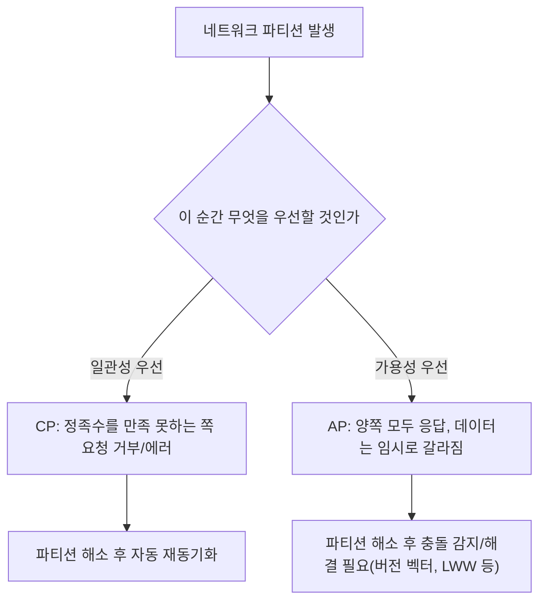

# CAP 이론

## 핵심 정의

CAP 이론(CAP theorem)은 분산 시스템이 네트워크 파티션(partition, 노드 간 통신 단절)이 발생했을 때 일관성(Consistency)과 가용성(Availability)을 동시에 완벽히 보장할 수 없다는 원리다. Eric Brewer가 2000년에 제시하고 이후 Gilbert와 Lynch가 형식적으로 증명했다. 세 요소의 의미는 다음과 같다.

- **Consistency(일관성)**: 각 연산이 호출과 응답 사이의 한 시점에 일어난 것처럼 보이고 실제 시간의 선후 관계를 지키는 선형화 가능성(linearizability)이다. 모든 복제본의 내부 상태가 매 순간 동일해야 한다는 뜻은 아니다.
- **Availability(가용성)**: 장애가 없는 노드에 도달한 모든 요청이 결국 해당 연산에 유효한 응답으로 종료된다. 고정된 응답시간 상한이나 운영 지표 99.9% 가용성과는 다른 정의다. 요청 거부 오류만 반환하는 것으로 충족하지 않는다.
- **Partition tolerance(파티션 허용성)**: 노드 사이 메시지가 임의로 유실되는 네트워크 분단을 허용하는 장애 모델이다. 분단 중 C와 A를 모두 유지할 수 있다는 보장이 아니다.

실무에서 가장 흔한 오해는 "C, A, P 중 2개를 골라야 한다"는 단순화다. 실제로는 네트워크 파티션은 분산 시스템에서 선택 사항이 아니라 언젠가 반드시 발생하는 현실이므로, 진짜 설계 선택은 "파티션이 발생했을 때 일관성을 포기할 것인가(AP), 가용성을 포기할 것인가(CP)"이다.

## 동작 원리 / 구조

### CP 시스템의 동작

정족수(quorum) 기반으로 동작하는 시스템(ZooKeeper, etcd, Consul, 그리고 강한 일관성 모드의 관계형 DB 클러스터)은 파티션 발생 시 과반 노드를 확보하지 못한 쪽의 요청을 거부하거나 타임아웃시킨다. 예를 들어 5개 노드 중 파티션으로 2개와 3개로 나뉘면, 3개 쪽(과반)만 쓰기를 계속 받아들이고 2개 쪽은 스스로 서비스를 중단하거나 읽기 전용으로 전환한다.

### AP 시스템의 동작

Dynamo 계열 설계나 CouchDB의 독립 복제본처럼 분단 양쪽에서 로컬 쓰기를 허용하는 구성을 생각할 수 있다. Cassandra도 필요한 consistency level의 복제본에 도달해야 성공하므로 모든 분단에서 항상 성공하는 것은 아니다. DynamoDB 제품 전체를 기본 AP라고 분류하면 테이블의 강한 읽기와 global tables의 MREC/MRSC 차이를 놓친다. 대신 파티션이 해소된 뒤 서로 다른 값을 가진 데이터가 존재할 수 있어, 이를 해결하기 위한 충돌 해결(conflict resolution) 메커니즘이 필요하다 — 마지막 쓰기 우선(Last-Write-Wins, LWW), 벡터 시계(vector clock), CRDT(Conflict-free Replicated Data Type) 등.

### PACELC로 확장해서 이해하기

CAP은 "파티션이 있을 때"만 다룬다. 평상시(파티션이 없을 때)의 트레이드오프까지 포함한 확장 모델이 PACELC다: 파티션(P) 시에는 가용성(A)과 일관성(C) 중 선택하고, 그렇지 않으면(Else, E) 지연시간(Latency)과 일관성(C) 중 선택한다. 예를 들어 동기 리플리케이션은 평상시에도 일관성을 위해 지연을 감수하는 EC 성향이고, 비동기 리플리케이션은 지연을 낮추는 대신 일관성을 다소 포기하는 EL 성향이다.

## 실무 관점

- **관계형 DB(RDBMS) 클러스터도 CAP의 적용 대상**: 단일 인스턴스 RDBMS는 분산 시스템이 아니므로 CAP과 무관하지만, MySQL Group Replication, PostgreSQL 동기 복제, Galera Cluster처럼 여러 노드의 응답에 의존하면 분단 시 가용성의 제약을 받는다. PostgreSQL 기본 스트리밍 복제 자체에는 자동 리더 선출·fencing이 포함되지 않으며 동기 복제 설정만으로 전체 서비스 선형성이 보장되는 것은 아니다.
- **NoSQL 선택 기준으로 오용하지 말 것**: "MongoDB는 CP, Cassandra는 AP"처럼 제품을 이분법으로 암기하는 것은 위험하다. 대부분의 현대 분산 DB는 설정(consistency level, write concern, read concern)으로 CP/AP 성향을 조절할 수 있다. 예를 들어 Cassandra의 QUORUM은 응답 가능한 복제본 요건을 높이지만 동시 쓰기를 포함한 선형성을 자동 보장하지 않는다. MongoDB secondary 읽기를 허용해도 분단된 양쪽에서 쓰기를 허용하는 시스템으로 바뀌지는 않는다.
- **업무 요구사항과의 매칭**: 재고/결제/포인트 차감처럼 이중 처리나 초과 차감이 치명적인 도메인은 CP(또는 아예 단일 원본 + 강한 트랜잭션)를 우선한다. 반면 좋아요 수, 조회수, 상품 추천 피드처럼 약간의 지연/불일치가 사용자 경험에 큰 영향이 없는 도메인은 AP를 택해 가용성과 지연시간을 확보한다.
- **흔한 실수**: 파티션이 "드물게 일어나는 예외 상황"이라고 가정하고 설계하는 것. 실제 클라우드 환경에서는 네트워크 지연 스파이크, GC pause로 인한 하트비트 실패 등으로 "부분 파티션처럼 보이는" 상황이 생각보다 자주 발생한다. 타임아웃/재시도/서킷 브레이커 설계 시 이를 전제해야 한다.
- **설정 튜닝 포인트**: 분산 캐시(Redis Cluster), 메시지 브로커(Kafka의 `acks`, `min.insync.replicas`), 검색엔진(Elasticsearch의 replica 설정) 등 모든 분산 컴포넌트는 저마다 CAP/PACELC 성향을 결정하는 설정값을 갖고 있다. 도입 시 반드시 기본값이 어느 쪽으로 치우쳐 있는지 확인해야 한다.

## 심화 Q&A

### Q. "가용성을 포기한다"는 것이 정확히 무엇을 의미하는가? 서비스가 완전히 멈추는 것인가?
A. CAP에서 말하는 가용성 포기는 시스템 전체 다운을 뜻하지 않는다. 정족수를 만족하지 못하는 파티션 쪽 노드가 해당 요청에 대해 명시적으로 에러를 반환하거나 응답을 거부하는 것을 의미하며, 나머지 정족수를 만족한 쪽은 정상 서비스를 계속한다. 즉 "일부 클라이언트 입장에서 일시적으로 가용성이 떨어지는 것"이지 시스템 전체 중단이 아니다.

### Q. 같은 분산 데이터베이스 제품이라도 CP로도, AP로도 동작할 수 있다는 말의 실제 예시는?
A. Cassandra에서 일반 쓰기/읽기의 consistency level을 ONE에서 QUORUM·ALL로 올리면 더 많은 복제본의 응답이 필요해 분단 중 성공 가능한 요청이 줄어든다. 그러나 요청이 실패할 수 있다는 사실만으로 CAP의 C인 선형성을 얻지는 않는다. Cassandra의 일반 쓰기는 타임스탬프 기반 충돌 해소를 사용하며, 선형화 가능한 조건부 갱신은 경량 트랜잭션(Lightweight Transaction, LWT)의 별도 보장이다. "제품 + 연산 + 설정"별로 어떤 이력을 허용하는지 확인해야 한다.

### Q. 최종 일관성(eventual consistency)을 택한 AP 시스템에서 "얼마나 기다려야 일관된 값을 보게 되는가"는 어떻게 설계/보장하는가?
A. 엄밀한 상한을 보장하지는 않지만, 실무에서는 리플리케이션 지연 지표(replication lag)를 모니터링해 P99 수렴 시간을 SLA처럼 관리하거나, "세션 일관성(session consistency, 자기 자신이 쓴 값은 반드시 보임)"처럼 완화된 일관성 모델을 별도로 제공해 최종 일관성의 단점을 보완한다. Azure Cosmos DB가 제공하는 5단계 consistency level(strong, bounded staleness, session, consistent prefix, eventual)이 이런 절충안의 대표적인 예다. DynamoDB의 일반 읽기에는 eventual/strong 옵션이 있고 트랜잭션 읽기 API도 별도 존재한다. global tables에는 MREC/MRSC 모드가 있어 단순히 두 단계라고 일반화하지 않는다.

### Q. CAP 이론과 ACID의 격리 수준(isolation level)은 어떤 관계가 있는가?
A. ACID의 격리 수준은 단일·분산 DB 모두에서 동시 트랜잭션 간 간섭과 허용되는 이력을 다루는 개념이고, CAP은 여러 노드 간 네트워크 파티션 상황에서의 트레이드오프를 다룬다. 다만 분산 트랜잭션(2PC 등)으로 여러 노드에 걸쳐 강한 격리를 구현하려 하면 네트워크 분단 때문에 커밋이 대기·실패할 수 있다. 2PC는 원자적 커밋 프로토콜이며 격리 수준이나 선형성 자체를 제공하지는 않는다.

### Q. PACELC 관점에서 "동기 복제 + CP"와 "비동기 복제 + AP"를 같은 서비스 안에서 도메인별로 다르게 적용하는 것이 가능한가?
A. 가능하고 실무에서 흔한 패턴이다. 결제/잔액처럼 정합성이 중요한 도메인은 동기(또는 반동기) 복제와 강한 일관성 저장소를 쓰고, 로그/알림/추천 피드처럼 정합성 완화가 허용되는 도메인은 비동기 복제 기반의 별도 저장소(캐시, 검색엔진, 메시지 큐 기반 파이프라인)를 사용하는 폴리글랏 퍼시스턴스(polyglot persistence) 구조가 일반적이다.

### Q. 네트워크 파티션이 짧게(수백 ms) 발생했다가 바로 복구되는 경우에도 CAP 트레이드오프를 신경 써야 하는가?
A. 그렇다. 짧은 파티션이라도 그 순간 진행 중이던 요청의 타임아웃/재시도 정책, 그리고 파티션 동안 CP 시스템이라면 거부된 요청에 대한 클라이언트 재시도 로직, AP 시스템이라면 그 찰나에 생긴 데이터 분기와 이후 충돌 해결 로직이 모두 동작해야 한다. 네트워크 분단과 지연을 즉시 확실히 구분할 수는 없으므로, 타임아웃·대기 한계·재시도 정책을 미리 설계하지 않으면 짧은 네트워크 흔들림에도 예기치 않은 에러나 데이터 불일치가 노출된다.

## 관련 개념
- [[데이터 일관성 모델]]
- [[리플리케이션]]
- [[샤딩 전략]]
- [[트랜잭션 격리 수준]]

## 참고 자료

부분 재확인: 2026-09-22. Cassandra 공식 Guarantees 문서의 일반 쓰기·LWT 보장을 대조해 정족수 응답과 선형성을 구분했다. 기존 전체 확인일은 유지한다.

- [Apache Cassandra Guarantees](https://cassandra.apache.org/doc/latest/cassandra/architecture/guarantees.html) — LWW 일반 쓰기와 Paxos 기반 조건부 연산의 보장 구분. 이번 확인은 이 개념 범위이며 특정 릴리스 기본값은 다루지 않는다.

확인일: 2026-09-08. 아래 적용 범위에서 본문·Q&A·예제를 재검증했다. 예제는 문서와 대조했으며 별도 실행 검증은 하지 않았다.

- [Gilbert & Lynch (2002) CAP proof](https://www.cs.princeton.edu/courses/archive/spr22/cos418/papers/cap.pdf) — C/A 정의·비동기 네트워크에서의 불가능성.
- [Daniel Abadi — PACELC](https://dbmsmusings.blogspot.com/2010/04/problems-with-cap-and-yahoos-little.html) — 원 제안자의 평상시 지연/일관성 논의.
- [DynamoDB Read Consistency](https://docs.aws.amazon.com/amazondynamodb/latest/developerguide/HowItWorks.ReadConsistency.html) — 2026-09-08 문서: 읽기 및 MREC/MRSC.
- [Cassandra Guarantees](https://cassandra.apache.org/doc/stable/cassandra/architecture/guarantees.html) — 일관성 수준과 선형성 경계.
- [Cosmos DB Consistency](https://learn.microsoft.com/en-us/azure/cosmos-db/consistency-levels) — 5개 읽기 일관성 수준.
- [PostgreSQL 18 Standby](https://www.postgresql.org/docs/18/warm-standby.html) — 동기 복제·자동 failover 범위.
