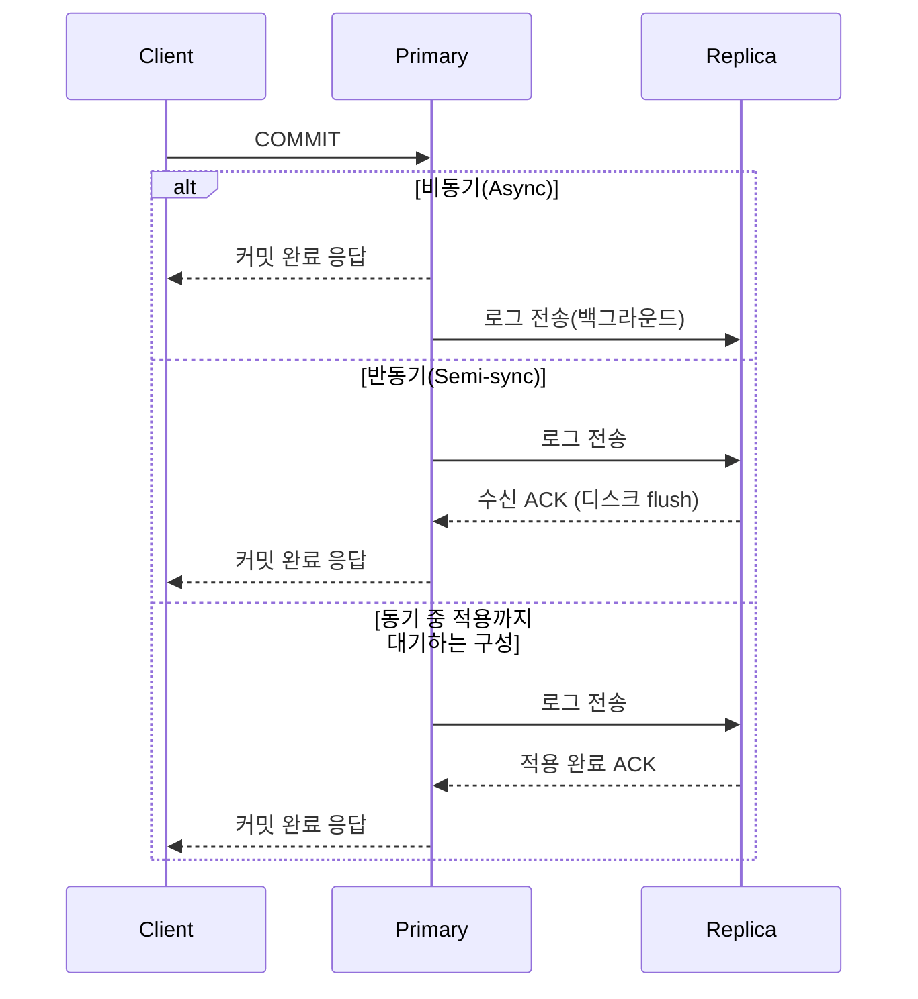

# 리플리케이션

## 핵심 정의

리플리케이션(replication)은 하나의 데이터베이스(원본, primary/source)에 발생한 변경 사항을 하나 이상의 다른 데이터베이스(복제본, replica/standby)에 지속적으로 복사하여 동일한 데이터 사본을 유지하는 기법이다. 목적은 크게 세 가지로, 장애 발생 시 서비스를 이어갈 수 있는 고가용성(high availability) 확보, 읽기 트래픽을 여러 노드에 분산시키는 읽기 스케일아웃, 그리고 백업/분석용 데이터를 운영 DB의 직접 조회 부하를 줄여 확보(로그 생성·전송 비용은 남음)하는 것이다.

리플리케이션은 데이터를 어떻게 전달하느냐(물리적 vs 논리적)와 언제 커밋을 확정하느냐(동기 vs 비동기)라는 두 축으로 구분해서 이해하는 것이 실무에 유용하다.

## 동작 원리 / 구조

### 전달 방식: 물리적 복제 vs 논리적 복제

- **물리적 복제(physical replication)**: 디스크 블록/WAL(Write-Ahead Log) 단위로 바이트 그대로 복사한다. PostgreSQL의 스트리밍 복제(streaming replication)가 대표적이다. 원본과 복제본의 메이저 버전과 데이터 형식·하드웨어 아키텍처 호환이 필요하다. PostgreSQL은 같은 메이저의 다른 minor 조합을 일반적으로 허용하지만 가능한 동일 버전을 권장한다. OS 이름까지 반드시 같아야 한다는 뜻은 아니며 오버헤드가 적고 신뢰성이 높다.
- **논리적 복제(logical replication)**: 행(row) 변경이나 SQL 같은 논리 표현으로 전달한다. MySQL의 binlog 기반 복제(ROW/STATEMENT/MIXED 형식), PostgreSQL의 logical replication(`CREATE PUBLICATION`/`CREATE SUBSCRIPTION`)이 해당한다. 테이블 단위 선택적 복제, 버전이 다른 DB 간 복제, 양방향 복제가 가능하지만 스키마 변경(DDL) 전파나 초기 동기화가 더 복잡하다.

### 동기화 수준: 동기 vs 비동기 vs 반동기

- **비동기(asynchronous)**: 원본이 커밋 후 클라이언트에 즉시 응답하고, 복제 로그는 별도로 전송한다. 지연(replication lag)이 발생할 수 있고, 원본 장애 시 아직 전송되지 않은 트랜잭션은 유실될 수 있다. MySQL의 기본 복제 방식.
- **반동기(semi-synchronous)**: 원본이 커밋을 확정하기 전, 최소 1개 이상의 복제본이 로그를 수신(디스크 flush)했다는 응답(ACK)을 받을 때까지 대기한다. MySQL 8.4 기준 `rpl_semi_sync_source_wait_point` 설정으로 `AFTER_SYNC`(기본값, 복제본 ACK 후 커밋)와 `AFTER_COMMIT` 중 선택할 수 있다. 타임아웃 시 자동으로 비동기 모드로 전환되는 폴백(fallback) 동작이 있다는 점이 실무에서 중요하다 — 이 경우 반동기 보장이 일시적으로 사라진다.
- **동기(synchronous)**: 설정으로 지정한 복제본 수가 확인 지점에 도달할 때까지 기다린다. PostgreSQL 18은 `synchronous_standby_names`와 함께 `synchronous_commit=on`이면 WAL flush, `remote_write`면 OS 쓰기, `remote_apply`면 재생 완료를 기다린다. 모든 동기 복제가 적용 완료를 기다리는 것은 아니며 지연은 선택한 대기 집합·조건에 달린다.

### 토폴로지

- **단일 원본(Primary-Replica, 구 Master-Slave)**: 쓰기는 원본 하나로 집중, 읽기는 여러 복제본으로 분산. 가장 흔한 구조.
- **멀티 원본/그룹 복제(Multi-Primary / Group Replication)**: 여러 노드가 동시에 쓰기를 받을 수 있다. MySQL Group Replication은 멤버십 서비스와 원자적 순서 보장(total order) 메시지 전달을 기반으로 하며, 단일 primary 모드와 멀티 primary 모드를 지원한다. 충돌 감지·해결 로직이 필요해서 복잡도가 크게 올라간다.
- **캐스케이딩 복제(cascading replication)**: 복제본이 다시 하위 복제본에 로그를 전달하여 원본의 부하를 줄인다.

### PostgreSQL 논리 복제본을 승격할 때 빠지는 상태

PostgreSQL 18의 기본 논리 복제는 테이블 행을 복제하지만 DDL과 시퀀스(sequence) 상태는 자동 복제하지 않는다. `serial`·`identity` 컬럼에 이미 저장된 ID가 구독자에 보여도, 다음 INSERT에서 사용할 시퀀스 값까지 진전한 것은 아니다. 승격 직후 새 쓰기가 기존 PK와 충돌할 수 있다.

전환 절차에는 원본 쓰기 차단, 최종 복제 위치 확인, 스키마 일치 확인, 시퀀스 값 조정, 새 쓰기 검증을 포함한다. `MAX(id)`만 보고 무조건 `setval`하는 스크립트는 빈 테이블·사용자 지정 시작값/증분·공유 시퀀스·동시 쓰기를 놓칠 수 있다. 실제 시퀀스 정의와 발급 정책에 맞춰 조정한다. 물리 복제와 논리 복제의 복구 절차를 같은 것으로 취급하지 않는다.

## 실무 관점

- **읽기/쓰기 분리(CQRS 유사 패턴)**: Spring 애플리케이션에서는 `AbstractRoutingDataSource`나 `@Transactional(readOnly = true)` 상태를 읽는 별도 라우팅 구현으로 읽기 쿼리를 복제본으로 보낸다. 이때 복제 지연(replication lag) 때문에 "방금 쓴 데이터가 읽기 조회에서 안 보이는" 현상(read-your-writes 위반)이 흔한 버그 패턴이다. 쓰기 직후 즉시 조회가 필요한 화면은 원본으로 강제 라우팅하거나, 세션의 쓰기 위치(LSN/GTID)를 기준으로 복제본 적용을 확인한다. "쓰기 이후 N초간 원본 우선"은 복제 지연에 상한이 없으면 엄밀한 보장이 아니다.
- **장애 조치(failover)**: 비동기 복제에서 원본 장애 시 미전송 트랜잭션 유실 가능성을 감안해 RPO(Recovery Point Objective)를 정의해야 한다. 완전동기/반동기는 유실을 줄이지만 가용성-지연 트레이드오프가 생긴다.
- **모니터링 포인트**: 복제 지연, 복제 스레드/워커 상태, 원본·복제본의 로그 위치를 함께 본다. MySQL 8.4 `Seconds_Behind_Source=0`이어도 receiver가 원본을 늦게 따라가고 applier만 수신 로그를 모두 처리한 상태일 수 있다. PostgreSQL 18 `pg_stat_replication.replay_lag`는 최근 WAL이 적용되고 원본에 알려지기까지의 지연이지 따라잡는 데 남은 시간이 아니다. 완전히 따라잡은 유휴 복제본에서는 잠시 뒤 `NULL`이 될 수 있다. GTID/LSN 진행과 연결 상태를 확인한 뒤 신선도·승격 가능성을 판단한다.
- **흔한 장애 패턴**: 대량 배치 작업이 원본에서 실행되며 WAL/binlog 생성량이 급증 → 복제 지연 폭증 → 읽기 복제본 기반 서비스 전체 지연으로 전이되는 케이스. 배치는 별도 시간대 분리나 전용 복제본 분리로 완화한다.
- **버전/스키마 변경 시 주의**: 논리적 복제는 DDL이 자동 전파되지 않는 경우가 많아(PostgreSQL 기본 논리 복제 등) 스키마 마이그레이션 도구(Flyway, Liquibase) 적용 순서를 원본/복제본 양쪽에서 관리해야 한다.

### 논리 복제 충돌을 건너뛰면 정상 변경도 빠진다

PostgreSQL 18 논리 복제에서 유니크 제약·권한 등의 오류가 발생하면 적용이 멈춘다. 구독자의 충돌 데이터나 권한을 보정해 원래 트랜잭션을 적용하는 방법과 `ALTER SUBSCRIPTION ... SKIP`으로 건너뛰는 방법은 결과가 다르다. SKIP은 충돌한 한 행만 무시하는 기능이 아니라 해당 원격 트랜잭션 전체를 건너뛴다. 주문 상태와 이력 INSERT가 같은 트랜잭션이었다면 이력의 한 행 충돌을 우회하면서 정상 주문 상태 변경도 누락할 수 있다.

충돌 로그의 트랜잭션 종료 위치(finish LSN)와 영향 테이블·업무를 먼저 확인한다. 임의의 최신 LSN으로 진행 위치를 밀거나, lag가 다시 줄었다는 이유만으로 복구 완료로 판단하지 않는다. 건너뛰기를 선택했다면 빠진 전체 변경의 보정·대조가 필요하다. `streaming=parallel`에서 실패 트랜잭션의 finish LSN이 로그에 없을 수 있으므로, 명령을 추측해 실행하기보다 공식 절차에 따라 `on` 또는 `off`로 바꿔 충돌 정보를 다시 확보하는 방안을 검토한다.

## 심화 Q&A

### Q. 반동기 복제(semi-sync)에서 원본이 타임아웃으로 비동기 모드로 자동 전환된 직후 원본이 죽으면 어떤 문제가 생기는가?
A. 반동기가 비동기로 전환된 구간 동안 커밋된 트랜잭션은 복제본에 도달하지 못했을 수 있다. 이 상태에서 원본이 crash하면 해당 트랜잭션은 복제본 기준으로는 존재하지 않는 데이터가 되어 failover 후 데이터 유실이 발생한다. 따라서 failover 직후에는 옛 원본을 그대로 재사용하지 않고 폐기(재구성)하는 것이 MySQL 공식 권고이며, 자동 전환 타임아웃 임계값과 모니터링 알람을 함께 설계해야 한다.

### Q. 물리적 복제와 논리적 복제 중 하나를 선택해야 한다면 어떤 기준으로 판단하는가?
A. 원본과 동일한 버전/구조의 재해 복구(DR) 사이트나 읽기 확장이 목적이면 물리적 복제가 단순하고 안정적이다. 반면 특정 테이블만 다른 시스템(예: 검색 엔진, 데이터 웨어하우스, 다른 메이저 버전 DB)으로 실시간 동기화해야 하거나, 무중단 메이저 버전 업그레이드처럼 이기종/이버전 간 전환이 필요하면 논리적 복제가 적합하다. 논리적 복제는 초기 동기화 비용과 DDL 처리 복잡도라는 대가를 치른다.

### Q. 멀티 프라이머리(Group Replication 등) 구조에서 "같은 로우를 두 노드에서 거의 동시에 수정"하면 어떻게 되는가?
A. 그룹 복제는 총 순서(total order) 메시지 전달로 모든 노드가 같은 순서로 트랜잭션을 인지하게 만들지만, 인증 단계에서 나중에 검증되는 트랜잭션이 충돌(certification failure)로 롤백될 수 있다. 즉 동시 쓰기 충돌은 낙관적 동시성 제어와 유사하게 사후 감지·롤백으로 처리되며, 애플리케이션은 재시도 로직을 갖추고 있어야 한다. 이 특성 때문에 멀티 프라이머리는 파티션 키가 노드별로 명확히 분리되는 워크로드에 더 적합하다.

### Q. 읽기 복제본이 여러 개일 때 로드밸런서 레벨에서 특정 복제본으로 라우팅을 고정하면 어떤 문제가 생길 수 있는가?
A. 특정 복제본에만 트래픽이 몰리면 그 노드의 복제 지연이 다른 노드보다 심해지고, 장애 시 단일 실패점(single point of failure)이 될 수 있다. 또한 세션 고정(sticky session)으로 같은 사용자가 계속 같은 복제본을 보게 하면 서로 다른 복제본으로 이동하며 값이 되돌아가는 현상을 줄일 수 있지만 primary에서 쓴 값의 read-your-writes를 보장하지는 않으며 부하 분산 효과가 줄어드는 트레이드오프가 생긴다.

### Q. 완전 동기 복제를 도입하면 가용성이 오히려 떨어질 수 있다는 말은 무슨 뜻인가?
A. 동기 복제는 설정된 복제본 수·우선순위·정족수(quorum)에 맞는 ACK를 기다린다. 필요한 복제본이 네트워크 단절이나 장애로 응답하지 못하면 내구성 조건을 지키느라 커밋이 대기할 수 있다. 다만 동기 ACK만으로 서비스의 선형성(linearizability)이 보장되지는 않는다. 복제본 읽기 정책, 리더 선출, 이전 리더 쓰기 차단(fencing)까지 함께 확인해야 한다([[CAP 이론]]).

### Q. 캐스케이딩 복제(cascading replication)는 어떤 상황에서 유리하고, 어떤 리스크가 있는가?
A. 원본의 네트워크/CPU 부하를 줄이면서 리전(region) 간 복제본을 늘릴 때 유리하다. 리스크는 지연이 누적(중간 노드의 지연 + 최종 노드의 지연)된다는 점과, 중간 노드가 장애나면 그 아래 하위 복제본 전체가 동시에 복제가 끊긴다는 점이다. 토폴로지 설계 시 중간 노드의 안정성을 원본 수준으로 관리해야 한다.

## 관련 개념
- [[샤딩 전략]]
- [[CAP 이론]]
- [[트랜잭션 격리 수준]]

## 참고 자료

부분 재확인: 2026-09-22. 복제 지연 지표의 의미·유휴 시 값과 동기 ACK 보장의 범위를 확인했다. 기존 전체 확인일은 유지한다.

- [MySQL 8.4 SHOW REPLICA STATUS](https://dev.mysql.com/doc/refman/8.4/en/show-replica-status.html) — `Seconds_Behind_Source`가 0이어도 원본 지연이 남는 경우.
- [PostgreSQL 18 Replication Statistics](https://www.postgresql.org/docs/18/monitoring-stats.html#MONITORING-PG-STAT-REPLICATION-VIEW) — `write_lag`/`flush_lag`/`replay_lag`의 의미와 `NULL`.

확인일: 2026-09-08. 아래 적용 범위에서 본문·Q&A·예제를 재검증했다. 예제는 문서와 대조했으며 별도 실행 검증은 하지 않았다.

- [PostgreSQL 18 Standby](https://www.postgresql.org/docs/18/warm-standby.html) — 물리 복제·동기 ACK·cascading·failover.
- [PostgreSQL 18 WAL Settings](https://www.postgresql.org/docs/18/runtime-config-wal.html) — synchronous_commit 확인 지점.
- [MySQL 8.4 Semisynchronous Replication](https://dev.mysql.com/doc/refman/8.4/en/replication-semisync.html) — ACK·AFTER_SYNC·fallback·failover.
- [MySQL 8.4 Group Replication](https://dev.mysql.com/doc/refman/8.4/en/group-replication.html) — 단일/다중 primary·인증.
- [MongoDB Read Concern](https://www.mongodb.com/docs/manual/reference/read-concern-majority/) — 읽기 최신성 경계 비교.

부분 재검증: 2026-09-23. PostgreSQL 18 기본 논리 복제의 DDL·시퀀스 비복제와 승격 시 조정 필요성을 확인했다. 나머지 제품 서술의 전체 검증일은 유지한다.

- [PostgreSQL 18 Logical Replication Restrictions](https://www.postgresql.org/docs/18/logical-replication-restrictions.html) — 행의 ID와 시퀀스 상태, 스키마 변경의 전파 범위.

부분 재검증: 2026-10-04. PostgreSQL 18의 논리 복제 충돌·트랜잭션 단위 SKIP·finish LSN 확인 범위를 재검증했다. 주문/이력 예시는 그 범위에서 도출한 장애 분석이며 실제 publication/subscription 충돌·SKIP 실행은 하지 않았다. 기존 `verified`는 유지한다.

- [PostgreSQL 18 Logical Replication Conflicts](https://www.postgresql.org/docs/18/logical-replication-conflicts.html) — 충돌 중단·전체 트랜잭션 누락·parallel 적용의 로그 제약.
- [PostgreSQL 18 ALTER SUBSCRIPTION](https://www.postgresql.org/docs/18/sql-altersubscription.html) — SKIP과 finish LSN.
