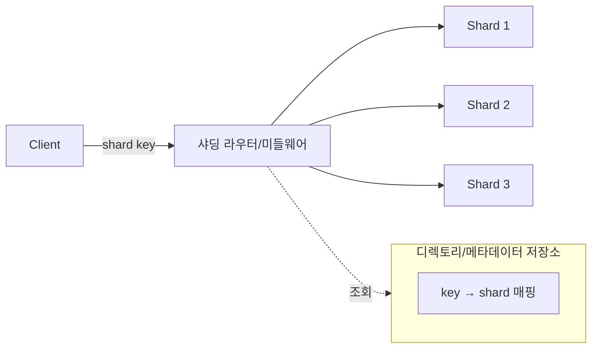

# 샤딩 전략

## 핵심 정의

샤딩(sharding)은 하나의 큰 데이터셋을 여러 개의 독립적인 데이터베이스 인스턴스(샤드, shard)로 수평 분할(horizontal partitioning)하여 저장하는 기법이다. 단일 서버의 CPU/메모리/디스크/IOPS 한계를 넘어서는 규모의 데이터와 트래픽을 처리하기 위한 스케일아웃(scale-out) 전략으로, 수직 확장(scale-up)이나 리플리케이션만으로는 쓰기 처리량 한계를 해결할 수 없을 때 도입한다.

샤딩의 핵심은 "어떤 데이터를 어느 샤드에 둘 것인가"를 정하는 샤딩 키(shard key)와 분배 알고리즘의 설계이며, 이 설계가 잘못되면 이후 마이그레이션 비용이 매우 커진다.

## 동작 원리 / 구조

### 주요 샤딩 전략

1. **범위 기반 샤딩(range-based sharding)**: 샤딩 키의 값 범위로 샤드를 나눈다(예: user_id 1~1000000은 샤드A, 1000001~2000000은 샤드B). 범위 쿼리에 유리하지만 특정 범위에 트래픽/데이터가 몰리는 핫스팟(hotspot)이 생기기 쉽다. 시계열 데이터(생성일 기준)에서 특히 최신 샤드에 쓰기가 집중되는 문제가 흔하다.

2. **해시 기반 샤딩(hash sharding)**: 샤딩 키를 해시 함수에 통과시켜 균등하게 분배한다(`hash(key) % N` 또는 컨시스턴트 해싱). 데이터 분포는 고르지만 범위 쿼리("특정 기간 데이터 조회")를 하려면 모든 샤드를 조회(scatter-gather)해야 한다.

3. **디렉토리 기반/조회 기반 샤딩(directory-based / lookup sharding)**: 별도의 매핑 테이블(또는 서비스)이 "어떤 키가 어느 샤드에 있는지"를 관리한다. 유연하게 재배치할 수 있지만 매핑 테이블 자체가 병목이나 단일 실패점이 될 수 있어 이 매핑 저장소는 보통 고가용성 구성이 필수다.

4. **지오샤딩(geo-sharding)**: 사용자의 지리적 위치나 리전 기준으로 샤드를 나눈다. 데이터 지역성(locality)과 규제 준수(데이터 주권)에 유리하다.

### 컨시스턴트 해싱으로 리샤딩 비용 줄이기

단순 `hash(key) % N` 방식은 샤드 개수(N)가 바뀌면 대부분의 키가 재배치되어야 한다. 컨시스턴트 해싱(consistent hashing)은 해시 링(hash ring) 위에 샤드와 키를 함께 배치해서, 샤드 추가/제거 시 영향받는 키의 범위를 전체의 일부(균등 분포를 가정하면 N개에서 하나 추가 시 평균 약 1/(N+1), 하나 제거 시 약 1/N)로 최소화한다.

### 크로스 샤드(cross-shard) 문제

샤딩 이후 가장 큰 실무 난제는 여러 샤드에 걸친 조인(join), 트랜잭션, 집계 쿼리다.
- **조인**: 애플리케이션 레벨에서 여러 샤드를 조회 후 메모리에서 조합하거나, 자주 조인되는 데이터를 같은 샤드에 배치하는 콜로케이션(colocation) 전략(예: 같은 tenant_id를 샤딩 키로 사용)을 쓴다.
- **분산 트랜잭션**: 2PC(Two-Phase Commit)나 Saga 패턴으로 처리하되, 가능하면 트랜잭션 경계를 하나의 샤드 안으로 제한하도록 데이터 모델을 설계하는 것이 우선이다.
- **집계**: scatter-gather 후 애플리케이션에서 재집계하거나, 별도의 OLAP/데이터 웨어하우스로 분리한다.

## 실무 관점

- **샤딩 키 선정**: 자주 조회/조인되는 단위(예: SaaS의 tenant_id, 이커머스의 user_id)를 샤딩 키로 잡아야 크로스 샤드 조회를 최소화할 수 있다. 나중에 샤딩 키를 바꾸는 것은 사실상 전체 데이터 재배치와 같아서 초기 설계 단계에서 신중히 결정해야 한다.
- **핫스팟 회피**: 자동 증가(auto-increment) PK나 시간순 UUID를 범위 기반 샤딩 키로 쓰면 최신 데이터에 쓰기가 몰린다. 해시를 섞거나 접두사를 랜덤화하는 방식으로 완화한다.
- **Java/Spring 생태계 도구**: ShardingSphere(Apache), Vitess(MySQL 기반) 같은 미들웨어가 샤딩 라우팅·분산 트랜잭션·리샤딩을 지원하지만 보장 모드·제약·컷오버 절차는 제품별로 다르다. 직접 구현보다는 이런 미들웨어 도입을 먼저 검토하는 것이 실무적으로 합리적이다.
- **운영 부담 증가**: 샤드 수만큼 백업/모니터링/스키마 변경 작업이 배로 늘어난다. 스키마 변경(DDL)을 모든 샤드에 순차/병렬로 안전하게 적용하는 배포 파이프라인이 필요하다.
- **흔한 실수**: 초기에는 샤드 2~3개로 시작했다가 트래픽이 늘어난 뒤 리샤딩을 시도하는데, 이때 서비스 중단 없이 데이터를 재배치하는 과정(더블 라이트, 백필, 컷오버)을 과소평가해서 장애로 이어지는 경우가 많다. 리샤딩은 별도 프로젝트로 취급해야 한다.
- **파티셔닝과의 구분**: 파티셔닝(partitioning)은 데이터를 나누는 넓은 개념이고, 샤딩은 그 중 서로 다른 저장 노드로 수평 분산하는 방식이다. 여기서 로컬 테이블 파티셔닝과 분산 샤딩을 구분한다. 파티셔닝은 운영 복잡도가 낮으므로 단일 서버 한계에 도달하기 전까지는 파티셔닝으로 먼저 대응하는 것이 일반적인 순서다.

## 심화 Q&A

### Q. MongoDB에서 기존 unique 인덱스를 유지한 채 tenant_id로 샤딩할 수 있는가?
A. MongoDB 8.3의 범위 샤딩 컬렉션은 일반 unique 인덱스에 샤드 키가 접두사(prefix)로 포함되어야 한다. 샤드 키가 `{tenant_id: 1}`이면 다음 두 요구는 다르다.

| 요구 | 인덱스 예 | 판단 |
|---|---|---|
| 같은 테넌트 안에서 이메일 유일 | `{tenant_id: 1, email: 1}`, unique | 조합 전체의 유일성을 검사 |
| 모든 테넌트에 걸쳐 이메일 유일 | `{email: 1}`, unique | 이 샤드 키의 샤딩 컬렉션에 그대로 적용할 수 없음 |

샤딩 전에 전역 UNIQUE로 지키던 업무 규칙을 복합 UNIQUE로 바꾸면 테넌트별 유일성으로 의미가 약해질 수 있다. 또한 `_id`가 샤드 키가 아니면 기본 `_id` 인덱스도 샤드 간 중복까지 막아주지 않는다. 이 경우 애플리케이션이 전역 ID 유일성을 보장해야 한다. 샤딩 키 변경 계획에는 조회 분포뿐 아니라 기존 유일성 제약의 의미와 지원 여부도 포함한다. hashed 인덱스에는 unique 제약을 지정할 수 없으므로 범위 샤딩의 예를 그대로 적용하지 않는다.

### Q. 해시 샤딩을 쓰는데 특정 고객(tenant) 하나의 데이터량이 다른 고객보다 100배 많다면 어떤 문제가 생기고 어떻게 대응하는가?
A. 해시 샤딩은 키 자체의 분포는 고르게 만들지만, 하나의 키(tenant)에 속한 레코드 양 자체의 불균형(데이터 스큐, data skew)은 해결하지 못한다. 그 결과 특정 샤드만 디스크/CPU 사용량이 튀는 "노이지 네이버(noisy neighbor)" 현상이 발생한다. 대응으로는 대형 테넌트만 별도로 전용 샤드에 격리하거나, 테넌트 내부에서 다시 2차 샤딩 키(예: tenant_id + 날짜)를 두는 계층적 샤딩을 적용한다.

### Q. 컨시스턴트 해싱을 쓰더라도 리샤딩 시 데이터 이동이 필요한 이유는 무엇이며, 무중단으로 처리하려면 어떤 절차가 필요한가?
A. 컨시스턴트 해싱은 이동량을 최소화할 뿐 0으로 만들지는 못한다 — 새 샤드가 해시 링에 들어오면 그 구간을 담당하던 키들은 여전히 물리적으로 이동해야 한다. 무중단 처리는 보통 (1) 새 샤드로 신규 쓰기는 두 곳에 동시에 쓰는 더블 라이트(dual write) 또는 CDC 변경 추적과 일관된 스냅샷 백필 시작 (2) 백필과 후속 변경 재생 완료 후 검증 (3) 오래된 라우터의 쓰기를 차단하는 fencing·라우팅 버전 전환과 함께 읽기·쓰기 소유권을 전환(cutover) (4) 복구 가능 기간을 둔 뒤 이전 데이터 정리 순서로 진행한다.

### Q. 크로스 샤드 트랜잭션에 2PC 대신 Saga 패턴을 선택하는 기준은 무엇인가?
A. 2PC는 강한 원자성을 보장하지만 코디네이터 장애 시 참여자들이 락을 잡은 채 블로킹되는 가용성 문제가 있고, 참여 샤드가 많아질수록 지연이 커진다. Saga는 각 단계를 로컬 트랜잭션으로 커밋하고 실패 시 보상 트랜잭션(compensating transaction)으로 되돌리기 때문에 장기간 전역 잠금을 피할 수 있지만 보상 실패·중복 재시도 처리 비용이 있고, 중간 상태가 잠시 외부에 노출될 수 있는 최종 일관성(eventual consistency)을 감수해야 한다. 실시간 강한 일관성이 필수인 소수의 크리티컬 트랜잭션(결제 등)에는 2PC나 아예 트랜잭션 경계를 한 샤드로 좁히는 설계를, 나머지 대다수 워크플로우에는 Saga를 선택하는 것이 일반적이다.

### Q. 디렉토리 기반 샤딩에서 매핑 테이블(라우팅 메타데이터) 자체를 어떻게 고가용성으로 만드는가?
A. 매핑 테이블은 트래픽 대비 크기가 작지만 조회 빈도가 매우 높으므로, 자체를 리플리케이션(다중 복제본)하고 각 애플리케이션 노드/샤딩 라우터에 캐싱한 뒤 TTL이나 변경 이벤트(pub/sub, CDC)로 캐시를 무효화하는 방식을 쓴다. 매핑 저장소가 단일 실패점이 되지 않도록 별도의 합의 기반 저장소(etcd, ZooKeeper) 또는 자체 복제 DB에 두는 경우가 많다.

### Q. 범위 기반 샤딩에서 시계열 데이터의 "최신 샤드 핫스팟" 문제를 해시 샤딩으로 바꾸지 않고 해결할 수 있는 방법이 있는가?
A. 있다. 시간 범위는 유지하되 각 시간 구간 내에서 보조 축(예: 디바이스ID, 사용자ID 해시)으로 다시 나누는 복합 샤딩 키를 쓰면, 범위 쿼리(최근 N일 조회)의 이점을 살리면서 동시에 같은 시간대 내 쓰기를 여러 샤드로 분산시킬 수 있다. 단, 키 순서와 실제 분할 단위에 따라 새 시간 구간이 다시 한 샤드로 몰릴 수 있어 분포와 사전 분할을 확인한다.

### Q. 샤딩 이후 "샤드 간 유니크 제약(unique constraint)"을 어떻게 보장하는가?
A. 각 샤드는 자신의 로컬 데이터만 알기 때문에 샤드별 로컬 UNIQUE만으로는 전역 유일성을 보장할 수 없다. 전역 인덱스·분산 트랜잭션을 제공하는 DB는 별도 지원 범위를 확인한다. 실무에서는 (1) 유일해야 하는 값(이메일 등)을 해시해서 샤딩 키로 사용해 항상 같은 샤드로 가게 만들거나, (2) 별도의 전역 유일성 서비스/테이블(UNIQUE 삽입으로 원자적으로 점유하고 실패를 복구하는 인덱스 테이블)을 두거나, (3) 유일성이 애플리케이션 수준에서 최종 일관성으로 처리되어도 되는지(중복 발생 후 정리) 비즈니스 요구를 재검토하는 방식을 조합한다.

## 관련 개념
- [[리플리케이션]]
- [[CAP 이론]]
- [[인덱스 설계 전략]]

## 참고 자료

확인일: 2026-09-08. 아래 적용 범위에서 본문·Q&A·예제를 재검증했다. 예제는 문서와 대조했으며 별도 실행 검증은 하지 않았다.

- [Azure Sharding Pattern](https://learn.microsoft.com/en-us/azure/architecture/patterns/sharding) — 범위/해시/lookup·조회·운영 트레이드오프.
- [MongoDB Shard Keys](https://www.mongodb.com/docs/manual/core/sharding-shard-key/) — 키 분포·샤딩 제약.
- [Cassandra Dynamo Architecture](https://cassandra.apache.org/doc/stable/cassandra/architecture/dynamo.html) — 토큰 링과 분산 원리.

부분 재검증: 2026-10-04. MongoDB 8.3 범위 샤딩의 unique 인덱스 접두사·_id 예외·hashed 인덱스 제약을 확인했다. 테넌트/이메일 사례는 해당 규칙을 적용한 모델링 예시다. 샤딩 클러스터에서 생성·마이그레이션을 실행하지 않았고 기존 `verified`는 유지한다.

- [MongoDB 8.3 Shard Key Indexes: Unique Indexes](https://www.mongodb.com/docs/v8.3/core/sharding-shard-key-indexes/#unique-indexes) — 샤드 키 접두사와 조합 유일성, _id의 샤드별 제약, hashed unique 제한.
