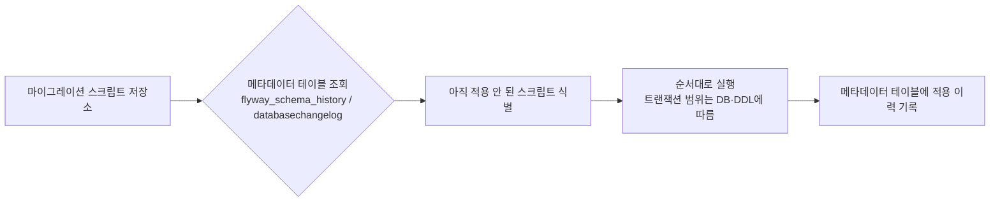

# 데이터베이스 마이그레이션 도구

## 핵심 정의

데이터베이스 마이그레이션 도구는 스키마 변경(DDL)과 초기 데이터 적재 스크립트를 버전 관리하고, 여러 환경(로컬/스테이징/운영)에 동일한 순서로 자동 적용해주는 도구다. 애플리케이션 코드는 Git으로 버전 관리하면서 스키마는 수작업 SQL로 관리하면 환경 간 스키마 불일치, 배포 순서 실수 같은 문제가 반복되기 때문에, Spring Boot 생태계에서는 Flyway와 Liquibase가 사실상 표준으로 쓰인다.

## 동작 원리 / 구조

### 공통 동작 방식



애플리케이션 기동 시(또는 별도 CI 단계에서) 도구가 DB에 있는 이력 테이블과 로컬 스크립트 목록을 비교해, 아직 적용되지 않은 스크립트만 순서대로 실행한다. 이미 적용된 스크립트의 체크섬(checksum)이 원본과 달라지면 오류를 내는 것이 기본 동작이라, 버전 마이그레이션의 불변성을 지킨다. Flyway repeatable·Liquibase `runOnChange` 등 재실행용 변경은 예외다.

### Flyway: SQL 우선

파일명 규칙으로 순서와 종류를 표현한다.

```
V1__create_orders_table.sql     # 버전 마이그레이션 (한 번만 실행)
V2__add_status_column.sql
R__refresh_order_summary_view.sql  # 반복 마이그레이션 (내용이 바뀔 때마다 재실행)
```

- 버전 마이그레이션(`V`)은 순서대로 한 번만 실행되고 이력에 남는다.
- 반복 마이그레이션(`R`)은 뷰, 저장 프로시저처럼 매번 최신 정의로 덮어써도 되는 대상에 쓰며, 체크섬이 바뀔 때마다 다시 실행된다.
- Undo 마이그레이션(`U`)은 커뮤니티(오픈소스) 버전에서는 지원하지 않고 유료(Teams/Enterprise) 기능이다. 즉 오픈소스 Flyway는 기본적으로 "앞으로만 가는(roll-forward)" 전략을 전제로 한다.
- PostgreSQL, MySQL 등 각 DB용 방언(dialect) 모듈이 `flyway-core`와 분리되어 있어, 의존성에 해당 DB 모듈(예: `flyway-database-postgresql`)을 별도로 추가해야 한다. 이를 빠뜨리면 기동 시점에 DB를 인식하지 못하는 오류가 나는 것이 흔한 업그레이드 실수다.

### Liquibase: 변경 세트 기반, 다중 포맷

XML/YAML/JSON/SQL로 changeset을 작성할 수 있고, 각 changeset은 `id` + `author` + changelog 파일 경로(`logicalFilePath`를 지정하면 그 경로) 조합으로 식별된다.

```yaml
databaseChangeLog:
  - changeSet:
      id: 1
      author: dev-a
      changes:
        - addColumn:
            tableName: orders
            columns:
              - column:
                  name: status
                  type: varchar(20)
      rollback:
        - dropColumn:
            tableName: orders
            columnName: status
```

- DB 종류에 무관한 추상 변경 유형(`addColumn`, `createTable` 등)을 쓰면 동일한 changeset을 여러 DB 방언에 맞춰 다른 SQL로 변환해 실행할 수 있다.
- `rollback` 블록을 changeset과 함께 명시적으로 작성할 수 있어 `rollback-count` 같은 명령으로 되돌릴 수 있다. 다만 이 롤백 SQL이 실제로 변경을 정확히 되돌리는지는 도구가 검증해주지 않으므로, 작성만 해두고 실제로 실행해본 적 없는 롤백은 "문서"이지 "동작이 검증된 기능"이 아니라는 점을 주의해야 한다.
- `context`, `label`, 사전조건(`preConditions`)으로 환경별 조건부 실행이 가능하다.

### Flyway vs Liquibase 비교

| 항목 | Flyway | Liquibase |
|---|---|---|
| 철학 | SQL을 직접 작성 | 선언적 변경 정의, DB별 SQL 자동 생성 |
| 포맷 | SQL 파일 (파일명이 순서 결정) | XML/YAML/JSON/SQL (changeset 단위) |
| 순서 관리 | 파일명 버전 번호 | changelog 파일 내 순서 + include 구조 |
| 롤백 | 오픈소스는 roll-forward만, undo는 유료 | changeset별 rollback 정의 가능 |
| 이력 테이블 | `flyway_schema_history` | `databasechangelog` |
| 강점 | 단순함, SQL을 그대로 다루는 팀에 적합 | 이기종 DB 지원, 세밀한 조건부 실행 |

### 실패 복구: 실행 이력과 실제 스키마를 따로 확인

Flyway `repair`는 스키마 이력을 정리하는 명령이며 이미 실행된 DDL·DML을 역으로 되돌리는 명령이 아니다. 비트랜잭션 DDL이 중간에 실패해 남긴 테이블·인덱스 등은 실제 DB에서 조사·정리해야 한다. 공식 Repair 문서(2026-09-15 개정)는 실패 이력 제거, 체크섬·설명·종류 정렬, 누락 마이그레이션의 삭제 표시를 명시한다. 따라서 migrate와 다른 `locations`로 repair하면 정상 파일까지 누락된 것으로 처리할 수 있다.

Liquibase Community 5.0.3의 `runInTransaction=false`도 변경을 안전하게 만드는 옵션이 아니다. 여러 SQL 중 앞 문장만 성공하면 실제 스키마와 DATABASECHANGELOG 상태가 어긋날 수 있다. 트랜잭션 밖에서 필요한 연산을 작은 changeset으로 분리하고, 실패 시 실제 객체 상태·이력·재실행 가능성을 확인한다. 이력만 성공으로 바꾸거나 반복 실행하는 것으로 복구를 대신하지 않는다.

## 실무 관점

- **적용된 버전 마이그레이션은 수정하지 않는다**: 이미 배포된 마이그레이션 파일을 고치면 체크섬 불일치로 다른 환경에서 배포가 실패한다. 잘못된 내용은 새 마이그레이션 파일을 추가해 고친다.
- **애플리케이션 기동 시 자동 실행 여부 결정**: Spring Boot는 기본적으로 애플리케이션 기동 시 마이그레이션을 자동 적용하지만, 운영 환경에서는 배포 파이프라인의 별도 단계(마이그레이션 전용 잡)로 분리해 애플리케이션 인스턴스가 여러 개 동시에 뜰 때 마이그레이션이 중복/경합 실행되는 것을 막는 구성이 흔하다.
- **대형 테이블 스키마 변경과 락**: 운영 중인 대형 테이블에 컬럼 추가/인덱스 생성 같은 DDL을 실행하면 락으로 인한 서비스 영향이 생길 수 있다. MySQL은 연산별 `ALGORITHM=INSTANT`/`INPLACE`·`LOCK` 지원을, PostgreSQL은 인덱스의 `CREATE INDEX CONCURRENTLY`를 검토한다. 모든 DDL에 해당 옵션을 적용할 수 없고 온라인 작업도 짧은 메타데이터 잠금은 필요하다. PostgreSQL CONCURRENTLY는 트랜잭션 블록 밖에서 실행해야 하므로 도구의 실행 설정도 분리한다. 자세한 내용은 [[인덱스 설계 전략]] 참고.
- **하위 호환을 고려한 다단계 배포(expand-contract)**: 컬럼 삭제/이름 변경처럼 애플리케이션 코드와 스키마가 동시에 바뀌어야 하는 변경은, 신규 컬럼 추가(expand) → 애플리케이션이 신규/기존 컬럼 모두 지원하도록 배포 → 데이터 백필 → 기존 컬럼 제거(contract) 순서의 다단계로 나눠야 무중단 배포가 가능하다. 한 번에 컬럼을 지우고 새 애플리케이션을 배포하면 배포 도중(구버전 인스턴스가 아직 떠 있는 시점) 오류가 발생한다.
- **리플리케이션 환경에서의 순서**: 논리적 복제([[리플리케이션]] 참고)를 쓰는 경우 DDL이 자동으로 복제본에 전파되지 않을 수 있어, 원본과 복제본에 마이그레이션 적용 순서/시점을 별도로 관리해야 한다.
- **테스트 환경 전략**: Testcontainers로 실제 DB 컨테이너를 띄우고 마이그레이션을 그대로 적용한 뒤 통합 테스트를 돌리는 방식이 H2 같은 인메모리 DB로 방언 차이를 감추는 것보다 신뢰도가 높다.

## 심화 Q&A

### Q. PostgreSQL의 NOT VALID로 제약을 추가하면 구버전 쓰기도 계속 허용되는가?
A. 아니다. PostgreSQL 18에서 `NOT VALID`는 기존 행의 전체 검사를 미루지만 이후 INSERT·UPDATE에는 제약을 적용한다. 예를 들어 기존 `quantity`가 NOT NULL인 테이블에 음수 방지 제약을 단계적으로 추가할 수 있다.

```sql
-- 1단계: 모든 쓰기 경로가 음수를 만들지 않도록 배포한 뒤 별도 커밋
ALTER TABLE orders
    ADD CONSTRAINT orders_quantity_nonnegative CHECK (quantity >= 0) NOT VALID;

-- 기존 위반 행을 별도 배치로 보정한 뒤, 2단계 마이그레이션에서 실행
ALTER TABLE orders VALIDATE CONSTRAINT orders_quantity_nonnegative;
```

구버전 앱이 여전히 음수를 쓰거나, 기존 음수 행의 다른 컬럼을 갱신해도 제약 위반으로 실패할 수 있다. 검사 미완료를 하위 호환 보장으로 해석하면 안 된다. CHECK 추가에는 기본적으로 `ACCESS EXCLUSIVE`, 검증에는 `SHARE UPDATE EXCLUSIVE` 잠금이 필요하므로 잠금이 사라지는 것도 아니다. 두 단계를 한 트랜잭션에 넣으면 처음의 강한 잠금이 검증 동안 유지되어 분리 효과가 줄어든다. 추가를 먼저 커밋하고, 검증 실패 시 제약을 우회하기보다 남은 위반 데이터와 쓰기 경로를 조사한다.

### Q. 여러 애플리케이션 인스턴스가 동시에 기동되며 마이그레이션을 시도하면 어떻게 되는가?
A. Flyway와 Liquibase 모두 마이그레이션 실행 전 DB 레벨 락(잠금 테이블/어드바이저리 락)을 획득해 동시 실행을 막는다. 먼저 락을 잡은 인스턴스가 마이그레이션을 끝내는 동안 나머지 인스턴스는 대기하다가, 락 해제 후 이미 적용된 것을 확인하고 그냥 넘어간다. 다만 락 대기 시간이 길어지면 기동 자체가 느려지므로, 대규모 인스턴스를 한꺼번에 배포하는 환경에서는 마이그레이션을 별도 배포 단계(전용 Job)로 분리하는 것이 안전하다.

### Q. Liquibase의 rollback 기능이 있는데도 왜 실무에서 "롤백에 의존하지 말라"는 조언이 많은가?
A. Liquibase는 `createTable` 등 지원되는 선언적 Change Type에 자동 롤백을 제공한다. 임의 SQL·데이터 파괴 변경에는 일반적으로 명시적인 rollback 정의가 필요하다. 즉 원본 changeset과 rollback 정의가 실제로 서로 역연산 관계인지 도구가 검증하지 않으며, 데이터가 이미 변형(예: 컬럼 삭제로 데이터 유실)된 이후에는 애초에 되돌릴 수 없는 변경도 있다. 그래서 스키마 변경 자체를 앞으로만 진행하고, 문제가 생기면 새로운 보정 마이그레이션을 추가하는 roll-forward 전략이 실무에서 더 신뢰받는다.

### Q. Flyway의 체크섬 검증이 걸림돌이 되는 상황과 대응 방법은?
A. CI 파이프라인에서 브랜치를 자주 리베이스/스쿼시하며 이미 병합된 마이그레이션 파일의 공백이나 주석만 바뀌어도 체크섬이 달라져 배포가 실패할 수 있다. 이런 경우 `flyway repair` 명령으로 이력 테이블의 체크섬을 현재 파일 기준으로 갱신할 수 있지만, 이는 "실제로 그 변경이 이미 적용된 내용과 동일하다"는 것을 사람이 확인한 뒤에만 써야 하는 예외적 조치다. 근본적으로는 이미 배포된 마이그레이션 파일을 건드리지 않는 팀 규율이 우선이다.

### Q. 스키마 변경과 애플리케이션 코드 배포 순서를 어떻게 맞춰야 하는가?
A. 카나리/블루-그린처럼 신구 버전이 동시에 떠 있는 배포 전략에서는, 스키마 변경이 신버전 전용 컬럼/제약을 추가하더라도 구버전 애플리케이션이 여전히 그 테이블에 정상적으로 쓰기/읽기가 가능해야 한다. 이를 위해 컬럼은 NOT NULL 제약 없이 추가하거나 기본값을 두고, 구버전이 완전히 내려간 뒤에야 제약을 강화하는 후속 마이그레이션을 추가하는 expand-contract 순서를 따른다.

### Q. 마이그레이션 도구를 선택할 때 주요 기준은 무엇인가?
A. 단일 DB 엔진(예: PostgreSQL만 사용)이고 SQL을 직접 다루는 것을 선호하는 팀은 Flyway가 단순하고 학습 비용이 낮다. 여러 DB 엔진을 동시에 지원해야 하거나, changeset 단위의 세밀한 조건부 실행/명시적 롤백 정의가 필요한 복잡한 릴리스 파이프라인이라면 Liquibase가 유리하다. 라이선스는 버전별로 확인한다. Liquibase Community는 5.0부터 FSL-1.1-ALv2로 전환했으므로 이전 Apache 2.0 버전과 같은 오픈소스 조건으로 설명하면 안 된다. Flyway undo와 드리프트 감지 등 기능은 해당 에디션 문서에서 제공 범위를 확인한다.

### Q. 마이그레이션 스크립트에 대량 데이터 백필(backfill) 로직을 포함시켜도 되는가?
A. 작은 참조 데이터라면 마이그레이션 스크립트에 포함해도 되지만, 수백만 건 이상의 데이터를 갱신하는 백필은 마이그레이션 트랜잭션 안에서 실행하면 장시간 락을 유발하고 배포 자체를 블로킹한다. 이런 작업은 별도의 배치 잡으로 분리해 청크 단위로 나눠 실행하고, 마이그레이션 스크립트는 스키마 변경(컬럼/인덱스 추가)만 담당하도록 역할을 분리하는 것이 안전하다.

## 관련 개념
- [[커넥션 풀과 HikariCP]]
- [[리플리케이션]]
- [[인덱스 설계 전략]]

## 참고 자료

확인일: 2026-09-08. 아래 적용 범위에서 본문·Q&A·예제를 재검증했다. 예제는 문서와 대조했으며 별도 실행 검증은 하지 않았다.

- [Flyway Migrations](https://documentation.red-gate.com/flyway/flyway-concepts/migrations) — 2026-09-08 문서: versioned·repeatable·체크섬.
- [Flyway Transaction Handling](https://documentation.red-gate.com/flyway/flyway-concepts/migrations/migration-transaction-handling) — DDL·비트랜잭션 마이그레이션.
- [Flyway Undo](https://documentation.red-gate.com/flyway/reference/commands/undo) — 2026-08-26 문서: undo 에디션·제약.
- [Flyway PostgreSQL Database](https://documentation.red-gate.com/fd/postgresql-database-277579325.html) — DB 모듈과 Java 의존성.
- [Liquibase 5.1 Changeset](https://docs.liquibase.com/secure/user-guide-5-1/what-is-a-changeset) — changeset 식별·실행·체크섬.
- [Liquibase 5.1 Rollback](https://docs.liquibase.com/secure/reference-guide-5-1/init-update-and-rollback-commands/rollback) — 자동/수동 rollback 경계.
- [Liquibase Community 5.0 License Change](https://www.liquibase.com/blog/liquibase-community-for-the-future-fsl) — 5.0부터 FSL-1.1-ALv2 전환.

부분 재검증: 2026-09-23. Flyway Repair의 2026-09-15 공식 문서와 Liquibase Community 5.0.3의 비트랜잭션 changeset 실패 경계를 확인했다. 기존 기능·에디션의 전체 검증일은 유지한다.

- [Flyway Repair](https://documentation.red-gate.com/flyway/reference/commands/repair) — 스키마 이력의 변경 범위, 남은 사용자 객체, 동일 locations 필요.
- [Liquibase Community 5.0.3 runInTransaction](https://docs.liquibase.com/community/reference-guide-5-0-3/changelog-attributes/runintransaction) — 부분 실행 후 이력 불일치.

부분 재검증: 2026-10-04. PostgreSQL 18의 NOT VALID·VALIDATE CONSTRAINT가 적용되는 행과 잠금 범위를 확인했다. 별도 배포 단계·커밋 권고는 이 잠금 계약에서 도출했다. SQL은 문서와 대조했고 아래 범위만 PostgreSQL에서 추가 실행했다. Flyway·Liquibase 실행은 확인하지 않았다. 도구 기능 전체의 `verified`는 유지한다.

- [PostgreSQL 18 ALTER TABLE](https://www.postgresql.org/docs/18/sql-altertable.html) — NOT VALID의 신규 INSERT/UPDATE 검사, CHECK 추가·검증의 잠금 차이.
- [PostgreSQL 18 Explicit Locking](https://www.postgresql.org/docs/18/explicit-locking.html) — 일반적으로 트랜잭션 종료까지 유지되는 잠금.

추가 실행 확인: 2026-10-04. 격리한 PostgreSQL 18.6 실제 서버와 pgJDBC 42.7.13의 두 연결로 확인했다. 기존 음수 행이 있는 상태에서 NOT VALID 추가는 성공했고, 새 음수 INSERT·기존 음수 행의 다른 컬럼 UPDATE·보정 전 VALIDATE는 SQLSTATE `23514`로 실패했다. 보정 후 VALIDATE는 성공했다. 추가와 검증을 같은 트랜잭션에서 실행하면 `pg_locks`에 `AccessExclusiveLock`이 남고 다른 연결의 SELECT는 `lock_timeout=100ms`에서 `55P03`으로 실패했다. 추가를 먼저 커밋한 뒤 검증하면 `ShareUpdateExclusiveLock`만 관찰되었고 다른 연결의 SELECT는 성공했다. 작은 테스트 데이터의 잠금 계약을 확인한 결과이며 대형 테이블의 검증 시간·배포 도구 설정까지 측정한 것은 아니다.
