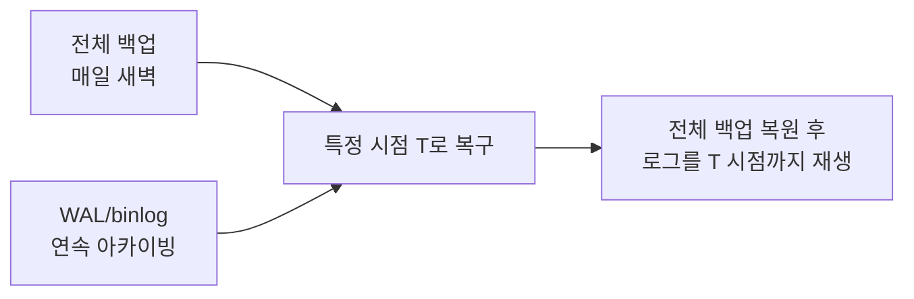

# 백업과 복구 전략

## 핵심 정의

백업(backup)은 데이터 유실·손상 상황에 대비해 데이터를 별도로 복사해 두는 것이고, 복구(recovery)는 그 백업으로 서비스 가능한 상태를 되살리는 절차다. 백업 전략을 설계할 때는 "얼마나 자주 백업하느냐"보다 두 가지 목표 지표, RPO(Recovery Point Objective, 복구 시점 목표 — 장애 시점 기준 얼마나 이전 데이터까지 유실을 허용하는가)와 RTO(Recovery Time Objective, 복구 시간 목표 — 장애 발생부터 서비스 정상화까지 허용 시간)를 먼저 정의하는 것이 우선이다. 이 두 지표가 백업 방식, 주기, 저장소 선택을 전부 결정한다.

## 동작 원리 / 구조

### 백업 방식 분류

- **논리 백업(logical backup)**: SQL 문장이나 데이터 덤프 형태로 저장(`mysqldump`, `pg_dump`). 이식성이 좋고 사람이 읽을 수 있지만, 대용량 DB에서는 덤프/복원 속도가 느리다.
- **물리 백업(physical backup)**: 데이터 파일을 바이트 단위로 그대로 복사(Percona XtraBackup, `pg_basebackup`, pgBackRest). SQL 재실행·인덱스 재구성 비용을 줄일 수 있어 대용량 운영 DB의 기본 전략으로 쓰인다.
- **스냅샷(snapshot)**: 클라우드 블록 스토리지(EBS 등)나 파일시스템(LVM, ZFS) 레벨에서 특정 시점의 이미지를 생성. 매우 빠르지만 DB의 데이터·로그·tablespace를 함께 일관되게 포착해야 한다. PostgreSQL처럼 유효한 crash-consistent 스냅샷과 WAL이 있으면 재시작 복구가 가능하며 사전 CHECKPOINT는 필수 조건이 아니라 복구 시간 단축 수단이다.

### 백업 유형 조합

| 유형 | 설명 | 특징 |
|---|---|---|
| 전체(full) | 전체 데이터 복사 | 가장 단순, 복원 빠름, 저장 공간/시간 많이 소요 |
| 증분(incremental) | 직전 백업 이후 변경분만 | 저장 공간 절약, 복원에 필요한 전체·증분 체인을 모두 확보해야 함 |
| 차등(differential) | 마지막 전체 백업 이후 누적 변경분 | 증분보다 복원은 단순(전체+최신 차등 1개), 저장 공간은 증분보다 큼 |

### PITR(Point-In-Time Recovery)

전체/증분 백업만으로는 확보한 백업 시점까지만 복구할 수 있다. 백업 사이의 특정 시점으로 복구하려면 기본 백업과 함께 그 시점까지 이어지는 WAL(PostgreSQL Write-Ahead Log)이나 binlog(MySQL)를 별도 저장소에 보관해야 한다. 로그 전송 주기와 누락 여부가 실제 복구 가능 시점을 결정한다.

이 구조가 있어야 "장애 발생 5분 전까지" 같은 세밀한 시점으로 복구할 수 있다. 연속적인 로그 아카이빙 없이는 RPO가 "마지막 전체/증분 백업 시점"으로 고정된다.

### PostgreSQL의 백업 종류와 검증 단계

PostgreSQL 18의 `pg_dump`는 데이터베이스 하나를 논리 백업한다. 역할(role)·테이블스페이스 같은 클러스터 공통 객체는 `pg_dumpall --globals-only` 등으로 별도 확보한다. 논리 덤프를 복원한 뒤 그 디렉터리에 물리 WAL을 이어 붙여 PITR할 수는 없다. 물리 PITR에는 유효한 물리 기본 백업과 그 백업에 이어지는 WAL이 필요하다.

네이티브 증분 백업은 `pg_combinebackup`에 필요한 전체 백업과 증분을 오래된 순서로 전달해 별도 출력 디렉터리에 합성 전체 백업을 만든다. 이미 실행 중인 데이터 디렉터리에 증분 파일을 순차 덮어쓰는 절차가 아니다. `--link`로 하드 링크를 사용하면 출력에서 서버를 기동한 쓰기가 입력 백업도 변경할 수 있으므로 보존할 원본 사본에 적용하지 않는다.

`pg_combinebackup`의 체인 관계 검증, `pg_verifybackup`의 백업 무결성 검증, 실제 복원 후 서버 기동·업무 데이터 검증은 서로 다른 단계다. pg_verifybackup 성공만으로 서버의 모든 복구 검사나 애플리케이션 정합성까지 통과한 것으로 보지 않는다.

## 실무 관점

- **RPO/RTO를 먼저 숫자로 정의**: "백업은 매일 한다" 식의 막연한 정책이 아니라, 비즈니스 요구사항에서 "RPO 5분, RTO 30분" 같은 구체적 수치를 먼저 뽑고 그에 맞는 백업 주기·방식·저장소를 역산해야 한다. 짧은 RPO는 백업 완료 주기·로그 전송 지연·복제 내구성을 함께 검토한다. 5분 이내 간격의 유효한 복구 지점을 확보하면 스냅샷으로도 해당 RPO를 달성할 수 있지만 비용과 일관성 검증이 필요하다.
- **3-2-1(-1-0) 원칙**: 최소 3개의 복사본을, 2종류 이상의 저장 매체에, 그중 1개는 원본과 물리적으로 분리된(오프사이트) 위치에 둔다. 여기에 하나는 오프라인·망 분리(air-gapped) 또는 변경 불가(immutable) 사본으로 두고, 복원 검증 오류 0개를 목표로 삼는 확장 운영 규칙도 쓰인다. 망 분리와 변경 불가는 서로 다른 보호 수단이다.
- **복원 리허설이 백업의 일부**: 실제로 복원해본 적 없는 백업은 "존재하는지 확인만 된 파일"일 뿐이다. 정기적으로(예: 월 1회) 스테이징 환경에 실제 복원을 수행해 RTO를 실측하고, 가능하면 이 과정을 CI/CD 파이프라인에 자동화해 둔다.
- **백업이 서비스에 주는 부하**: 논리 백업(`mysqldump`)은 대상 테이블에 락을 걸거나 부하를 유발할 수 있어 운영 시간대를 피하거나 복제본에서 수행한다. 물리 백업 도구(XtraBackup, pgBackRest)는 온라인 백업을 지원하지만 I/O 부하와 일관성 확보용 백업 락·DDL 제약이 남는다. 논블로킹을 절대 보장하는 것으로 이해하면 안 된다.
- **암호화와 접근 통제**: 백업 파일 자체가 개인정보를 포함한 전체 데이터의 사본이므로, 저장 시 암호화와 접근 권한 분리(백업 저장소에 대한 별도 IAM/권한 체계)가 운영 DB 자체 보안 못지않게 중요하다.
- **흔한 실수**: 백업은 잘 돌아가는데 복원 절차 문서가 오래되어 실제 장애 상황에서 담당자가 순서를 못 찾는 경우, 백업 저장소를 운영 DB와 같은 가용영역/리전에 둬서 리전 단위 장애 시 백업까지 함께 소실되는 경우, 증분 백업 체인 중 하나가 손상되면 그 이후 모든 증분이 복원 불가능해지는 것을 인지하지 못한 경우가 반복적으로 발생한다.

### PITR 목표 도달과 서비스 재개를 구분한다

PostgreSQL 18에서 `recovery_target_time`은 시간대까지 명시하고, 목표 트랜잭션을 포함할지 `recovery_target_inclusive`로 결정한다(기본 on). `recovery_target_timeline`의 기본값 `latest`는 아카이브에서 찾은 최신 타임라인(timeline)을 따르며, `current`는 기본 백업 당시 타임라인을 따른다. 이전 복구·승격으로 갈라진 이력이 있다면 시각만 적는 것으로 복구 대상을 충분히 특정했다고 보지 않는다.

`recovery_target_action`의 기본값 `pause`는 `hot_standby`를 활성화한 복구 서버에서 목표 지점의 결과를 조회해 검사하는 용도다. `hot_standby=off`이면 `pause`도 `shutdown`처럼 서버를 종료한다. 이 상태에서 `pg_wal_replay_resume()`를 호출하면 복구가 종료되므로, “잠깐 멈춘 WAL을 더 원하는 시점까지 계속 재생”하는 일반 재개 버튼으로 취급하지 않는다. 더 늦은 목표가 필요하면 공식 절차대로 서버를 종료하고 목표를 바꿔 다시 시작한다. 목표를 지정했는데 아카이브가 먼저 끝나면 정상 복구 완료가 아니라 fatal 오류다. 복구 목표 확인·업무 정합성 확인·쓰기 트래픽 전환을 별도 단계로 둔다.

## 심화 Q&A

### Q. 리플리케이션이 있는데 왜 별도의 백업이 또 필요한가?
A. [[리플리케이션]]은 하드웨어 장애나 가용영역 장애에는 효과적이지만, 논리적 오류(운영자가 실수로 실행한 DELETE, 애플리케이션 버그로 인한 데이터 오염)는 즉시 복제본에도 그대로 전파된다. 즉 리플리케이션은 "같은 실수를 복제본도 똑같이 겪는" 구조라 논리적 삭제/오염 사고에는 무력하다. 특정 과거 시점으로 되돌릴 수 있는 백업(PITR)만이 이런 사고에서 데이터를 구제할 수 있다.

### Q. 증분 백업 체인이 길어지면 어떤 문제가 생기고, 어떻게 완화하는가?
A. 증분 백업은 저장 공간을 아끼지만 복원 시 의존하는 전체·증분 체인을 읽어 재구성해야 하므로, 체인이 길어질수록 복원 시간(RTO)이 늘어날 수 있고 중간 증분 하나가 손상되면 그 이후 전체가 무용지물이 된다. 정기적으로(예: 매주) 전체 백업을 다시 떠서 체인 길이를 리셋하거나, 증분 대신 차등 백업으로 전환해 복원 시 필요한 파일 수를 줄이는 방식으로 완화한다.

### Q. 클라우드 스냅샷만으로 백업 전략을 구성해도 되는가?
A. 스냅샷은 빠르고 편리하지만 기본적으로 원본과 같은 클라우드 계정/리전에 종속되는 경우가 많아, 계정 탈취나 리전 단위 장애 시 원본과 함께 소실될 위험이 있다. 또한 데이터와 WAL이 여러 볼륨에 나뉘면 동시 스냅샷 또는 DB 백업 프로토콜로 일관된 복구 지점을 확보해야 한다. 유효한 crash-consistent 사본은 DB 복구로 미완료 트랜잭션을 정리할 수 있으나, CHECKPOINT만 강제한 뒤 서로 다른 시점의 볼륨을 복사하면 안전해지는 것은 아니다.

### Q. RPO를 0(완전 무손실)으로 만들 수 있는가?
A. 먼저 무손실의 대상과 장애 범위를 정해야 한다. 예를 들어 PostgreSQL 18에서 동기 복제본의 내구 저장까지 확인한 커밋은, 그 복제본이 살아 있고 해당 WAL을 보유한 노드로 전환한다는 조건에서 주 노드 장애 시 승인된 데이터를 보존할 수 있다. 이는 단순히 복제본 메모리에 도착한 경우와 다르다. 필요한 복제본이 응답하지 않으면 커밋 대기와 가용성 저하를 감수해야 한다. 모든 사본의 동시 소실이나 이미 복제된 잘못된 DELETE까지 막는 보장은 아니므로, 동기 [[리플리케이션]]과 과거 시점 복구용 백업을 함께 설계한다.

### Q. 백업 복원 훈련을 자동화한다는 것은 구체적으로 무엇을 의미하는가?
A. 단순히 백업 파일이 생성되었는지 확인하는 것을 넘어, 주기적으로 격리된 환경에 실제로 그 백업을 복원시키고, 복원된 DB에 대해 스키마 검증·샘플 데이터 쿼리·행 수 비교 같은 자동 점검을 수행한 뒤 결과를 알림으로 보내는 파이프라인을 구축하는 것을 말한다. 이렇게 해야 "백업 파일은 생성됐지만 실제로는 손상되어 있어 복원이 안 되는" 상황을 장애 발생 전에 미리 발견할 수 있다.

### Q. 샤딩된 환경에서 백업 전략은 단일 DB와 무엇이 다른가?
A. [[파티셔닝과 샤딩의 차이]]에서 다루는 샤딩 구조에서는 샤드마다 독립적으로 백업이 이뤄지므로, 여러 샤드에 걸친 트랜잭션이나 참조 무결성이 있는 경우 "각 샤드를 같은 논리적 시점"으로 복구해야 정합성이 유지된다. 이를 위해 각 샤드의 백업을 같은 시각 기준으로 조율하거나, 각 샤드별 로그 위치와 분산 트랜잭션의 커밋 상태를 함께 보관해 논리적으로 일관된 지점으로 복원해야 한다. 서로 독립된 DB의 LSN은 직접 비교할 수 없고 동일 벽시계 시각만 맞춰도 분산 트랜잭션 중간 상태가 남을 수 있다.

## 관련 개념
- [[리플리케이션]]
- [[파티셔닝과 샤딩의 차이]]
- [[데이터베이스 마이그레이션 도구]]

## 참고 자료

부분 재확인: 2026-09-22. PostgreSQL 18의 PITR에 필요한 연속 WAL과 동기 복제의 승인·내구성·장애 범위를 확인했다. 다른 백업 도구와 클라우드 기능 전체의 재검증은 아니므로 기존 `verified`를 유지했다.

- [PostgreSQL 18 Synchronous Replication](https://www.postgresql.org/docs/18/warm-standby.html#SYNCHRONOUS-REPLICATION) — 커밋 승인과 복제본 내구 저장, 대기·가용성 조건.

확인일: 2026-09-08. 아래 적용 범위에서 본문·Q&A·예제를 재검증했다. 예제는 문서와 대조했으며 별도 실행 검증은 하지 않았다.

- [PostgreSQL 18 File System Backup](https://www.postgresql.org/docs/18/backup-file.html) — crash-consistent 스냅샷·다중 볼륨·CHECKPOINT.
- [PostgreSQL 18 Continuous Archiving](https://www.postgresql.org/docs/18/continuous-archiving.html) — base/incremental backup·PITR·체인.
- [MySQL 8.4 PITR](https://dev.mysql.com/doc/refman/8.4/en/point-in-time-recovery.html) — 전체 백업과 binlog 재생.

부분 재검증: 2026-09-23. PostgreSQL 18의 단일 DB 논리 덤프 범위, 증분 백업 합성과 하드 링크 위험, 백업 검증 도구의 한계를 확인했다. 실제 복원 훈련은 실행하지 않았으며 다른 엔진·도구의 전체 검증일은 유지한다.

- [PostgreSQL 18 pg_dump](https://www.postgresql.org/docs/18/app-pgdump.html) — 단일 DB와 전역 객체 구분. 위 Continuous Archiving의 물리 백업 요구도 재확인.
- [PostgreSQL 18 pg_combinebackup](https://www.postgresql.org/docs/18/app-pgcombinebackup.html) — 합성 전체 백업·의존 체인·하드 링크.
- [PostgreSQL 18 pg_verifybackup](https://www.postgresql.org/docs/18/app-pgverifybackup.html) — 파일 검증과 실제 복원 시험의 차이.
- [PostgreSQL 18 pg_dumpall](https://www.postgresql.org/docs/18/app-pg-dumpall.html) — globals-only의 역할·테이블스페이스 범위.

부분 재검증: 2026-10-04. PostgreSQL 18의 복구 목표·inclusive·timeline·pause의 hot_standby 조건·이후 동작과 목표 미도달 실패를 확인했다. 위 단계 분리는 이 계약에 따른 운영 판단이다. 실제 PITR·타임라인 분기 복원은 실행하지 않았고 다른 백업 도구의 `verified`는 유지한다.

- [PostgreSQL 18 Recovery Target](https://www.postgresql.org/docs/18/runtime-config-wal.html#RUNTIME-CONFIG-WAL-RECOVERY-TARGET) — 목표 시각의 시간대, latest/current, pause·resume·미도달 오류.
