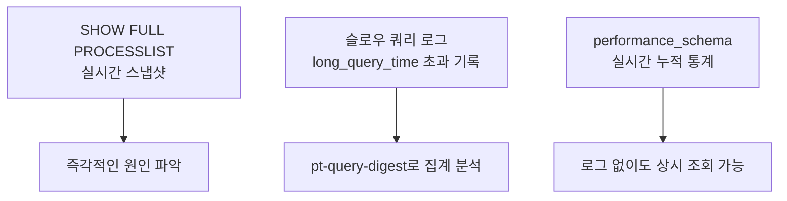

# 슬로우 쿼리 분석과 튜닝

## 핵심 정의

슬로우 쿼리(slow query) 분석은 실행 시간이 임계값을 넘는 쿼리를 자동으로 기록·집계해 최적화 우선순위를 정하는 운영 활동이다. 개별 쿼리 하나의 `EXPLAIN` 결과를 읽는 것([[실행 계획 읽는 법]] 참고)과는 다른 층위의 작업으로, "지금 이 쿼리가 왜 느린가"가 아니라 "전체 트래픽 중 어떤 쿼리 패턴이 가장 큰 부하를 유발하는가"를 데이터 기반으로 찾아내는 것이 목적이다.

## 동작 원리 / 구조

### 탐지 계층



- **슬로우 쿼리 로그**: MySQL의 `long_query_time`(초 단위)을 넘고 `min_examined_row_limit` 등 기록 조건을 만족한 쿼리를 설정된 FILE/TABLE 대상으로 남긴다. MySQL 8.4 `long_query_time` 기본값은 10초이며 슬로우 로그 자체는 기본 비활성화다. 일반 쿼리 로그(모든 쿼리 기록)와 달리 오버헤드가 낮아 기록량·I/O·민감한 파라미터 노출을 측정한 뒤 상시 수집 여부를 정한다. 0.5~2초 등은 조정 예시이며 공식 권장 기본값은 아니다.
- **`performance_schema.events_statements_summary_by_digest`**: 쿼리를 리터럴 값을 제거한 정규화된 형태(digest)로 묶어 실행 횟수, 누적 실행 시간, 평균 지연 등을 실시간으로 집계해 둔 테이블이다. 로그 파일 없이도 상시 조회할 수 있고, `SUM_NO_INDEX_USED`로 인덱스 미사용 쿼리를 바로 걸러낼 수 있다.
- **PostgreSQL의 `pg_stat_statements`**: 확장(extension)을 활성화하면 MySQL의 `performance_schema` digest 집계와 동일한 역할을 한다. 쿼리별 총 실행 시간, 호출 횟수, 평균/최대 시간을 노출한다.

### 슬로우 쿼리 로그 핵심 필드

| 필드 | 의미 | 해석 |
|---|---|---|
| `Query_time` | 총 실행 시간 | 튜닝 우선순위의 1차 기준 |
| `Lock_time` | 초기 잠금 획득에 소요된 시간 | 모든 InnoDB 행 잠금 대기를 포괄하는 값은 아님. data_lock_waits 등과 함께 확인 |
| `Rows_examined` | 실제로 훑은 행 수 | `Rows_sent`(반환 행 수) 대비 압도적으로 크면 인덱스 부재 의심 |
| `Rows_sent` | 반환된 행 수 | `Rows_examined`와 함께 선택도(selectivity) 판단 근거 |

### pt-query-digest를 통한 집계 분석

Percona Toolkit의 `pt-query-digest`는 슬로우 로그를 정규화(리터럴 제거)된 지문(fingerprint) 단위로 묶어, 개별 실행이 아니라 "쿼리 패턴별 총 부하"를 랭킹으로 보여준다.

```bash
# 총 실행 시간 기준 상위 10개 쿼리 패턴
pt-query-digest --limit 10 /var/log/mysql/slow.log

# 훑은 행 수 합계 기준 정렬
pt-query-digest --order-by Rows_examined:sum /var/log/mysql/slow.log
```

가장 느린 쿼리 1건보다, 실행 횟수는 많지만 개별로는 빠른 쿼리의 누적 합이 전체 부하의 대부분을 차지하는 경우가 실무에서 더 흔하다. `pt-query-digest`는 이 "누적 기준 우선순위"를 자동으로 계산해준다는 점이 `SHOW FULL PROCESSLIST`를 눈으로 보는 것과의 차이다.

## 실무 관점

- **분석 도구 자체의 부하 격리**: 슬로우 로그 자체를 남기는 것은 저오버헤드이지만, `pt-query-digest`로 대용량 로그를 분석하는 작업은 CPU를 상당히 소모한다. 운영 원본 서버가 아니라 읽기 복제본이나 별도 분석 서버에서 로그 파일을 옮겨 분석하는 것이 권장된다.
- **`Rows_examined` / `Rows_sent` 비율로 원인 분류**: 비율이 크게 벌어져 있으면 인덱스 설계 문제([[인덱스 설계 전략]] 참고)일 가능성이 높고, 비율은 정상인데 `Query_time` 자체가 크면 데이터량이 원래 많은 쿼리(정당한 대량 처리)이거나 잠금·I/O 대기가 원인일 수 있다. `Lock_time` 하나가 InnoDB 행 잠금 대기를 모두 나타내지는 않으므로 Performance Schema의 잠금 대기와 실행 계획을 함께 확인해 원인을 분류한다.
- **임계값 설정의 트레이드오프**: `long_query_time`을 너무 낮게 잡으면 로그량이 폭증해 디스크/분석 비용이 커지고, 너무 높게 잡으면 실제로 누적 부하를 유발하는 "적당히 느린" 쿼리들을 놓친다. 앞서의 0.5~2초는 서비스에 맞춰 검증할 예시이고, 이와 별개로 신규 도입 초기나 특정 장애 조사 시에는 일시적으로 더 낮게(예: 0.1~0.5초) 잡아 전체 패턴을 넓게 수집한 뒤, 정상 범위로 판명된 쿼리 패턴은 제외 필터로 걸러내고 다시 상시 기준으로 되돌리는 단기 진단 방식을 병행하는 것이 실무적이다.
- **Spring/JPA 환경 특유의 함정**: N+1 문제로 인해 짧은 개별 쿼리가 수백 번 반복 실행되는 경우, 각 쿼리는 슬로우 쿼리 임계값에 걸리지 않아 로그에 전혀 나타나지 않는다. 이런 패턴은 슬로우 쿼리 로그만으로는 발견되지 않으므로, APM(애플리케이션 성능 관리) 도구나 `show-sql`/P6Spy로 요청당 실제 쿼리 발행 횟수를 함께 확인해야 한다.
- **정기 리뷰 루틴화**: 슬로우 쿼리 분석은 장애 발생 후 1회성으로 하는 작업이 아니라, `pt-query-digest --review`처럼 이미 검토한 쿼리는 다시 보고하지 않고 신규 패턴만 강조하는 기능을 활용해 주기적인(주간/스프린트 단위) 리뷰 루틴으로 운영하는 것이 데이터 증가에 따른 성능 저하를 조기에 잡는 데 효과적이다.
- **파라미터 스니핑과 튜닝의 함정**: 같은 쿼리 패턴인데 특정 파라미터 값에서만 느린 경우가 있다. 이런 경우 집계 통계(평균)만 보면 문제를 놓치므로, `pt-query-digest`의 최대·표준편차·근사 95% 값과 APM 등에서 측정한 P99를 함께 확인한다. 표준 리포트가 임의의 모든 백분위수를 직접 제공한다고 가정하지 않는다.

## 심화 Q&A

### Q. pg_stat_statements의 평균 시간이 줄었으면 방금 배포한 쿼리가 빨라진 것인가?
A. 누적 평균만으로는 배포 전후를 비교할 수 없다. PostgreSQL 18에서 같은 `(dbid, userid, queryid, toplevel)` 항목의 두 관측값을 저장하고, 관측 구간 평균은 `Δtotal_exec_time / Δcalls`로 계산한다. `mean_exec_time` 두 값의 차이는 그 구간의 평균이 아니다. 호출 수가 늘지 않은 구간은 평균을 계산하지 않고, 호출량·파라미터 분포·캐시 상태도 함께 비교한다.

통계 리셋이나 항목 축출 후 재생성이 있었다면 단순 차분도 무효다. 항목의 `stats_since`와 전체 `pg_stat_statements_info.stats_reset`, 용량 초과 축출 지표 `dealloc`을 함께 수집해 수집 구간이 이어지는지 확인한다. 음수 차분을 0으로 바꿔 숨기거나 새 항목을 기존 통계와 이어 붙이지 않는다. `queryid`도 PostgreSQL 메이저 버전 간 안정성이 보장되지 않으므로 업그레이드 전후의 ID 동일성만으로 성능 시계열을 결합하지 않는다.

계획·실행 통계는 각 단계가 성공적으로 끝났을 때 갱신된다. 타임아웃으로 실패한 실행이나 아직 실행 중인 장기 쿼리까지 이 집계에 모두 포함된다고 가정하지 말고, 서버 로그·`pg_stat_activity`·APM의 실패/진행 중 요청과 대조한다.

### Q. 슬로우 쿼리 로그에는 안 걸리지만 실제로 서비스 지연을 유발하는 쿼리는 어떻게 찾는가?
A. N+1 문제나 커넥션 풀 대기처럼 개별 쿼리 자체는 빠르지만 호출 횟수나 대기 시간이 문제인 경우가 대표적이다. `performance_schema.events_statements_summary_by_digest`는 활성화된 statement 계측·digest 수집 범위와 테이블 용량 안에서 임계값과 무관하게 집계하므로, 개별로는 임계값 아래여도 합산 실행 시간(`SUM_TIMER_WAIT`)이 큰 패턴을 걸러낼 수 있다. 또한 APM 분산 추적(트레이싱)으로 한 요청 안에서 발생한 쿼리 수와 각 쿼리 사이의 대기(커넥션 풀 대기 포함) 시간을 함께 봐야 진짜 원인을 찾을 수 있다.

### Q. `Rows_examined`가 크지만 `Query_time`은 짧은 쿼리도 튜닝 대상인가?
A. 그렇다. 개별 실행은 빨라 보여도, 이런 쿼리가 초당 수백 번 호출되면 DB 서버 전체의 CPU/디스크 I/O를 누적으로 크게 소모해 다른 쿼리들의 지연에 간접적으로 영향을 준다. `pt-query-digest`의 "총 실행 시간(sum)" 기준 랭킹이 이런 패턴을 잡아내는 이유이며, 단일 쿼리의 절대 속도보다 시스템 전체에 대한 누적 기여도로 우선순위를 매겨야 한다.

### Q. 슬로우 쿼리 로그와 `EXPLAIN`은 어떤 순서로 함께 쓰는가?
A. 슬로우 쿼리 로그(또는 digest 집계)로 "어떤 쿼리 패턴을 먼저 봐야 하는가"라는 우선순위를 정한 다음, 그 쿼리에 대해 `EXPLAIN`/`EXPLAIN ANALYZE`로 왜 느린지 구체적인 실행 경로를 진단하는 것이 순서다. `pt-query-digest`는 `--explain` 옵션으로 이 두 단계를 자동으로 이어줄 수 있지만, 운영 원본에 부하를 주지 않도록 복제본에서 실행하는 것이 권장된다. 세부 실행 계획 해석은 [[실행 계획 읽는 법]] 참고.

### Q. 슬로우 쿼리 로그 자체가 성능에 영향을 주지 않는가?
A. 슬로우 쿼리 로그는 임계값을 넘는 쿼리만 기록하므로 전체 쿼리를 다 기록하는 일반 쿼리 로그보다 오버헤드가 훨씬 낮고, 운영 환경에서도 수집할 수 있다. 안전한 수집량은 workload·디스크·로테이션 정책에 따라 확인해야 한다. 다만 임계값을 지나치게 낮게 설정하면(예: 0에 가깝게) 사실상 모든 쿼리를 기록하는 것과 같아져 일반 쿼리 로그 수준의 부하가 발생할 수 있으므로, 진단 목적의 일시적 저임계값 설정은 짧은 시간 동안만 유지해야 한다.

### Q. 동일한 쿼리 패턴의 지연 편차(P50은 낮은데 P99는 매우 높음)는 무엇을 의미하는가?
A. 평균이나 중앙값(P50)만으로는 드러나지 않는 문제로, 대부분의 실행은 인덱스를 잘 타서 빠르지만 특정 파라미터 값(카디널리티가 낮은 값, 데이터 분포가 치우친 값)이나 특정 시간대(락 경합, 캐시 미스 직후)에만 느려지는 패턴일 가능성이 크다. 파라미터 스니핑, 특정 파티션/샤드로의 쏠림, 커넥션 풀 대기 급증 같은 원인을 의심하고, 느렸던 개별 실행 건의 실제 파라미터 값과 실행 시점을 함께 조사해야 한다.

### Q. 슬로우 쿼리 개선 후에도 DB 전체 부하가 그대로라면 무엇을 의심해야 하는가?
A. 상위 몇 개의 슬로우 쿼리만 최적화해도 전체 부하 중 일부만 개선되는 경우가 많다. 롱테일(long tail)에 해당하는 다수의 "적당히 빠른" 쿼리들의 합산 부하가 여전히 크거나, 애초에 병목이 쿼리 실행이 아니라 커넥션 풀 크기([[커넥션 풀과 HikariCP]] 참고), 락 경합, 디스크 I/O 포화 같은 인프라 레벨 요인일 수 있다. 쿼리 튜닝만으로 해결되지 않으면 시스템 자원 지표(CPU, 디스크 I/O, 락 대기)를 함께 확인해야 한다.

## 관련 개념
- [[실행 계획 읽는 법]]
- [[인덱스 설계 전략]]
- [[커넥션 풀과 HikariCP]]
- [[페이징 최적화]]

## 참고 자료

부분 재확인: 2026-09-22. MySQL 8.4 Slow Query Log 문서의 실행 시간·초기 잠금 획득·Lock_time 범위를 다시 확인해 원인 분류 설명을 맞췄다. Percona 도구 등 나머지 서술의 전체 재검증은 아니므로 기존 `verified`를 유지했다.

확인일: 2026-09-08. 아래 적용 범위에서 본문·Q&A·예제를 재검증했다. 예제는 문서와 대조했으며 별도 실행 검증은 하지 않았다.

- [MySQL 8.4 Slow Query Log](https://dev.mysql.com/doc/refman/8.4/en/slow-query-log.html) — 기록 조건·기본값·Lock_time.
- [Percona Toolkit pt-query-digest](https://docs.percona.com/percona-toolkit/pt-query-digest.html) — 명령 옵션·집계·review·백분위 통계.
- [PostgreSQL 18 pg_stat_statements](https://www.postgresql.org/docs/18/pgstatstatements.html) — 활성화와 누적 집계 범위.

부분 재검증: 2026-10-04. PostgreSQL 18의 집계 식별자·누적 필드·stats_since·리셋/축출 통계·메이저 버전 간 queryid 안정성 범위를 확인했다. 차분 계산은 누적 카운터 정의에서 도출한 운영 방식이다. 실제 서버 수집·부하 비교는 수행하지 않았고 MySQL·Percona 부분의 `verified`는 유지한다.

- [PostgreSQL 18 pg_stat_statements](https://www.postgresql.org/docs/18/pgstatstatements.html) — 항목별 집계 키, stats_since, pg_stat_statements_info, queryid 안정성 제약.
