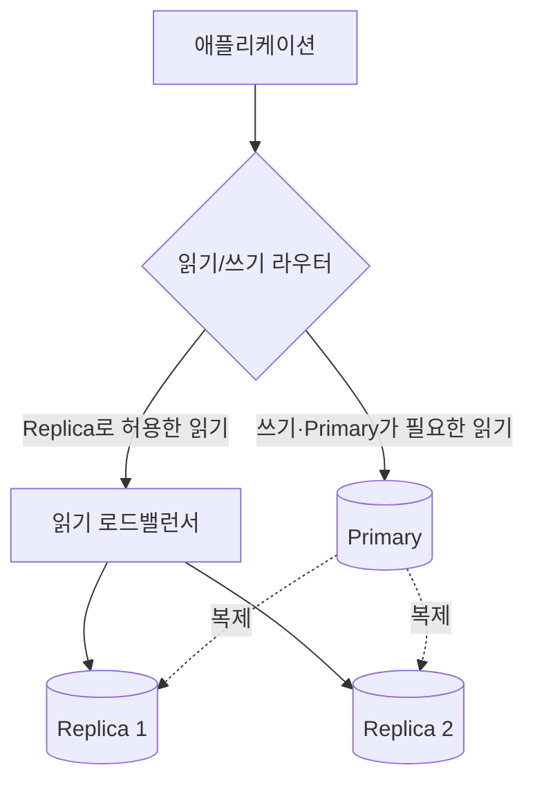

# 읽기와 쓰기 분리

## 핵심 정의

읽기와 쓰기 분리(read/write splitting)는 쓰기 트래픽은 원본(primary) DB로, 읽기 트래픽은 하나 이상의 읽기 복제본(read replica)으로 라우팅해서 부하를 분산시키는 아키텍처 패턴이다. 읽기 트래픽 비중이 큰 서비스에서는, 쓰기 처리량을 원본에 집중시키면서 읽기 확장성만 별도로 늘리는 것이 수직 확장보다 비용 효율적인 경우가 많다. 이 패턴은 [[리플리케이션]]이 전제되어야 성립하며, 여기서는 리플리케이션 메커니즘 자체보다 애플리케이션이 트래픽을 어떻게 나눠 보내고 그로 인한 정합성 문제를 어떻게 다루는지에 초점을 둔다.

읽기·쓰기 모델의 책임을 나누는 설계와의 비교는 [[CQRS 패턴]]에서 이어서 다룬다.

## 동작 원리 / 구조

### 라우팅 계층 구조



라우팅은 크게 세 계층 중 하나에서 이뤄진다.
1. **애플리케이션 레벨**: Spring의 `AbstractRoutingDataSource`를 확장해, 현재 트랜잭션이 읽기 전용인지(`TransactionSynchronizationManager.isCurrentTransactionReadOnly()`)를 기준으로 실제 사용할 데이터소스를 런타임에 결정한다.
2. **미들웨어/프록시 레벨**: ProxySQL, ShardingSphere-Proxy, MySQL Router 같은 프록시가 SQL 문장을 파싱해 읽기/쓰기를 자동으로 분류하고 라우팅한다. 애플리케이션 코드 수정 없이 도입할 수 있다는 장점이 있다.
3. **드라이버/클라우드 엔드포인트 레벨**: Aurora의 reader/writer 엔드포인트처럼 별도 주소를 제공하는 경우도 있다. 애플리케이션은 읽기·쓰기용 연결을 선택해야 하며 reader endpoint는 연결 단위로 분산한다. 읽기 복제본이 없으면 primary로 연결될 수 있다.

### Spring `AbstractRoutingDataSource` 예시

```java
public class ReadWriteRoutingDataSource extends AbstractRoutingDataSource {
    @Override
    protected Object determineCurrentLookupKey() {
        boolean readOnly = TransactionSynchronizationManager.isCurrentTransactionReadOnly();
        return readOnly ? "replica" : "primary";
    }
}
```

```java
@Transactional(readOnly = true)
public Order findOrder(Long id) {
    return orderRepository.findById(id).orElseThrow(); // replica로 라우팅
}

@Transactional
public void placeOrder(Order order) {
    orderRepository.save(order); // primary로 라우팅
}
```

이 코드는 라우팅 판단의 핵심만 보여준다. primary/replica 대상 DataSource와 기본 대상을 등록하고, 트랜잭션 readOnly가 설정된 후 연결을 얻도록 `LazyConnectionDataSourceProxy` 등으로 지연 획득을 구성해야 한다. Spring Framework 6.1.2+의 이 프록시는 별도 read-only DataSource 설정도 지원한다. 바깥 REQUIRED 트랜잭션의 상태·이미 획득한 연결이 우선하므로 내부 메서드 애노테이션만으로 전환되지 않는다.

`@Transactional(readOnly = true)`를 라우팅 신호로 쓰기 때문에, 이 애노테이션을 실제 읽기 전용 트랜잭션에만 정확히 붙이는 팀 규율이 전체 아키텍처의 정합성을 좌우한다.

### 복제 위치 대기와 실제 읽기 경계

MySQL 8.4의 `WAIT_FOR_EXECUTED_GTID_SET(gtid_set, timeout)`은 해당 서버가 지정된 트랜잭션 집합을 적용할 때까지 기다린다. 반환값 0은 성공, 1은 제한 시간 초과다. timeout 생략 또는 0은 즉시 확인이 아니라 무기한 대기이므로 요청 기한에 맞는 양의 제한을 준다.

이 기능으로 read-your-writes를 설계하려면 확인한 동일 복제본에서 읽고, 기다리기 전에 만들어진 오래된 REPEATABLE READ 스냅샷을 재사용하지 않아야 한다. 다른 복제본으로 다시 분산하거나 이전 스냅샷에서 읽으면 GTID 대기 성공만으로 최신성이 보장되지 않는다. 시간 초과 시 원본으로 보낼지·실패할지를 정하고 원본 폴백의 동시 요청 수도 제한한다.

PostgreSQL 18의 hot standby는 읽기 전용이며 `SELECT FOR UPDATE/SHARE`도 허용하지 않는다. 단순 SELECT인지뿐 아니라 잠금 요구·복제 적용과 충돌해 조회가 취소될 가능성까지 라우팅 정책에 반영한다.

## 실무 관점

- **read-your-writes 위반이 가장 흔한 버그**: 쓰기 직후 같은 화면에서 바로 조회하면 복제 지연(replication lag) 때문에 방금 저장한 데이터가 안 보이는 현상이 발생한다. 대응 패턴은 세 가지다. (1) 쓰기 응답에 저장된 엔티티를 그대로 포함해 재조회 자체를 없앤다. (2) 특정 사용자 세션에서 "쓰기 후 N초는 원본 우선 조회"로 예외 라우팅하되, 지연 상한이 없으면 이 시간 규칙은 엄밀한 보장이 아니다. (3) DB가 지원하면 세션 내에서 특정 LSN/GTID 이후 지점까지 복제가 반영된 복제본만 골라 읽는 인과적 일관성(causal consistency) 기법을 쓴다.
- **읽기 전용 트랜잭션의 오분류**: `readOnly = true`를 붙였지만 내부에서 실제로 쓰기 쿼리를 실행하는 코드가 있으면, 복제본으로 쓰기가 전달되어 예외가 나거나(복제본이 read-only 모드인 경우) read-only가 강제되지 않으면 복제본이 직접 갱신되어 원본과 불일치할 수 있다. JPA flush 억제는 별도 계층의 동작이며 DB가 쓰기를 조용히 무시한다고 가정하지 않는다. 코드 리뷰에서 `readOnly` 트랜잭션 안의 쓰기 호출 여부를 반드시 확인해야 한다.
- **일부 쿼리만 강제로 원본 라우팅**: 결제 확인, 재고 차감 직후 조회처럼 최신성이 중요한 경로는 애초에 `readOnly = false`로 두거나, 라우팅 로직에 "이 리포지토리 메서드는 무조건 primary" 같은 예외 규칙을 둔다.
- **읽기 복제본 부하 분산 전략**: 단순 라운드로빈은 특정 복제본에 지연이 몰려도 계속 트래픽을 보낼 수 있다. 복제 지연을 헬스체크 지표로 삼아 지연이 임계치를 넘은 복제본을 일시적으로 라우팅 대상에서 제외하는 방식이 더 안전하다.
- **배치/리포트 쿼리 격리**: 무거운 집계 쿼리를 서비스용 복제본과 같은 곳에서 실행하면 그 복제본의 지연이 커져 다른 요청에도 영향을 준다. 배치·리포트 전용 복제본을 분리하는 것이 일반적이다.
- **트랜잭션 경계 안에서 읽기+쓰기가 섞이는 경우**: 하나의 `@Transactional` 안에서 읽고 나서 그 결과를 바탕으로 쓰는 로직은 애초에 읽기/쓰기 분리 대상이 아니다(전체가 원본으로 가야 함). 라우팅 기준을 트랜잭션 단위로 잡아야지 쿼리 단위로 잡으면 이런 케이스에서 일부 쿼리만 복제본으로 새는 사고가 난다.

## 심화 Q&A

### Q. PostgreSQL 복제본의 조회가 제한 시간보다 훨씬 빨리 취소되는 이유는?
A. PostgreSQL 18의 `max_standby_streaming_delay`는 각 쿼리에 보장하는 실행 시간이 아니라 수신한 WAL 적용이 충돌 때문에 지연되는 시간의 한도다. 앞선 조회나 복제 처리 지연으로 예산을 소모했다면 방금 시작한 조회도 더 짧은 시간 안에 취소될 수 있다. 이를 `statement_timeout`처럼 요청별 실행 예산으로 계산하면 재시도가 계속 실패할 수 있다.

복구 충돌은 복제본의 `pg_stat_database_conflicts`로 원인을 구분하고, 재시도는 새 트랜잭션에서 요청 기한과 횟수 제한을 적용한다. `hot_standby_feedback`은 행 정리로 인한 충돌을 줄이지만 원본의 오래된 행 버전 정리를 늦춰 팽창을 유발할 수 있으며 DDL 잠금 등 모든 충돌을 없애지 않는다. 리포트 조회를 위해 지연 한도를 늘리면 다른 조회의 최신성과 장애 시 승격할 복제본의 지연에도 비용이 생긴다. 원본 폴백까지 포함해 조회 성공률·복제 지연·원본 부하를 함께 판단한다.

### Q. 같은 트랜잭션 안에서 읽기 전용으로 시작했다가 도중에 쓰기가 필요해지면 어떻게 되는가?
A. `@Transactional(readOnly = true)`로 시작한 트랜잭션 안에서 쓰기 쿼리를 실행하면, 이미 복제본에 라우팅된 커넥션에 쓰기를 시도하게 되어 DB가 읽기 전용 모드를 강제하는 경우 예외가 발생하거나, 강제하지 않는 설정이면 복제본에 직접 쓰기가 들어가 원본과 복제본 데이터가 어긋나는 심각한 정합성 오류로 이어질 수 있다. 설계 단계에서 트랜잭션의 읽기/쓰기 여부를 먼저 확정하고, 메서드를 쪼개서 각각 독립된 트랜잭션 경계를 갖게 하는 것이 안전하다.

### Q. 프록시 레벨 라우팅(ProxySQL 등)과 애플리케이션 레벨 라우팅 중 어떤 기준으로 선택하는가?
A. 프록시 레벨은 애플리케이션 코드 변경 없이 도입할 수 있고 여러 언어/프레임워크에 걸쳐 통일된 라우팅 정책을 적용할 수 있다는 장점이 있지만, SQL 파싱 기반 자동 분류가 복잡한 쿼리(저장 프로시저, CTE 등)에서 오분류할 위험이 있고 프록시 자체가 새로운 장애 지점(SPOF)이 된다. 애플리케이션 레벨은 트랜잭션 경계를 정확히 알고 있어 오분류 위험이 낮지만, 서비스마다 라우팅 로직을 반복 구현해야 하는 부담이 있다. 여러 서비스가 공유하는 인프라 표준이 필요하면 프록시, 팀별로 정합성 요구사항이 크게 다르면 애플리케이션 레벨이 유리하다.

### Q. 읽기 복제본이 원본보다 오래된 스키마를 갖고 있는 짧은 시점(마이그레이션 직후)에는 어떤 문제가 생기는가?
A. MySQL binlog·PostgreSQL 물리 복제처럼 DDL이 전파되는 구성에서는 원본 변경 직후, 아직 복제본에 반영되지 않은 동안 애플리케이션이 새 컬럼을 참조하는 SELECT를 복제본으로 보내면 컬럼 없음 오류가 날 수 있다. [[데이터베이스 마이그레이션 도구]]에서 다루는 expand-contract 전략과 마찬가지로, 스키마 변경이 모든 복제본에 전파된 것을 확인한 뒤 그 컬럼을 참조하는 애플리케이션 코드를 배포하는 순서를 지켜야 한다. PostgreSQL 기본 논리 복제는 DDL을 자동 복제하지 않으므로 복제본 스키마를 별도로 관리한다.

### Q. 읽기 복제본을 몇 대까지 늘리는 것이 합리적인가?
A. 복제본을 늘릴수록 읽기 처리량은 늘지만, 원본이 각 복제본에 로그를 전송하는 부담과 네트워크 대역폭 소비도 함께 늘어난다. 또한 복제본이 많아질수록 그중 일부가 지연되는 확률이 높아져 일관성 관리가 복잡해진다. 실무에서는 원본의 복제 전송 부하와 애플리케이션이 감내 가능한 지연 편차를 지표로 삼아 늘리며, 무한정 늘리기보다는 캐시 계층(레디스 등)을 앞단에 두어 반복 조회 자체를 줄이는 방법과 병행하는 경우가 많다.

### Q. 커넥션 풀은 읽기/쓰기 분리 구조에서 어떻게 구성해야 하는가?
A. 원본용과 복제본용을 별도의 [[커넥션 풀과 HikariCP]] 인스턴스로 분리하는 것이 일반적이다. 하나의 풀을 공유하면 트래픽 급증 시 쓰기 요청이 읽기 요청과 커넥션을 두고 경쟁하게 되어, 원래 분리하려던 부하 격리 효과가 사라진다. 각 풀의 크기는 해당 DB 노드(원본/복제본)의 처리 능력에 맞춰 독립적으로 산정한다.

## 관련 개념
- [[CQRS 패턴]]
- [[리플리케이션]]
- [[커넥션 풀과 HikariCP]]
- [[CAP 이론]]

## 참고 자료

확인일: 2026-09-08. 아래 적용 범위에서 본문·Q&A·예제를 재검증했다. 예제는 문서와 대조했으며 별도 실행 검증은 하지 않았다.

- [Spring Framework 7.0.9 LazyConnectionDataSourceProxy](https://docs.spring.io/spring-framework/docs/current/javadoc-api/org/springframework/jdbc/datasource/LazyConnectionDataSourceProxy.html) — 연결 지연 획득·6.1.2+ read-only DataSource.
- [MySQL Router 8.4 Read/Write Splitting](https://dev.mysql.com/doc/mysql-router/8.4/en/router-read-write-splitting.html) — SQL 분류·트랜잭션 라우팅.
- [Aurora Reader Endpoint](https://docs.aws.amazon.com/AmazonRDS/latest/AuroraUserGuide/Aurora.Endpoints.Reader.html) — 연결 단위 분산·replica 없는 구성.
- [PostgreSQL 18 Standby](https://www.postgresql.org/docs/18/warm-standby.html) — 읽기 복제·지연·조회 부하.

부분 재검증: 2026-09-23. MySQL 8.4의 GTID 대기 반환값·무기한 대기 조건과 PostgreSQL 18 hot standby 제한을 확인했다. 동일 복제본·새 스냅샷 조건은 복제 위치와 기존 격리 계약을 함께 적용한 설계상 귀결이다. Spring 라우팅 전체는 재검증하지 않았다.

- [MySQL 8.4 GTID Functions](https://dev.mysql.com/doc/refman/8.4/en/gtid-functions.html) — WAIT_FOR_EXECUTED_GTID_SET 적용 대기·0/1·timeout=0.
- [PostgreSQL 18 Hot Standby](https://www.postgresql.org/docs/18/hot-standby.html) — 읽기 전용·잠금 조회 제한·복제 적용 충돌.
- [MySQL 8.4 Consistent Nonlocking Reads](https://dev.mysql.com/doc/refman/8.4/en/innodb-consistent-read.html) — REPEATABLE READ 기존 스냅샷의 유지.

부분 재검증: 2026-10-04. PostgreSQL 18의 standby WAL 충돌 취소 시간과 hot_standby_feedback의 정리 지연 범위를 확인했다. 제한된 재시도·폴백 권고는 해당 동작에 대한 운영 판단이며 실제 복제 장애를 재현하지 않았다. Spring·MySQL 라우팅 전체의 `verified`는 유지한다.

- [PostgreSQL 18 Hot Standby: Handling Query Conflicts](https://www.postgresql.org/docs/18/hot-standby.html#HOT-STANDBY-CONFLICT) — 수신 WAL 기준 지연 예산, 새 트랜잭션 재시도, 충돌 통계.
- [PostgreSQL 18 Replication Settings](https://www.postgresql.org/docs/18/runtime-config-replication.html#GUC-HOT-STANDBY-FEEDBACK) — cleanup 충돌 감소와 원본 팽창의 비용.
