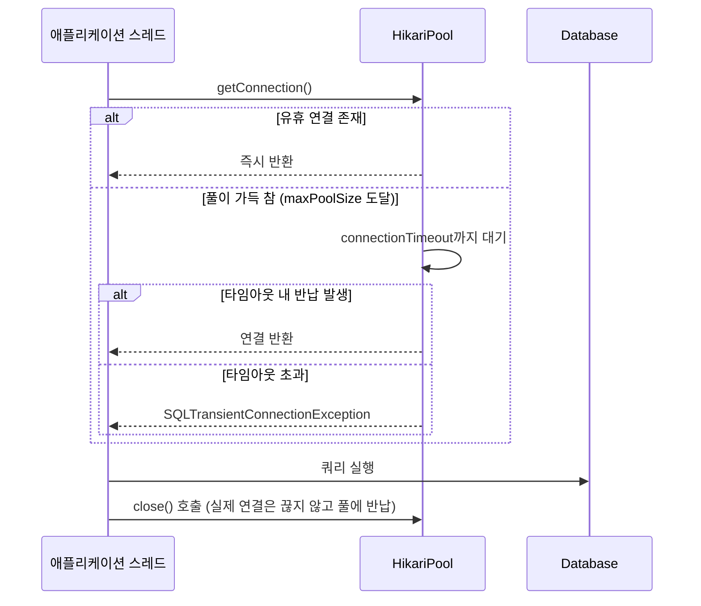

# 커넥션 풀과 HikariCP

## 핵심 정의

커넥션 풀(connection pool)은 데이터베이스 연결(connection)을 미리 여러 개 만들어 두고 재사용하는 기법이다. TCP 연결 수립, 인증, 세션 초기화를 매 요청마다 반복하면 지연시간과 DB 서버 부하가 크게 늘어나므로, 애플리케이션은 요청이 올 때마다 풀에서 연결을 빌려 쓰고 반납한다. HikariCP는 Spring Boot의 JDBC/JPA starter 구성에서 우선 선택하는 경량 JDBC 풀 라이브러리로, 바이트코드 수준 최적화와 락(lock) 경합 최소화를 통해 낮은 오버헤드를 목표로 설계되었다.

## 동작 원리 / 구조

### 요청-반납 흐름

정상적인 `Connection.close()`는 실제 TCP 연결을 유지하고 풀에 반납한다. 다만 만료·오류 등으로 폐기 대상이면 물리 연결도 닫힐 수 있다. HikariCP가 프록시로 감싼 커넥션 객체가 `close()` 호출을 가로채 풀에 반납하는 형태로 동작한다. 직접 JDBC 연결을 빌린 코드에서는 `try-with-resources`로 커넥션/스테이트먼트를 닫아야 하며(Spring/JPA가 관리하는 연결은 프레임워크 생명주기를 따른다), 닫지 않으면 풀 고갈(pool exhaustion)로 이어진다.

### 핵심 파라미터

| 파라미터 | 의미 | 기본값 |
|---|---|---|
| `maximumPoolSize` | 풀이 가질 수 있는 최대 연결 수(유휴+사용중 합) | 10 |
| `minimumIdle` | 유지할 최소 유휴 연결 수 (설정 안 하면 `maximumPoolSize`와 동일하게 취급되어 고정 크기 풀로 동작) | `maximumPoolSize`와 동일 |
| `connectionTimeout` | getConnection()에서 연결 획득을 기다리는 최대 시간(ms); SQL 실행 제한과는 다름 | 30000 |
| `idleTimeout` | 유휴 연결을 풀에서 제거하기까지의 시간(ms). `minimumIdle < maximumPoolSize`일 때만 의미가 있음 | 600000 |
| `maxLifetime` | 연결의 최대 수명(ms). 초과 시 사용 중이 아닌 시점에 자동 폐기 후 재생성 | 1800000 |
| `leakDetectionThreshold` | 이 시간 이상 반납되지 않은 연결을 "누수 의심"으로 로깅(ms). 0이면 비활성화 | 0 |

풀 크기 산정의 출발점으로 HikariCP 위키가 제시하는 공식은 `connections = ((core_count * 2) + effective_spindle_count)`다. 이는 PostgreSQL 프로젝트에서 유래한 경험적 공식으로, "무조건 크게" 설정하는 것이 아니라 DB 서버가 동시에 효율적으로 처리할 수 있는 활성 커넥션 수에 맞춘다는 사고방식이 핵심이다. 여러 애플리케이션 인스턴스가 하나의 DB를 공유한다면 관리·배치·다른 서비스 연결과 배포 중 중복 파드를 제외한 연결 예산을 최대 인스턴스 수에 배분한다. 임의의 0.8 비율은 공식 산정 기준이 아니며 부하 테스트로 동시 실행 수를 조정한다.

### 고정 크기 풀을 권장하는 이유

HikariCP는 공식적으로 `minimumIdle`을 별도로 줄이지 않고 `maximumPoolSize`와 같게 두는 고정 크기(fixed-size) 풀을 권장한다. 풀 크기가 가변적이면 트래픽 급증 시 새 연결을 그때그때 생성해야 하는데, 연결 생성 자체가 무겁고 지연이 크기 때문에 스파이크 상황에서 응답 지연이 오히려 커진다. 고정 크기 풀도 기동·연결 교체·장애 복구 중에는 생성과 유효성 검사 비용이 발생한다. 모든 연결이 항상 준비되어 있거나 대기만 발생한다고 보장하지 않는다.

### 연결 재사용과 세션 상태

풀은 TCP 연결뿐 아니라 DB 세션도 재사용한다. HikariCP는 JDBC API로 감지한 격리 수준 등의 변경을 반납 시 복원하지만, SQL로 `SET SESSION ...`을 직접 실행한 변경까지 모두 추적하지 않는다. 격리 수준 변경에는 `Connection.setTransactionIsolation()`을 사용하고, 임의 세션 변수·임시 테이블 등의 생명주기는 별도로 관리한다. 반납이 새 DB 세션을 만드는 것과 같지는 않다.

## 실무 관점

- **최대 수명과 유휴 타임아웃을 구분**: 방화벽, 로드밸런서, DB `wait_timeout`(MySQL) 등이 유휴 연결을 강제로 끊는 경우, HikariCP가 이를 모르고 죽은 연결을 반환하면 애플리케이션에서 `Communications link failure` 같은 오류가 발생한다. `maxLifetime`을 인프라 타임아웃보다 짧게 설정해 최대 연결 수명 제한 전에 교체하도록 한다. 유휴 타임아웃은 유휴 연결에만 ping하는 `keepaliveTime`도 함께 조정한다(확인한 HikariCP README 기본값 120000ms, maxLifetime보다 작아야 함). 사용 중 연결은 maxLifetime이 지나도 즉시 중단하지 않으므로 장기 쿼리의 네트워크 제한을 대신 해결하지 않는다.
- **풀 고갈(pool exhaustion) 장애 패턴**: 트랜잭션 안에서 외부 API 호출처럼 느린 I/O를 수행하면 그 시간 동안 커넥션을 계속 점유하게 된다. 동시 요청이 몰리면 풀의 모든 연결이 느린 작업에 묶여 나머지 요청이 `connectionTimeout` 대기 후 전부 실패하는 연쇄 장애로 이어진다. `@Transactional` 범위를 최소화하고, 트랜잭션 안에서 외부 호출을 하지 않는 것이 원칙이다.
- **leakDetectionThreshold 활용**: 코드에서 커넥션을 닫지 않는 버그(예외 경로에서 close 누락)를 운영 중 조기 발견하려면 개발/스테이징 환경에서 이 값을 켜서 로그로 누수 의심 스택 트레이스를 확보한다. 운영에서는 오버헤드를 감안해 신중히 켠다.
- **모니터링 지표**: HikariCP는 Micrometer를 통해 `hikaricp.connections.active`, `hikaricp.connections.pending`(대기 중인 요청 수), `hikaricp.connections.timeout` 같은 지표를 노출한다. `pending`이 지속되면 연결 공급보다 요구가 크다는 신호다. 작은 풀뿐 아니라 느린 SQL·락 대기·누수·연결 생성 실패를 먼저 구분한다.
- **다중 데이터소스 환경**: 읽기/쓰기 분리나 멀티 테넌트 구조에서 데이터소스별로 풀을 분리해서 만들면, 각 풀의 `maximumPoolSize` 합이 DB의 `max_connections`를 넘지 않도록 전체 설계를 해야 한다.

## 심화 Q&A

### Q. `minimumIdle`을 `maximumPoolSize`보다 작게 설정하면 어떤 트레이드오프가 생기는가?
A. 평소 유휴 연결 수를 줄여 DB 측 리소스(메모리, 연결 슬롯)를 절약할 수 있지만, 트래픽이 급증하는 순간 부족한 연결을 새로 생성해야 하므로 그 시점의 응답 지연이 늘어난다. HikariCP 자체가 고정 크기 풀을 권장하는 이유이며, 유휴 연결 비용보다 스파이크 대응이 더 중요한 서비스라면 굳이 `minimumIdle`을 줄이지 않는다.

### Q. `connectionTimeout`을 짧게 잡으면(예: 3초) 어떤 효과와 부작용이 있는가?
A. 풀이 고갈된 상황에서 요청을 오래 붙잡지 않고 빠르게 실패시켜, 상위 계층(서킷 브레이커, 재시도)이 빨리 반응하게 만들 수 있다. 반대로 일시적인 DB 지연(예: 짧은 GC 정지, 네트워크 지터)에도 정상 요청까지 조기에 실패 처리될 위험이 커지므로, 상위 계층에 재시도/타임아웃 정책이 갖춰져 있는지 함께 점검해야 한다.

### Q. 커넥션 풀 크기를 늘리면 항상 처리량이 좋아지는가?
A. 아니다. HikariCP 위키가 인용하는 사례처럼 과도하게 큰 풀은 DB 서버의 CPU 컨텍스트 스위칭, 락 경합을 늘려 오히려 처리량을 떨어뜨릴 수 있다. DB가 동시에 효율적으로 처리 가능한 활성 트랜잭션 수는 CPU 코어 수 등 물리적 자원에 의해 제한되므로, 풀 크기는 애플리케이션 스레드 수가 아니라 DB의 처리 능력에 맞춰야 한다.

### Q. `@Transactional(readOnly = true)`와 커넥션 풀은 어떤 관계가 있는가?
A. `readOnly = true` 자체가 별도의 풀을 쓰게 만들지는 않지만, 이 힌트를 드라이버/DB가 받아 제품별 읽기 전용 최적화나 라우팅 판단에 활용할 수 있다. [[읽기와 쓰기 분리]] 구조에서는 이 어노테이션을 `AbstractRoutingDataSource`의 라우팅 판단 근거로 삼아 서로 다른 HikariCP 풀(쓰기용/읽기용)로 연결을 분배하는 패턴이 흔하다.

### Q. 컨테이너 환경(Kubernetes)에서 파드(pod)를 수평 확장하면 커넥션 풀 설정을 어떻게 조정해야 하는가?
A. 파드마다 독립적인 HikariCP 풀이 생기므로, 파드 수가 늘어날수록 DB에 도달하는 총 연결 수가 비례해서 증가한다. `(파드당 maximumPoolSize) × (최대 파드 수)`가 DB의 `max_connections`를 넘지 않도록 설계해야 하며, 파드 수가 동적으로 변하는 환경(HPA)에서는 오히려 PgBouncer 같은 외부 커넥션 풀러를 앞단에 두어 DB 쪽 연결 수를 상한선 안에서 통제하는 구성을 함께 검토한다.

### Q. 커넥션 누수(leak)와 풀 고갈은 어떻게 구분해서 진단하는가?
A. 풀 고갈은 빌릴 수 있는 연결이 소진된 상태로, 정상 트래픽 폭증·느린 작업·누수 모두 원인이 될 수 있다. 일시적 부하 때문이면 트래픽이 줄 때 `active`도 감소하는 경향이 있지만 누수는 트래픽이 줄어도 `active`(또는 사용 중 연결 수)가 계속 높은 수준에 머무는 패턴으로 나타난다. `leakDetectionThreshold`로 확보한 스택 트레이스나, 애플리케이션 코드에서 예외 발생 시 `close()`가 누락된 경로가 있는지를 함께 확인한다.

### Q. DB가 한가한데 모든 요청이 풀에서 대기하는 경우도 있는가?
A. 각 요청이 연결 하나를 보유한 채 두 번째 연결을 기다리면 가능하다. 예를 들어 같은 풀에서 바깥 트랜잭션을 유지한 채 `REQUIRES_NEW`가 새 연결을 요구하면, 모든 연결이 바깥 작업에 묶여 안쪽 작업이 진행하지 못할 수 있다. HikariCP FAQ의 `T × (C - 1) + 1`은 최대 T개 작업이 각각 최대 C개 연결을 동시에 필요로 하는 단순 자원 모델에서 이 순환 대기를 피하는 최소 수량이며 최적 성능 공식은 아니다. 먼저 중첩 점유를 줄이고 동시 진입 수를 제한한 뒤 DB 연결 예산 안에서 산정한다.

## 관련 개념
- [[읽기와 쓰기 분리]]
- [[리플리케이션]]
- [[트랜잭션 격리 수준]]

## 참고 자료

확인일: 2026-09-08. 아래 적용 범위에서 본문·Q&A·예제를 재검증했다. 예제는 문서와 대조했으며 별도 실행 검증은 하지 않았다.

- [HikariCP README](https://github.com/brettwooldridge/HikariCP) — 2026-09-08 확인본: 파라미터 기본값·close·keepalive·maxLifetime.
- [HikariCP Pool Sizing](https://github.com/brettwooldridge/HikariCP/wiki/About-Pool-Sizing) — 경험식 및 DB 동시성에 따른 풀 산정.
- [Spring Framework 7.0.9 LazyConnectionDataSourceProxy](https://docs.spring.io/spring-framework/docs/current/javadoc-api/org/springframework/jdbc/datasource/LazyConnectionDataSourceProxy.html) — Spring 트랜잭션과 read-only 연결.

부분 재검증: 2026-09-23. HikariCP 공식 FAQ의 JDBC 격리 상태 추적·복원과 다중 연결 점유에 따른 풀 대기 조건을 확인했다. FAQ는 특정 릴리스의 기본값 표가 아니므로 기존 파라미터 전체 검증일은 유지한다.

- [HikariCP FAQ](https://github.com/brettwooldridge/HikariCP/wiki/FAQ) — SQL로 바꾼 격리 수준의 누출, pool-locking 산식·성능 산정과의 구분.
