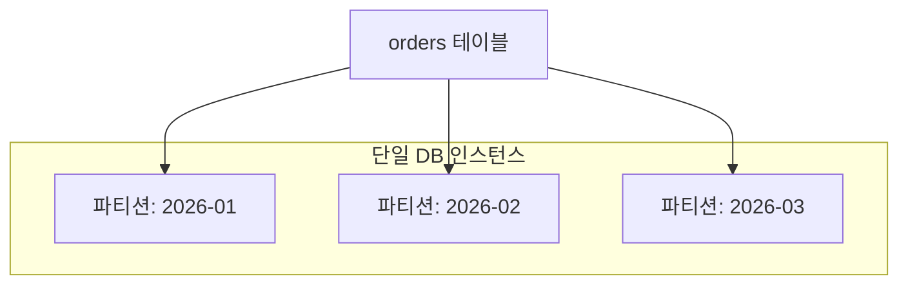

# 파티셔닝과 샤딩의 차이

## 핵심 정의

파티셔닝(partitioning)과 샤딩(sharding)은 둘 다 큰 데이터를 여러 조각으로 나눈다는 점에서 같지만, 나뉜 조각이 어디에 위치하느냐가 근본적으로 다르다. 파티셔닝은 넓게는 데이터 분할을 뜻하며 샤딩도 수평 파티셔닝의 한 형태다. 이 노트에서 비교하는 로컬 테이블 파티셔닝은 하나의 DB 인스턴스 안에서 논리적으로 하나인 테이블을 물리적으로 여러 조각(파티션)으로 나눠 저장하는 것이고, 샤딩은 데이터를 서로 다른 DB 인스턴스(서버)로 분산시키는 것이다. 즉 파티셔닝은 단일 인스턴스 내부의 저장/스캔 최적화 기법이고, 샤딩은 여러 인스턴스에 걸친 수평 확장(scale-out) 아키텍처다. 샤딩 자체의 키 설계, 리샤딩, 크로스 샤드 문제는 [[샤딩 전략]]에서 다루므로, 이 노트는 두 개념의 경계와 파티셔닝 고유의 동작에 집중한다.

## 동작 원리 / 구조

### 비교표

| 항목 | 파티셔닝 | 샤딩 |
|---|---|---|
| 범위 | 하나의 DB 인스턴스 내부 | 여러 DB 인스턴스/서버 |
| 목적 | 단일 노드 내 쿼리/유지보수 성능 개선 | 단일 노드의 물리적 한계(CPU/메모리/디스크/IOPS) 극복 |
| 트랜잭션 | 같은 인스턴스이므로 파티션 간 트랜잭션도 로컬 트랜잭션으로 처리 | 여러 샤드의 원자적 커밋과 [[SAGA 패턴]]의 로컬 커밋·보상 흐름을 구분해 설계 |
| 조인 | 같은 인스턴스 내 조인이라 SQL 엔진이 투명하게 처리 | 샤드 간 조인은 분산 SQL 엔진 또는 애플리케이션의 scatter-gather가 필요 |
| 운영 복잡도 | 상대적으로 낮음(DB 엔진이 대부분 관리) | 라우팅, 리샤딩, 샤드별 백업/모니터링 등 운영 부담 큼 |
| 도입 순서 | 보통 먼저 적용 | 파티셔닝/수직 확장으로도 부족할 때 도입 |

### 파티셔닝 방식 (MySQL/PostgreSQL 공통 개념)

- **범위 파티셔닝(range partitioning)**: 날짜, ID 범위 등으로 나눈다. 로그/이벤트성 테이블에서 오래된 파티션을 통째로 `DROP`해 삭제 비용을 크게 줄이는 용도로 가장 널리 쓰인다.
- **리스트 파티셔닝(list partitioning)**: 특정 값 집합 기준(국가 코드, 상태값 등)으로 나눈다.
- **해시 파티셔닝(hash partitioning)**: MySQL HASH는 정수 표현식, KEY는 엔진 해시를 이용하며 PostgreSQL HASH는 키 해시를 이용한다. 분포는 키 편향과 파티션 수에 좌우된다. 범위 쿼리보다 균등한 쓰기 분산이 중요할 때 쓴다.
- **서브파티셔닝(composite/sub-partitioning)**: 범위+해시처럼 두 방식을 조합한다(예: 날짜로 큰 파티션을 나누고, 그 안을 다시 해시로 세분화).

### 파티션 프루닝(pruning)

옵티마이저가 쿼리의 조건절(파티션 키에 대한 WHERE 조건)을 보고, 조건에 맞지 않는 파티션은 아예 스캔 대상에서 제외하는 최적화다. `WHERE created_at >= '2026-03-01'` 조건이 있으면 2026-01, 2026-02 파티션은 조건과 엔진의 지원 범위에 따라 계획 또는 실행 단계에서 건너뛴다. 파티셔닝 도입의 실질적 성능 이득은 대부분 이 프루닝에서 나온다 — 파티션 키가 조건절에 없는 쿼리는 모든 파티션이 후보가 되어 오히려 파티셔닝 이전보다 오버헤드가 늘 수 있다.

### PostgreSQL 파티션 연결도 잠금 없는 배포는 아니다

PostgreSQL 18에서 `ATTACH PARTITION`은 부모에 SHARE UPDATE EXCLUSIVE를 잡아, 부모에 ACCESS EXCLUSIVE를 요구하는 `CREATE TABLE ... PARTITION OF`보다 동시 작업에 유리하다. 그러나 연결할 테이블에는 ACCESS EXCLUSIVE를 잡고 범위를 검증한다. 독립 테이블에서 적재·검증을 먼저 끝내고 파티션 경계를 증명하는 유효한 CHECK를 준비하면 연결 시 스캔을 생략할 수 있다.

DEFAULT 파티션도 새 범위의 행이 없는지 ACCESS EXCLUSIVE 상태에서 검사할 수 있다. 이를 배제하는 유효한 CHECK가 없고 DEFAULT가 크면 새 파티션 추가가 긴 잠금 작업이 된다. 이미 새 범위의 데이터가 DEFAULT에 있다면 먼저 옮겨야 하며, ATTACH가 이를 자동 이동해 주지는 않는다.

부모 파티션 테이블에는 `CREATE INDEX CONCURRENTLY`를 직접 사용할 수 없다. `CREATE INDEX ... ON ONLY`로 부모 인덱스를 invalid 상태로 만든 뒤, 자식마다 CONCURRENTLY로 인덱스를 생성하고 `ALTER INDEX ... ATTACH PARTITION`으로 연결하는 절차를 사용할 수 있다. 모든 자식 인덱스가 연결되어 부모 인덱스가 valid가 됐는지까지 확인해야 배포가 끝난다.

## 실무 관점

- **병목에 맞춰 선택**: 단일 서버의 디스크/메모리 용량이 아직 여유가 있다면, 프루닝·기간별 삭제의 이득이 있는지 먼저 검토한다. 파티셔닝을 샤딩의 필수 선행 단계로 볼 필요는 없다. 파티셔닝은 인덱스 크기 축소(파티션별로 더 작은 B+Tree), 오래된 데이터 일괄 삭제(파티션 DROP), 병렬 스캔 같은 이점을 준다. 샤딩은 이런 파티셔닝으로도 감당 안 되는 쓰기 처리량이나 저장 용량 한계에 부딪혔을 때 검토한다.
- **파티션 키와 조회 패턴 불일치**: 파티션 키가 조건절에 없는 쿼리(특히 파티션 키 없이 PK로만 조회)는 프루닝 혜택을 못 받고 모든 파티션을 순회해야 해서 파티셔닝 도입 전보다 느려질 수 있다. 파티션 키는 실제 조회 패턴에서 항상 함께 등장하는 컬럼(날짜, 테넌트 ID 등)으로 정해야 한다.
- **파티션 키와 유니크 제약의 제한**: MySQL의 파티셔닝에서 유니크 키(PK 포함)는 파티션 키를 포함해야 한다는 제약이 있다. 이는 스키마 설계에 영향을 주므로, 기존 테이블에 적용할 때 PK 구조 변경이 필요할 수 있다. PostgreSQL 18의 부모 테이블 UNIQUE/PK도 모든 파티션 키 컬럼을 포함해야 하고 파티션 키에 표현식이 있으면 해당 제약을 만들 수 없다. MySQL 8.4 InnoDB의 사용자 파티셔닝은 외래키를 지원하지 않지만 PostgreSQL 선언적 파티셔닝과 동일한 제한은 아니다.
- **파티션 유지보수 자동화**: 시간 기반 파티셔닝은 새 기간의 파티션을 미리 만들어두고 오래된 파티션을 정리하는 작업을 배치/스케줄러로 자동화해야 한다. 파티션 생성을 누락하면 새 데이터가 기본 파티션(catch-all)에 몰리거나 삽입 오류가 나는 장애로 이어진다.
- **샤딩과의 혼동 주의**: "샤딩 키"라는 표현을 파티션 키에도 관용적으로 섞어 쓰는 경우가 많은데, 설계 문서/논의에서 두 개념을 명확히 구분해서 표현해야 나중에 "파티셔닝으로 될 일을 샤딩으로 오버엔지니어링"하거나 반대로 "샤딩이 필요한데 파티셔닝만으로 해결하려는" 설계 실수를 줄일 수 있다.
- **PostgreSQL 선언적 파티셔닝(declarative partitioning)**: 테이블을 부모/자식 관계로 선언하고 각 자식 테이블이 실제 파티션이 되는 구조로, 파티션마다 별도 인덱스·제약을 가질 수 있다. 파티션 키가 없는 조회에서는 여전히 전체 파티션을 스캔해야 하므로 인덱스 설계는 [[인덱스 설계 전략]] 원칙을 파티션 단위로도 동일하게 적용해야 한다.

## 심화 Q&A

### Q. 파티셔닝만으로 쓰기 처리량 문제(단일 서버의 IOPS 한계)를 해결할 수 있는가?
A. 아니다. 파티셔닝은 같은 물리 서버, 같은 디스크/CPU 자원을 여러 파티션이 나눠 쓰는 구조이기 때문에, 서버 전체가 처리할 수 있는 총 IOPS나 CPU 한계 자체를 늘려주지 않는다. 파티셔닝의 이득은 스캔 범위 축소와 유지보수 편의성에 있지, 물리적 자원 총량 확장에 있지 않다. 물리적 자원 한계를 넘어서려면 수직 확장(더 큰 서버)이나 샤딩(여러 서버로 분산)이 필요하다.

### Q. 파티셔닝된 테이블에 인덱스를 걸면 전체 테이블에 하나의 인덱스가 생기는가, 파티션마다 생기는가?
A. MySQL과 PostgreSQL 모두 기본적으로 파티션마다 로컬 인덱스(local index)가 별도로 생성된다. 즉 전체를 아우르는 단일 인덱스가 아니라 파티션 개수만큼의 독립된 B+Tree가 만들어진다. 이 때문에 파티션 키가 없는 쿼리는 각 파티션의 로컬 인덱스를 개별적으로 훑어야 해서(파티션 수만큼 인덱스 탐색이 반복) 파티셔닝 이전 단일 인덱스보다 느려질 수 있다.

### Q. 파티셔닝된 단일 DB에서 샤딩으로 전환할 때 파티셔닝 설계가 도움이 되는가?
A. 그렇다. 파티션 키가 이미 조회 패턴에 맞게 잘 설계되어 있다면, 그 키를 그대로 [[샤딩 전략]]에서 말하는 샤딩 키의 후보로 재사용할 수 있다. 예를 들어 테넌트 ID로 파티셔닝되어 있던 테이블이라면, 각 파티션(또는 파티션 그룹)을 그대로 별도의 물리 서버(샤드)로 승격시키는 전환이 상대적으로 수월하다. 반대로 파티션 키가 조회 패턴에 맞지 않게 설계되어 있었다면 샤딩 전환 시 키 자체를 재설계해야 하는 큰 작업이 추가된다.

### Q. 파티션 프루닝이 기대와 다르게 동작하지 않는 경우는 언제인가?
A. 조건절에 파티션 키가 있어도 함수나 형변환이 적용되어 있으면(`WHERE YEAR(created_at) = 2026`) 옵티마이저가 프루닝 대상을 판단하지 못해 전체 파티션을 스캔할 수 있다. 또한 바인드 변수(prepared statement 파라미터)로 조건값이 전달되는 경우, 일부 DB 버전/설정에서는 실행 계획 수립 시점에 실제 값을 몰라 프루닝을 적용하지 못하고 실행 시점에야 동적 프루닝을 수행하기도 한다. `EXPLAIN` 결과에서 실제로 스캔 대상 파티션이 좁혀졌는지 확인하는 습관이 필요하다. 자세한 실행 계획 해석은 [[실행 계획 읽는 법]] 참고.

### Q. 파티셔닝된 테이블에서 파티션 키를 변경(다른 값으로 UPDATE)하면 어떤 일이 벌어지는가?
A. 해당 로우가 속해야 할 파티션이 바뀌므로, DB 내부적으로는 기존 파티션에서 DELETE하고 새 파티션에 INSERT하는 것과 행 이동이 필요하다. PostgreSQL은 내부적으로 DELETE/INSERT로 처리한다. 비용과 동시성 영향은 엔진·인덱스·행 크기에 달리므로, 대량의 로우에 대해 파티션 키를 일괄 변경하는 배치 작업은 파티션 재구성 수준의 부하를 유발할 수 있으므로 별도의 마이그레이션 작업으로 취급해야 한다.

### Q. 샤딩 없이 파티셔닝만으로 해결 가능한 문제인지 어떻게 판단하는가?
A. 병목의 성격을 먼저 구분해야 한다. 오래된 데이터의 스캔/삭제 비용, 인덱스 크기 비대화, 특정 기간 데이터 위주 조회처럼 "같은 서버 안에서 데이터 구조를 재배치하면 풀리는 문제"는 파티셔닝으로 해결된다. 반면 단일 서버의 총 쓰기 처리량(IOPS), 메모리, CPU 자체가 한계에 도달했거나, 지리적으로 분산된 리전에 데이터를 배치해야 하는 요구사항은 파티셔닝으로는 원천적으로 해결할 수 없고 샤딩(또는 수직 확장)이 필요하다.

## 관련 개념
- [[샤딩 전략]]
- [[인덱스 설계 전략]]
- [[실행 계획 읽는 법]]

## 참고 자료

부분 재확인: 2026-09-22. AWS Saga orchestration 설명에서 로컬 트랜잭션·보상과 격리 부재를 확인해 비교표의 보장 범위를 구분했다. 파티셔닝 엔진 전체 재검증은 아니므로 기존 `verified`를 유지했다.

- [AWS Saga Orchestration](https://docs.aws.amazon.com/prescriptive-guidance/latest/cloud-design-patterns/saga-orchestration.html) — 원자적 분산 커밋과 다른 로컬 커밋·보상 방식; 제품 기본값 없는 패턴 설명.

확인일: 2026-09-08. 아래 적용 범위에서 본문·Q&A·예제를 재검증했다. 예제는 문서와 대조했으며 별도 실행 검증은 하지 않았다.

- [PostgreSQL 18 Table Partitioning](https://www.postgresql.org/docs/18/ddl-partitioning.html) — 선언적 분할·프루닝·UNIQUE·행 이동.
- [MySQL 8.4 Partitioning Keys](https://dev.mysql.com/doc/refman/8.4/en/partitioning-limitations-partitioning-keys-unique-keys.html) — 모든 유니크 키의 파티션 키 포함.
- [MySQL 8.4 Partitioning Engines](https://dev.mysql.com/doc/refman/8.4/en/partitioning-limitations-storage-engines.html) — InnoDB 사용자 파티셔닝 외래키 제한.

부분 재검증: 2026-09-23. PostgreSQL 18의 ATTACH·DEFAULT 검증 잠금과 파티션 인덱스의 동시 생성 제약을 확인했다. 실제 동시 DDL 잠금 실험은 수행하지 않았다. 기존 전체 검증일은 유지한다.

- [PostgreSQL 18 Partition Maintenance](https://www.postgresql.org/docs/18/ddl-partitioning.html#DDL-PARTITIONING-DECLARATIVE-MAINTENANCE) — 부모·자식·DEFAULT의 잠금, CHECK로 스캔 생략, 자식 인덱스 연결.
