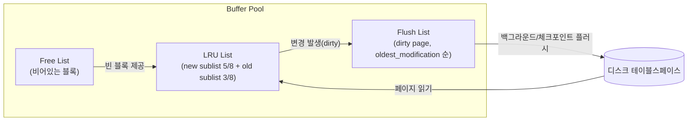

# InnoDB 저장 구조와 버퍼풀

## 핵심 정의
InnoDB는 MySQL의 기본 스토리지 엔진(storage engine)으로, 데이터를 페이지(page, 기본 16 KiB) 단위로 디스크에 저장하고 이를 메모리 상의 버퍼풀(buffer pool)에 캐싱해 처리한다. 버퍼풀은 InnoDB가 디스크 I/O를 최소화하기 위해 유지하는 가장 큰 메모리 영역으로, 테이블/인덱스 데이터 페이지를 캐싱할 뿐 아니라 변경 사항을 모아뒀다가 배치로 디스크에 반영하는 쓰기 버퍼 역할도 겸한다. 인덱스 자체의 자료구조([[인덱스와 B+Tree]])와는 별개로, "그 B+Tree 페이지들을 물리적으로 어떻게 저장하고 메모리에 어떻게 올려두는가"가 이 노트의 주제다.

## 동작 원리 / 구조

### 페이지와 테이블스페이스
InnoDB는 모든 데이터를 테이블스페이스(tablespace) 파일 안에 고정 크기 페이지로 저장한다. 기본 페이지 크기는 16 KiB(`innodb_page_size`)이며, 클러스터드 인덱스(clustered index, 즉 PK 기준 B+Tree)의 리프 노드에 실제 로우 데이터가, 논리프 노드에 키와 페이지 포인터가 저장된다. 세컨더리 인덱스는 리프 노드에 PK 값을 저장해 클러스터드 인덱스를 한 번 더 찾아가는 구조를 가진다.

### 버퍼풀 내부 리스트
버퍼풀은 페이지를 관리하기 위해 세 개의 리스트를 유지한다.

- **Free List**: 아직 아무 데이터도 담기지 않은 빈 블록 목록. 새 페이지를 읽어올 때 여기서 꺼내 쓴다.
- **LRU List**: 단순 LRU가 아니라 미드포인트 삽입(midpoint insertion) 전략을 쓴다. 리스트를 new sublist(약 5/8, 자주 접근되는 hot 페이지)와 old sublist(약 3/8)로 나누고, 새로 읽은 페이지는 항상 old sublist의 head(미드포인트)에 삽입한다. 처음 접근한 뒤 `innodb_old_blocks_time`(MySQL 8.4 기본 1000ms) 이상 지난 시점에 old sublist에서 다시 접근되어야 new sublist로 승격된다. 이 설계 덕분에 전체 테이블 스캔이나 백업 작업이 한 번만 읽는 페이지의 승격을 억제해 hot 데이터 축출을 줄인다. 캐시 오염을 완전히 막는 보장은 아니다.
- **Flush List**: 변경되었지만 아직 디스크에 반영되지 않은 더티 페이지(dirty page) 목록. 각 더티 페이지가 처음 변경된 시점의 LSN(`oldest_modification`)순으로 관리되며, 이 리스트의 가장 오래된 LSN이 체크포인트 위치를 결정하는 기준이 된다([[체크포인트와 장애 복구]] 참고).

Free List가 부족하면 LRU에서 축출 가능한 페이지를 확보하고 필요하면 더티 페이지를 플러시한다. `innodb_lru_scan_depth`는 페이지 할당 요청마다 탐색할 고정 길이가 아니라, 페이지 클리너가 인스턴스별 LRU를 탐색해 플러시할 페이지를 찾는 배경 작업의 깊이를 조절한다.

### 버퍼풀 인스턴스와 청크
대용량 버퍼풀에서 단일 뮤텍스로 인한 경합을 줄이기 위해 `innodb_buffer_pool_instances`로 버퍼풀을 여러 개의 독립적인 인스턴스로 분할할 수 있다(각 인스턴스가 자체 LRU/Free/Flush 리스트를 가짐). 또한 `innodb_buffer_pool_chunk_size` 단위로 청크를 나눠 버퍼풀 크기를 온라인으로 동적 조정(resize)할 수 있다.

## 실무 관점
- `innodb_buffer_pool_size`는 InnoDB 성능에 가장 큰 영향을 주는 단일 설정이다. 전용 DB 서버라면 물리 메모리의 50~75% 수준으로 잡는 것이 일반적인 출발점이며, MySQL 8.0부터는 `innodb_dedicated_server=ON`으로 서버 메모리를 감지해 버퍼풀/redo 로그 용량을 자동 산정할 수도 있다.
- 버퍼풀이 작업셋(working set)보다 작으면 캐시 미스가 늘어 디스크 I/O가 급증하고, 특히 풀스캔성 배치 쿼리가 실행될 때 기존 hot 페이지를 밀어내는 캐시 오염(cache pollution)이 발생할 수 있다. 미드포인트 삽입과 `innodb_old_blocks_time` 조정은 오염을 완화하는 수단이다. 스캔 범위·배치 동시성을 줄이거나 실행 시간대를 분리하고, 자원 격리가 필요하면 별도 DB 인스턴스의 읽기 복제본을 검토한다. 같은 MySQL 인스턴스에서 커넥션만 분리해도 버퍼풀과 I/O 자원은 격리되지 않는다. 여러 버퍼풀 인스턴스도 페이지를 해시로 배정하므로 세션별 전용 캐시가 아니다.
- 재시작하면 버퍼풀 내용이 사라져 재시작 직후 캐시 미스가 몰리는 콜드 스타트(cold start) 문제가 생긴다. `innodb_buffer_pool_dump_at_shutdown`/`innodb_buffer_pool_load_at_startup`(기본 활성)을 켜두면 종료 시 캐시된 페이지 목록을 덤프하고 시작 시 다시 로드해 워밍업 시간을 줄인다.
- 더티 페이지 비율이 너무 높아지면 체크포인트가 급격히 몰리는 "체크포인트 폭주"가 발생해 순간적으로 쓰기 지연이 튈 수 있다. `innodb_max_dirty_pages_pct`, `innodb_io_capacity`/`innodb_io_capacity_max`로 백그라운드 플러시 속도를 조절해 완만하게 유지하는 것이 튜닝 포인트다.
- 운영 중 `SHOW ENGINE INNODB STATUS`의 BUFFER POOL AND MEMORY 섹션이나 `information_schema.INNODB_BUFFER_PAGE_LRU`로 히트율, 더티 페이지 비율을 확인할 수 있다. 다만 후자는 조회 시 내부 자료구조를 잠그므로 대용량 버퍼풀에서는 운영 중 남발하지 않는다.

## 심화 Q&A

### Q. 왜 InnoDB는 단순 LRU 대신 미드포인트 삽입 전략을 쓰는가?
A. 순수 LRU라면 대량의 페이지를 한 번씩만 읽는 전체 테이블 스캔이나 백업 작업이 리스트 head를 모두 차지해, 실제로 반복 접근되는 hot 데이터를 몰아내는 캐시 오염이 발생한다. 리스트를 new/old sublist로 나누고 새로 읽은 페이지를 old sublist에만 넣어 "검증 기간"을 거치게 하면, 한 번만 읽히고 마는 페이지는 승격되지 못한 채 자연스럽게 축출되고, 실제로 반복 접근되는 데이터만 new sublist로 올라가 보호된다.

### Q. 더티 페이지는 언제 디스크에 반영되는가? COMMIT 시점에 바로 쓰이는가?
A. 아니다. `innodb_flush_log_at_trx_commit=1`과 정상적인 저장장치 flush를 전제로 COMMIT이 기다리는 것은 redo 로그 내구성이지, 버퍼풀의 더티 페이지 자체가 아니다. 더티 페이지는 백그라운드 플러시 스레드가 주기적으로, 그리고 체크포인트가 진행될 때 배치로 디스크에 반영한다. 이 지연 쓰기(lazy write) 덕분에 같은 페이지에 대한 여러 변경을 모아 한 번에 쓸 수 있어 I/O 효율이 높아진다. 자세한 흐름은 [[WAL과 트랜잭션 로그]], [[체크포인트와 장애 복구]] 참고.

### Q. 버퍼풀 인스턴스를 여러 개로 나누면 항상 유리한가?
A. 아니다. 버퍼풀 인스턴스 분할은 동시 접근이 많은 버퍼풀에서 내부 락 경합을 줄이는 목적이다. 너무 잘게 나누면 인스턴스별 유효 캐시가 작아지고 관리 비용이 늘 수 있다. MySQL 8.4는 효율을 위해 인스턴스당 최소 1 GiB를 권장하며 전체 버퍼풀이 1 GiB 이하이면 기본 인스턴스 수는 1이다. 큰 버퍼풀도 경합과 메모리 분포를 측정한 뒤 나눈다.

### Q. 페이지 크기(innodb_page_size)를 바꾸면 어떤 트레이드오프가 생기는가?
A. 기본 16 KiB보다 작게(4 KiB, 8 KiB) 잡으면 작은 임의 쓰기에서 불필요한 I/O나 페이지 내 경합을 줄일 수 있다. 32 KiB·64 KiB는 스캔·대량 갱신에 유리할 수 있지만 읽고 쓰는 단위가 커지므로 실제 워크로드로 비교한다. **MySQL 8.4는 32 KiB·64 KiB 페이지에서 `ROW_FORMAT=COMPRESSED`를 지원하지 않는다.** 큰 페이지가 항상 압축에 유리하다는 뜻은 아니다. `innodb_page_size`는 인스턴스 초기화 전에 결정하며 이후 변경할 수 없다.

### Q. 버퍼풀 히트율이 99%인데도 성능이 나쁘다면 무엇을 의심해야 하는가?
A. 히트율만으로는 부족하다. 더티 페이지 비율이 높아 체크포인트가 자주 강하게 발생하고 있는지, `innodb_io_capacity`가 디스크 실제 IOPS 대비 너무 낮게/높게 잡혀 백그라운드 플러시가 병목인지, 또는 특정 핫 페이지(예: auto-increment PK의 마지막 페이지)에 쓰기가 몰려 내부 래치(latch) 경합이 발생하는지를 함께 봐야 한다. 히트율은 "읽기 캐시 효율"만 보여줄 뿐 쓰기 경로의 병목은 드러내지 못한다.

### Q. 세컨더리 인덱스에 대한 쓰기도 버퍼풀을 거치는가, change buffer는 무엇인가?
A. 세컨더리 인덱스 페이지가 버퍼풀에 이미 있다면 바로 반영되지만, 없다면 디스크에서 읽어오는 대신 change buffer라는 별도 구조에 변경 사항을 임시로 모아뒀다가, 해당 페이지가 나중에 읽기 위해 버퍼풀로 로드될 때 병합(merge)한다. 이는 change buffering을 활성화했고 해당 인덱스·연산이 적용 조건을 만족할 때의 동작이다. MySQL 8.4 `innodb_change_buffering` 기본값은 `none`이다. 대상 연산(insert/delete/purge)을 선택하며 unique·descending 인덱스 등 제약도 확인한다.

## 관련 개념
- [[인덱스와 B+Tree]]
- [[WAL과 트랜잭션 로그]]
- [[체크포인트와 장애 복구]]
- [[MVCC]]

## 참고 자료

부분 재확인: 2026-10-04. MySQL 8.4의 버퍼풀 공유·페이지 해시 배정과 scan-resistant 정책을 대조해 별도 커넥션이 캐시를 격리한다는 표현을 바로잡았다. 배치 시간대·복제본 분리는 이 공유 구조를 바탕으로 한 운영 판단이며 격리 효과·성능을 실행 측정하지 않았다. 전체 `verified`는 유지한다.

- [MySQL 8.4 Multiple Buffer Pool Instances](https://dev.mysql.com/doc/refman/8.4/en/innodb-multiple-buffer-pools.html) — 인스턴스별 내부 목록·페이지 해시 배정; 세션별 할당이 아니다.
- [MySQL 8.4 Buffer Pool](https://dev.mysql.com/doc/refman/8.4/en/innodb-buffer-pool.html) — 테이블·인덱스 페이지 캐싱과 스캔에 의한 기존 페이지 축출.

부분 재확인: 2026-09-22. MySQL 8.4 `innodb_page_size`의 고정 시점·압축 제약과 버퍼풀 인스턴스 크기 지침을 확인했다. 기존 전체 확인일은 유지한다.

- [MySQL 8.4 InnoDB Variables](https://dev.mysql.com/doc/refman/8.4/en/innodb-parameters.html#sysvar_innodb_page_size) — 32/64 KiB 페이지의 `ROW_FORMAT=COMPRESSED` 제한; 같은 문서의 `innodb_buffer_pool_instances`.

확인일: 2026-09-08. 아래 적용 범위에서 본문·Q&A·예제를 재검증했다. 예제는 문서와 대조했으며 별도 실행 검증은 하지 않았다.

- [MySQL 8.4 Buffer Pool](https://dev.mysql.com/doc/refman/8.4/en/innodb-buffer-pool.html) — 페이지·LRU·미드포인트.
- [MySQL 8.4 Buffer Pool Flushing](https://dev.mysql.com/doc/refman/8.4/en/innodb-buffer-pool-flushing.html) — LRU scan·dirty 비율·adaptive flush.
- [MySQL 8.4 InnoDB Variables](https://dev.mysql.com/doc/refman/8.4/en/innodb-parameters.html) — 페이지 크기·1000ms·인스턴스·dump/load 기본값.
- [MySQL 8.4 Change Buffer](https://dev.mysql.com/doc/refman/8.4/en/innodb-change-buffer.html) — 기본 none·적용 조건.
- [MySQL 8.4 Dedicated Server](https://dev.mysql.com/doc/refman/8.4/en/innodb-dedicated-server.html) — 자동 버퍼풀·redo 산정.
