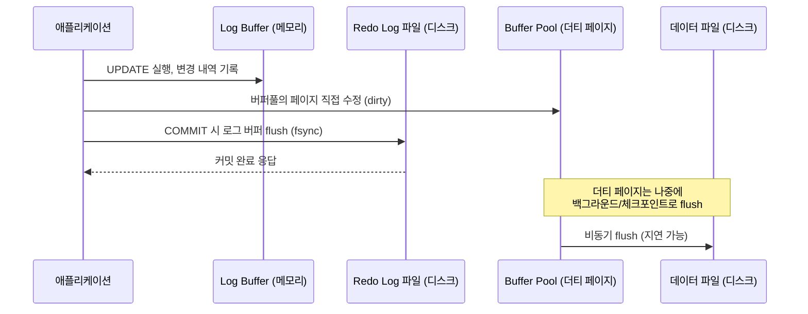

# WAL과 트랜잭션 로그

## 핵심 정의
WAL(Write-Ahead Logging, 선기록 로깅)은 변경된 데이터 페이지를 영구 저장하기 전에 그 변경을 복구하는 데 필요한 로그를 먼저 영구 저장한다는 원칙이다. 데이터 파일 자체를 매 트랜잭션마다 동기화(fsync)하는 대신 로그를 순차 쓰기(sequential write)하고 나중에 데이터 페이지를 반영해 복구 가능성과 처리 효율을 확보한다. InnoDB는 이 로그를 redo 로그라고 부르고, 변경 이전 값을 보관하는 undo 로그와 함께 트랜잭션 로그 체계를 구성한다.

**WAL의 기록 순서와 커밋 응답의 내구성은 구분한다.** 동기 커밋은 커밋 로그의 영구 저장을 기다린 뒤 성공을 응답한다. PostgreSQL 18의 `synchronous_commit=off`처럼 비동기 커밋을 허용하면 WAL 원칙을 지키면서도 로그 flush 전에 성공을 응답할 수 있다. 이 경우 장애 복구의 일관성은 유지되지만 최근 성공 응답한 트랜잭션이 유실될 수 있다.

## 동작 원리 / 구조

### redo 로그: 커밋의 내구성 보장
InnoDB에서 데이터를 변경하면, 실제 데이터 페이지(버퍼풀 상의 더티 페이지)는 바로 디스크에 쓰이지 않고 나중에 배치로 flush된다([[InnoDB 저장 구조와 버퍼풀]] 참고). 대신 "어떤 페이지의 어느 위치를 어떻게 바꿨다"는 물리적 변경 로그가 redo 로그 버퍼(log buffer)에 기록된다. 아래 흐름은 MySQL 8.4의 `innodb_flush_log_at_trx_commit=1`을 전제로 한다. COMMIT은 해당 redo 로그의 flush(fsync)를 기다리며, 저장장치가 동기화 보장을 지키고 로그가 보존되면 장애 후 redo 재생(replay)으로 커밋된 변경을 복구할 수 있다.

- 로그 버퍼에서 디스크로 flush하는 시점과 강도는 `innodb_flush_log_at_trx_commit`으로 제어한다.
  - `1`(기본값, 권장): 각 COMMIT이 자신의 redo 로그가 write·fsync될 때까지 기다린다. 여러 트랜잭션이 그룹 커밋으로 한 번의 동기화를 공유할 수 있다. 정상적인 fsync·저장장치 내구성을 전제로 커밋된 redo를 보존한다. binlog를 쓰면 `sync_binlog=1`도 함께 확인한다.
  - `2`: 매 COMMIT마다 write는 하되 fsync는 매초 한 번만. MySQL 프로세스가 죽어도 OS 페이지 캐시에 남아 있어 데이터는 보존되지만, OS/서버 전체가 죽으면 대략 플러시 주기 동안의 변경이 유실될 수 있다. 1초는 엄밀한 상한이 아니다.
  - `0`: 로그 버퍼를 매초 한 번만 write+fsync. MySQL 프로세스만 죽어도 대략 플러시 주기 동안의 변경이 유실될 수 있다. 1초는 엄밀한 상한이 아니다.
- MySQL 8.0.30부터는 redo 로그 파일 크기/개수를 `innodb_log_file_size` + `innodb_log_files_in_group` 대신 `innodb_redo_log_capacity` 하나로 지정한다(MySQL 8.4는 새 변수를 명시하지 않았을 때 구 두 변수의 곱을 적용할 수 있으며 구 변수는 deprecated). redo 로그는 `#innodb_redo` 디렉터리 아래 여러 개의 고정 크기 파일로 순환(circular) 기록되며, 총 용량을 `innodb_redo_log_capacity`로 관리한다.

### undo 로그: 롤백과 MVCC 스냅샷
undo 로그는 변경 이전 값을 별도의 롤백 세그먼트(rollback segment)에 남긴다. 두 가지 목적으로 쓰인다.
1. **롤백**: 트랜잭션이 ROLLBACK되면 undo 로그를 거슬러 올라가며 원래 값으로 되돌린다.
2. **MVCC 스냅샷 재구성**: 다른 트랜잭션이 더 이전 시점의 값을 읽어야 할 때, 최신 행에서 시작해 undo 체인을 따라가며 필요한 버전을 만들어낸다. 자세한 내용은 [[MVCC]] 참고.

redo와 undo의 관계를 헷갈리기 쉬운데, undo 로그에 대한 변경 자체도 redo 로그의 보호를 받는다. 즉 "undo 로그를 남겼다"는 사실 자체가 먼저 redo 로그에 기록되어야, 장애 후 재시작할 때 undo 로그도 정상적으로 존재함이 보장된다.

### 로그와 LSN
InnoDB의 모든 로그 레코드는 단조 증가하는 LSN(Log Sequence Number)을 갖는다. LSN은 redo 로그의 위치를 가리키는 논리적 시계 역할을 하며, 체크포인트가 "어느 LSN까지의 변경이 데이터 파일에 이미 반영되었는지"를 표시하는 데 사용된다([[체크포인트와 장애 복구]] 참고).

### PostgreSQL의 전체 페이지 이미지와 WAL 크기

PostgreSQL 18의 `full_page_writes=on`(기본값)은 체크포인트 이후 페이지가 처음 변경될 때 전체 페이지 이미지(Full-Page Image, FPI)를 WAL에 기록한다. 장애 중 페이지가 일부만 저장되면 변경 조각만으로 복구할 수 없기 때문이다. InnoDB의 doublewrite와 모두 부분 쓰기 문제를 다루지만 저장 위치와 복구 방식은 다르다.

작은 UPDATE라도 많은 페이지를 한 번씩 건드리면 FPI 때문에 업무 데이터 증가량보다 WAL이 훨씬 커질 수 있다. 체크포인트를 자주 만들면 같은 페이지에서 첫 변경이 반복되어 이 비용이 늘 수 있다. `wal_compression`은 FPI를 압축해 WAL 양을 줄이는 대신 기록·복구 시 CPU를 사용한다. 일반 행 변경 레코드 전체를 압축하는 옵션으로 이해하지 않는다.

성능을 위해 `fsync`나 `full_page_writes`를 끄는 것은 `synchronous_commit=off`로 최근 승인된 커밋의 유실을 허용하는 것과 다르다. 전자는 장애 후 복구 불가능한 페이지 손상까지 만들 수 있다. 내구성 정책을 낮추기 전에 WAL 생성량의 원인·압축 비용·체크포인트 간격·복구 시간을 함께 측정한다.

## 실무 관점
- `innodb_flush_log_at_trx_commit=1`이 기본값이자 금융/주문처럼 데이터 유실이 치명적인 서비스의 표준 설정이다. 대량 배치 적재처럼 유실 허용 범위가 있고 처리량이 중요한 파이프라인에서만 제한적으로 `2`를 고려한다. `0`은 일반적인 서비스 DB에서는 거의 쓰지 않는다.
- redo 로그 용량이 너무 작으면 체크포인트가 자주, 급하게 발생해 쓰기 처리량이 들쭉날쭉해진다. 반대로 너무 크면 장애 복구 시 재생해야 할 로그 양이 많아져 복구 시간(RTO)이 늘어난다. 고정된 1시간 규칙 대신 피크 redo 생성률·실제 checkpoint age·flush 처리량·복구 훈련 결과로 용량을 정한다.
- binlog(바이너리 로그)와 redo 로그를 혼동하지 않아야 한다. redo 로그는 InnoDB 엔진 내부의 물리적 복구용 로그이고, binlog는 서버 레벨에서 복제(replication)와 지정 시점 복구(point-in-time recovery)에 쓰이는 논리적(또는 row 기반) 로그다. 둘 다 커밋 시 안전하게 기록되어야 하므로 InnoDB는 이 둘의 순서를 맞추기 위해 2단계 커밋(two-phase commit, XA 유사 프로토콜)을 내부적으로 수행한다. `sync_binlog=1`과 `innodb_flush_log_at_trx_commit=1`을 함께 설정해야 "binlog에는 있는데 redo에는 없는" 또는 그 반대의 불일치를 막을 수 있다.
- 장시간 열린 트랜잭션이 있으면 undo 로그가 정리되지 못해 undo tablespace가 계속 커지는 문제가 생긴다([[MVCC]]의 실무 관점 참고). `information_schema.INNODB_TRX`로 오래 열린 트랜잭션을 모니터링하는 것이 표준 관행이다.
- redo 로그 파일을 담는 디스크의 쓰기 지연(latency)이 곧 커밋 지연으로 직결된다. WAL의 성능 이점은 "순차 쓰기가 빠르다"는 전제에 기반하므로, 로그 파일을 느린 네트워크 스토리지에 두면 이 이점이 사라진다.

## 심화 Q&A

### Q. 왜 데이터 페이지를 바로 디스크에 쓰지 않고 굳이 로그를 먼저 쓰는가?
A. 두 가지 이유가 있다. 첫째, 데이터 페이지에 대한 변경은 페이지 내 임의 위치에 대한 랜덤 I/O인 반면, 로그는 항상 끝에 추가되는 순차 I/O라 훨씬 빠르다. 둘째, 하나의 트랜잭션이 여러 페이지를 변경해도 로그의 순서·완전성·커밋 기록을 기준으로 재실행과 롤백을 수행할 수 있다. 유효한 데이터 페이지(또는 복구 가능한 사본)와 필요한 로그가 함께 있어야 하며, 로그만으로 임의의 데이터 파일 손상을 모두 복구할 수는 없다.

### Q. redo 로그와 undo 로그 중 하나만 있으면 안 되는가?
A. InnoDB의 설계에서는 둘 다 필요하다. redo는 "커밋된 변경이 손실되지 않게" 보장하는 것이고, undo는 "커밋되지 않은/롤백된 변경이 다른 트랜잭션에 보이지 않게" 하거나 "이전 버전을 재구성"하는 것으로 목적이 다르다. 별도 undo 없이도 PostgreSQL처럼 이전 튜플과 트랜잭션 상태로 롤백 가시성을 처리하는 설계는 가능하므로 이를 모든 DB의 필수 로그 구조로 일반화하지 않는다. undo만 있으면 롤백은 가능해도 서버가 죽었을 때 아직 데이터 파일에 반영되지 않은 커밋 내용을 되살릴 방법이 없다.

### Q. innodb_flush_log_at_trx_commit=2와 1의 차이가 왜 성능에 큰 영향을 주는가?
A. write(OS 페이지 캐시에 쓰기)와 fsync(물리 디스크까지 강제 반영)는 비용이 크게 다르다. `write`는 메모리 연산에 가까워 빠르지만, `fsync`는 디스크 컨트롤러까지 내려가는 동기 I/O라 훨씬 느리다. `=1`은 커밋 응답 전에 해당 redo의 fsync 완료를 기다리며 그룹 커밋으로 여러 트랜잭션이 한 fsync를 공유할 수 있다. `=2`는 redo를 커밋마다 write하되 fsync는 주기적으로 수행해 redo 동기화 대기를 줄인다. 커밋의 모든 대기를 없애는 설정은 아니다. binlog를 사용하고 `sync_binlog=1`이면 binlog 디스크 동기화도 커밋 경로에 남으므로 커밋이 즉시 반환된다고 단정할 수 없다. 대신 그 대가로 OS는 살아있지만 프로세스만 죽는 상황은 안전해도, OS/하드웨어 장애 시 미플러시 커밋이 사라질 수 있다. 기본 주기는 1초지만 스케줄링과 `innodb_flush_log_at_timeout` 설정에 따라 더 길어질 수 있다.

### Q. WAL을 쓰는데도 왜 "더블 라이트 버퍼(doublewrite buffer)"라는 게 따로 필요한가?
A. redo 로그는 페이지의 "변경 내용"만 기록하지, 페이지 전체의 새 이미지를 담지 않는다. 그런데 페이지 크기(16KB)는 OS/디스크의 물리적 쓰기 단위(예: 4KB 섹터)보다 커서, 데이터 페이지를 디스크에 flush하는 도중 장애가 나면 페이지의 일부만 쓰인 부분 쓰기(torn page)가 생길 수 있다. redo 로그를 재생하려면 최소한 "온전한 이전 페이지"가 필요한데 torn page는 그 전제를 깨뜨린다. 그래서 InnoDB는 실제 위치에 쓰기 전에 doublewrite buffer 영역에 페이지 전체를 먼저 순차적으로 써서 온전성을 확보한 뒤, 실제 위치에 쓴다. 장애 복구 시 doublewrite buffer로 손상된 페이지를 먼저 복구한 다음 redo 로그를 재생한다.

### Q. redo 로그 용량을 늘리면 무조건 좋은가?
A. 아니다. redo 로그가 크면 체크포인트를 미룰 수 있는 여유가 커져 쓰기 처리량과 지연 시간의 변동폭(jitter)이 줄어드는 장점이 있다. 하지만 장애 복구 시에는 마지막 체크포인트 이후 기록된 redo 로그를 전부 재생해야 하므로, 로그가 클수록(또는 체크포인트가 뒤처져 있을수록) 복구에 걸리는 시간이 늘어난다. 처리량(가용 자원 활용)과 복구 시간(RTO) 사이의 트레이드오프이며, SLA에 명시된 복구 목표 시간을 고려해 용량을 정해야 한다.

### Q. PostgreSQL의 WAL과 InnoDB의 redo 로그는 같은 개념인가?
A. 목적(장애 복구를 위한 선기록)은 같지만 세부 구현이 다르다. PostgreSQL의 일반 heap MVCC는 InnoDB 형태의 별도 undo 로그를 사용하지 않는다. 대신 앞서 [[MVCC]]에서 설명했듯 이전 버전 튜플을 heap에 그대로 남겨두고 VACUUM으로 정리하는 방식을 쓴다. InnoDB는 redo(재실행용)와 undo(되돌리기/스냅샷용)를 분리된 로그로 관리한다. 둘 다 "로그를 먼저, 데이터는 나중에"라는 WAL 원칙은 동일하게 따른다.

## 관련 개념
- [[InnoDB 저장 구조와 버퍼풀]]
- [[체크포인트와 장애 복구]]
- [[MVCC]]
- [[ACID]]

## 참고 자료

부분 재확인: 2026-10-04. MySQL 8.4의 redo write/flush 정책과 `sync_binlog=1`의 커밋 전 동기화를 대조해 `innodb_flush_log_at_trx_commit=2`를 즉시 커밋으로 설명한 문장을 바로잡았다. MySQL 서버 실행·지연 비교는 하지 않았다. 전체 `verified`는 유지한다.

- [MySQL 8.4 InnoDB Flush Policy](https://dev.mysql.com/doc/refman/8.4/en/innodb-parameters.html#sysvar_innodb_flush_log_at_trx_commit) — 1·2의 write/flush 차이와 주기 보장 범위.
- [MySQL 8.4 sync_binlog](https://dev.mysql.com/doc/refman/8.4/en/replication-options-binary-log.html#sysvar_sync_binlog) — 1일 때 커밋 전 binlog 디스크 동기화.

부분 재확인: 2026-09-22. WAL 선기록 규칙과 커밋 응답 시점의 차이, MySQL 8.4 커밋 로그 flush 조건을 확인했다. 그 밖의 내용은 아래 기존 확인 범위를 유지한다.

- [PostgreSQL 18 Asynchronous Commit](https://www.postgresql.org/docs/18/wal-async-commit.html) — 비동기 커밋의 유실 창과 crash recovery 일관성.

확인일: 2026-09-08. 아래 적용 범위에서 본문·Q&A·예제를 재검증했다. 예제는 문서와 대조했으며 별도 실행 검증은 하지 않았다.

- [MySQL 8.4 Redo Log](https://dev.mysql.com/doc/refman/8.4/en/innodb-redo-log.html) — 8.0.30+ 용량·구 파라미터·순환 파일.
- [MySQL 8.4 InnoDB Variables](https://dev.mysql.com/doc/refman/8.4/en/innodb-parameters.html) — 0/1/2·플러시 주기 비보장·내구성 조건.
- [MySQL 8.4 Undo Logs](https://dev.mysql.com/doc/refman/8.4/en/innodb-undo-logs.html) — 롤백·MVCC·redo 보호.
- [MySQL 8.4 Doublewrite](https://dev.mysql.com/doc/refman/8.4/en/innodb-doublewrite-buffer.html) — torn page와 완전한 페이지 복구.
- [PostgreSQL 18 WAL](https://www.postgresql.org/docs/18/wal-intro.html) — WAL 원칙과 커밋 flush.

부분 재검증: 2026-09-23. PostgreSQL 18의 full_page_writes·wal_compression·fsync와 비동기 커밋의 장애 보장 차이를 공식 문서로 확인했다. 실제 crash recovery는 실행하지 않았으며 기존 InnoDB 서술의 전체 검증일은 유지한다.

- [PostgreSQL 18 WAL Configuration](https://www.postgresql.org/docs/18/runtime-config-wal.html) — 체크포인트 이후 FPI·압축 대상·fsync 해제의 손상 위험.
