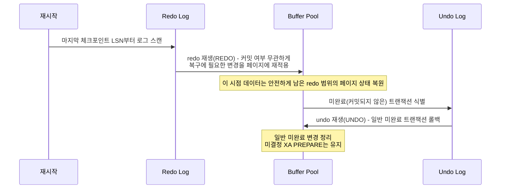

# 체크포인트와 장애 복구

## 핵심 정의
체크포인트(checkpoint)는 "이 시점까지의 변경 사항은 데이터 파일에 이미 반영되었다"는 기준점을 만드는 작업이다. redo 로그는 계속 쌓이기만 하면 무한정 커지고, 장애 시 처음부터 전부 재생해야 해 복구 시간이 감당할 수 없이 길어진다. 체크포인트는 주기적으로 더티 페이지를 디스크에 flush하고 그 지점을 기록해, 이후 재생해야 할 로그 범위를 제한하는 역할을 한다. 이 노트의 장애 복구(crash recovery) 설명은 MySQL 8.4 InnoDB 기준이다. 복구는 체크포인트 지점부터 redo 로그를 재생하고, 커밋되지 않은 트랜잭션을 undo 로그로 되돌려 데이터베이스를 일관된 상태로 되돌리는 과정이다.

## 동작 원리 / 구조

### 체크포인트가 필요한 이유
버퍼풀의 더티 페이지는 즉시 디스크에 반영되지 않고 지연 flush된다([[InnoDB 저장 구조와 버퍼풀]]). 이 상태로 redo 로그만 계속 쌓이면 두 가지 문제가 생긴다.
1. redo 로그 파일 공간이 유한하므로 언젠가 순환(circular) 구조상 오래된 로그를 덮어써야 하는데, 그 로그가 보호하는 더티 페이지가 아직 디스크에 반영되지 않았다면 덮어쓸 수 없다(redo 로그 공간 부족, "Out of space in the redo log" 문제).
2. 장애가 나면 마지막 체크포인트 이후의 모든 로그를 재생해야 하므로, 체크포인트가 오래될수록 복구 시간이 길어진다.

### Fuzzy 체크포인트
InnoDB는 한 번에 모든 더티 페이지를 flush하는 완전 체크포인트(sharp checkpoint) 대신, 오래된 더티 페이지부터 점진적으로 조금씩 flush하는 퍼지 체크포인트(fuzzy checkpoint)를 사용한다. 이렇게 하면 체크포인트의 I/O를 분산하면서 지속적으로 배경에서 flush가 진행된다.

- Flush List는 더티 페이지를 `oldest_modification`(그 페이지가 처음 변경된 시점의 LSN) 순으로 정렬해 관리한다.
- 체크포인트 LSN은 Flush List에서 가장 오래된 미반영 변경 LSN 등을 바탕으로 안전하게 진행 가능한 위치를 계산한다. 버퍼풀 인스턴스·진행 중 I/O·redo 소비자의 제약이 있어 단순히 리스트 첫 값과 항상 같다고 보장하지 않는다. 그 이전 시점의 redo 로그는 이미 모든 관련 페이지가 디스크에 반영되어 있다는 뜻이므로 재사용(순환 덮어쓰기) 가능하다.
- 백그라운드 페이지 클리너(page cleaner)는 `innodb_io_capacity`/`innodb_io_capacity_max` 등을 참고해 더티 페이지 flush를 조절한다. 일정한 속도나 모든 I/O의 절대 상한을 뜻하지 않는다. MySQL 8.4에서 `innodb_flush_sync=ON`이면 체크포인트 압박 때 이 설정을 넘어 flush할 수 있다.
- 더티 페이지 비율이 `innodb_max_dirty_pages_pct_lwm` 등에 도달하거나 redo checkpoint age가 커지면, 평소보다 공격적으로(또는 강제로) flush 속도를 높여 로그 공간 고갈을 막는다.

### 장애 복구 절차
서버가 비정상 종료된 후 재시작하면 InnoDB는 다음 순서로 복구를 수행한다.

1. **분석/스캔**: 마지막 체크포인트 LSN 이후의 redo 로그를 읽어, 어떤 페이지가 어떤 변경을 받아야 하는지 파악한다.
2. **Redo 재생**: 커밋 여부와 무관하게 로그에 기록된 모든 변경을 데이터 페이지에 다시 적용한다. 이 단계가 끝나면 데이터베이스는 안전하게 보존된 redo 기록이 반영된 상태가 된다. flush되지 않은 메모리 로그까지 복구하는 것은 아니다.
3. **Undo 적용**: 트랜잭션 상태 정보(어떤 트랜잭션이 커밋되지 않았는지)를 확인해, 커밋되지 않은 변경을 undo 로그로 롤백한다. XA PREPARE 상태는 자동 롤백 대상에서 제외되어 별도 결정을 기다릴 수 있다. InnoDB는 redo 적용 후 접속을 먼저 받고 배경에서 롤백을 진행할 수 있어 신규 트랜잭션에 락 대기가 남을 수 있다.
4. 복구 가능한 로그와 커밋 상태를 기준으로 일관된 상태를 만든다. 성공 응답한 모든 트랜잭션이 살아남는지는 [[WAL과 트랜잭션 로그]]의 flush 설정과 저장장치 보장에 달려 있다. 비동기 flush에서 최근 커밋이 유실되는 것과 트랜잭션의 일부만 반영되는 원자성(Atomicity) 위반은 다른 문제다.

이 "먼저 전부 재생한 뒤, 커밋 안 된 것만 되돌린다"는 방식을 ARIES 알고리즘 계열이라고 부르며, 로그 기반 복구를 이해하는 비교 모델로 쓸 수 있다. InnoDB를 ARIES 논문의 분석·redo·undo 구현과 동일시하거나 PostgreSQL에도 undo 로그 재생을 그대로 적용하면 안 된다.

## 실무 관점
- 체크포인트가 뒤처지는 대표적 원인은 (1) 쓰기 워크로드가 급증했는데 `innodb_io_capacity`가 디스크 실제 성능보다 낮게 설정되어 있거나, (2) 디스크 자체 성능이 부족한 경우다. 이 경우 redo 로그 사용률이 임계치를 넘어 InnoDB가 강제로 flush를 밀어붙이면서 쓰기 지연이 급격히 튀는 현상(체크포인트 폭주, checkpoint age spike)이 나타난다.
- 복구 시간(RTO)은 마지막 체크포인트 이후 redo 양뿐 아니라 대상 페이지의 I/O, CPU, 미완료 트랜잭션의 롤백량에도 영향을 받는다. 로그 용량만으로 시간을 선형 예측하지 말고 복구 훈련으로 측정한다. redo 로그 용량을 늘리면 평시 처리량은 안정되지만 장애 시 처리할 로그가 더 쌓일 수 있다([[WAL과 트랜잭션 로그]] 참고).
- 배포 시에는 강제 종료(kill -9)를 피하고 정상 종료(graceful shutdown)를 위한 시간을 확보한다. MySQL 8.4의 `innodb_fast_shutdown=1`(기본)은 종료 시 전체 purge·change buffer merge를 생략하며, `0`은 이 작업까지 한다. `2`는 로그를 flush한 뒤 종료하고 다음 시작에서 crash recovery를 수행하므로, 정상 종료 요청을 보냈다는 사실만으로 다음 복구 작업이 없다고 판단하면 안 된다.
- 복제(replication) 환경에서는 장애 복구와 별개로, 복제 지연(replication lag)이나 세미싱크(semi-sync) 설정이 실제 데이터 유실 범위에 영향을 준다. 단일 노드의 크래시 리커버리가 완벽해도, 그 노드가 프라이머리였고 커밋 직후 승격 전 복제가 따라오지 못했다면 다른 층위의 데이터 유실이 발생할 수 있다. 자세한 내용은 [[리플리케이션]] 참고.
- 모니터링 관점에서 `SHOW ENGINE INNODB STATUS`의 LOG 섹션에서 checkpoint age(현재 LSN과 체크포인트 LSN의 차이)를 주기적으로 확인하면 체크포인트가 정상적으로 진행되고 있는지 파악할 수 있다.

## 심화 Q&A

### Q. innodb_force_recovery로 기동에 성공하면 서비스에 다시 투입해도 되는가?
A. MySQL 8.4의 `innodb_force_recovery`는 손상 때문에 정상 기동이 어려울 때 데이터를 추출하기 위한 비상 수단이다. 정상 복구의 단축 옵션이 아니다. 0보다 크면 InnoDB의 INSERT·UPDATE·DELETE를 막으며, 높은 값은 undo·redo 등 복구 단계를 생략한다. 예를 들어 5는 미완료 트랜잭션도 커밋된 것으로 취급하고 6은 redo 재생을 생략하므로, SELECT가 된다고 정상적인 커밋 상태가 보장되지 않는다.

공식 절차는 원본의 백업 사본을 확보하고 가장 낮은 값부터 필요한 경우에만 올리는 것이다. 특히 4 이상은 파일을 영구 손상시킬 수 있어 별도 물리 사본에서 먼저 검증해야 한다. 추출한 데이터도 업무 불변식·누락 범위를 대사하고 정상 인스턴스 재구축 또는 검증된 백업 복구로 이어가야 한다. 강제 복구 상태의 기동 성공, 데이터 추출 성공, 서비스 복구 완료를 구분한다([[백업과 복구 전략]]).

### Q. 왜 InnoDB는 한 번에 모든 더티 페이지를 flush하는 완전 체크포인트를 쓰지 않는가?
A. 완전 체크포인트는 그 순간 모든 더티 페이지를 디스크에 써야 하므로 대규모 I/O 스파이크를 유발해 그 시점의 모든 쿼리 지연이 급격히 튄다. 퍼지 체크포인트는 오래된 더티 페이지부터 조금씩 지속적으로 flush해 I/O를 시간에 걸쳐 분산시킨다. 처리량 관점에서는 총 I/O 양이 비슷하더라도, 사용자 체감 지연의 변동폭(tail latency)을 크게 줄여준다는 점이 실무적으로 중요하다.

### Q. Redo 재생 단계에서 왜 커밋 여부를 따지지 않고 일단 전부 재생하는가?
A. Redo 로그 자체가 "커밋된 트랜잭션의 변경"과 "아직 커밋되지 않은 트랜잭션의 변경"을 구분하지 않고 발생 순서대로 기록되어 있기 때문이다. 만약 재생 단계에서 커밋 여부를 판단하며 선별적으로 재생하려 하면 로직이 훨씬 복잡해지고 페이지 간 의존 관계(예: 한 트랜잭션이 여러 페이지를 수정)를 다루기 어려워진다. ARIES 방식은 "보존된 로그를 페이지 상태에 재적용한 뒤(Redo), 미커밋 변경을 되돌린다(Undo)"는 2단계로 문제를 단순화한다.

### Q. 체크포인트 LSN 이전의 redo 로그를 지워도 되는 이유는 무엇인가?
A. 체크포인트 LSN은 그 이전 로그에 해당하는 페이지 변경이 안전하게 저장되었음을 나타내므로, 그보다 이전에 기록된 로그가 보호하던 모든 페이지는 이미 디스크에 반영되어 있음이 보장된다. 즉 그 구간의 로그는 재생할 필요가 전혀 없는 상태이므로 엔진이 다른 소비자의 보존 요건까지 확인해 재사용할 수 있다. 운영자가 redo 파일을 직접 삭제해서는 안 된다. 반대로 이 판단이 틀리면(아직 반영 안 된 페이지의 로그를 지우면) 해당 페이지의 변경 내역이 영구히 사라지는 심각한 데이터 손상으로 이어진다.

### Q. 장애 복구 도중 서버가 다시 죽으면 어떻게 되는가?
A. 저장장치·데이터 파일이 유효하고 필요한 로그가 남아 있다면 다시 복구할 수 있다. Redo 재생은 멱등(idempotent)하게 설계되어 있어, 이미 반영된 변경을 다시 적용해도(페이지의 LSN을 확인해 이미 그 이상 버전이면 skip) 결과가 달라지지 않는다. 이 멱등성이 ARIES 계열 복구 알고리즘이 "복구 도중 재복구"까지 안전하게 처리할 수 있는 핵심 성질이다.

### Q. 체크포인트와 백업(특히 물리 백업)은 어떤 관계가 있는가?
A. Percona XtraBackup 같은 물리 백업 도구는 데이터 파일을 복사하는 동안에도 계속 변경이 발생하므로, 파일 복사 자체는 "특정 시점에 일관되지 않은" 상태다. 그래서 백업 도구는 파일 복사와 함께 그 구간의 redo 로그도 함께 복사해두고, 백업 완료 후 "가짜 크래시 복구(prepare 단계)"를 수행해 redo 로그를 재생함으로써 파일들을 하나의 일관된 시점으로 맞춘다. 즉 물리 백업의 정합성도 결국 크래시 복구와 동일한 메커니즘에 의존한다.

### Q. 체크포인트 주기를 늘려 I/O 부하를 줄이는 것이 항상 좋은 선택인가?
A. 아니다. 체크포인트를 늦추면(더티 페이지를 더 오래 메모리에 쌓아두면) 같은 페이지에 대한 반복 변경을 한 번의 flush로 합칠 수 있어 평상시 I/O는 줄어들 수 있다. 하지만 이미 생성된 redo를 회수하지 못해 로그 공간 압박이 커지고, 무엇보다 장애 시 재생해야 할 로그 양과 복구 시간이 늘어난다. 처리량과 RTO 사이의 트레이드오프이므로, 서비스의 장애 허용 시간(SLA)을 기준으로 redo 로그 용량과 flush 속도(`innodb_io_capacity`)를 함께 결정해야 한다.

## 관련 개념
- [[WAL과 트랜잭션 로그]]
- [[InnoDB 저장 구조와 버퍼풀]]
- [[ACID]]
- [[리플리케이션]]

## 참고 자료

부분 재확인: 2026-09-22. MySQL 8.4의 복구 가능한 로그 범위, flush 속도 제약, 종료 모드와 복구 시간 해석을 확인했다. 기존 전체 확인일은 유지한다.

- [MySQL 8.4 InnoDB Variables](https://dev.mysql.com/doc/refman/8.4/en/innodb-parameters.html) — `innodb_fast_shutdown`, `innodb_flush_log_at_trx_commit`, `innodb_flush_sync`.

확인일: 2026-09-08. 아래 적용 범위에서 본문·Q&A·예제를 재검증했다. 예제는 문서와 대조했으며 별도 실행 검증은 하지 않았다.

- [MySQL 8.4 Checkpoints](https://dev.mysql.com/doc/refman/8.4/en/innodb-checkpoints.html) — fuzzy checkpoint·redo 재사용.
- [MySQL 8.4 Recovery](https://dev.mysql.com/doc/refman/8.4/en/innodb-recovery.html) — redo·배경 rollback·XA PREPARE·재접속.
- [MySQL 8.4 Buffer Flushing](https://dev.mysql.com/doc/refman/8.4/en/innodb-buffer-pool-flushing.html) — dirty 비율과 redo age 구분.
- [MySQL 8.4 log0chkp.cc](https://github.com/mysql/mysql-server/blob/8.4/storage/innobase/log/log0chkp.cc) — 안전한 checkpoint LSN 계산.
- [Percona XtraBackup 8.4 Prepare](https://docs.percona.com/percona-xtrabackup/8.4/prepare-full-backup.html) — 물리 백업 prepare 단계.

부분 재검증: 2026-10-04. MySQL 8.4 innodb_force_recovery의 사용 목적·DML 차단·4 이상 손상 위험·5/6의 복구 생략 범위를 확인했다. 데이터 대사와 정상 인스턴스 전환은 이 제한에서 도출한 복구 판단이다. 손상 DB나 강제 복구 옵션은 실행하지 않았고 기존 `verified`는 유지한다.

- [MySQL 8.4 Forcing InnoDB Recovery](https://dev.mysql.com/doc/refman/8.4/en/forcing-innodb-recovery.html) — 데이터 추출 목적, 백업 사본, 단계별 제한과 손상 위험.
