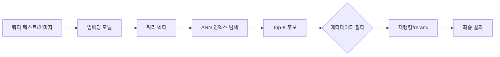

# 벡터 데이터베이스 기초

## 핵심 정의

벡터 데이터베이스(Vector Database)는 임베딩(embedding) 모델이 생성한 고차원 벡터를 저장하고, 쿼리 벡터와 유사도(similarity)가 가장 높은 벡터들을 정확 검색 또는 근사 최근접 이웃(Approximate Nearest Neighbor, ANN) 인덱스로 찾아주는 데이터베이스다. 텍스트, 이미지, 오디오 등 비정형 데이터를 임베딩 모델로 변환하면 의미적으로 유사한 항목이 벡터 공간에서 가까운 거리에 위치하게 되는데, 이 성질을 이용해 시맨틱 검색, 추천, RAG(Retrieval-Augmented Generation)의 검색 단계를 구현한다.

크게 두 갈래로 나뉜다. Milvus, Qdrant, Weaviate, Pinecone처럼 벡터 검색 자체를 위해 설계된 전용 벡터DB와, PostgreSQL의 pgvector, MongoDB Atlas Vector Search, OpenSearch/Elasticsearch의 kNN처럼 기존 데이터베이스에 벡터 검색 기능을 확장으로 얹은 형태다. 후자는 기존 인프라와 트랜잭션/필터링 기능을 재사용할 수 있다는 점이 강점이다.

## 동작 원리 / 구조

**검색 흐름**

**대표 ANN 인덱스 알고리즘**

| 알고리즘 | 구조 | 특징 |
|---|---|---|
| IVF (Inverted File Index) | 벡터를 k-means로 클러스터링 후 셀 단위로 탐색 | 학습(training) 단계 필요, `nprobe`(탐색 셀 수)로 재현율/속도 조절 |
| HNSW (Hierarchical Navigable Small World) | 다층 그래프(graph)에서 상위 층은 성기게, 하위 층은 촘촘하게 연결 | 학습 불필요, 조회 속도와 재현율이 우수하지만 인덱스 빌드 시간과 메모리 사용량이 큼 |
| DiskANN | 탐색 그래프와 원본 벡터를 SSD에, PQ 압축 벡터와 일부 캐시를 메모리에 유지하는 원 논문 구성 | 메모리보다 큰 데이터셋을 탐색하며 그래프 탐색 도중에도 SSD I/O가 발생 |

**정확한 최근접 이웃 대신 근사치를 쓰는 이유**: 고차원 공간에서는 점들 사이 거리 차이가 희미해지는 차원의 저주(curse of dimensionality) 때문에 전수 스캔(brute-force)이 아니고서는 정확한 최근접 이웃을 빠르게 찾기 어렵다. ANN은 100% 재현율(recall)을 포기하는 대신 많은 실용 데이터에서 탐색 비용을 줄인다. 모든 데이터 분포·차원에서 로그 시간이나 일정한 재현율을 보장하는 것은 아니다.

**양자화(Quantization)**: Product Quantization(PQ), Statistical Binary Quantization(SBQ), half-precision(half vector) 등으로 벡터를 압축해 메모리/스토리지를 줄인다. pgvector는 `halfvec` 타입으로 저장 용량을 절반 수준으로 줄이고, 원래 DiskANN은 PQ를 사용한다. SBQ는 일부 파생 구현에서 쓰는 선택지이므로 DiskANN 전체의 기본 압축으로 일반화하지 않는다. 압축률이 높을수록 재현율 손실 가능성이 커지므로 재랭킹 단계로 보완하는 경우가 많다.

**필터링과 하이브리드 검색**: 메타데이터 조건(카테고리, 날짜 등)과 벡터 유사도를 함께 쓸 때는 필터를 먼저 적용한 뒤 그 안에서 벡터 탐색(pre-filter)할지, 벡터 탐색 후 필터를 적용(post-filter)할지에 따라 성능과 결과 품질이 달라진다. 키워드 기반 검색(BM25 등)과 벡터 검색을 함께 쓰는 하이브리드 검색은 Reciprocal Rank Fusion(RRF) 같은 방식으로 두 순위를 합친다.

## 실무 관점

- RAG의 검색 단계, 시맨틱 검색, 추천, 이상/중복 탐지처럼 "의미 기반 유사도"가 필요한 곳에 쓴다. 정확한 일치(exact match)나 범위 조건 조회가 핵심이면 일반 인덱스로 충분하며 벡터DB를 도입할 이유가 없다.
- 기존에 PostgreSQL/MongoDB 등을 운영 중이고 트랜잭션·검색 부하를 함께 감당할 수 있다면 pgvector 같은 확장으로 시작하는 편이 운영 복잡도가 낮다. 차원·필터 선택도·목표 recall·QPS·갱신률 측정에서 확장 한계가 드러나면 전용 벡터DB를 검토한다.
- 흔한 실수: HNSW의 `m`, `ef_construction`, `ef_search` 같은 인덱스 파라미터를 기본값 그대로 두고 운영하다가 재현율이 낮은 것을 알아채지 못하는 경우. 벡터 검색은 정답이 명확히 틀린 결과를 반환하는 게 아니라 "덜 관련된" 결과를 반환하기 때문에 품질 저하가 조용히 진행된다.
- 흔한 실수 2: pgvector ANN 인덱스 탐색 뒤 선택도가 낮은 메타데이터 필터를 적용하면 후보가 대거 탈락해 원하는 개수만큼 결과를 못 받는 오버필터링(overfiltering)이 발생한다. pgvector 0.8부터는 `hnsw.iterative_scan` 옵션으로 결과 수 또는 `hnsw.max_scan_tuples` 등 탐색 상한까지 확장해 완화한다. 결과 수를 무조건 보장하지는 않는다.
- 튜닝 포인트: IVF의 `nlist`(클러스터 수)/`nprobe`(탐색 클러스터 수), HNSW의 `m`(노드당 연결 수)/`ef_construction`(빌드 시 탐색 폭)/`ef_search`(조회 시 탐색 폭), 양자화 적용 여부와 재랭킹 후보 수. 모델을 교체하면 쿼리·문서를 같은 임베딩 공간으로 다시 생성해야 한다. 차원·거리 함수 변화는 스키마/인덱스 변경이 필요할 수 있다. 같은 차원 모델의 교체도 기존 벡터와 혼합하지 않도록 별도 버전 인덱스 또는 점진적 이행을 설계한다.

## 심화 Q&A

### Q. HNSW와 IVF는 각각 언제 유리한가?
HNSW는 학습 단계 없이 데이터가 들어오는 대로 그래프에 삽입할 수 있고 조회 속도와 재현율의 균형이 좋아 대부분의 범용 워크로드에서 기본 선택지로 쓰인다. 다만 그래프의 메모리 사용량이 크고 디스크 기반 구현에서는 캐시 미스 비용도 커지므로 데이터가 매우 크면 비용이 커진다. IVF는 사전에 클러스터링(학습)이 필요하지만 인덱스 자체는 더 가볍고, 클러스터 단위로 디스크/메모리를 나눠 다루기 쉬워 초대규모 데이터셋에서 메모리 효율을 우선할 때 고려된다.

### Q. 차원의 저주가 ANN 검색에 실제로 어떤 영향을 주는가?
차원이 높아질수록 임의의 두 점 사이 거리 분포가 좁아져서 "가장 가까운 점"과 "적당히 가까운 점"의 거리 차이가 희미해진다. 그 결과 전수 스캔 없이 정확한 최근접 이웃을 찾는 것 자체가 이론적으로 어려워지고, 실무에서는 애초에 정확도를 약간 포기하는 ANN 알고리즘과, 임베딩 모델이 만들어내는 벡터의 실질적 유효 차원(intrinsic dimension)을 낮게 유지하는 것(과도하게 큰 임베딩 모델을 무조건 쓰지 않는 것)이 함께 고려된다.

### Q. pgvector 같은 확장형 벡터 검색과 전용 벡터DB의 트레이드오프는?
확장형은 기존 트랜잭션, 조인, 백업/복구, 운영 도구를 그대로 재사용할 수 있어 인프라를 늘리지 않아도 된다는 점이 가장 큰 장점이다. 대신 벡터 검색 전용 최적화(분산 샤딩, 전용 압축 포맷, 대규모 인덱스 리빌드 파이프라인)는 전용 벡터DB보다 상대적으로 제한적이다. 전용 벡터DB는 수억 단위 벡터, 다중 컬렉션 격리, 실시간 업서트가 잦은 워크로드에서 강점을 보이지만 별도 클러스터 운영 부담이 추가된다.

### Q. 하이브리드 검색에서 RRF는 어떤 문제를 해결하는가?
벡터 유사도 점수와 키워드 검색(BM25) 점수는 스케일이 다르고 분포 특성도 달라서 단순히 가중합하면 한쪽 점수 체계가 결과를 지배하기 쉽다. RRF는 각 검색 결과의 절대 점수 대신 순위(rank)만 이용해 `1 / (k + rank)` 형태로 합산하므로 스케일이 다른 두 순위 체계를 점수 정규화 없이 안정적으로 결합할 수 있다. 키워드 매칭이 중요한 고유명사·코드 조회와 의미 기반 매칭이 중요한 자연어 질의를 함께 다뤄야 할 때 흔히 쓰인다.

### Q. 메타데이터 필터링에서 pre-filter와 post-filter의 차이와 오버필터링 문제는?
Post-filter는 먼저 ANN 인덱스에서 Top-K를 뽑은 뒤 메타데이터 조건으로 걸러내는 방식으로 구현이 단순하지만, 필터 조건에 맞는 데이터가 상위 K개 안에 충분히 없으면 요청한 개수보다 적은 결과가 반환되는 오버필터링이 발생한다. Pre-filter는 조건을 만족하는 후보 집합을 먼저 좁힌 뒤 그 안에서 벡터 탐색을 하므로 조건에 맞는 후보를 탐색할 수 있지만 검색 상한·ANN 방식에 따라 K개 반환을 보장하지는 않으며, 후보 집합이 인덱스 구조(그래프, 클러스터)와 맞물리지 않으면 탐색 효율이 떨어질 수 있다. pgvector의 iterative scan처럼 조건을 만족할 때까지 탐색 범위를 점진적으로 넓히는 방식이 최근의 절충안이다.

### Q. 양자화로 인한 재현율 손실은 어떻게 보완하는가?
양자화는 벡터를 저정밀도(half-precision, 이진 등)로 압축해 메모리 탐색 속도를 높이지만, 압축 과정에서 정보 손실이 생겨 실제 최근접 이웃이 후보에서 누락될 가능성이 커진다. 일반적인 완화 전략은 압축 벡터로 넓은 범위의 후보를 빠르게 추려낸 뒤(coarse search), 압축되지 않은 원본 벡터로 그 후보들만 다시 정밀 계산(rerank)해 최종 순위를 매기는 2단계 구조다. DiskANN 계열이 그래프 탐색은 압축 벡터로, 최종 스코어링은 디스크의 원본 벡터로 하는 것이 이 패턴의 대표적인 예다.

## 관련 개념
- [[시계열 데이터베이스]]
- [[NoSQL 데이터 모델 비교]]
- [[MongoDB 기본 구조]]
- [[인덱스와 B+Tree]]

## 참고 자료

확인일: 2026-09-08. 아래 적용 범위에서 본문·Q&A·예제를 재검증했다. 예제는 문서와 대조했으며 별도 실행 검증은 하지 않았다.

- [pgvector 0.8.6 README](https://github.com/pgvector/pgvector) — exact/ANN·halfvec·필터·0.8+ iterative scan 상한.
- [Malkov & Yashunin — HNSW](https://arxiv.org/abs/1603.09320) — 원 논문: 계층 그래프 탐색.
- [Microsoft Research — DiskANN (2019)](https://www.microsoft.com/en-us/research/publication/diskann-fast-accurate-billion-point-nearest-neighbor-search-on-a-single-node/) — 원 논문: SSD 그래프·PQ 벡터·캐시.
- [MongoDB Hybrid Search](https://www.mongodb.com/docs/vector-search/hybrid-search/hybrid-search-overview/) — RRF 등 순위 결합과 검색 범위.
