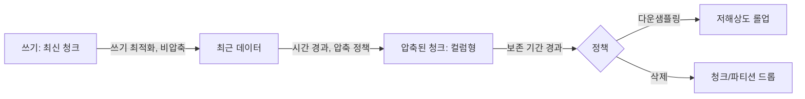

# 시계열 데이터베이스

## 핵심 정의

시계열 데이터베이스(Time-Series Database, TSDB)는 타임스탬프(timestamp)를 기준으로 순서가 있는 데이터 포인트를 저장하고 다루는 데이터베이스다. 메트릭, 센서 값, 로그, 금융 틱 데이터처럼 "시간이 지나면서 계속 추가되고(append-only에 가까운 쓰기 패턴), 최신 데이터를 자주 읽으며, 시간 범위 기준으로 집계하는" 워크로드에 최적화되어 있다. 일반 RDB와 달리 갱신(update)보다 삽입(insert)이 압도적으로 많고, 오래된 데이터는 원본 그대로 유지하기보다 압축하거나 다운샘플링(downsampling)해서 보관하는 것을 전제로 설계된다.

대표 제품으로는 PostgreSQL 확장 형태인 TimescaleDB(TigerData 브랜드), Arrow/Parquet 기반으로 재작성된 InfluxDB 3.x, Prometheus의 내장 TSDB, 컬럼형 저장에 특화된 QuestDB 등이 있다. 접근 방식은 제품마다 다르지만 "시간 축 기준 파티셔닝 + 시간 순서를 활용한 고압축률 + 시간 범위 쿼리 가속"이라는 공통 목표를 공유한다.

## 동작 원리 / 구조

**데이터 모델**: Prometheus 모델에서는 메트릭 이름과 태그/레이블(label) 집합이 시계열을 식별하고, 그 시계열에 타임스탬프와 값으로 된 표본이 누적된다. SQL 기반 TSDB는 일반 테이블 형태도 제공한다. 예를 들어 Prometheus에서는 `http_requests_total{method="GET", status="200"}`처럼 메트릭명과 레이블 조합 전체가 고유한 시계열 하나를 식별한다.

**수집-압축-보존 흐름**

**TimescaleDB의 하이퍼테이블(hypertable)**: 논리적으로는 하나의 테이블처럼 보이지만 내부적으로 시간 구간(chunk_time_interval)마다 별도의 물리 테이블(청크)로 자동 분할된다. 최신 청크는 일반 행 저장(row store)으로 쓰기에 최적화되어 있고, 일정 시간이 지난 청크는 컬럼형(columnar)으로 압축되어 저장 공간을 크게 줄인다. TimescaleDB 2.25.0은 일부 집계·FIRST/LAST를 컬럼 저장 메타데이터로 가속하는 `ColumnarIndexScan` 경로를 추가했다. 적용 여부는 쿼리와 컬럼 메타데이터에 달려 있으며, 특정 벤치마크의 수십~수백 배 수치를 일반 성능 보장으로 사용하지 않는다.

**압축 알고리즘**: 시계열 데이터는 인접한 값끼리 변화가 작고 타임스탬프가 일정 간격에 가까운 경우가 많다는 특성을 활용해 델타 인코딩(delta encoding), Gorilla 압축(페이스북이 제안한 타임스탬프 delta-of-delta·부동소수점 XOR 기반 기법) 등을 적용해 데이터 특성에 맞으면 범용 압축보다 효율적으로 저장할 수 있다.

**InfluxDB 3.x 아키텍처**: FDAP 스택(Apache Flight, DataFusion, Apache Arrow, Parquet)으로 완전히 재작성되었다. 인메모리 컬럼 포맷으로 Arrow, 디스크 저장 포맷으로 Parquet, 쿼리 엔진으로 DataFusion(SQL 지원)을 사용하며, 로컬 디스크 없이 S3/GCS/Azure Blob 같은 오브젝트 스토리지만으로 영속성을 확보하는 디스크리스(diskless) 구성도 지원한다. 자주 조회되는 최신 값은 Last Value Cache(LVC), 고유 값 목록은 Distinct Value Cache(DVC)로 캐싱해 흔한 쿼리를 빠르게 응답하도록 최적화한다. 응답 시간은 캐시 적중·크기·쿼리·하드웨어에 따라 측정한다.

**연속 집계(Continuous Aggregate)**: TimescaleDB에서 일반 materialized view와 달리 백그라운드에서 증분(incremental) 갱신되며, 대시보드가 원본 원시 데이터 대신 미리 계산된 롤업(시간당/일당 평균 등)을 조회하도록 해 쿼리 비용을 크게 줄인다.

## 실무 관점

- 메트릭 모니터링(Prometheus 계열), IoT 센서 수집, 금융 틱 데이터, 애플리케이션 이벤트의 시간 기반 집계처럼 "시간 범위 조회 + 고빈도 삽입"이 핵심인 워크로드에 쓴다.
- 이미 PostgreSQL을 운영 중이고 SQL 호환성, 조인, 트랜잭션을 함께 활용해야 한다면 TimescaleDB로 시작하는 편이 새 인프라를 추가하지 않아 운영 부담이 적다. 순수 고빈도 수집이 압도적이고 오브젝트 스토리지 기반 비용 구조를 원하면 InfluxDB 3 계열을 검토한다. 다만 TimescaleDB는 PostgreSQL 기반이므로 수집 배치·WAL·인덱스·스토리지 조건으로 처리량을 측정해야 하며, 분산 하이퍼테이블 기능은 TimescaleDB 2.14부터 sunset되어 수평 확장은 애플리케이션 레벨에서 고려해야 한다.
- 흔한 실수: 일반 RDB 테이블에 시계열 데이터를 그대로 쌓다가 인덱스가 비대해지고, 오래된 데이터를 `DELETE`로 지우면서 대량의 vacuum/컴팩션 부하가 발생해 장애로 이어지는 패턴. 시계열 DB는 이런 상황을 청크/파티션 단위 드롭(drop)으로 처리해 개별 행 삭제보다 훨씬 저렴하게 만든다.
- 흔한 실수 2: 레이블/태그 조합이 계속 늘어나는 카디널리티 폭발(cardinality explosion). 사용자 ID, 요청 ID처럼 값의 종류가 무한히 늘어나는 필드를 레이블로 쓰면 실제로 등장하는 레이블 조합 수가 늘어 메모리 사용량과 쿼리 지연이 급격히 나빠진다. 이는 Prometheus와 InfluxDB 1.x/2.x의 모델에서 특히 주의할 사항이다. InfluxDB 3는 고카디널리티 지원을 위해 저장 엔진을 바꿨지만 LVC의 키 조합 수는 여전히 메모리 비용에 영향을 준다.
- 튜닝 포인트: 청크 시간 간격(chunk_time_interval), 압축 정책이 적용되는 시점(예: 7일 지난 청크부터 압축), 연속 집계의 갱신 주기, 보존 정책(retention policy)과 다운샘플링 규칙, 레이블 카디널리티 모니터링.

## 심화 Q&A

### Q. 카디널리티 폭발이 시계열DB에서 특히 치명적인 이유는?
Prometheus 등은 메트릭명과 레이블 조합 하나하나를 독립된 시계열로 관리하고, 각 시계열마다 별도의 인덱스 엔트리와 메모리 상 메타데이터를 유지한다. 레이블에 사용자 ID나 요청 ID처럼 사실상 무한한 값이 들어가면 시계열 개수 자체가 폭발적으로 늘어나 가능한 조합 수는 레이블별 값 개수의 곱까지 커질 수 있다. 메모리는 실제 생성된 시계열 수와 표본·인덱스 구조에 따라 증가하며 반드시 지수적으로 증가한다는 뜻은 아니다. 일반 RDB라면 단순히 로우가 늘어나는 문제지만, 시계열DB에서는 "관리해야 할 개별 시계열의 수"가 늘어나는 구조적 문제라 훨씬 빨리 한계에 부딪힌다.

### Q. TimescaleDB의 하이퍼테이블 청크 분할과 일반 RDB의 파티셔닝은 뭐가 다른가?
기본 개념은 동일하게 시간 범위로 데이터를 나누는 것이지만, 하이퍼테이블은 청크 생성·관리를 자동화하고 청크별로 서로 다른 물리적 저장 전략(최신 청크는 행 저장, 오래된 청크는 압축된 컬럼형 저장)을 적용하도록 설계되어 있다. 일반 RDB 파티셔닝은 이런 이종 저장 전략 전환이 기본 제공되지 않아, 압축이나 컬럼형 전환을 하려면 별도 확장이나 애플리케이션 레벨 로직이 필요하다.

### Q. Gorilla/델타 인코딩 압축이 시계열 데이터에서 유독 효과적인 이유는?
gzip 같은 범용 압축은 바이트 반복과 심볼 빈도를 활용하지만 타임스탬프 간격·부동소수점 구조를 직접 해석하지는 않는다. 반면 시계열 데이터는 타임스탬프가 거의 일정한 간격으로 증가하고, 측정값도 인접한 시점끼리 변화폭이 작다는 강한 사전 지식이 있다. 델타 인코딩은 절대값 대신 이전 값과의 차이만 저장하고, Gorilla는 부동소수점 값의 XOR 결과의 반복되는 선행·후행 0비트와 이전 패턴을 이용해 비트 단위로 압축한다. 이런 특화된 가정 덕분에 규칙적인 시계열을 적은 비트로 표현할 수 있다. 불규칙하거나 값 변화가 큰 데이터까지 항상 더 잘 압축되는 것은 아니다.

### Q. InfluxDB 3의 디스크리스(diskless) 아키텍처는 무엇을 얻고 무엇을 잃는가?
로컬 디스크 없이 오브젝트 스토리지만으로 영속성을 확보하면 인스턴스 자체는 상태를 거의 갖지 않게(stateless에 가깝게) 되어 수평 확장과 장애 복구가 단순해지고, 스토리지 비용도 오브젝트 스토리지 단가로 낮아진다. 대신 오브젝트 스토리지는 로컬 디스크보다 지연(latency)이 높기 때문에, Last Value Cache나 Distinct Value Cache 같은 인메모리 캐시 계층으로 흔한 쿼리 경로의 지연을 가려주는 설계가 필수적으로 따라붙는다. 캐시에 없는 냉적 데이터(cold data) 조회는 여전히 오브젝트 스토리지 지연의 영향을 받는다.

### Q. 연속 집계(continuous aggregate)와 일반 materialized view의 차이는?
일반 materialized view는 갱신 시점에 전체(또는 지정 범위)를 다시 계산해야 하는 경우가 많아 데이터가 계속 쌓이는 시계열 워크로드에는 부담이 크다. TimescaleDB의 연속 집계는 하이퍼테이블의 청크 구조를 활용해 변경된 시간 범위의 무효화(invalidation)를 추적하고 갱신 정책의 윈도우 내 버킷을 재계산한다. 과거 데이터의 지연 도착·수정도 갱신 대상이며 윈도우 밖 변경은 수동 갱신이나 정책 조정이 필요하다. 비용은 신규 행 수뿐 아니라 영향을 받은 버킷과 데이터량에 달린다.

### Q. 오래된 시계열 데이터를 삭제할 때 DELETE 대신 청크/파티션 드롭을 쓰는 이유는?
`DELETE` 문은 조건에 맞는 행을 하나씩 찾아 지우고 트랜잭션 로그와 인덱스도 그만큼 갱신해야 하므로, 대량의 오래된 데이터를 지울수록 부하가 커지고 그 뒤에 발생하는 vacuum/컴팩션 작업도 무거워진다. 반면 시간 기준으로 분리된 청크나 파티션 전체를 드롭하는 연산은 메타데이터 수준에서 테이블(또는 청크)을 통째로 제거하는 것에 가까워 행별 삭제·인덱스 갱신을 피한다. 다만 잠금·카탈로그 갱신·파일 제거 비용이 있어 항상 상수 시간인 것은 아니다. 이 때문에 시계열DB의 보존 정책은 대부분 행 단위 삭제가 아니라 청크 드롭을 전제로 설계되어 있다.

## 관련 개념
- [[벡터 데이터베이스 기초]]
- [[파티셔닝과 샤딩의 차이]]
- [[관측 가능성 3요소]]
- [[샤딩 전략]]

## 참고 자료

확인일: 2026-09-08. 아래 적용 범위에서 본문·Q&A·예제를 재검증했다. 예제는 문서와 대조했으며 별도 실행 검증은 하지 않았다.

- [Prometheus Data Model](https://prometheus.io/docs/concepts/data_model/) — 시계열 식별자·표본·레이블.
- [TimescaleDB 2.25.0 Release](https://github.com/timescale/timescaledb/releases/tag/2.25.0) — ColumnarIndexScan 적용 범위.
- [Tiger Data Continuous Aggregate Refresh](https://www.tigerdata.com/blog/continuous-aggregate-refresh-demystified) — 갱신 윈도우·invalidation·지연 도착.
- [InfluxDB 3 Core Internals](https://docs.influxdata.com/influxdb3/core/reference/internals/durability/) — Arrow/Parquet·WAL·오브젝트 스토리지.
- [InfluxDB 3 Core Schema](https://docs.influxdata.com/influxdb3/core/write-data/best-practices/schema-design/) — 고카디널리티 저장 모델과 이전 버전 차이.
- [InfluxDB 3 Core LVC](https://docs.influxdata.com/influxdb3/core/admin/last-value-cache/) — 캐시와 키 카디널리티 비용.
- [Timescale Distributed Hypertables](https://github.com/timescale/docs/blob/latest/api/distributed-hypertables/index.md) — 2.14 sunset 안내.
- [Gorilla: A Fast, Scalable, In-Memory Time Series Database](https://cs.brown.edu/courses/cs227/archives/2017/papers/gorilla.pdf) — VLDB 2015 원저, delta-of-delta·XOR 압축.
