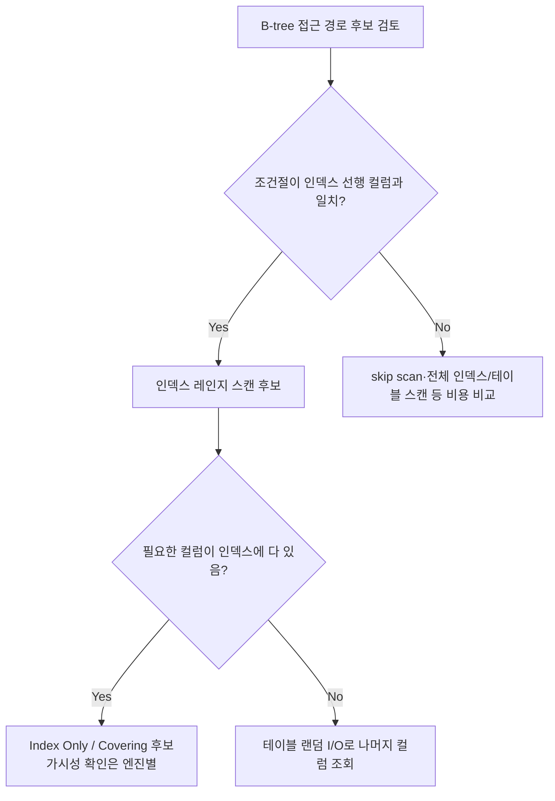

# 인덱스 설계 전략

## 핵심 정의

인덱스(index)는 테이블 데이터를 빠르게 찾기 위해 별도로 관리하는 접근 자료구조다. 여기서는 정렬된 B-tree 계열을 중심으로 설명한다. 대부분의 관계형 DB는 B-Tree(B+Tree) 기반 인덱스를 기본으로 사용하며, 컬럼 값을 키로 정렬해 두고 PostgreSQL은 heap 위치를, InnoDB 보조 인덱스는 클러스터드 키를 저장한다. InnoDB 클러스터드 인덱스의 리프에는 행 데이터가 있다. 인덱스 설계는 단순히 "느린 컬럼에 인덱스 건다"가 아니라, 쿼리 패턴(WHERE, JOIN, ORDER BY, GROUP BY)과 카디널리티(cardinality), 쓰기 비용을 함께 고려해 컬럼 순서와 개수를 결정하는 작업이다.

## 동작 원리 / 구조

### 복합 인덱스와 컬럼 순서 (Leftmost Prefix)

복합 인덱스(composite index)는 여러 컬럼을 정렬 트리 하나로 묶는다. 앞쪽 컬럼 조건이 있어야 연속된 탐색 범위를 좁히기 쉽다(leftmost prefix rule). 선두 조건이 없어도 커버링·전체 인덱스 스캔·조건부 skip scan이 가능해 절대 미사용 규칙은 아니다.

```sql
CREATE INDEX idx_order_status_created ON orders (status, created_at, customer_id);

-- 인덱스 사용 가능 (status만, 또는 status+created_at)
WHERE status = 'PAID'
WHERE status = 'PAID' AND created_at > '2026-01-01'

-- 선행 status가 없어 단순 연속 범위 탐색은 어려움; skip scan 등은 계획 확인
WHERE created_at > '2026-01-01'
```

컬럼 순서 결정 원칙(일반적으로 통용되는 기준):
1. 등치 조건(`=`)으로 자주 걸리는 컬럼을 앞에
2. 등호 컬럼끼리는 카디널리티만으로 우열을 정하지 말고 다른 조회의 선두 재사용·정렬 요구를 고려
3. 등호 뒤에 범위·정렬 컬럼을 검토 — 첫 범위 뒤의 컬럼은 단순 탐색 구간을 더 좁히기 어려워도 인덱스 조건 푸시다운(ICP)·필터·커버링·일부 skip scan에 활용될 수 있음

### 인덱스 구조 흐름



### 카디널리티와 선택도(Selectivity)

선택도 = 조건을 만족하는 행 수 / 전체 행 수. 선택도가 낮을수록(결과가 적을수록) 인덱스 효율이 좋다. 성별처럼 카디널리티가 낮은 컬럼은 단독 인덱스로는 옵티마이저가 풀스캔을 선택하는 경우가 많다. 낮은 카디널리티라도 특정 값이 드물거나 `(status, created_at)`처럼 등호와 정렬을 결합하면 선두 컬럼으로 유용할 수 있다.

### 인덱스 탐색 효율이 떨어질 수 있는 패턴

- 컬럼에 함수/연산을 적용: `WHERE YEAR(created_at) = 2026`은 일반 `created_at` 인덱스로 연도 범위를 바로 찾기 어렵다. 원래 컬럼의 시작일 이상·다음 연도 시작일 미만 조건으로 바꾸거나 일치하는 함수 기반 인덱스(functional index)를 검토한다. 전체 인덱스 스캔까지 불가능하다는 뜻은 아니다.
- 암묵적 타입 변환: 문자열 컬럼에 숫자 리터럴 비교
- 선행 와일드카드 LIKE: `LIKE '%abc'`
- `OR` 조건에서 각 컬럼이 서로 다른 인덱스에 속함 (옵티마이저가 union 처리를 못 하는 경우 풀스캔으로 빠짐)
- 부정 조건(`!=`, `NOT IN`)으로 대부분의 행이 남으면 인덱스 탐색 이점이 작다. 흔한 값을 제외해 결과가 아주 적어지는 경우도 있으므로 부정 연산자 자체로 미사용을 단정하지 않는다.

### 부분 인덱스와 준비된 쿼리의 계획

PostgreSQL 18의 부분 인덱스(partial index)는 계획 시점에 쿼리 조건이 인덱스 조건을 포함한다고 판단할 수 있어야 한다. 예를 들어 `WHERE status = 'PENDING'`인 인덱스에 `WHERE status = $1` 쿼리를 사용하면 모든 값에 공통인 범용 계획(generic plan)에서는 해당 인덱스를 사용할 수 없다. 실제 인자를 대입하는 맞춤 계획(custom plan)에서는 사용 가능성이 있으므로 "준비된 쿼리는 항상 부분 인덱스를 못 쓴다"고 일반화하지 않는다.

업무상 고정된 조건이라면 SQL에도 `status = 'PENDING'`을 명시하고 다른 검색값만 바인딩한다. `EXPLAIN EXECUTE`로 애플리케이션과 같은 준비된 쿼리의 계획을 확인한다. 인덱스를 사용할 수 있는 조건을 충족해도 비용상 다른 계획이 선택될 수 있고, 전역적으로 custom plan을 강제하면 재계획 비용이 늘어난다.

## 실무 관점

- **쓰기 비용 트레이드오프**: 인덱스는 INSERT/UPDATE/DELETE마다 함께 갱신되므로, 읽기 성능과 쓰기 성능은 항상 트레이드오프 관계다. 조회 빈도가 낮은 테이블에 인덱스를 과도하게 추가하면 배치/대량 삽입 성능이 눈에 띄게 저하된다.
- **인덱스 개수 관리**: 비슷한 조건을 커버하는 중복 인덱스(예: `(a)`와 `(a, b)`)가 쌓이면 옵티마이저 판단 비용과 저장 공간, 쓰기 비용만 늘어난다. 주기적으로 `EXPLAIN`과 실행 통계(예: MySQL `sys.schema_unused_indexes`, PostgreSQL `pg_stat_user_indexes`)로 미사용 인덱스를 점검해야 한다.
- **정렬/페이징을 고려한 인덱스**: 등호로 고정된 선두 컬럼·정렬 방향까지 일치하는 인덱스 접근 경로를 선택하면 별도의 정렬(filesort/Sort 노드) 없이 인덱스 순서 그대로 결과를 낼 수 있다. 대량 데이터의 페이징 성능에 직접 영향을 준다.
- **흔한 장애 패턴**: 운영 중 데이터가 늘어나며 옵티마이저 통계(statistics)가 오래돼 실행 계획이 갑자기 바뀌는 경우("인덱스가 있는데 안 탄다"). 정기적인 통계 갱신(`ANALYZE TABLE`, PostgreSQL `ANALYZE`)이 필요하다.
- **부분 인덱스(partial index)**: PostgreSQL은 `CREATE INDEX ... WHERE 조건`으로 특정 조건을 만족하는 행만 인덱싱해 인덱스 크기와 쓰기 비용을 줄일 수 있다(예: `WHERE deleted_at IS NULL`). MySQL은 이런 조건부(필터형) 부분 인덱스를 지원하지 않는다.
- **함수 기반 인덱스(functional index)**: `WHERE YEAR(created_at) = 2026`처럼 컬럼에 함수를 적용한 조회를 인덱스로 처리하려면 표현식 자체를 인덱싱해야 한다. MySQL은 5.7까지는 가상 생성 컬럼(virtual generated column)에 인덱스를 거는 방식으로 우회했지만, 8.0.13부터는 `CREATE INDEX idx ON t ((YEAR(created_at)))`처럼 생성 컬럼 없이 표현식을 직접 인덱싱하는 함수형 키 파트(functional key part)를 지원한다. PostgreSQL은 오래전부터 표현식 인덱스(`CREATE INDEX ON t (lower(email))`)를 지원해왔다.
- **온라인 인덱스 생성**: MySQL 8.4에서 `ALGORITHM=INPLACE`는 동시 DML 허용과 별개다. 지원되는 작업에서 `LOCK=NONE`을 지정하면 동시 DML을 허용하고, 그 수준을 지원하지 않으면 실패한다. 이때도 메타데이터 락(metadata lock, MDL) 대기는 남을 수 있다. PostgreSQL은 `CREATE INDEX CONCURRENTLY`의 대기·실패 정리 비용까지 확인한다([[데이터베이스 마이그레이션 도구]]).

### 조회 횟수가 0인 인덱스의 삭제 판단

PostgreSQL 18의 `pg_stat_user_indexes.idx_scan`은 인덱스 탐색 횟수이지 그 인덱스의 모든 업무상 사용을 세는 값이 아니다. 조회 횟수가 0이어도 유일성 검사는 INSERT를 거부할 수 있다. `pg_constraint.conindid`의 PK·UNIQUE 등 의존성을 먼저 확인하되, 별도 `CREATE UNIQUE INDEX`는 해당 제약 행 없이도 중복을 막으므로 `pg_index.indisunique`와 정의도 함께 확인한다. 제약 의존성이 없다고 삭제해도 안전한 것은 아니다.

통계 수집 여부·리셋 이력·관찰 기간에 월말 배치 같은 드문 조회가 포함됐는지도 확인한다. PostgreSQL은 정상 종료 시 누적 통계를 보존하지만 비정상 종료·베이스 백업에서의 시작·PITR 후에는 초기화하므로 재시작 전후의 0을 같은 관찰 기간으로 해석하지 않는다. 삭제 후보는 읽기 이득뿐 아니라 유일성·참조 관계를 검토한 뒤 결정한다.

### 실패한 동시 인덱스 생성의 후속 영향

PostgreSQL 18의 `CREATE UNIQUE INDEX CONCURRENTLY`는 조회에 사용할 수 있는 valid 상태가 되기 전에도 두 번째 테이블 스캔부터 다른 쓰기의 유일성을 검사한다. 이 단계 이후 실패하면 invalid 인덱스가 남아 조회 계획에는 쓰이지 않으면서 중복 INSERT·UPDATE는 계속 거부할 수 있다. “생성 명령이 실패했으니 서비스의 쓰기 제약도 원래대로 돌아왔다”고 판단하면 안 된다.

복구 시 이름의 존재만 보지 않고 `pg_index.indisvalid`(조회 가능), `indisready`(INSERT/UPDATE 반영), 실제 인덱스 정의를 확인한다. `IF NOT EXISTS`는 같은 이름의 객체가 있으면 건너뛰므로 invalid 인덱스를 고치거나 원하는 정의와 같음을 보장하지 않는다. 실패 원인·중복 데이터를 해결한 뒤 삭제 후 재생성 또는 `REINDEX INDEX CONCURRENTLY`를 검토한다. 모든 invalid 인덱스가 같은 단계에서 실패한 것은 아니므로 일괄 삭제 대신 진행 상태·제약 의존성과 원래 생성 작업을 함께 조사한다.

## 심화 Q&A

### Q. 카디널리티가 높은 컬럼을 무조건 인덱스 앞에 두는 것이 맞는가?
아니다. 등치 조건과 범위 조건이 섞이면 "등치 조건을 앞에 두고 이후 범위·정렬 요구를 검토한다"를 출발점으로 삼는다. 예를 들어 `WHERE tenant_id = ? AND created_at BETWEEN ? AND ?`는 `tenant_id`의 카디널리티가 낮더라도 `(tenant_id, created_at)`으로 해당 테넌트의 시간 범위를 좁힐 수 있다. 첫 범위 뒤 컬럼도 필터·커버링·일부 skip scan에 쓰일 수 있으므로 쓸모없다고 단정하지 않는다. PostgreSQL 18과 MySQL 8.4의 실제 계획에서 스캔 구간과 남은 필터를 구분한다.

### Q. 인덱스가 있는데도 옵티마이저가 풀 스캔을 선택하는 이유는?
옵티마이저는 통계 기반 비용(cost)으로 실행 계획을 정한다. (1) 조건을 만족하는 행 비율이 너무 높아(고정된 30% 기준은 없으며 테이블·인덱스 폭·캐시 상태에 따라 달라짐) 랜덤 I/O 인덱스 스캔보다 순차 풀 스캔이 더 싸다고 판단하는 경우, (2) 통계가 오래돼 실제 분포와 옵티마이저가 아는 분포가 다른 경우, (3) 함수/형변환 때문에 일반 인덱스로 탐색 범위를 좁히지 못하는 경우가 대표적이다. `EXPLAIN`의 예상 행 수와 실제 행 수를 비교해 원인을 구분한다.

### Q. 인덱스를 많이 만들수록 조회는 항상 빨라지는가?
아니다. 인덱스가 늘어나면 옵티마이저가 실행 계획을 고르는 탐색 공간이 커져 계획 수립 비용이 늘고, 잘못된 인덱스를 선택하는 경우도 생긴다. 또한 모든 쓰기 작업에서 추가 인덱스를 갱신해야 하므로 쓰기 지연이 누적된다. 인덱스는 "이 쿼리 패턴에 필요한 최소 집합"으로 설계하는 것이 원칙이다.

### Q. 유니크 인덱스(unique index)와 일반 인덱스의 성능 차이는 실제로 있는가?
InnoDB 기준으로 유니크 인덱스는 삽입 시 중복 검사를 위해 즉시 인덱스 페이지를 확인해야 해서 change buffer(삽입 버퍼링)를 활용하기 어렵다. 반면 일반(비유니크) 보조 인덱스는 change buffering을 활성화한 경우 쓰기를 지연/병합할 수 있어 대량 삽입 시 유니크 인덱스보다 유리한 경우가 있다. MySQL 8.4는 `innodb_change_buffering=none`이 기본이므로 기본 상태에서 이 차이를 기대하면 안 된다. 다만 유니크 제약이 데이터 정합성에 필요하다면 성능보다 정합성이 우선이다.

### Q. 인덱스 컬럼 순서를 바꾸면 기존 쿼리들이 전부 영향을 받는가?
모든 쿼리가 반드시 달라지는 것은 아니다. 복합 인덱스는 컬럼 순서에 따라 탐색·정렬 특성이 달라지므로, 컬럼 순서를 바꾸면 이전에 그 인덱스를 타던 다른 쿼리가 더 이상 타지 못할 수 있다. 하나의 인덱스로 여러 쿼리 패턴을 모두 만족시키려 하기보다, 쿼리 패턴별로 필요한 인덱스를 분리하거나 커버링 인덱스로 통합하는 편이 유지보수에 안전하다.

### Q. 대형 운영 테이블에 인덱스를 추가할 때 무엇을 점검해야 하는가?
1) 락 종류와 범위(온라인 DDL 지원 여부, `ALGORITHM=INPLACE`/`CONCURRENTLY` 사용 가능 여부), 2) 복제 지연(replication lag) 영향, 3) 디스크 여유 공간(인덱스 생성 중 임시 공간 필요), 4) 생성 후 통계 갱신 여부를 점검해야 한다. 특히 `CREATE INDEX CONCURRENTLY`(PostgreSQL)는 트랜잭션 하나로 묶이지 않고 실패 시 invalid 인덱스가 남을 수 있어 후속 정리가 필요하다.

## 관련 개념
- [[커버링 인덱스]]
- [[페이징 최적화]]
- [[실행 계획 읽는 법]]

## 참고 자료

부분 재확인: 2026-09-22. MySQL 8.4·PostgreSQL 18의 범위 접근·skip scan, 부정 조건의 비용 판단, 온라인 DDL의 알고리즘과 잠금 수준을 확인했다. 기존 전체 확인일은 유지한다.

- [MySQL 8.4 Online DDL Performance and Concurrency](https://dev.mysql.com/doc/refman/8.4/en/innodb-online-ddl-performance.html) — `LOCK=NONE`, MDL 대기와 후속 요청 차단.

확인일: 2026-09-08. 아래 적용 범위에서 본문·Q&A·예제를 재검증했다. 예제는 문서와 대조했으며 별도 실행 검증은 하지 않았다.

- [MySQL 8.4 Range Optimization](https://dev.mysql.com/doc/refman/8.4/en/range-optimization.html) — 선두·범위·skip scan.
- [MySQL 8.4 ORDER BY Optimization](https://dev.mysql.com/doc/refman/8.4/en/order-by-optimization.html) — 선두 등호·정렬 방향.
- [MySQL 8.4 Change Buffer](https://dev.mysql.com/doc/refman/8.4/en/innodb-change-buffer.html) — 기본 none와 unique 제약.
- [PostgreSQL 18 Multicolumn Indexes](https://www.postgresql.org/docs/18/indexes-multicolumn.html) — 복합 컬럼·skip scan.
- [PostgreSQL 18 Partial Indexes](https://www.postgresql.org/docs/18/indexes-partial.html) — 조건부 인덱스.
- [PostgreSQL 18 CREATE INDEX](https://www.postgresql.org/docs/18/sql-createindex.html) — INCLUDE·CONCURRENTLY·invalid 인덱스.

부분 재검증: 2026-09-23. PostgreSQL 18의 부분 인덱스 조건 증명과 generic/custom plan의 차이를 확인했다. 기존 전체 검증일은 유지한다.

- [PostgreSQL 18 PREPARE](https://www.postgresql.org/docs/18/sql-prepare.html) — 실제 인자별 계획과 범용 계획, EXPLAIN EXECUTE. 위 Partial Indexes의 계획 시점 조건도 재확인.

부분 재검증: 2026-10-04. PostgreSQL 18의 동시 유니크 인덱스 생성 단계·실패 후 유일성 검사·IF NOT EXISTS·카탈로그 상태를 확인하고 아래 범위를 실제 실행했다. 기존 MySQL·계획 성능 설명의 `verified`는 유지한다.

- [PostgreSQL 18 Building Indexes Concurrently](https://www.postgresql.org/docs/18/sql-createindex.html#SQL-CREATEINDEX-CONCURRENTLY) — 실패한 invalid 인덱스의 쓰기 영향과 복구, IF NOT EXISTS의 이름 검사.
- [PostgreSQL 18 pg_index](https://www.postgresql.org/docs/18/catalog-pg-index.html) — indisvalid·indisready의 서로 다른 의미.

추가 실행 확인: 2026-10-04. 격리 PostgreSQL 18.6에서 오래된 REPEATABLE READ 스냅샷을 유지하고 다른 연결로 동시 유니크 인덱스를 생성했다. `pg_stat_progress_create_index`가 `waiting for old snapshots`에 도달했을 때 생성 세션만 취소해 SQLSTATE `57014`를 발생시켰다. 남은 인덱스는 indisvalid=false·indisready=true였고 중복 INSERT는 `23505`로 실패했다. 같은 이름의 IF NOT EXISTS 재실행은 invalid 상태를 고치지 않았으며 `REINDEX INDEX CONCURRENTLY` 뒤에는 valid=true가 되었다. 작은 테이블·생성 취소 경계를 재현한 것으로 대형 데이터 생성 비용·디스크 장애·모든 실패 단계를 시험한 것은 아니다.

부분 재검증: 2026-10-04. PostgreSQL 18의 인덱스 통계 의미·초기화 조건·유니크 인덱스와 제약 카탈로그 관계를 확인했다. 격리 PostgreSQL 18.6에서 유일성 검사로 중복 INSERT가 `23505`로 거부된 뒤에도 idx_scan=0임을 확인했다. 통계 flush 후 새 연결에서 읽었으며 명시적인 인덱스 조회를 수행한 대조군은 idx_scan=1이었다. 제약 행 없는 독립 유니크 인덱스를 삭제하자 같은 값의 INSERT가 성공했다. 운영 인덱스 삭제·장기 관찰·MySQL 통계 동작을 시험한 것은 아니다. 전체 `verified`는 유지한다.

- [PostgreSQL 18 Cumulative Statistics](https://www.postgresql.org/docs/18/monitoring-stats.html#MONITORING-PG-STAT-ALL-INDEXES-VIEW) — idx_scan·통계 수집 지연과 서버 종료 방식에 따른 보존/리셋.
- [PostgreSQL 18 Unique Indexes](https://www.postgresql.org/docs/18/indexes-unique.html) — 조회 외 유일성 보장과 제약용 인덱스.
- [PostgreSQL 18 pg_constraint](https://www.postgresql.org/docs/18/catalog-pg-constraint.html) — conindid의 제약 지원 인덱스 연결; 위 pg_index의 indisunique도 함께 확인.
