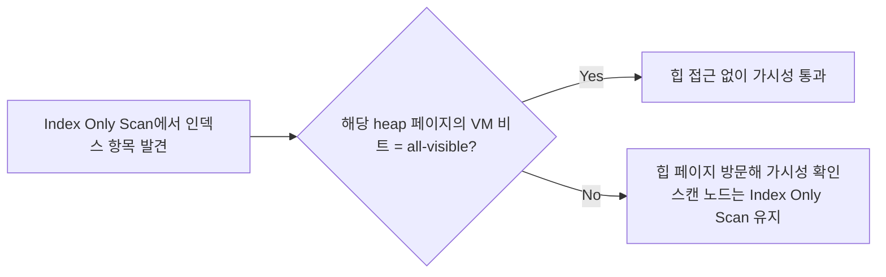

# 커버링 인덱스

## 핵심 정의

커버링 인덱스(covering index)는 쿼리가 요구하는 모든 컬럼(SELECT, WHERE, ORDER BY 대상)을 인덱스 자체에서 전부 제공할 수 있는 인덱스를 말한다. 이 조건은 인덱스에서 필요한 값을 구할 수 있다는 뜻이다. DB 엔진이 가시성 확인까지 생략할 수 있으면 실제 테이블(heap 또는 clustered index)에 접근하지 않고 반환하며, 이를 인덱스 온리 스캔(Index-Only Scan, MySQL에서는 "Using index"로 표기)이라 부른다. 랜덤 I/O로 이어지는 테이블 접근을 없애 조회 성능을 크게 개선한다.

## 동작 원리 / 구조

### InnoDB(MySQL)의 경우

InnoDB의 보조 인덱스(secondary index)는 검색 키 컬럼 외에도 항상 프라이머리 키(clustered index key) 값을 함께 저장한다. 인덱스에 SELECT 대상 컬럼이 모두 포함돼 있으면(검색 키 컬럼이든, 프라이머리 키든) 값을 얻기 위한 클러스터형 인덱스 조회를 줄일 수 있다. 다만 InnoDB도 보조 인덱스 레코드의 삭제 표시나 페이지 변경 이력이 read view보다 새로우면 클러스터드 레코드와 undo로 가시성을 확인할 수 있다.

```sql
CREATE INDEX idx_orders_status ON orders (status, created_at);

-- 커버링: id는 PK라 자동 포함, status/created_at도 인덱스에 있음
SELECT id, status, created_at FROM orders WHERE status = 'PAID';
-- EXPLAIN Extra: Using index
```

### PostgreSQL의 경우

PostgreSQL 인덱스는 행의 최신 버전 여부(MVCC 가시성)를 자체적으로 담지 않으므로, 인덱스에 컬럼이 다 있어도 힙(heap) 페이지의 가시성 확인이 별도로 필요하다. 이를 최적화하기 위한 것이 가시성 맵(Visibility Map, VM)이다. 힙 페이지의 모든 행이 "전 트랜잭션에 대해 보임(all-visible)" 상태면 VM 비트가 설정되고, 이 경우에만 힙 접근 없이 인덱스만으로 결과를 낼 수 있다.



즉 PostgreSQL에서 커버링 인덱스를 만들어도 **쓰기가 잦은 테이블에서 VACUUM/autovacuum이 VM을 갱신하기 전까지는 힙 접근이 계속 발생**해 기대한 성능 이득이 나지 않을 수 있다. INSERT/UPDATE/DELETE가 힙 페이지를 건드릴 때마다 해당 페이지의 VM 비트는 즉시 해제(0)된다.

PostgreSQL은 `INCLUDE` 절로 검색 키가 아닌 "페이로드 컬럼"을 인덱스에 포함시켜 커버링 인덱스를 명시적으로 구성할 수 있다(B-tree, GiST, SP-GiST 인덱스에서 지원. GIN, BRIN은 미지원).

```sql
CREATE INDEX idx_orders_status_covering
  ON orders (status)
  INCLUDE (created_at, customer_id);
```

`INCLUDE` 컬럼은 정렬 순서나 인덱스 탐색 범위를 정하는 검색 키가 아니며 UNIQUE 제약 판단에도 영향을 주지 않는다. 값을 저장해 커버링 범위를 넓히는 대신 인덱스 크기가 늘어난다.

검색 키가 아니어도 `INCLUDE` 값을 인덱스에서 꺼내 `Filter` 조건을 평가할 수 있다. 인덱스 탐색 경계(`Index Cond`)를 좁히는 것과 구분한다. PostgreSQL 18.6에서 `(id) INCLUDE(flag)`와 `id BETWEEN 1 AND 1000 AND flag=1`을 실행했을 때 ID 범위는 Index Cond, flag는 Filter로 나타났다. 1,000개 후보 중 990개를 버리고 10개를 반환했으며 `Heap Fetches: 0`이었다. 테이블 방문을 없앤 것과 읽은 인덱스 후보 수를 줄인 것은 별개이므로, 선택도가 중요한 필터라면 [[인덱스 설계 전략]]의 검색 키 순서와 비교한다.

### INCLUDE가 쓰기에 주는 비용

PostgreSQL 18에서 B-tree `INCLUDE` 컬럼은 검색 경계를 좁히는 키가 아니지만 인덱스가 참조하는 컬럼이다. 따라서 포함한 컬럼을 갱신하면 그 인덱스 때문에 힙 전용 튜플(Heap-Only Tuple, HOT) 갱신 조건을 충족하지 못한다. 예를 들어 조회 편의를 위해 자주 바뀌는 `last_seen_at`을 INCLUDE하면, 단순 힙 갱신으로 끝낼 수 있었던 쓰기에 인덱스 갱신 비용까지 추가할 수 있다. HOT에는 같은 힙 페이지의 여유 공간 등 다른 조건도 필요하다.

또한 INCLUDE가 있는 B-tree에는 중복 제거(deduplication)가 적용되지 않는다. 큰 문자열·JSON을 무조건 포함하면 인덱스 튜플 크기 제한을 넘어 INSERT 자체가 실패할 수도 있다. 조회의 `Heap Fetches` 감소와 함께 인덱스 크기·쓰기 지연·`pg_stat_all_tables`의 HOT 갱신 비율을 비교한다.

## 실무 관점

- **언제 쓰는가**: 목록 조회, 대시보드 집계처럼 자주 반복되고 SELECT 컬럼이 고정된 쿼리에 적용하면 효과가 크다. 반대로 `SELECT *`처럼 컬럼이 매번 달라지는 쿼리에는 적용하기 어렵다(인덱스가 지나치게 커짐).
- **트레이드오프**: 인덱스에 컬럼을 추가할수록 인덱스 크기가 커지고, 쓰기 시 갱신 비용도 늘어난다. "자주 실행되는 조회 쿼리의 이득"과 "인덱스 비대화로 인한 쓰기/메모리 비용"을 저울질해야 한다.
- **PostgreSQL 쓰기 부하 환경 주의**: 갱신이 잦은 테이블은 VM 비트가 자주 해제돼 Index Only Scan 이득이 사라질 수 있다. `autovacuum_vacuum_scale_factor`를 낮춰 VACUUM 주기를 앞당기거나, 읽기 위주 테이블에만 커버링 인덱스 전략을 적용하는 것이 현실적이다.
- **EXPLAIN으로 검증**: MySQL은 `Extra: Using index` 여부, PostgreSQL은 `Index Only Scan` 노드와 `Heap Fetches` 수치(0에 가까울수록 이상적)로 실제 커버링 효과를 확인해야 한다. 인덱스를 만들었다고 자동으로 효과가 보장되는 게 아니라 반드시 실행 계획으로 검증해야 한다.
- **흔한 실수**: 컬럼 하나만 빠져도(예: 로그 목적으로 `updated_by` 컬럼을 나중에 SELECT에 추가) 커버링이 깨져 조용히 일반 인덱스 스캔+힙 접근으로 되돌아간다. 쿼리 변경 시 관련 인덱스도 함께 재검토해야 한다.

## 심화 Q&A

### Q. 커버링 인덱스와 일반 복합 인덱스의 차이는 무엇인가?
복합 인덱스는 여러 컬럼을 검색 키로 묶은 것이고, 커버링 인덱스는 "그 쿼리가 필요로 하는 모든 컬럼을 인덱스가 갖고 있다"는 결과적 상태를 가리키는 개념이다. 즉 복합 인덱스가 특정 쿼리에 대해 커버링 인덱스가 될 수도, 안 될 수도 있다. PostgreSQL의 `INCLUDE` 컬럼처럼 검색 키가 아닌데도 커버링 목적으로만 추가하는 컬럼도 있다.

### Q. PostgreSQL에서 인덱스에 필요한 컬럼이 다 있는데도 Index Only Scan이 안 나오는 이유는?
필요한 컬럼과 index-only를 지원하는 인덱스 종류인지, 비용상 해당 계획이 유리한지부터 확인한다. 가시성 맵(VM) 비트가 적으면 예상 heap fetch 비용 때문에 다른 계획을 선택할 수 있다. 또한 계획 이름이 Index Only Scan이어도 실제 힙 방문이 0이라는 뜻은 아니다. 최근에 갱신되거나 삽입된 행이 많은 페이지는 VM 비트가 해제돼 있어 힙 방문이 강제된다. `VACUUM` 실행 직후에는 VM이 갱신돼 Index Only Scan 비율이 높아지지만, 쓰기가 계속되면 다시 낮아진다. `EXPLAIN (ANALYZE, BUFFERS)`의 `Heap Fetches` 값으로 실제 힙 방문 빈도를 확인할 수 있다.

### Q. MySQL과 PostgreSQL의 커버링 인덱스 이득 메커니즘이 근본적으로 다른 이유는?
InnoDB는 보조 인덱스에 PK를 항상 포함하고, 클러스터형 인덱스 구조상 PK로 찾아가는 비용이 상대적으로 낮지만 여전히 별도 B-Tree 탐색이다. 반면 PostgreSQL은 힙(heap)이 별도 구조이고 인덱스에 가시성 정보가 없어 MVCC 특성상 힙 확인이 원칙적으로 필요하다. VM은 이 확인을 생략하기 위한 캐시 성격의 보조 구조이지, 근본적으로 다른 저장 엔진 구조(clustered vs heap)의 차이에서 오는 트레이드오프다.

### Q. 커버링 인덱스를 넓게 만들수록 항상 유리한가?
아니다. INCLUDE 컬럼이 늘어날수록 인덱스 튜플 크기와 페이지 수가 늘어 B-Tree 깊이나 리프 페이지 수가 늘고, 메모리(버퍼 캐시)에 인덱스를 올릴 때 차지하는 공간도 커진다. 결과적으로 쓰기 비용 증가와 캐시 효율 저하로 이어질 수 있어, 실제로 반복 실행되는 쿼리에 한해 선별적으로 적용해야 한다.

### Q. `SELECT *`를 쓰는 쿼리에도 커버링 인덱스를 적용할 수 있는가?
이론적으로는 테이블의 전체 컬럼을 인덱스에 포함시키면 가능하지만, 보조 인덱스가 테이블 크기에 가까워져 실익이 작을 수 있다. InnoDB의 PK 범위 조회는 클러스터드 리프 자체가 행을 갖고 있으므로 SELECT *도 별도 보조 인덱스를 늘리지 않고 처리한다. 커버링 인덱스는 SELECT 컬럼을 필요한 만큼만 명시하는 쿼리 설계와 함께 갈 때 의미가 있다.

### Q. 커버링 인덱스가 페이징 쿼리에서 특히 유용한 이유는?
대량 데이터 페이징에서 정렬 순서를 제공하는 검색 키와 필요한 반환 컬럼을 인덱스에 구성하면, 정렬을 위한 별도 filesort/Sort 연산과 각 행마다의 테이블 접근을 동시에 없앨 수 있다. 특히 커버링 인덱스 + 서브쿼리로 PK만 먼저 추려낸 뒤 본문 컬럼을 조인해서 가져오는 "지연 조인(deferred join)" 패턴은 OFFSET이 큰 페이지에서도 정렬/필터 비용을 인덱스 스캔 범위로 국한시킨다.

## 관련 개념
- [[VACUUM과 오토바큠]]
- [[인덱스 설계 전략]]
- [[페이징 최적화]]
- [[실행 계획 읽는 법]]

## 참고 자료

확인일: 2026-09-08. 아래 적용 범위에서 본문·Q&A·예제를 재검증했다. 예제는 문서와 대조했으며 별도 실행 검증은 하지 않았다.

- [MySQL 8.4 Multi-versioning](https://dev.mysql.com/doc/refman/8.4/en/innodb-multi-versioning.html) — 보조 인덱스 커버링과 undo 가시성 예외.
- [MySQL 8.4 Clustered/Secondary Indexes](https://dev.mysql.com/doc/refman/8.4/en/innodb-index-types.html) — PK 포함·클러스터드 행 저장.
- [PostgreSQL 18 Index-only Scans](https://www.postgresql.org/docs/18/indexes-index-only-scans.html) — visibility map·heap fetch·비용.
- [PostgreSQL 18 CREATE INDEX](https://www.postgresql.org/docs/18/sql-createindex.html) — INCLUDE 지원 인덱스·페이로드 제약.

부분 재검증: 2026-09-23. PostgreSQL 18의 INCLUDE·HOT 조건, B-tree deduplication 제외와 튜플 크기 제약을 확인했다. 다른 엔진 서술의 전체 검증일은 유지한다.

- [PostgreSQL 18 Heap-Only Tuples](https://www.postgresql.org/docs/18/storage-hot.html) — 인덱스 참조 컬럼 변경과 HOT 조건. 위 CREATE INDEX의 INCLUDE 제약도 재확인.

부분 재검증: 2026-10-04. PostgreSQL 18의 INCLUDE 비키 컬럼과 index-only 경로를 확인했다. PostgreSQL 18.6·pgJDBC 42.7.13에서 100,000행을 적재하고 VACUUM ANALYZE한 격리 테이블로 Index Cond와 Filter의 분리, 990행 필터 제거·Heap Fetches 0을 실제 확인했다. 플래너 강제 설정은 사용하지 않았으며, 수치는 이 데이터 분포의 실행 결과로 운영 성능 보장이 아니다. 다른 인덱스 종류·MySQL은 이번 검증 범위가 아니다. 전체 `verified`는 유지한다.

- [PostgreSQL 18 CREATE INDEX — INCLUDE](https://www.postgresql.org/docs/18/sql-createindex.html) — 비키 컬럼의 검색 자격 및 index-only 반환값 역할. 위 Index-only Scans와 함께 재확인.
