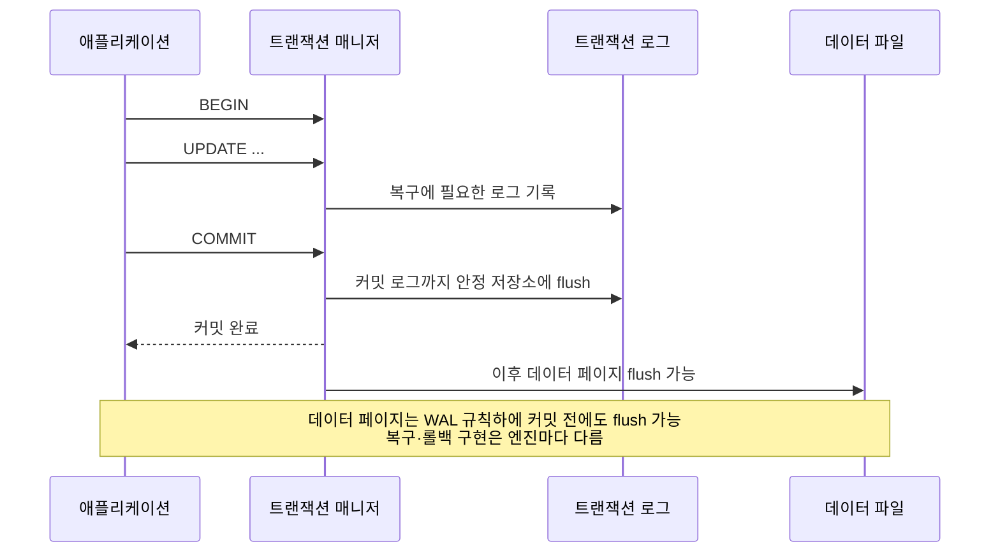

# ACID

## 핵심 정의
ACID는 트랜잭션(transaction)이 안전하게 실행되기 위해 보장해야 하는 4가지 속성인 원자성(Atomicity), 일관성(Consistency), 고립성(Isolation), 지속성(Durability)의 앞글자를 딴 용어다. 관계형 데이터베이스(RDBMS)가 여러 연산을 하나의 논리적 작업 단위로 묶어 처리할 때, 중간에 장애가 발생하거나 여러 트랜잭션이 동시에 실행되어도 데이터의 정합성을 깨뜨리지 않도록 하는 설계 원칙이다.

이 중 원자성/고립성/지속성은 DBMS 엔진(트랜잭션 매니저, 락 매니저, 로그 시스템)이 기술적으로 보장하는 속성이고, 일관성은 애플리케이션이 정의한 제약 조건(무결성 제약, 비즈니스 규칙)을 트랜잭션 전후로 지키는 것을 의미해 성격이 조금 다르다.

## 동작 원리 / 구조

**Atomicity (원자성)**: 커밋된 트랜잭션의 변경이 부분적으로만 남지 않도록 전부 반영하거나 롤백한다. SQL 한 문장의 오류가 항상 전체 트랜잭션을 자동 롤백한다는 뜻은 아니다. InnoDB는 중복 키 오류·기본 락 타임아웃에서 해당 문장만 취소하며, 애플리케이션이 전체 작업 실패 시 `ROLLBACK`해야 한다. InnoDB는 undo log를 사용하고 PostgreSQL은 미커밋 튜플의 가시성을 차단하는 등 구현이 다르다.

**Consistency (일관성)**: 올바른 트랜잭션은 유효한 상태를 다른 유효한 상태로 바꾼다. DB는 선언된 외래키·유니크·체크 제약을 강제하지만, 모든 비즈니스 규칙을 자동으로 알아내지는 못한다. 애플리케이션의 올바른 변경 로직과 동시성 제어가 필요하며 다른 세 속성만으로 보장되지 않는다. 지연 제약은 커밋 시 검사할 수 있어 실행 중간의 모든 상태가 항상 제약을 만족해야 하는 것은 아니다.

**Isolation (고립성)**: 동시 실행에서 허용할 관찰과 이상 현상을 제한한다. Serializable은 성공한 트랜잭션들이 어떤 순서로 하나씩 실행된 것과 같은 효과를 보장한다. 실제 동시 실행을 금지하지 않으며 성능 비용은 구현·경합·재시도율에 따라 달라진다. 자세한 내용은 [[트랜잭션 격리 수준]] 참고.

**Durability (지속성)**: 커밋 성공을 응답한 변경을 정해진 장애 범위에서 보존한다. MySQL InnoDB의 redo log와 PostgreSQL의 WAL(Write-Ahead Logging)은 데이터 페이지보다 관련 로그를 먼저 지속화한다. 안전한 커밋 설정은 로그를 안정 저장소에 flush한 뒤 성공을 응답하며, 디스크·컨트롤러가 flush 계약을 지켜야 한다. 디스크 전체 손실까지 견디려면 복제·백업도 필요하다.

## 실무 관점
- **원자성**은 Spring에서 `@Transactional`로 선언적으로 처리하는 경우가 많은데, 체크 예외(checked exception)는 기본적으로 롤백하지 않는다는 점을 놓쳐 부분 반영 장애가 나는 경우가 흔하다. 요구에 맞게 `rollbackFor = Exception.class`를 지정한다. Spring 6.2부터는 `@EnableTransactionManagement(rollbackOn = ALL_EXCEPTIONS)`로 전역 기본값도 바꿀 수 있다.
- **일관성**은 DB 제약만으로 보장되지 않는다. 애플리케이션 레벨 검증(예: 잔액이 음수가 되지 않아야 한다)은 결국 DB 제약(CHECK) 또는 애플리케이션 로직 + 적절한 락으로 함께 지켜야 한다.
- **고립성**을 위해 SERIALIZABLE을 선택하면 충돌 감지·대기·재시도 비용을 측정해야 한다. 대부분의 서비스는 READ COMMITTED나 REPEATABLE READ를 기본값으로 쓰고, 정말 필요한 구간에만 명시적 락이나 낙관적 락(optimistic lock)으로 보완한다.
- **지속성**은 `innodb_flush_log_at_trx_commit`(MySQL) 같은 설정으로 성능과 안전성을 조절할 수 있다. 값을 1이 아닌 0/2로 낮추면 커밋 응답은 빨라지지만 크래시 시 최근 트랜잭션 유실 가능성이 생긴다. 금융/결제성 데이터는 반드시 1(기본값, 커밋 성공 전에 로그 지속화; 그룹 커밋 가능)을 유지해야 한다.
- 흔한 장애 패턴: 트랜잭션 경계를 서비스 메서드가 아니라 리포지토리(DAO) 단위로 짧게 잡아, 여러 DB 호출 사이에 원자성이 깨지는 설계 실수. 같이 지켜야 하는 로컬 불변식을 하나의 트랜잭션으로 묶는다. 긴 업무 흐름 전체를 외부 API 호출까지 포함해 한 DB 트랜잭션으로 늘리지는 않는다.

## 심화 Q&A

### Q. Consistency(일관성)는 왜 다른 세 속성과 성격이 다르다고 하는가?
A. 엔진은 커밋·롤백과 동시 실행의 기술적 계약을 제공하지만 업무 규칙의 의미까지 결정할 수 없다. 예를 들어 차변만 기록하는 잘못된 이체 로직을 완전히 원자적으로 커밋해도 업무 일관성은 깨진다. 선언적 제약으로 표현 가능한 규칙은 DB에 두고, 나머지는 올바른 트랜잭션 로직과 격리·충돌 처리로 지켜야 한다.

### Q. NoSQL(예: MongoDB, Cassandra)이 "ACID를 지원하지 않는다"는 말은 정확한가?
A. 제품과 작업 범위를 구분해야 한다. MongoDB는 복제 셋·샤드 클러스터에서 다중 문서 트랜잭션을 지원한다. Cassandra의 경량 트랜잭션(lightweight transaction)은 Paxos 기반 조건부 변경을 제공하지만 임의의 다중 파티션 ACID 트랜잭션과 같지 않다. NoSQL 전체를 BASE 또는 비트랜잭션 저장소로 묶으면 이 차이를 놓친다.

### Q. Durability를 보장하면서도 커밋 지연(latency)을 줄이려면 어떤 선택지가 있는가?
A. 그룹 커밋(group commit)은 여러 트랜잭션의 로그를 한 번의 flush로 지속화해 비용을 나눌 수 있다. 저지연 안정 저장소와 적절한 배치 크기도 영향을 준다. 준동기 복제는 원격 확인 대기를 추가하는 별도 보호이며 로컬 fsync를 대체하지 않는다. 비동기 복제여도 로컬 지속성은 보장할 수 있지만, 복제 전 원본을 잃고 failover하면 승인된 변경이 사라질 수 있다.

### Q. 분산 환경에서 여러 DB에 걸친 트랜잭션도 ACID를 그대로 적용할 수 있는가?
A. 단일 노드 ACID와 분산 트랜잭션은 다르게 접근해야 한다. 2PC(Two-Phase Commit)로 분산 원자성을 시도할 수 있지만 코디네이터 장애 시 블로킹 문제가 있고 성능 비용이 크다. 요구에 따라 Saga 패턴처럼 각 로컬 트랜잭션은 ACID를 지키되 전체 흐름은 보상 트랜잭션(compensating transaction)으로 결과적 일관성(eventual consistency)을 맞추는 방식을 선택할 수 있다. Saga는 전체 ACID·격리를 그대로 보장하지 않는다.

### Q. 원자성을 보장하는 Undo log와 지속성을 보장하는 Redo log(WAL)는 왜 둘 다 필요한가?
A. InnoDB에서 redo는 장애 시 페이지 변경을 재현하고 undo는 미완료 변경의 롤백과 이전 버전 읽기를 지원한다. redo에는 미커밋 트랜잭션 변경도 포함될 수 있어 복구 후 롤백과 함께 해석해야 한다. 모든 DB가 별도 undo log를 요구하는 것은 아니다. PostgreSQL은 WAL 복구와 트랜잭션 상태·튜플 가시성으로 미커밋 결과를 숨기고 이후 공간을 회수한다.

### Q. 애플리케이션에서 원자성이 깨지는 대표적인 설계 실수는 무엇인가?
A. 하나의 비즈니스 트랜잭션 안에서 DB 커밋과 외부 시스템 호출(메시지 발행, 외부 API 호출)을 같은 트랜잭션 경계처럼 취급하는 경우다. DB 트랜잭션은 커밋됐는데 메시지 발행이 실패하거나 그 반대의 상황이 생기면 정합성이 깨진다. 이런 경우 Outbox 패턴처럼 DB 트랜잭션 안에서는 로컬 상태만 원자적으로 변경하고, 외부 발행은 별도 프로세스가 보장하도록 분리해야 한다.

### Q. 롤백했는데 시퀀스 번호가 건너뛰면 원자성이 깨진 것인가?
A. 아니다. PostgreSQL 18의 `nextval()`로 얻은 시퀀스 값은 트랜잭션이 중단되어도 회수하지 않는다. `INSERT ... ON CONFLICT`도 충돌 판정 전에 번호를 소비할 수 있다. 따라서 시퀀스·자동 생성 ID를 빈틈없는 업무 번호나 커밋 순서로 해석하지 않는다. 번호의 연속성이 업무 규칙이라면 별도의 직렬화된 발급 절차와 취소 이력을 설계해야 하며, 처리량 비용도 생긴다.

## 관련 개념
- [[트랜잭션 격리 수준]]
- [[MVCC]]
- [[락의 종류]]

## 참고 자료

확인일: 2026-09-08. 아래 적용 범위에서 본문·Q&A·예제를 재검증했다. 예제는 문서와 대조했으며 별도 실행 검증은 하지 않았다.

- [InnoDB and the ACID Model](https://dev.mysql.com/doc/refman/8.4/en/mysql-acid.html) — MySQL 8.4: ACID와 엔진·저장소 설정.
- [InnoDB Error Handling](https://dev.mysql.com/doc/refman/8.4/en/innodb-error-handling.html) — MySQL 8.4: 문장 롤백과 전체 롤백의 구분.
- [Transaction Isolation](https://www.postgresql.org/docs/18/transaction-iso.html) — PostgreSQL 18: 직렬성 및 성능·재시도.
- [Write-Ahead Logging](https://www.postgresql.org/docs/18/wal-intro.html) — PostgreSQL 18: WAL과 그룹 커밋.
- [Using @Transactional](https://docs.spring.io/spring-framework/reference/data-access/transaction/declarative/annotations.html) — Spring Framework 6.2+ 전역 롤백 규칙.
- [MongoDB Transactions](https://www.mongodb.com/docs/manual/core/transactions/) — 공식 현행 문서: 복제 셋·샤드 트랜잭션.
- [Cassandra Guarantees](https://cassandra.apache.org/doc/stable/cassandra/architecture/guarantees.html) — 공식 stable 문서: 원자성·격리 및 경량 트랜잭션.

부분 재검증: 2026-09-23. PostgreSQL 18 시퀀스의 비롤백 특성과 커밋 응답이 데이터 페이지 flush 완료를 기다릴 필요가 없다는 WAL 설명을 확인했다. 다른 제품·Spring의 전체 재검증은 하지 않았다.

- [PostgreSQL 18 Sequence Manipulation Functions](https://www.postgresql.org/docs/18/functions-sequence.html) — nextval·ON CONFLICT·번호 공백과 트랜잭션 경계. 위 WAL 문서의 커밋 flush 경계도 재확인.
