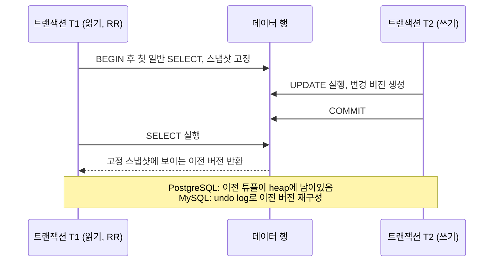

# MVCC

## 핵심 정의
MVCC(Multi-Version Concurrency Control, 다중 버전 동시성 제어)는 하나의 데이터 행에 대해 여러 버전을 동시에 유지함으로써, 읽기 트랜잭션이 쓰기 트랜잭션을 기다리지 않고(또는 그 반대도) 각자 자신에게 유효한 시점의 스냅샷을 읽을 수 있게 하는 동시성 제어 기법이다. "읽기는 쓰기를 블로킹하지 않고, 쓰기는 읽기를 블로킹하지 않는다"는 것이 핵심 목표이며, PostgreSQL과 MySQL InnoDB, Oracle 등 대부분의 현대 RDBMS가 채택하고 있다.

락 기반 동시성 제어가 "충돌 가능성이 있는 접근을 미리 막는" 방식이라면, MVCC는 "각 트랜잭션에게 서로 다른 버전을 보여줘서 애초에 충돌할 필요가 없게 만드는" 방식에 가깝다.

## 동작 원리 / 구조

DBMS마다 버전을 저장하는 위치가 다르다.

- **PostgreSQL 18**: UPDATE는 새 튜플을 만들며 DELETE는 기존 튜플에 삭제 정보를 남긴다(heap에 여러 행 버전 존재). 각 튜플은 `xmin`(생성한 트랜잭션 ID), `xmax`(삭제·갱신 또는 행 잠금 관련 정보)를 가지며, 조회 시점의 트랜잭션 스냅샷과 비교해 어떤 버전이 보여야 하는지 결정한다. 오래된 버전은 더 이상 어떤 트랜잭션도 참조하지 않을 때 VACUUM 프로세스가 정리한다.
- **MySQL InnoDB**: 실제 행은 최신 버전만 테이블에 유지하고, 이전 버전은 undo log(rollback segment)에 보관한다. 트랜잭션이 이전 시점 데이터를 읽어야 하면 최신 행에서 시작해 undo log 체인을 거슬러 올라가며 필요한 버전을 재구성한다.

스냅샷 가시성(visibility)은 단순히 `생성 ID ≤ 내 ID`로 정해지지 않는다. 생성·삭제 트랜잭션의 커밋 여부, 스냅샷 당시 활성 트랜잭션 집합, 자신의 변경 등을 함께 판단한다. 나보다 먼저 시작했어도 스냅샷 당시 미커밋인 변경은 보이지 않을 수 있다.

READ COMMITTED의 일반 조회는 문장마다 새 스냅샷을 얻는다. REPEATABLE READ에서 PostgreSQL은 첫 비트랜잭션 제어 문장 시점, InnoDB는 첫 consistent read 시점에 고정한다. `BEGIN` 자체와 항상 같지는 않다. InnoDB의 `START TRANSACTION WITH CONSISTENT SNAPSHOT`은 별도로 시점을 지정하는 수단이다.

## 실무 관점
- MVCC 덕분에 대부분의 OLTP 워크로드에서 일반 `SELECT`는 행의 읽기 락 없이 조회할 수 있어 읽기 위주 서비스의 동시성이 크게 향상된다. 반면 `SELECT ... FOR UPDATE`, `UPDATE`, `DELETE`처럼 실제 쓰기 잠금이 필요한 연산은 여전히 락 경합이 발생한다. PostgreSQL REPEATABLE READ에서는 스냅샷 이후 변경된 행의 잠금·갱신이 serialization failure를 일으킬 수 있다. 일반 조회도 테이블·메타데이터 락이나 I/O 때문에 대기할 수 있다.
- PostgreSQL 운영 시 흔한 장애 패턴: 오래 실행되는 트랜잭션(long-running transaction)이 하나 있으면, 그보다 오래된 버전을 VACUUM이 정리하지 못해 테이블/인덱스가 비대해지는 테이블 블로트(table bloat) 현상이 생긴다. 유휴 상태로 커밋도 롤백도 하지 않은 트랜잭션(idle in transaction)이 방치되면 특히 심각해진다. `idle_in_transaction_session_timeout` 같은 설정과 모니터링이 필요하다.
- MySQL InnoDB도 유사하게, 오래 열려 있는 트랜잭션이 있으면 undo log가 계속 쌓여 undo tablespace가 비대해지거나 히스토리 리스트 길이(history list length)가 늘어나 전체 성능이 저하될 수 있다.
- MVCC 환경에서는 "SELECT 후 애플리케이션에서 계산한 값으로 UPDATE"하는 로직이 InnoDB REPEATABLE READ 등에서 갱신 손실(lost update)을 일으킬 수 있다는 점을 팀 내에 명확히 공유해야 한다. 재고 차감, 포인트 차감처럼 정합성이 중요한 로직은 `SELECT ... FOR UPDATE`(비관적 락) 또는 버전 컬럼 기반 낙관적 락으로 별도 처리한다. PostgreSQL REPEATABLE READ는 해당 동시 행 갱신을 실패시킬 수 있고 SERIALIZABLE은 직렬화 이상을 차단하므로 모든 수준이 같지는 않다.
- 카운트 쿼리(`COUNT(*)`)가 순간순간 다르게 나오는 현상, 대시보드 집계가 시점마다 미묘하게 다른 현상은 스냅샷 차이로 설명될 수 있다. 같은 스냅샷·조건인지, 실제 데이터 변경·복제 지연·쿼리 오류가 있는지도 확인해야 한다.

### 스냅샷이 있어도 DDL 이전 내용을 읽지 못하는 경우

PostgreSQL 18의 `TRUNCATE`와 테이블을 재작성하는 일부 `ALTER TABLE`은 MVCC 안전성을 제공하지 않는다. 다음 순서가 가능하다.

1. 트랜잭션 A가 REPEATABLE READ 스냅샷을 얻지만 대상 테이블은 아직 읽지 않는다.
2. B가 대상 테이블을 `TRUNCATE`하고 커밋한다.
3. A가 처음 그 테이블을 읽으면 이전 행이 복원되어 보이는 대신 빈 테이블로 보일 수 있다.

A가 이미 대상 테이블을 읽었다면 `ACCESS SHARE` 잠금 때문에 B의 DDL이 A 종료까지 기다리므로 조건이 다르다. 따라서 여러 테이블을 일관된 시점으로 읽는 리포트가 실행 중일 때, 참조 테이블을 `TRUNCATE` 후 다시 채우는 배치를 일반 `DELETE`와 같은 가시성으로 취급하면 안 된다. DDL·전체 교체 배치와 장기 스냅샷의 겹침을 배포·배치 설계에서 검토한다. 모든 `ALTER TABLE`이 테이블을 재작성하는 것은 아니다.

## 심화 Q&A

### Q. PostgreSQL은 왜 VACUUM이라는 별도 프로세스가 반드시 필요한가?
A. UPDATE는 새 튜플을 만들고 DELETE는 기존 튜플에 삭제 정보를 남긴다. 이전 버전을 즉시 모두 지울 수 없어, VACUUM은 더 이상 필요한 스냅샷이 없는 dead tuple 공간을 재사용 가능하게 회수하고 트랜잭션 ID wraparound 방지를 위한 freeze도 수행한다. 페이지 pruning이 일부 공간을 회수해도 VACUUM의 역할 전체를 대신하지는 못한다. `autovacuum`과 오래 열린 트랜잭션을 함께 관리해야 한다.

### Q. MySQL InnoDB는 undo log 체인이 길어지면 왜 성능이 나빠지는가?
A. 오래된 버전을 읽어야 하는 트랜잭션은 최신 행에서 시작해 undo log를 하나씩 거슬러 올라가며 원하는 버전을 재구성해야 한다. 오래 열린 트랜잭션이 있어 undo log가 정리되지 못하고 체인이 길어지면, 오래된 스냅샷에서 많이 갱신된 행을 조회할 때 긴 체인을 순회해야 해 CPU 비용이 늘고 undo tablespace 공간도 계속 증가한다. `information_schema.INNODB_TRX`나 history list length 지표로 오래 열린 트랜잭션을 모니터링하는 것이 유용하다. history list length는 purge 대기 이력 지표이며 개별 행의 버전 체인 길이와 같지 않다.

### Q. MVCC를 쓰는 DB에서도 데드락(deadlock)이 발생할 수 있는가?
A. 발생할 수 있다. MVCC는 읽기와 쓰기 사이의 블로킹을 없애는 것이지, 쓰기와 쓰기 사이의 잠금 경쟁까지 없애는 것은 아니다. 두 트랜잭션이 서로 다른 순서로 같은 행들에 대해 배타 락(exclusive lock)을 요구하면 MVCC DB에서도 데드락이 발생하며, InnoDB는 데드락 탐지기가 대기 그래프(wait-for graph)를 감시하다가 한쪽 트랜잭션을 강제로 롤백시켜 해소한다. 자세한 잠금 종류는 [[락의 종류]] 참고.

### Q. MVCC와 2단계 잠금(2PL)을 함께 쓰는 경우가 있는가?
A. 그렇다. InnoDB나 Oracle 모두 순수 MVCC만으로 모든 것을 해결하지 않는다. 일반 읽기(plain SELECT)는 MVCC 스냅샷으로 처리하되, `SELECT ... FOR UPDATE`, `UPDATE`, `DELETE`처럼 쓰기 의도가 있는 연산은 실제 레코드에 락(2PL 방식의 배타 락)을 걸어 다른 트랜잭션의 동시 쓰기를 막는다. 즉 실무의 대부분 RDBMS는 "읽기는 MVCC, 쓰기 충돌 방지는 락"이라는 하이브리드 구조를 취한다.

### Q. PostgreSQL의 MVCC 방식은 인덱스에도 영향을 주는가?
A. 그렇다. MVCC는 UPDATE 시 새 버전을 위한 튜플을 추가로 생성하는데, 원칙적으로는 이 새 튜플을 가리키는 인덱스 엔트리도 매번 새로 추가해야 해 인덱스가 함께 비대해질 수 있다. 다만 PostgreSQL은 HOT(Heap-Only Tuple) 업데이트라는 최적화를 제공한다. 업데이트되는 컬럼이 일반 인덱스의 참조 대상이 아니고 같은 페이지 안에 여유 공간이 있으면(18에서는 BRIN 같은 summarizing index는 예외), 인덱스 엔트리를 새로 만들지 않고 페이지 내부에서 이전 버전과 새 버전을 체인으로 연결해 인덱스 쓰기 비용을 줄인다. 또한 인덱스만으로 결과를 반환하는 인덱스 전용 스캔(index-only scan)도 튜플이 모든 트랜잭션에 보이는지 판단하기 위해 가시성 맵(visibility map)을 함께 참조해야 하므로, MVCC 가시성 규칙은 인덱스 설계와 성능에도 직접적인 영향을 준다.

### Q. 낙관적 락(optimistic lock)은 MVCC와 같은 개념인가?
A. 다르다. MVCC는 DBMS 엔진 내부의 동시성 제어 메커니즘으로, 애플리케이션이 의식하지 않아도 자동으로 동작한다. 낙관적 락은 애플리케이션(또는 JPA 같은 프레임워크)이 버전 컬럼을 두고 "버전을 조건으로 UPDATE하고 영향 행 수 등으로 충돌을 감지"하는 애플리케이션 레벨 패턴이다. 검사는 flush 시점에도 일어날 수 있다. MVCC 자체가 애플리케이션의 변경 충돌 검사를 대신하는 것은 아니다.

## 관련 개념
- [[VACUUM과 오토바큠]]
- [[트랜잭션 격리 수준]]
- [[ACID]]
- [[락의 종류]]

## 참고 자료

확인일: 2026-09-08. 아래 적용 범위에서 본문·Q&A·예제를 재검증했다. 예제는 문서와 대조했으며 별도 실행 검증은 하지 않았다.

- [System Columns](https://www.postgresql.org/docs/18/ddl-system-columns.html) — PostgreSQL 18: xmin/xmax와 튜플 버전.
- [Routine Vacuuming](https://www.postgresql.org/docs/18/routine-vacuuming.html) — PostgreSQL 18: dead tuple 회수·freeze.
- [Heap-Only Tuples](https://www.postgresql.org/docs/18/storage-hot.html) — PostgreSQL 18: HOT 조건과 BRIN 예외.
- [Transaction Isolation](https://www.postgresql.org/docs/18/transaction-iso.html) — PostgreSQL 18: 스냅샷 시점·동시 갱신 실패.
- [Consistent Nonlocking Reads](https://dev.mysql.com/doc/refman/8.4/en/innodb-consistent-read.html) — MySQL 8.4: read view와 locking read 구분.
- [InnoDB Multi-Versioning](https://dev.mysql.com/doc/refman/8.4/en/innodb-multi-versioning.html) — MySQL 8.4: undo 이전 버전 및 purge.
- [Hibernate Optimistic Locking](https://docs.hibernate.org/orm/7.1/userguide/html_single/#locking-optimistic) — Hibernate ORM 7.1: 버전 검사.

부분 재검증: 2026-10-04. PostgreSQL 18의 DDL과 기존 스냅샷 가시성 예외, 선행 테이블 접근 시 잠금 조건을 확인했다. 아래 TRUNCATE 경계만 실제 서버에서 추가 확인했고 테이블 재작성 ALTER TABLE은 실행하지 않았다. 기존 MySQL·Hibernate 서술의 전체 검증일은 유지한다.

- [PostgreSQL 18 MVCC Caveats](https://www.postgresql.org/docs/18/mvcc-caveats.html) — TRUNCATE·테이블 재작성 DDL의 가시성 예외와 ACCESS SHARE 조건.
- [PostgreSQL 18 TRUNCATE](https://www.postgresql.org/docs/18/sql-truncate.html) — ACCESS EXCLUSIVE 잠금·MVCC 비안전성·트랜잭션 롤백 가능성의 구분.

추가 실행 확인: 2026-10-04. 격리한 PostgreSQL 18.6 실제 서버와 pgJDBC 42.7.13의 두 연결을 사용했다. A가 REPEATABLE READ에서 별도 기준 테이블을 읽어 스냅샷을 얻고, B가 대상 테이블의 TRUNCATE를 커밋한 뒤 A가 처음 조회하면 원래 1행이 있던 대상의 count는 0이었다. 대조 실험에서 A가 대상을 먼저 읽으면 B의 TRUNCATE는 `lock_timeout=100ms`에서 SQLSTATE `55P03`으로 실패했고, A가 종료한 후에는 성공했다. MySQL의 DDL·다른 격리 수준·복제 환경에 일반화하지 않는다.
