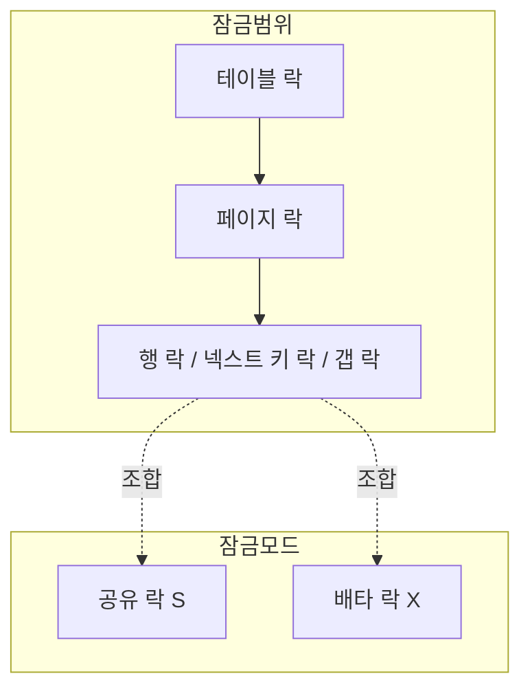

# 락의 종류

## 핵심 정의
락(lock)은 여러 트랜잭션이 동시에 같은 데이터에 접근할 때 발생할 수 있는 충돌을 막기 위해 DBMS가 자원(행, 페이지, 테이블 등)에 대한 접근을 통제하는 수단이다. 락은 여러 기준으로 분류할 수 있는데, 크게 (1) 잠그는 범위(행 락/테이블 락 등), (2) 허용하는 접근 방식(공유 락/배타 락), (3) 획득 시점의 낙관성(비관적 락/낙관적 락)으로 나눠볼 수 있다. 실무에서는 이 세 축을 조합해 특정 상황에 맞는 락 전략을 선택한다.

## 동작 원리 / 구조

**1) 잠금 모드 기준**
- **공유 락(Shared Lock, S-Lock)**: 읽기를 위한 락. 여러 트랜잭션이 동시에 공유 락을 가질 수 있지만, 공유 락이 걸려 있는 동안 배타 락은 획득할 수 없다.
- **배타 락(Exclusive Lock, X-Lock)**: 쓰기를 위한 락. 한 트랜잭션만 가질 수 있고, 다른 트랜잭션은 공유 락도 배타 락도 얻을 수 없다.

| | S-Lock 요청 | X-Lock 요청 |
|---|---|---|
| S-Lock 보유 중 | 허용 | 대기 |
| X-Lock 보유 중 | 대기 | 대기 |

이 표는 동일 자원의 S/X 락 요청 간 호환성이다. MVCC 일반 읽기는 행 S 락을 요청하지 않아 X 락과 병행해 이전 버전을 읽을 수 있다.

**2) 잠금 범위 기준**
- **행 락(Row Lock)**: 특정 행 단위로 잠금. 동시성이 가장 높지만 락 관리 오버헤드가 있다.
- **갭 락(Gap Lock)**: 인덱스 레코드 사이의 빈 공간을 잠가, 그 범위에 새 행이 INSERT되는 것을 막는다. InnoDB가 REPEATABLE READ에서 팬텀 리드를 방지하기 위해 사용.
- **넥스트 키 락(Next-Key Lock)**: 레코드 락 + 그 레코드 앞의 갭 락을 합친 것. InnoDB REPEATABLE READ의 범위 잠금에 사용되며, 존재하는 유니크 키 전체의 등가 조회는 레코드 락만 사용할 수 있다.
- **페이지 락/테이블 락**: 더 큰 단위를 잠근다. DDL이나 대량 배치 작업, 락 에스컬레이션(lock escalation) 상황에서 사용되며 동시성은 낮지만 락 관리 비용이 적다.
- **의도 락(Intention Lock, IS/IX)**: 상위 단위(테이블)에 "하위 단위(행)에 락을 걸 예정"임을 표시해, 테이블 락 요청이 하위 행 락과의 충돌 여부를 매번 스캔하지 않고 빠르게 판단할 수 있게 하는 보조 락.

**3) 획득 시점/전략 기준**
- **비관적 락(Pessimistic Lock)**: 충돌이 일어날 것을 전제로, 데이터를 읽는 시점부터 락을 걸어 다른 트랜잭션의 접근을 막는다. JPA에서는 `@Lock(LockModeType.PESSIMISTIC_WRITE)`를 지정하며 실제 SQL과 잠금 범위는 JPA 제공자·DB 방언·조회 형태에 달려 있다.
- **낙관적 락(Optimistic Lock)**: 충돌이 드물 것이라 가정하고 락 없이 읽은 뒤, 커밋(업데이트) 시점에 버전(version) 컬럼이나 타임스탬프를 비교해 그 사이 변경이 있었는지 검사한다. 충돌이 감지되면 예외를 던지고 애플리케이션이 재시도한다. JPA의 `@Version` 어노테이션이 대표적 구현.

**2단계 잠금(Two-Phase Locking, 2PL)**: 락 획득 단계와 해제 단계를 구분하고, 한 번 해제한 뒤 새 락을 얻지 않는 프로토콜이다. Strict 2PL은 배타 락을 트랜잭션 종료까지 유지하고, Rigorous/Strong Strict 2PL은 공유 락도 종료까지 유지한다. 실제 엔진의 모든 격리 수준이 이 프로토콜 하나를 그대로 따르는 것은 아니다. InnoDB READ COMMITTED는 조건에 맞지 않는 행의 락을 일찍 해제하며 일반 조회에는 MVCC를 사용한다.

**데드락(Deadlock)**: 두 개 이상의 트랜잭션이 서로가 가진 락을 기다리며 순환 대기(circular wait)에 빠지는 상태. InnoDB는 대기 그래프를 감시하다 데드락을 탐지하면 비용이 더 적은(보통 롤백할 변경 행이 적은) 트랜잭션을 강제로 롤백시켜 해소한다.

### 잠금을 기다리지 않는 조회의 의미

MySQL 8.4 InnoDB와 PostgreSQL 18의 잠금 조회에서 `NOWAIT`는 충돌 시 즉시 실패하고, `SKIP LOCKED`는 잠긴 행을 결과에서 제외한다. 후자는 작업 큐처럼 지금 확보 가능한 작업만 가져올 때 유용하다. 재고 존재 확인·총합 계산에 쓰면 잠긴 행을 없는 것으로 판단할 수 있으므로 일반 조회를 빨리 만드는 옵션으로 쓰지 않는다. 두 옵션의 비대기 동작은 행 잠금에 적용되며 필요한 테이블 수준 잠금까지 없애지는 않는다.

PostgreSQL 18은 행 잠금도 `FOR UPDATE`, `FOR NO KEY UPDATE`, `FOR SHARE`, `FOR KEY SHARE`로 나눈다. 키를 바꾸지 않는 갱신의 `NO KEY UPDATE`는 외래키 참조 보호 등에 쓰는 `KEY SHARE`와 병행할 수 있다. S/X 두 종류의 표만으로 모든 PostgreSQL 행 잠금 충돌을 판단하지 않는다.

## 실무 관점
- **비관적 락 vs 낙관적 락 선택 기준**: 충돌 빈도가 높고 실패 시 재시도 비용이 큰 로직(재고 차감, 선착순 처리)은 비관적 락이, 충돌이 드물고 읽기가 훨씬 많은 로직(게시글 조회수 갱신 제외한 일반 수정)은 낙관적 락이 유리한 경우가 많다. 다만 비관적 락은 락 대기로 인한 응답 지연과 데드락 위험을, 낙관적 락은 충돌 시 사용자에게 노출되는 재시도/실패 UX를 감수해야 한다.
- **흔한 장애 패턴 1 (락 순서 불일치로 인한 데드락)**: 트랜잭션 A는 행1 → 행2 순서로, 트랜잭션 B는 행2 → 행1 순서로 락을 건다. 두 트랜잭션이 동시에 실행되면 데드락이 발생한다. 해결책은 항상 동일한 순서(예: 기본키 오름차순)로 락을 걸도록 코드를 통일하는 것이다.
- **흔한 장애 패턴 2 (갭 락으로 인한 대량 INSERT 블로킹)**: MySQL InnoDB REPEATABLE READ에서 범위 조건의 `UPDATE`/`DELETE`나 비유니크 조건의 잠금 읽기(`SELECT ... FOR UPDATE`) 시 갭 락이 넓게 걸려, 관련 없어 보이는 다른 INSERT 트랜잭션들이 서로 대기하다 데드락이 나는 경우가 잦다. 이런 경우 READ COMMITTED로 격리 수준을 낮추거나(갭 락 사용이 크게 줄어듦), 조건절에 인덱스를 정확히 태워 잠금 범위를 좁히는 것이 대응책이다.
- **낙관적 락 사용 시 주의점**: `@Version` 컬럼 기반 낙관적 락은 충돌 시 `OptimisticLockException`을 던지므로, 업무에 맞게 충돌 응답 또는 제한된 재시도를 선택한다. 사용자 편집은 최신 값을 보여주고 병합하게 할 수 있다. 재시도한다면 새 트랜잭션에서 다시 읽고 재계산해야 하며 오래된 입력을 무조건 덮어쓰면 안 된다.
- **락 대기 시간 설정**: `innodb_lock_wait_timeout`(MySQL), `lock_timeout`/`statement_timeout`(PostgreSQL) 같은 설정으로 락을 무한정 기다리지 않고 일정 시간 후 실패 처리하도록 방어선을 둬야 한다. 기본값을 그대로 두면 배치 작업이 락을 오래 잡고 있을 때 서비스 트랜잭션들이 줄줄이 대기하는 연쇄 지연이 발생할 수 있다.
- **분산 환경의 락**: 여러 앱 인스턴스가 같은 DB 행을 변경한다면 그 DB의 락으로도 조정할 수 있다. DB 밖의 자원이나 여러 저장소를 조정해야 한다면 Redis·ZooKeeper 등의 분산 조정 수단과 자원 측 fencing을 검토한다. 이때도 락 획득 실패/타임아웃/락 해제 실패(락 보유 프로세스 다운) 시나리오를 반드시 설계에 포함해야 한다.

## 심화 Q&A

### Q. InnoDB에서 잠금 시간초과를 잡아 무시하면 전체 트랜잭션이 취소되는가?
A. MySQL 8.4 InnoDB의 기본 동작에서는 잠금 대기 시간초과가 발생한 **문장만** 롤백된다. 앞선 문장의 변경과 트랜잭션은 남고 문장 롤백만으로 잠금도 해제되지 않는다. 반면 데드락 희생자는 전체 트랜잭션이 롤백된다. `innodb_rollback_on_timeout`을 활성화한 서버는 시간초과에도 전체 롤백을 적용하므로 설정을 확인해야 한다.

예를 들어 주문 INSERT 뒤 재고 UPDATE가 잠금 시간초과로 실패했는데 예외를 삼키고 COMMIT하면 주문만 남을 수 있다. 두 변경이 하나의 업무 단위라면 명시적으로 전체 ROLLBACK하고 새 트랜잭션에서 다시 판단한다. DB 기본 동작과 Spring 등 프레임워크의 rollback-only 처리는 다른 계층이므로 예외 유형·전파 경계까지 확인한다.

PostgreSQL 18의 `lock_timeout`은 각 잠금 획득 시도에 따로 적용된다. 문장 전체 기한이 필요하면 `statement_timeout`과 함께 설계하고, 둘을 같은 값으로 두기보다 잠금 대기를 더 짧게 제한할지 결정한다. 어느 엔진이든 “시간초과”라는 이름만 보고 롤백 범위와 남은 잠금을 같다고 가정하지 않는다.

### Q. 갭 락은 왜 REPEATABLE READ에서만 문제가 되고 READ COMMITTED에서는 상대적으로 덜한가?
A. MySQL 8.4 InnoDB READ COMMITTED는 검색·인덱스 스캔의 갭 락을 사용하지 않지만 외래키와 중복 키 검사에서는 여전히 사용할 수 있다. REPEATABLE READ의 범위 잠금은 삽입 공간까지 보호하므로 동시 INSERT와 경합이 커질 수 있다. 격리 수준을 바꾸기 전 팬텀 허용과 업무 정합성 영향을 함께 확인한다.

### Q. 낙관적 락과 비관적 락을 같은 로직에 함께 쓸 수 있는가?
A. 가능하고 실제로 쓰인다. 예를 들어 조회 단계는 낙관적으로 락 없이 진행하다가, 정말 임계 구간(critical section)에 들어가는 순간에만 `SELECT ... FOR UPDATE`로 비관적 락을 짧게 거는 하이브리드 방식이 흔하다. 잠금을 얻은 뒤 값을 다시 읽어 앞선 판단을 재검증해야 한다. 잠금 전 읽은 값이 그대로 유효하다고 가정하면 경쟁 조건이 남는다. 락 구간은 짧고 좁게 유지한다.

### Q. 의도 락(Intention Lock)이 없다면 어떤 문제가 생기는가?
A. 의도 락이 없으면, 테이블 락을 요청한 트랜잭션이 그 테이블 안의 모든 행에 개별 락이 걸려 있는지 일일이 스캔해서 확인해야 한다. 의도 락(IS/IX)은 "이 테이블 안 어딘가에 행 락을 걸었다/걸 예정이다"라는 신호 역할을 해, 테이블 단위 락 요청이 하위 행 락 존재 여부를 O(1)에 가깝게 판단할 수 있게 해준다. 계층적 락 프로토콜(hierarchical locking)의 핵심 아이디어다.

### Q. 데드락 탐지와 데드락 예방(prevention)은 어떻게 다른 전략인가?
A. 탐지(detection)는 InnoDB처럼 데드락이 실제로 발생하도록 두고 대기 그래프에서 순환을 찾아 사후에 한쪽을 롤백시키는 반응적 전략이다. 예방(prevention)은 애초에 순환 대기가 생기지 않도록 락 획득 순서를 강제하거나(모든 트랜잭션이 동일한 순서로 자원에 접근), 타임스탬프 기반으로 오래된 트랜잭션에 우선권을 주는(wait-die, wound-wait 알고리즘) 사전 예방적 전략이다. 실무 RDBMS는 대부분 탐지 방식을 쓰고, 애플리케이션 레벨에서 락 순서를 통일하는 것으로 예방을 보완한다.

### Q. 락 에스컬레이션(Lock Escalation)은 무엇이고 왜 발생하는가?
A. 많은 행·키·페이지 락을 테이블 등 상위 단위 락으로 바꿔 관리 비용을 줄이는 동작이다. SQL Server의 에스컬레이션은 페이지로 승격하는 과정이 아니라 테이블(설정에 따라 파티션) 수준으로의 전환이다. 대량 배치를 나누면 완화할 수 있지만 원자성 요구를 먼저 확인한다. InnoDB는 행 락을 자동 테이블 락으로 승격하지 않는다. PostgreSQL도 일반 행 락은 승격하지 않지만 SSI의 비차단 predicate lock은 메모리 제한 때문에 더 넓은 단위로 합쳐질 수 있다.

### Q. 낙관적 락의 버전 컬럼 방식과 타임스탬프 방식 중 무엇을 택해야 하는가?
A. 정수 버전 컬럼(예: JPA `@Version`의 `Long version`) 방식이 일반적으로 권장된다. 타임스탬프는 시스템 시계 정밀도(밀리초 단위 충돌), NTP 보정으로 인한 시간 역행, 서버 간 시계 오차 문제로 동시 요청을 정확히 구분하지 못할 위험이 있는 반면, 단순 증가 정수 버전은 이런 문제에서 자유롭고 비교 로직도 단순하다.

## 관련 개념
- [[트랜잭션 격리 수준]]
- [[MVCC]]
- [[ACID]]

## 참고 자료

확인일: 2026-09-08. 아래 적용 범위에서 본문·Q&A·예제를 재검증했다. 예제는 문서와 대조했으며 별도 실행 검증은 하지 않았다.

- [InnoDB Locking](https://dev.mysql.com/doc/refman/8.4/en/innodb-locking.html) — MySQL 8.4: S/X/IS/IX, gap/next-key·유니크 조회 예외.
- [Transaction Isolation Levels](https://dev.mysql.com/doc/refman/8.4/en/innodb-transaction-isolation-levels.html) — MySQL 8.4: RC 조기 락 해제와 갭 락 예외.
- [Deadlock Detection](https://dev.mysql.com/doc/refman/8.4/en/innodb-deadlock-detection.html) — MySQL 8.4: 탐지 및 희생 트랜잭션 선택.
- [Explicit Locking](https://www.postgresql.org/docs/18/explicit-locking.html) — PostgreSQL 18: 행·테이블·advisory 락과 데드락.
- [Transaction Isolation](https://www.postgresql.org/docs/18/transaction-iso.html) — PostgreSQL 18: SSI 비차단 predicate lock의 병합.
- [Resolve Blocking Caused by Lock Escalation](https://learn.microsoft.com/en-us/troubleshoot/sql/database-engine/performance/resolve-blocking-problems-caused-lock-escalation) — SQL Server 공식 문서 2026-08-04: 테이블 에스컬레이션.
- [Hibernate Locking](https://docs.hibernate.org/orm/7.1/userguide/html_single/#locking) — Hibernate ORM 7.1: 낙관적·비관적 락 및 버전 검사.
- [CMU Two-Phase Locking](https://15445.courses.cs.cmu.edu/spring2026/slides/18-twophaselocking.pdf) — Spring 2026 DB 강의 원자료, 2PL·격리·교착.

부분 재검증: 2026-09-23. MySQL 8.4·PostgreSQL 18의 NOWAIT/SKIP LOCKED 범위와 PostgreSQL 행 잠금 호환성을 확인했다. JPA·SQL Server 등 나머지 서술은 전체 재검증하지 않았다.

- [MySQL 8.4 Locking Reads](https://dev.mysql.com/doc/refman/8.4/en/innodb-locking-reads.html) — NOWAIT·SKIP LOCKED와 비일관적 조회·큐 용도.
- [PostgreSQL 18 SELECT](https://www.postgresql.org/docs/18/sql-select.html#SQL-FOR-UPDATE-SHARE) — 행 잠금 옵션, 테이블 잠금 예외. 행 잠금 모드의 호환성은 위 Explicit Locking도 재확인.

부분 재검증: 2026-10-04. MySQL 8.4의 문장·트랜잭션 롤백 차이와 PostgreSQL 18의 잠금별 timeout 범위를 확인했다. 주문 예시는 명세에 근거한 실패 순서이며 실제 서버·Spring 트랜잭션 관리자에서 실행하지 않았다. JPA·SQL Server 등의 기존 `verified`는 유지한다.

- [MySQL 8.4 InnoDB Error Handling](https://dev.mysql.com/doc/refman/8.4/en/innodb-error-handling.html) — 데드락 전체 롤백, 시간초과 문장 롤백, innodb_rollback_on_timeout, 문장 롤백의 잠금 유지.
- [PostgreSQL 18 Client Connection Defaults](https://www.postgresql.org/docs/18/runtime-config-client.html#GUC-LOCK-TIMEOUT) — lock_timeout의 획득 시도별 적용과 statement_timeout의 관계.
