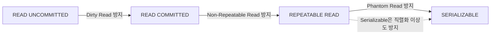

# 트랜잭션 격리 수준

## 핵심 정의
트랜잭션 격리 수준(transaction isolation level)은 여러 트랜잭션이 동시에 실행될 때 변경의 가시성과 동시 실행에서 허용할 이상 현상을 정의하는 규칙이다. SQL 표준(SQL:1992)은 READ UNCOMMITTED, READ COMMITTED, REPEATABLE READ, SERIALIZABLE 4단계를 정의하며, 낮은 단계일수록 더 많은 데이터 이상 현상(anomaly)을 허용한다. 처리량은 구현과 충돌·대기·재시도 비용에 달려 있어 항상 더 빠르지는 않다. 즉 격리 수준은 정합성과 성능 사이의 트레이드오프를 조절하는 손잡이다.

## 동작 원리 / 구조

대표적 읽기 이상과 직렬화 이상(serialization anomaly)에 대한 최소 보장을 비교하면 다음과 같다.

| 격리 수준 | Dirty Read | Non-Repeatable Read | Phantom Read | 직렬화 이상 |
|---|---|---|---|---|
| READ UNCOMMITTED | 허용 | 허용 | 허용 | 허용 |
| READ COMMITTED | 방지 | 허용 | 허용 | 허용 |
| REPEATABLE READ | 방지 | 방지 | 허용(표준 기준)* | 허용 |
| SERIALIZABLE | 방지 | 방지 | 방지 | 방지 |

* 제품은 이보다 강한 보장을 제공할 수 있다. PostgreSQL 18 REPEATABLE READ는 팬텀을 방지해도 write skew 같은 직렬화 이상은 허용한다. InnoDB의 일반 읽기 스냅샷과 잠금 읽기의 갭 보호는 서로 다른 메커니즘이다.

- **Dirty Read**: 다른 트랜잭션이 아직 커밋하지 않은 변경을 읽는 현상.
- **Non-Repeatable Read**: 같은 트랜잭션 내에서 동일 행을 두 번 읽었을 때 값이 달라지는 현상(다른 트랜잭션이 그 사이 커밋).
- **Phantom Read**: 같은 조건으로 범위 조회를 두 번 했을 때 행의 개수(집합)가 달라지는 현상(다른 트랜잭션이 INSERT/DELETE 또는 조건 컬럼 UPDATE로 집합을 변경).

실제 확인한 기본값과 적용 범위:
- MySQL 8.4 InnoDB: **REPEATABLE READ**.
- PostgreSQL 18: **READ COMMITTED** (`default_transaction_isolation`). READ UNCOMMITTED를 요청해도 READ COMMITTED로 처리하며, REPEATABLE READ는 팬텀도 방지한다.
- 운영 서버·세션·커넥션 풀에서 기본값을 덮어쓸 수 있으므로 연결의 실제 설정을 확인한다.

구현은 DB마다 다르다. PostgreSQL과 InnoDB는 일반 읽기에 [[MVCC]]를 쓰면서 쓰기 충돌에는 락을 사용한다. Serializable은 실제 순차 실행을 강제하는 뜻이 아니라 성공한 결과의 직렬 등가성을 뜻한다. 잠금 기반 구현과 PostgreSQL의 SSI(Serializable Snapshot Isolation)는 이를 서로 다르게 달성한다.

Spring에서는 `@Transactional(isolation = Isolation.REPEATABLE_READ)`처럼 선언할 수 있으며, `Isolation.DEFAULT`를 쓰면 연결의 기본 격리 설정을 따른다. 기존 트랜잭션에 참여하는 REQUIRED 호출은 새 isolation 선언으로 기존 격리를 바꾸지 않는다.

### 서로 다른 행을 바꿔도 깨지는 불변식

당직 의사 두 명 중 적어도 한 명이 근무해야 한다고 하자. 두 트랜잭션이 각각 `COUNT(*) WHERE on_call = true`로 2명을 확인한 뒤 자기 행만 `false`로 바꾸면, 동일 행의 갱신 충돌 없이 당직자가 0명이 될 수 있다. PostgreSQL 18 REPEATABLE READ의 스냅샷 고정은 이 쓰기 편향(write skew)을 막지 않는다. 각자 수정할 행만 `FOR UPDATE`로 잠그는 방식도 공통 불변식을 보호하지 못한다.

선택지는 불변식에 참여하는 공통 자원을 같은 순서로 잠그고 재검증하거나, 관련 트랜잭션을 SERIALIZABLE로 실행하고 실패한 전체 작업을 다시 수행하는 것이다. 한 경로만 강한 격리를 쓰고 다른 경로가 같은 규칙을 우회하면 전체 보장을 기대할 수 없다.

## 실무 관점
- 대부분의 웹 서비스는 기본 격리 수준(READ COMMITTED 또는 REPEATABLE READ)을 그대로 사용하고, 정합성이 특히 중요한 구간(재고 차감, 잔액 이체, 선착순 쿠폰 발급)에만 명시적 락이나 낙관적 락으로 보완하는 것이 일반적이다. SERIALIZABLE도 명시적 락을 줄일 수 있는 설계 선택지이며 실제 부하와 재시도율을 비교한다.
- MySQL InnoDB REPEATABLE READ에서 흔한 실수: "REPEATABLE READ니까 SELECT 결과가 트랜잭션 내내 고정된다"고 오해하고 `SELECT ... FOR UPDATE` 없이 조회한 값을 그대로 믿고 UPDATE를 수행하는 패턴. 일반 SELECT는 스냅샷을 보지만 UPDATE/DELETE 같은 잠금 읽기는 최신 커밋 데이터 기준으로 동작해 갱신 손실(lost update)이 생길 수 있다.
- PostgreSQL은 READ COMMITTED가 기본이라 같은 트랜잭션 내 두 번의 조회 사이에 다른 트랜잭션의 커밋이 끼어들 수 있다(Non-Repeatable Read 가능). 다단계 불변식을 지키려면 조건부 UPDATE·잠금·버전 검사나 더 강한 격리 중 적합한 수단을 선택한다. 격리 상승만으로 모든 업무 규칙이 보장되지는 않는다.
- PostgreSQL SERIALIZABLE의 SSI는 비차단 의존성 추적과 충돌 감지를 추가하므로, 애플리케이션이 `serialization failure` 예외를 받고 재시도(retry)하는 로직을 반드시 갖춰야 한다. 재시도 로직 없이 SERIALIZABLE만 켜면 운영 중 예외가 사용자에게 그대로 노출되는 장애가 난다.
- 격리 수준을 낮추면(READ UNCOMMITTED) 정합성 이슈뿐 아니라 디버깅 난이도도 올라간다. 실무에서 READ UNCOMMITTED를 쓰는 경우는 대략적인 집계용 리포트 조회 등 극히 제한적이다.

## 심화 Q&A

### Q. MySQL InnoDB의 REPEATABLE READ가 표준 정의보다 더 강하게 팬텀 리드를 막는 이유는 무엇인가?
A. 일반 SELECT는 첫 consistent read의 스냅샷을 재사용하므로 다른 트랜잭션의 후속 삽입이 보이지 않으며 이 읽기 자체는 갭 락을 잡지 않는다. `SELECT ... FOR UPDATE/SHARE`나 UPDATE/DELETE는 최신 상태에 대해 범위를 잠가 그 구간 삽입을 막는다. 존재하는 유니크 키 전체를 등가 검색하면 레코드만 잠글 수 있다. 두 읽기 종류를 섞으면 보이는 상태가 다를 수 있어 REPEATABLE READ를 모든 연산의 고정 스냅샷으로 해석하면 안 된다.

### Q. READ COMMITTED에서 MVCC는 스냅샷을 언제 새로 뜨는가?
A. REPEATABLE READ가 PostgreSQL에서는 첫 비제어 문장, InnoDB에서는 첫 consistent read에 스냅샷을 고정하는 것과 달리, READ COMMITTED는 매 SELECT 문(statement)마다 새로운 스냅샷을 뜬다. 그래서 같은 트랜잭션 안에서도 문장이 실행될 때마다 그 시점까지 커밋된 최신 데이터를 보게 되고, 이것이 Non-Repeatable Read가 발생하는 근본 원인이다.

### Q. 애플리케이션 레벨에서 REPEATABLE READ를 쓰는데도 갱신 손실(lost update)이 발생할 수 있는 이유는?
A. MySQL 8.4 InnoDB에서는 일반 조회로 읽은 값을 애플리케이션에서 계산해 절대값으로 쓰면 중간 변경을 덮어쓸 수 있다. PostgreSQL 18 REPEATABLE READ는 스냅샷 이후 동시 갱신된 행을 변경하려 하면 serialization failure를 낼 수 있다. 따라서 격리 이름만으로 모든 제품의 결과를 단정하지 않는다. 조건부 원자 UPDATE, 잠금 읽기, 버전 검사 중 업무에 맞는 방법과 실패 처리를 선택한다.

### Q. SERIALIZABLE을 2단계 잠금(2PL)으로 구현하는 방식과 PostgreSQL의 SSI 방식은 어떻게 다른가?
A. 잠금 방식은 충돌하는 접근을 대기시켜 직렬성을 확보한다. MySQL 8.4 SERIALIZABLE은 autocommit이 꺼져 있으면 일반 SELECT를 FOR SHARE로 바꾸지만, autocommit 단일 읽기 트랜잭션은 비잠금 읽기가 가능하다. PostgreSQL SSI는 비차단 predicate lock으로 읽기·쓰기 의존성을 추적해 위험한 실행을 실패시킨다. 일반 쓰기 락은 여전히 존재하고 실패가 반드시 COMMIT에서만 발생하지도 않는다. 전체 트랜잭션을 재실행할 준비가 필요하다.

### Q. 격리 수준을 낮추는 것과 락의 범위를 좁히는 것은 같은 효과를 내는가?
A. 아니다. 격리 수준은 "다른 트랜잭션의 변경을 얼마나 보여줄지"를 결정하는 정합성 규칙이고, 락 범위(row lock vs table lock, 락을 잡는 시간)는 동시성 제어의 구현 수단이다. 격리 수준을 낮추면 락을 덜 잡거나 짧게 잡아 동시성이 좋아지는 경향은 있지만, MVCC 기반 DB에서는 애초에 읽기가 락을 거의 잡지 않으므로 격리 수준을 낮춘다고 반드시 락 경합이 줄어드는 것은 아니다. 오히려 정합성만 희생하고 성능 이득은 미미한 경우도 많다.

### Q. 격리 수준과 [[락의 종류]]는 어떤 관계가 있는가?
A. 격리 수준은 목표(어떤 이상 현상을 허용/방지할지)이고, 락은 그 목표를 달성하는 여러 수단 중 하나다. 비관적 락(공유 락/배타 락, 갭 락)은 격리 수준이 요구하는 정합성을 "충돌을 미리 막는" 방식으로 구현하고, MVCC는 각 읽기에 보이는 버전을 선택해 읽기-쓰기 간 대기를 줄인다. 쓰기-쓰기 충돌이나 write skew를 자체적으로 없애는 것은 아니며 격리 수준에 따라 락·검증·중단이 추가된다. 같은 REPEATABLE READ라도 DBMS마다 락을 쓰는 비중과 갭 락 유무가 달라 동작이 미묘하게 다르다.

### Q. 직렬화 실패가 나면 마지막 UPDATE만 다시 실행해도 되는가?
A. PostgreSQL 18의 SQLSTATE `40001`은 새 트랜잭션에서 조회·업무 판단·계산을 포함한 전체 작업을 재시도해야 한다. 이전 스냅샷에서 계산한 값을 그대로 다시 UPDATE하면 처음의 잘못된 판단을 반복한다. `40P01` 데드락도 재시도 대상일 수 있지만, `23505` 유니크 위반은 영구적인 업무 중복일 수 있으므로 모두 재시도하지 않는다. 재시도 횟수·전체 기한을 제한하고 외부 결제·메시지 발행을 재실행 경계에 넣지 않도록 멱등키·아웃박스를 설계한다.

## 관련 개념
- [[ACID]]
- [[MVCC]]
- [[락의 종류]]

## 참고 자료

확인일: 2026-09-08. 아래 적용 범위에서 본문·Q&A·예제를 재검증했다. 예제는 문서와 대조했으며 별도 실행 검증은 하지 않았다.

- [PostgreSQL Transaction Isolation](https://www.postgresql.org/docs/18/transaction-iso.html) — PostgreSQL 18: 기본값·스냅샷·팬텀과 write skew·SSI 재시도.
- [InnoDB Transaction Isolation Levels](https://dev.mysql.com/doc/refman/8.4/en/innodb-transaction-isolation-levels.html) — MySQL 8.4: 기본 RR·잠금 범위·SERIALIZABLE autocommit 예외.
- [Consistent Nonlocking Reads](https://dev.mysql.com/doc/refman/8.4/en/innodb-consistent-read.html) — MySQL 8.4: 일반 읽기와 locking read의 서로 다른 상태.
- [Using @Transactional](https://docs.spring.io/spring-framework/reference/data-access/transaction/declarative/annotations.html) — Spring Framework 공식 현행 문서: isolation과 트랜잭션 선언.

부분 재검증: 2026-09-23. PostgreSQL 18의 쓰기 편향·SSI 범위와 전체 트랜잭션 재시도 조건을 공식 문서로 확인했다. 위 당직 예시는 이 계약을 적용한 실행 순서 예시이며 DB에서 실행하지 않았다. 나머지 제품·Spring 서술의 전체 검증일은 유지한다.

- [PostgreSQL 18 Serialization Failure Handling](https://www.postgresql.org/docs/18/mvcc-serialization-failure-handling.html) — 40001·40P01·23505 구분, 판단 로직을 포함한 전체 재시도.
