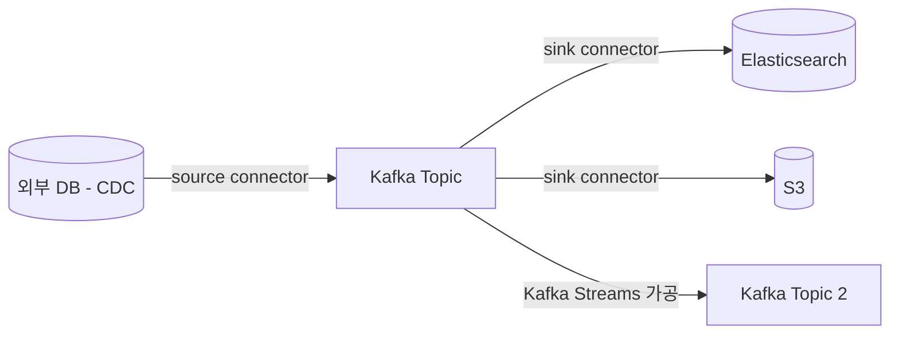

# Kafka Connect

## 핵심 정의
Kafka Connect는 Kafka와 외부 시스템(RDBMS, NoSQL, 파일, 클라우드 스토리지 등) 사이의 데이터 이동을 커넥터(connector) 플러그인과 설정으로 처리하는 통합 프레임워크다. 데이터를 Kafka로 가져오는 소스 커넥터(source connector)와 Kafka에서 외부로 내보내는 싱크 커넥터(sink connector)로 구분되며, 분산 모드(distributed mode)로 실행하면 여러 워커(worker) 프로세스가 클러스터를 이뤄 태스크를 분산·재조정한다.

## 동작 원리 / 구조

### 구성 요소
- **Worker**: Connect 클러스터를 구성하는 JVM 프로세스. 분산 모드에서는 워커들이 그룹 코디네이터를 통해 커넥터/태스크를 나눠 실행한다.
- **Connector**: 커넥터 생명주기와 작업 분할을 관리하고 태스크 설정을 생성하는 플러그인 단위. 레코드 이동의 주된 실행 단위는 Task다.
- **Task**: 커넥터가 나눈 실제 작업 단위. 병렬 처리의 기본 단위이며, `tasks.max`로 최대 태스크 수를 제한한다.
- **Converter**: 메시지를 Kafka에 쓰거나 읽을 때 직렬화/역직렬화 형식(JSON, Avro, Protobuf 등)을 지정한다. 스키마 레지스트리(schema registry)와 조합해 스키마 진화(schema evolution)를 관리하는 경우가 많다. Avro/Protobuf Converter와 Schema Registry는 별도 공급자의 플러그인·서비스이며 Apache Kafka에 모두 내장된 것은 아니다.
- **SMT(Single Message Transform)**: 커넥터를 거치는 개별 메시지를 필드 추출, 마스킹, 라우팅 등으로 가볍게 변형하는 인라인 처리 단계.

### 소스/싱크 흐름

### 오프셋 관리
- **소스 커넥터**: 외부 시스템에서 어디까지 읽었는지(예: DB의 마지막 timestamp/PK, 파일의 마지막 오프셋)를 분산 모드에서는 `offset.storage.topic`으로 지정한 내부 토픽(예: `connect-offsets`)에 기록하고, 단독 모드에서는 로컬 오프셋 파일을 사용한다.
- **싱크 커넥터**: 일반 Kafka 컨슈머와 동일하게 `__consumer_offsets`에 커밋한다.
- 커넥터 설정, 상태(status)도 분산 모드에서 `config.storage.topic`, `status.storage.topic`으로 지정한 내부 토픽에 저장되어, 워커가 죽어도 다른 워커가 이어받을 수 있다.

### 배포 모드
| 모드 | 특징 | 적합한 상황 |
|---|---|---|
| Standalone | 단일 프로세스, 소스 오프셋을 로컬 파일에 저장 | 개발·테스트, 자동 장애 전환이 필요 없는 단일 워커 작업 |
| Distributed | 여러 워커가 클러스터 구성, REST API로 커넥터 관리, 자동 태스크 재분배 | 운영 환경 |

### CDC(Change Data Capture) 패턴
가장 흔한 사용 사례는 Debezium 같은 CDC 커넥터로 DB의 트랜잭션 로그(binlog, WAL)를 읽어 변경분을 Kafka 토픽으로 스트리밍하는 것이다. 테이블을 반복 조회하는 부하를 줄이고 삭제(delete)까지 캡처할 수 있어, [[트랜잭셔널 아웃박스]] 패턴의 구현 수단으로도 자주 쓰인다(아웃박스 테이블을 CDC로 읽어 이벤트 발행).

### 상태 확인과 내부 토픽의 운영 경계

Kafka 4.3에서 커넥터 인스턴스와 실제 데이터를 처리하는 태스크의 상태는 별도다. REST 접속 성공이나 connector의 RUNNING만으로 정상 적재를 판단하지 않는다. `GET /connectors/{name}/status`에서 모든 태스크 상태·오류를 보고 처리량·소스 위치·싱크 반영도 확인한다. 재시작 API의 `includeTasks` 기본값은 false이므로 커넥터만 재시작하고 실패한 태스크까지 재시작했다고 오해하지 않는다.

분산 모드의 내부 토픽은 임시 캐시가 아니다. `config.storage.topic`은 단일 파티션·복제·컴팩션을 사용하고, offset/status 토픽도 복제·컴팩션을 적용하되 여러 파티션을 사용할 수 있다. 개발용 설정을 복사할 때 클러스터 식별자와 내부 토픽 소유 범위를 함께 확인한다. 단순 장애 복구 목적으로 내부 토픽을 삭제하면 커넥터 설정이나 재개 위치를 잃을 수 있다. 오프셋을 의도적으로 수정할 때는 커넥터를 STOPPED로 전환하고 대상 커넥터의 지원 범위를 확인해 REST 오프셋 관리 API를 사용한다.

### CDC의 after가 항상 완전한 행은 아니다

Debezium 3.3 PostgreSQL 커넥터에서 `REPLICA IDENTITY DEFAULT`일 때, 변경되지 않은 TOAST 값이 replica identity에도 속하지 않으면 UPDATE 이벤트에 원래 값이 실리지 않을 수 있다. 커넥터는 `unavailable.value.placeholder`로 대신 표시하며 기본값은 `__debezium_unavailable_value`다. 이는 SQL NULL도 실제 새 문자열 값도 아니다. `after` 전체를 그대로 UPSERT하거나 캐시 객체로 교체하면, 다른 컬럼만 변경한 이벤트가 기존 본문을 placeholder로 덮어쓸 수 있다.

싱크는 실제 NULL·미전달 표시·전달된 값을 구분하고, 기존 값과 합치는 경우 초기 상태 확보와 이벤트 순서까지 정한다. `REPLICA IDENTITY FULL`은 해당 TOAST 값을 before/after에 포함시키는 선택지지만 로그·전송량 비용을 함께 측정한다. 현재 DB를 별도 SELECT해 과거 이벤트의 빈 필드를 메우는 방식은 그 사이 더 최신 변경을 읽을 수 있으므로 같은 시점의 행 복원으로 간주하지 않는다. 이 한계는 PostgreSQL 커넥터의 값 표현 문제이며 Kafka Connect의 전달 보장만 강화해도 해결되지 않는다.

## 실무 관점
- 자체 프로듀서/컨슈머 코드를 작성하는 것보다 운영 부담이 적다. 이미 검증된 커넥터(Confluent Hub, Debezium 등)가 있는 시스템 연동이라면 Connect를 우선 검토하는 것이 일반적이다.
- `tasks.max`를 늘려도 실제 병렬도는 소스 시스템의 특성(예: 테이블 파티션 수, 파일 개수)이나 대상 토픽 파티션 수에 의해 제한될 수 있다. 커넥터별 태스크 분할 로직을 확인한다. 예를 들어 Debezium MySQL 커넥터는 단일 태스크로 binlog를 읽으므로 `tasks.max` 증설만으로 병렬화되지 않는다.
- 싱크 커넥터는 일반 컨슈머와 같은 순서·전달 보장 특성을 가진다. 멱등한 쓰기(upsert)를 지원하지 않는 외부 시스템에 at-least-once로 쓰면 중복이 발생할 수 있으므로, 대상 시스템의 유니크 키 제약이나 커넥터의 exactly-once 지원 여부(예: 일부 커넥터의 트랜잭션 지원)를 확인한다.
- SMT는 가볍게 값 변환/필터링하는 용도로만 쓰고, 복잡한 비즈니스 로직을 SMT 체인으로 구현하면 디버깅과 테스트가 어려워진다. 복잡한 변환이 필요하면 [[Kafka Streams]]나 별도 컨슈머/프로듀서 애플리케이션으로 분리하는 것이 낫다.
- 기본 `errors.tolerance=none`에서는 허용되지 않은 변환 오류로 태스크가 실패할 수 있다. `errors.tolerance=all`은 프레임워크가 처리 가능한 레코드 오류를 건너뛰는 정책이며 모든 커넥터 장애를 무시하지 않는다. 표준 DLQ(`errors.deadletterqueue.topic.name`)는 싱크 커넥터에 적용된다. 소스에도 동일하게 적용된다고 가정하지 말고 누락 허용 여부·DLQ 적재·경보를 함께 설계한다.
- 스키마 레지스트리를 쓰는 경우 스키마 호환성 모드(backward/forward/full)를 사전에 정해두지 않으면, 소스 스키마 변경이 싱크 쪽 컨슈머/커넥터를 예고 없이 깨뜨릴 수 있다.

## 심화 Q&A

### Q. CDC 기반 소스 커넥터가 DB 폴링 방식보다 유리한 이유는 구체적으로 무엇인가?
A. 폴링 방식(예: `SELECT ... WHERE updated_at > ?`)은 폴링 주기 사이의 변경을 놓치거나, 물리 삭제(hard delete)를 감지하지 못하고, 폴링 쿼리 자체가 소스 DB에 부하를 준다. CDC는 트랜잭션 로그를 순차적으로 읽으므로 캡처 대상으로 설정된 테이블의 삭제 등 변경을 로그 순서에 따라 읽는다. 초기 스냅샷·스키마 조회·로그 보존은 DB 부하를 발생시키며, 출력 토픽 전체의 전역 처리 순서까지 보장하지 않는다. 다만 CDC 커넥터가 로그를 읽는 지점(binlog 위치 등)을 잃어버리면 재동기화 비용이 크다는 트레이드오프가 있다.

### Q. 분산 모드에서 워커가 죽으면 그 워커가 실행 중이던 태스크는 어떻게 되는가?
A. Connect 클러스터도 컨슈머 그룹과 유사한 리밸런스 메커니즘을 사용한다. 워커 장애가 감지되면 그룹 코디네이터가 나머지 워커들에게 해당 워커가 담당하던 커넥터/태스크를 재분배한다. 소스 태스크는 저장된 소스 오프셋을 각 커넥터의 복구 규칙에 따라 해석하고, 싱크 태스크는 마지막 커밋된 컨슈머 오프셋부터 처리한다. 예를 들어 Debezium 3.3의 기본 `snapshot.mode=initial`에서 초기 스냅샷의 완료가 오프셋에 기록되기 전에 장애·리밸런스가 발생하면, 마지막으로 읽은 행 다음부터 잇지 않고 새 스냅샷을 시작한다. 초기 스냅샷 이후 로그 스트리밍의 재개도 필요한 로그·스키마 이력 보존이 전제다.

### Q. 하나의 소스 레코드가 중복 적재되는 상황은 왜 발생하고 어떻게 줄이는가?
A. 소스 커넥터가 외부 데이터를 읽어 Kafka에 쓴 뒤, 오프셋을 커밋하기 전에 워커가 죽으면 재시작 시 같은 구간을 다시 읽어 중복 레코드가 생길 수 있다. at-least-once 경로에서는 다운스트림 멱등성(유니크 키, upsert)이 필요하다. Kafka 3.3에서 추가된 소스 EOS는 분산 모드, 지원 커넥터, 워커의 `exactly.once.source.support=enabled`가 필요하다. 소스 오프셋과 Kafka 출력을 같은 트랜잭션으로 기록하고 이전 태스크를 fencing하지만 외부 DB 쓰기까지 포함하지 않는다. 기존 클러스터는 모든 워커를 `preparing`으로 전환한 뒤 `enabled`로 올리는 절차가 필요하다.

### Q. Kafka Connect와 자체 구현 프로듀서/컨슈머 중 무엇을 선택해야 하는가?
A. 표준적인 데이터 이동(단순 CDC, 파일 적재, 검색엔진 색인 등)이고 검증된 커넥터가 존재하면 Connect가 개발·운영 비용 면에서 유리하다. 반면 복잡한 비즈니스 로직, 세밀한 오류 처리, 커스텀 배치/재시도 정책이 필요하거나 SMT로 표현하기 어려운 변환이 있다면 자체 애플리케이션(또는 Streams)이 더 적합하다. 커넥터가 없는 시스템은 자체 애플리케이션 또는 Connect 플러그인 개발이 필요하다.

### Q. 스키마가 변경되면 이미 운영 중인 싱크 커넥터에 어떤 영향이 있는가?
A. Converter가 스키마 레지스트리를 사용하는 경우, 호환성 모드에 따라 결과가 다르다. BACKWARD는 새 리더 스키마가 이전 스키마의 데이터를 읽을 수 있다는 방향이다. Avro의 기본값 있는 필드 추가·필드 제거는 backward 호환일 수 있지만, 기존 컨슈머가 새 데이터를 읽는 forward 호환까지 뜻하지 않는다. 형식별 규칙과 컨슈머 배포 순서, 대상 DB 스키마를 함께 검증해야 한다. 비호환 스키마는 Registry 등록 단계에서 거부되거나 소비 시 오류가 날 수 있다. 스키마 변경 전에 호환성 검사를 CI에 포함시키는 것이 일반적인 방어책이다.

## 관련 개념
- [[VACUUM과 오토바큠]]
- [[Kafka Streams]]
- [[Kafka 아키텍처]]
- [[트랜잭셔널 아웃박스]]
- [[오프셋 관리와 정확히 한 번 처리]]

## 참고 자료

확인일: 2026-09-08. 아래 적용 범위에서 본문·Q&A·예제를 재검증했다. 예제는 문서와 대조했으며 별도 실행 검증은 하지 않았다.

- [Apache Kafka Connect User Guide](https://kafka.apache.org/43/kafka-connect/user-guide/) — Kafka 4.3, 워커·내부 토픽·오류 처리·소스 EOS.
- [Connect Worker Configs](https://kafka.apache.org/43/generated/connect_config.html) — Kafka 4.3, exactly.once.source.support 기본값과 전환.
- [Debezium MySQL Connector](https://debezium.io/documentation/reference/stable/connectors/mysql.html) — 확인일 stable 문서, 스냅샷·binlog·단일 태스크 범위.
- [Schema Evolution and Compatibility](https://docs.confluent.io/platform/current/schema-registry/fundamentals/schema-evolution.html) — Confluent Schema Registry, Avro 호환성 방향과 형식별 차이.

부분 재검증: 2026-09-23. Kafka 4.3 Connect의 커넥터/태스크 상태·재시작 기본 범위·내부 토픽 조건·오프셋 변경의 STOPPED 요구를 공식 User Guide에서 확인했다. 다른 커넥터 제품의 전체 검증일은 유지한다.

- [Kafka 4.3 Connect REST API](https://kafka.apache.org/43/kafka-connect/user-guide/#rest-interface) — 상태·includeTasks·stop·offsets API. 같은 문서의 분산 모드 내부 토픽 설정도 재확인.

부분 재검증: 2026-10-04. Debezium 3.3 PostgreSQL 커넥터의 unchanged TOAST·replica identity·placeholder 기본값과 별도 조회의 경쟁 조건을 공식 문서에서 확인했다. 싱크의 덮어쓰기·병합 경계는 이 값 표현에서 도출한 설계 판단이다. Debezium·Kafka·싱크를 실행한 결과가 아니며 다른 커넥터와 기존 EOS 설명 전체는 이번 검증 범위가 아니다. 전체 `verified`는 유지한다.

- [Debezium 3.3 PostgreSQL — Toasted values](https://debezium.io/documentation/reference/3.3/connectors/postgresql.html#postgresql-toasted-values) — DEFAULT/FULL의 TOAST 처리, `unavailable.value.placeholder`, 원본 DB 별도 조회로 빠진 값을 안전하게 복원할 수 없는 이유.

부분 재검증: 2026-10-04. Debezium 3.3 MySQL·PostgreSQL의 초기 스냅샷 완료 기록과 중단 후 재시작, 3.3.2.Final 고정 소스의 snapshotInProgress 판단을 확인했다. 워커 인계가 항상 마지막 행 다음부터의 재개를 뜻한다는 기존 문장을 수정했고, CDC의 부하 설명은 반복 조회 감소로 한정했다. 초기 스냅샷 재시작·리밸런스의 통합 실행은 하지 않았으며 전체 `verified`는 유지한다.

- [Debezium 3.3 MySQL snapshots](https://debezium.io/documentation/reference/3.3/connectors/mysql.html#mysql-snapshots) — 초기 스냅샷 완료 전 중단·재시작과 로그 재개 조건.
- [Debezium 3.3 PostgreSQL snapshots](https://debezium.io/documentation/reference/3.3/connectors/postgresql.html#postgresql-snapshots) — 초기 스냅샷 완료의 offset 기록, 장애·리밸런스 시 새 스냅샷.
- [InitialSnapshotter — v3.3.2.Final](https://github.com/debezium/debezium/blob/v3.3.2.Final/debezium-core/src/main/java/io/debezium/snapshot/mode/InitialSnapshotter.java) — offset이 있어도 snapshotInProgress이면 데이터 스냅샷을 수행하는 판단.
