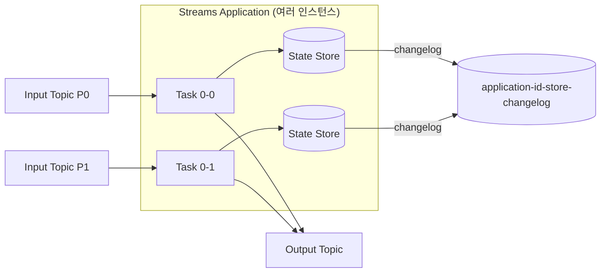

# Kafka Streams

## 핵심 정의
Kafka Streams는 Kafka 토픽을 입력/출력으로 삼아 스트림 처리(stream processing)를 수행하는 클라이언트 라이브러리다. 별도의 클러스터를 운영하는 Spark Streaming, Flink 같은 외부 처리 엔진과 달리, 애플리케이션 프로세스 자체가 Kafka 컨슈머/프로듀서로 동작하므로 별도의 처리 엔진 제어 클러스터 없이(애플리케이션 배포 자원은 필요하다) "Kafka in, Kafka out" 파이프라인을 구성할 수 있다. KStream(레코드 스트림)과 KTable(변경 로그 기반 테이블)이라는 두 가지 추상화를 통해 무한 스트림 데이터를 함수형 연산 체인으로 처리한다.

## 동작 원리 / 구조

### KStream vs KTable
| 구분 | KStream | KTable |
|---|---|---|
| 의미 | 독립적인 이벤트의 흐름(append-only) | 키별 최신 값을 유지하는 변경 로그(changelog) |
| 같은 키 재입력 | 별개의 레코드로 누적 | 이전 값을 덮어씀(upsert) |
| 내부 표현 | 레코드 스트림 | 키별 테이블 의미, 필요 시 로컬 상태로 materialize; 입력 토픽 자체에 compaction이 필수인 것은 아님 |
| 대표 연산 | `map`, `filter`, `flatMap` | `groupBy` + `aggregate`, `join` |

KStream을 `groupByKey().aggregate()`하면 KTable이 되고, KTable을 `toStream()`하면 테이블 변경 스트림으로 변환된다. 전체 테이블의 일회성 스냅샷을 내보내는 연산은 아니며, KTable의 null 값은 삭제(tombstone)를 나타낸다. 이 이중성(duality)이 Kafka Streams의 핵심 설계다.

### 토폴로지와 태스크
애플리케이션 코드는 프로세서 토폴로지(processor topology, DAG)로 컴파일된다. 토폴로지를 이루는 각 sub-topology는 입력 파티션 그룹에 따라 태스크(task)로 나뉘어 병렬 실행되며, 태스크는 스레드(`num.stream.threads`)와 인스턴스 사이에 분배된다.

- 단일 입력·단일 sub-topology 예제는 파티션당 태스크 하나지만, 조인 태스크는 여러 입력 토픽의 파티션을 함께 담당할 수 있다. 병렬도는 sub-topology별 입력 파티션 수로 제한되며 repartition 토픽이 이후 단계의 병렬도를 바꿀 수 있다. [[파티션과 컨슈머 그룹]]의 할당과 구분한다.
- 상태 저장이 필요한 연산(`aggregate`, `join`, `windowed count` 등)은 로컬 상태 저장소(state store, 기본 RocksDB)를 사용하고, 내구성을 위해 해당 상태 변경 내역을 내부 changelog 토픽(compacted topic)에 복제한다(로깅 비활성화·소스 토픽 재사용 등 구성별 예외가 있다). 인스턴스가 죽으면 다른 인스턴스가 changelog를 재생(replay)해 상태를 복구한다.
- 윈도우 연산(windowing)은 시간 기반으로 레코드를 그룹화한다. Tumbling, Hopping, Sliding, Session 윈도우를 지원하며 `grace period`로 지연 도착 데이터를 얼마나 기다릴지 설정한다.

### 정확히 한 번 처리
`processing.guarantee=exactly_once_v2` 설정 시 내부적으로 Kafka 트랜잭션 API를 사용해 "읽기 → 상태 갱신 → 쓰기 → 오프셋 커밋"을 원자적으로 묶는다. Kafka 내 출력·상태 changelog·입력 오프셋의 일관성이 대상이며 외부 HTTP/DB 부수 효과는 포함하지 않는다. 출력 소비자는 `read_committed`로 읽어야 한다. [[오프셋 관리와 정확히 한 번 처리]] 참고.

### 리밸런스 프로토콜의 진화
기존에는 컨슈머 그룹 리밸런스와 동일하게 클라이언트 주도(client-side) eager/cooperative 방식을 썼다. KIP-1071 Streams Rebalance Protocol은 브로커가 태스크 할당을 계산한다. Kafka 4.3 문서 기준 브로커·클라이언트 4.2+가 필요하며 새 4.2+ 클러스터에서는 서버 기능이 활성화된다. 클라이언트는 기본 `classic`에서 `group.protocol=streams`를 선택해야 한다. 이 프로토콜은 static membership, warmup/rack-aware assignor, 온라인 그룹 전환 등을 아직 지원하지 않는다.

## 실무 관점
- 별도 처리 클러스터(Flink 등)를 운영할 여력이 없거나, 입력/출력이 모두 Kafka인 단순~중간 복잡도의 변환·집계·조인 파이프라인에 적합하다. 복잡한 배치 처리, 대규모 조인, ML 파이프라인처럼 Kafka 생태계를 벗어나는 요구가 있으면 별도 스트림 처리 엔진을 검토한다.
- RocksDB 기반 상태 저장소는 디스크 I/O와 메모리(block cache)를 소비한다. 상태가 큰 애플리케이션은 인스턴스당 디스크 용량과 RocksDB block cache와 별개인 레코드 캐시 `statestore.cache.max.bytes` 설정을 사전에 산정해야 한다.
- 상태 복구(재시작, 리밸런스로 인한 태스크 이동)는 유효한 로컬 상태·checkpoint가 없으면 changelog의 복구에 필요한 구간을 재생하므로 상태 크기가 크면 복구 시간이 길어진다. `num.standby.replicas`(`StreamsConfig.NUM_STANDBY_REPLICAS_CONFIG`)를 1 이상으로 설정하면 다른 인스턴스가 미리 상태를 복제해두어 장애 전환(failover) 시간을 크게 줄일 수 있다. 새 `streams` 프로토콜에서는 클라이언트 설정 대신 그룹 설정 `streams.num.standby.replicas`를 사용한다. standby n개를 실질적으로 활용하려면 인스턴스도 최소 n+1개 이상 떠 있어야 한다.
- 내부적으로 생성되는 changelog·repartition 토픽은 사람이 직접 만들지 않아도 자동 생성되지만, 파티션 수·보존 정책이 운영에 영향을 준다. 모니터링 대상에 반드시 포함해야 한다.
- 일반 키 동등 조인은 입력 토픽의 파티션 수와 키 직렬화·파티셔닝 전략이 같아야 한다(co-partitioning). 파티션 수 불일치는 감지하지만 다른 해시 전략은 자동 검증하지 않는다. GlobalKTable 조인과 KTable 외래 키 조인은 예외다.

## 심화 Q&A

### Q. Streams reset 도구를 실행하면 출력과 로컬 상태도 처음으로 돌아가는가?
A. Kafka 4.3의 classic application reset 도구는 입력 오프셋을 지정 위치로 옮기고 내부 토픽을 삭제하지만 출력 토픽과 각 인스턴스의 로컬 상태는 초기화하지 않는다. 완전 재처리를 계획한다면 모든 인스턴스를 먼저 중지하고 대상 application.id·입력·내부 토픽을 확인한 뒤 `--dry-run`으로 변경 범위를 검토한다. 로컬 상태 정리와 출력 소비자의 중복·이전 결과 처리 계획은 별도로 필요하다.

출력 토픽에 과거 결과가 남은 상태에서 입력을 다시 읽으면 같은 업무 결과가 재발행될 수 있다. `exactly_once_v2`도 운영자가 의도적으로 시작한 새 재처리의 결과를 과거 결과와 업무적으로 중복 제거해 주지는 않는다. 별도 결과 토픽에서 검증 후 전환하거나, 결과 키·버전·멱등성을 갖춘 소비 경로로 복구해야 한다. 삭제된 입력 이력은 reset으로 복원되지 않는다. `group.protocol=streams`인 새 리밸런스 프로토콜은 공식 문서가 Streams groups CLI 사용을 안내하므로 classic reset 명령을 그대로 적용하지 않는다.

### Q. KTable에 대한 집계 연산이 왜 이벤트 발생 시점이 아니라 "최신 상태 변경" 관점으로 동작하는가?
A. KTable은 changelog 시맨틱을 갖기 때문에 동일 키에 대한 새 레코드가 들어오면 이전 값을 대체(upsert)한다. 따라서 `KTable.groupBy().aggregate()` 같은 연산은 각 키의 "현재 값"이 바뀔 때마다 이전 값을 먼저 빼고(subtract) 새 값을 더하는 방식으로 재계산된다. KStream 집계처럼 단순 누적이 아니라, 상태 전이(diff)를 반영하는 구조라는 점이 핵심 차이다. 레코드 캐시가 중간 갱신을 합칠 수 있어 모든 입력이 그대로 후속 변경 이벤트로 나가지는 않는다.

### Q. 상태가 있는 태스크가 다른 인스턴스로 옮겨가면 처리는 어떻게 이어지는가?
A. 새로 태스크를 할당받은 인스턴스는 로컬에 해당 상태 저장소가 없으면 changelog 토픽 전체(또는 standby replica가 이미 따라잡은 지점부터)를 읽어 RocksDB를 재구성한 뒤에야 레코드 처리를 재개한다. `num.standby.replicas`가 0이면 이 복구 구간 동안 해당 태스크의 처리가 완전히 멈추므로, 지연에 민감한 파이프라인은 standby와 영속 로컬 디스크를 복구 시간 목표·비용에 맞게 검토한다.

### Q. exactly_once_v2와 at_least_once의 처리량 차이는 실무에서 어느 정도인가?
A. 정확한 수치는 워크로드에 따라 다르지만, 트랜잭션 커밋 오버헤드(브로커 왕복, 배치 크기 제약)로 인해 EOS의 처리량·종단 지연(latency)이 달라진다. 모드별 기본 커밋 간격도 다르므로 동일한 배치·부하 조건에서 측정한다. `commit.interval.ms`를 늘려 커밋 빈도를 줄이면 처리량은 개선되지만 장애 시 재처리 구간과 다운스트림 가시성 지연이 함께 커지는 트레이드오프가 생긴다.

### Q. 윈도우 연산에서 grace period를 너무 짧게 잡으면 어떤 문제가 생기는가?
A. 윈도우 종료+grace를 stream-time(관측한 레코드 타임스탬프의 진행)이 넘어서 윈도우가 닫힌 뒤 도착하는 늦은 레코드(late-arriving record)는 기본적으로 버려진다. 네트워크 지연이나 업스트림 배치 처리로 인해 이벤트 시간(event time)과 처리 시간(processing time)의 차이가 큰 환경에서 grace period를 짧게 잡으면 정상 데이터가 조용히 유실될 수 있다. 반대로 너무 길게 잡으면 윈도우 결과 확정이 늦어지고 상태 저장소 크기가 커진다. 단순한 벽시계 타이머가 아니므로 새 레코드가 없으면 종료도 진행하지 않을 수 있다. 기본 집계는 중간 갱신을 내보낼 수 있고 최종 결과만 내보내려면 suppression 등 별도 설정이 필요하다.

### Q. Kafka Streams와 Kafka Connect를 함께 쓸 때 역할을 어떻게 나누는가?
A. Kafka Connect는 외부 시스템(DB, 파일, 다른 메시지 시스템)과 Kafka 사이의 데이터 이동(적재/추출)을 담당하고, Kafka Streams는 Kafka 토픽 간의 변환·집계·조인 로직을 담당한다. 전형적인 파이프라인은 "Connect(source)로 DB 변경분을 토픽에 적재 → Streams로 가공·집계 → Connect(sink)로 결과를 다른 저장소에 반영" 형태로 구성된다. 자세한 내용은 [[Kafka Connect]] 참고.

## 관련 개념
- [[Kafka 로그 보존과 컴팩션]]
- [[Kafka Connect]]
- [[Kafka 아키텍처]]
- [[파티션과 컨슈머 그룹]]
- [[오프셋 관리와 정확히 한 번 처리]]

## 참고 자료

확인일: 2026-09-08. 아래 적용 범위에서 본문·Q&A·예제를 재검증했다. 예제는 문서와 대조했으며 별도 실행 검증은 하지 않았다.

- [Kafka Streams Architecture](https://kafka.apache.org/43/streams/architecture/) — Kafka 4.3, 파티션 그룹·태스크·상태 복구.
- [Streams DSL](https://kafka.apache.org/43/streams/developer-guide/dsl-api/) — Kafka 4.3, KTable·조인 예외·window와 grace.
- [Configuring Streams](https://kafka.apache.org/43/streams/developer-guide/config-streams/) — Kafka 4.3, EOS·standby·커밋 간격.
- [Streams Memory Management](https://kafka.apache.org/43/streams/developer-guide/memory-mgmt/) — Kafka 4.3, 레코드 캐시와 RocksDB 메모리.
- [Streams Rebalance Protocol](https://kafka.apache.org/43/streams/developer-guide/streams-rebalance-protocol/) — Kafka 4.3 문서의 4.2+ 활성화·제약·그룹 설정.

부분 재검증: 2026-10-04. Kafka 4.3 application reset 도구의 입력·내부·출력·로컬 상태 범위와 classic/streams 프로토콜별 도구 선택을 확인했다. 재발행 결과의 업무 중복 처리는 이 범위와 기존 EOS 계약에서 도출한 설계 판단이다. 토픽 삭제·reset·실제 재처리는 실행하지 않았고 기존 `verified`는 유지한다.

- [Kafka 4.3 Application Reset Tool](https://kafka.apache.org/43/streams/developer-guide/app-reset-tool/) — 중지 조건·dry-run·출력과 로컬 환경 제외·Streams groups CLI 구분.
