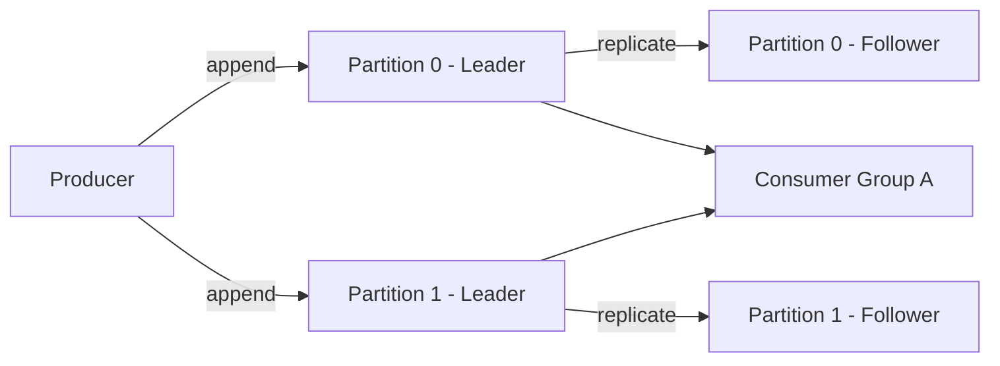

# Kafka 아키텍처

## 핵심 정의
Apache Kafka는 분산 커밋 로그(distributed commit log) 기반의 발행-구독(pub-sub) 메시징 시스템이다. 프로듀서(producer)가 토픽(topic)에 메시지를 쓰고 컨슈머(consumer)가 이를 읽는 구조이며, 각 토픽은 여러 파티션(partition)으로 분산 저장되어 수평 확장과 병렬 처리를 지원한다. 메타데이터 관리는 과거 ZooKeeper가 담당했으나, Kafka 4.0(2025년 3월 정식 출시)부터는 ZooKeeper가 완전히 제거되고 자체 합의 프로토콜인 KRaft(Kafka Raft)만 지원한다.

## 동작 원리 / 구조

### 구성 요소
- **Broker**: 메시지를 저장하고 요청을 처리하는 Kafka 서버 프로세스. 클러스터는 여러 브로커로 구성된다.
- **Topic / Partition**: 토픽은 논리적 메시지 채널이며, 실제로는 여러 파티션(append-only log)으로 나뉘어 저장된다. 파티션 내에서만 메시지 순서가 보장된다.
- **Replica**: 파티션은 내구성을 위해 여러 브로커에 복제된다. 리더(leader)가 쓰기와 기본 컨슈머 읽기를 처리하고(랙 인식 follower fetching은 예외), 팔로워(follower)는 리더를 복제한다.
- **ISR(In-Sync Replicas)**: 리더와 충분히 동기화된 복제본 집합. 리더 장애 시 우선 ISR에서 리더를 선출한다. ELR(Eligible Leader Replicas)을 사용하면 ISR 밖에서도 안전한 후보를 추적해 선출할 수 있다.
- **Controller**: 파티션 리더 선출, 브로커 장애 감지 등 클러스터 메타데이터를 관리하는 역할. KRaft 모드에서는 controller 쿼럼(quorum) 노드들이 Raft 합의로 메타데이터 로그를 관리하며, ZooKeeper 없이 자체적으로 처리한다.
- **Producer / Consumer**: 각각 메시지를 쓰고 읽는 클라이언트. 컨슈머는 컨슈머 그룹(consumer group) 단위로 파티션을 분담한다.

### 메시지 흐름

- 프로듀서는 파티셔너(partitioner)를 통해 메시지를 특정 파티션에 매핑한다(키가 있으면 기본적으로 키 해시, 키가 없으면 배치를 위한 sticky/adaptive 선택; 별도 RoundRobinPartitioner도 지원).
- 각 파티션은 오프셋(offset)이 붙은 순서형 로그이며, 디스크에 세그먼트(segment) 파일로 저장된다. 페이지 캐시와 순차 I/O를 적극 활용해 높은 처리량을 낸다.
- 컨슈머는 자신이 읽은 위치(offset)를 기록해두고, 그 이후부터 이어서 읽는다.

### KRaft 이전/이후 비교
| 구분 | ZooKeeper 모드 (Kafka 3.x 이하, KRaft는 2.8에서 조기 제공·3.3부터 운영 지원) | KRaft 모드 (Kafka 4.0+ 기본/유일) |
|---|---|---|
| 메타데이터 저장 | 외부 ZooKeeper 앙상블 | Kafka controller 역할의 쿼럼(Raft 로그) |
| 운영 복잡도 | 별도 클러스터 운영 필요 | ZooKeeper 제거, 운영에서는 controller와 broker 프로세스 분리 권장 |
| 컨트롤러 전환 | ZooKeeper 기반 선출·상태 로드 | 복제된 메타데이터 로그를 가진 controller가 선출; 실제 시간은 설정·규모에 의존 |

### 장애 도메인과 순차 재시작

Kafka 4.3의 controller 쿼럼은 메타데이터 합의를 담당하고, 토픽의 복제 계수와 ISR은 데이터 보존을 담당한다. Controller가 3대라고 토픽 데이터도 3개 복제본을 갖는 것은 아니다. `broker.rack`에 가용 영역 등의 장애 도메인을 반영하면 복제본 배치에 이를 사용할 수 있지만, controller 노드 배치와 실제 토픽 replica 위치는 각각 확인해야 한다. 설정 이름만 붙였다고 기존 배치가 안전해졌다고 가정하지 않는다.

RF=3, min ISR=2, acks=all이고 세 복제본이 모두 동기화된 상태라면 한 브로커 장애 후 ISR 2개로 쓰기를 지속할 수 있다. 그 상태에서 다른 브로커를 다시 내리면 ISR 1개가 되어 쓰기 확인 조건을 만족하지 못한다. 순차 재시작에서는 이전 브로커가 프로세스만 뜬 상태가 아니라, 관련 파티션의 복제 지연을 따라잡고 ISR에 복귀했는지 확인한 뒤 다음 브로커를 내린다. Controller 과반수도 동시에 유지해야 한다.

`controlled.shutdown.enable=true`의 정상 종료는 리더 이동과 재시작 시 로그 복구 비용을 줄이지만, 살아 있는 다른 복제본이 없는 파티션의 가용성을 만들어 주지는 못한다. 재시작 후 선호 리더 분포가 달라질 수 있으므로 ISR 복구와 리더 부하 분포를 함께 점검한다.

## 실무 관점
- 신규 구축이라면 Kafka 4.x 이상에서 ZooKeeper를 고려할 필요가 없다. 레거시 3.x 클러스터는 마이그레이션 시 ZooKeeper 모드에서 바로 4.0으로 갈 수 없고, 반드시 3.x KRaft 모드를 거쳐야 한다.
- 파티션 수는 늘리기는 쉽지만 같은 토픽에서 줄일 수 없다(새 토픽으로 이전 필요). 초기 설계 시 예상 처리량과 컨슈머 병렬도를 고려해 파티션 수를 정한다.
- 복제 계수(replication factor)는 장애 도메인과 비용을 고려해 운영에서 3을 흔히 선택하며, `min.insync.replicas`와 프로듀서 `acks` 설정을 조합해 내구성 수준을 결정한다.
- Kafka 4.3에서 ELR을 활성화하면 최소 ISR 조건이 하이 워터마크(High Watermark, HW) 진행에도 적용된다. ISR 수가 `min.insync.replicas`보다 작으면 새 기록의 HW가 전진하지 않는다. 이때 `acks=1`로 응답을 받더라도 해당 기록이 컨슈머에게 보이는 커밋 경계까지 도달했다고 판단하면 안 된다. 기존 클러스터는 업그레이드 버전뿐 아니라 ELR feature 활성화 상태도 확인한다.
- 브로커 디스크 장애나 네트워크 파티션 시 ISR이 축소되면서 가용성과 내구성 트레이드오프가 발생한다. 모니터링에서 `UnderReplicatedPartitions`, `OfflinePartitionsCount` 지표를 반드시 추적한다.
- 컨트롤러 쿼럼(KRaft controller) 노드 수는 과반수 합의를 사용하므로 보통 3 또는 5개로 구성한다. 짝수도 동작하지만 직전 홀수보다 한 노드가 늘어도 추가 장애 허용 수는 같아 비효율적이다.

## 심화 Q&A

### Q. 파티션 리더가 갑자기 죽으면 클라이언트 입장에서 어떤 일이 벌어지나?
A. 컨트롤러가 장애를 감지하고 ISR을 우선해 리더를 선출한다. Kafka 4.0에서 도입된 ELR은 4.1+ 신규 클러스터에서 기본 활성화되며 ISR이 비면 안전한 ELR 후보도 고려한다. 이 전환 동안 해당 파티션에 대한 쓰기/읽기 요청은 `NOT_LEADER_OR_FOLLOWER` 등의 오류를 받고, 클라이언트는 메타데이터를 새로고침해 새 리더로 재시도한다. `unclean.leader.election.enable`이 true면 안전성이 보장되지 않은 복제본도 리더가 될 수 있어 데이터 유실 가능성이 생기므로 기본값(false)을 유지하는 것이 일반적이다.

### Q. KRaft 모드에서 컨트롤러 쿼럼이 과반수 장애로 죽으면 클러스터는 어떻게 되나?
A. 메타데이터 로그에 대한 합의(quorum)를 이룰 수 없으므로 새로운 리더 선출이나 메타데이터 변경(토픽 생성, 파티션 재할당 등)이 멈춘다. 다만 기존에 이미 확정된 메타데이터를 기준으로 브로커 간 데이터 파티션의 읽기/쓰기 자체는 어느 정도 지속될 수 있다. 이는 ZooKeeper 앙상블이 과반수 장애일 때와 유사한 양상이다.

### Q. 파티션을 늘리면 왜 메시지 순서가 깨질 수 있는가?
A. Kafka는 파티션 단위로만 순서를 보장한다. 파티션 수를 늘리면 동일 키(key)의 메시지가 기존과 다른 파티션으로 재해싱되어 이후 들어오는 메시지와 순서 관계가 어긋날 수 있다. 순서 보장이 중요한 도메인 키라면 파티션 증설 시점과 방식(예: 신규 토픽으로 마이그레이션)을 신중히 설계해야 한다.

### Q. `acks=all`이면 데이터 유실이 전혀 없다고 볼 수 있나?
A. 아니다. `acks=all`은 리더가 ISR 전체의 확인(ack)을 받은 뒤 응답한다는 의미일 뿐, `min.insync.replicas`가 1이고 ISR이 리더 하나뿐인 상태라면 사실상 단일 복제본 확인과 동일해진다. 보통 `min.insync.replicas=2`, `replication.factor=3`을 조합한다. `acks=all`은 매 쓰기마다 모든 복제본의 디스크 fsync를 보장하지 않으며, 동시 저장 장치 손실 등 상관 장애까지 막지는 못한다.

### Q. 브로커 간 복제(replication)와 컨슈머의 읽기는 같은 방식인가?
A. 아니다. 팔로워 복제본이 리더로부터 데이터를 가져오는 것도 내부적으로는 fetch 요청이라는 점에서 비슷해 보이지만, 팔로워 복제는 ISR 유지와 오프셋 동기화가 목적이고 컨슈머 fetch는 컨슈머 그룹의 진행 상태(offset commit)와 연결된다. 또한 `replica.selector.class` 설정으로 랙 인식(rack-aware) 읽기를 구성하면 컨슈머가 가장 가까운 복제본에서 읽도록(follower fetching) 최적화할 수도 있다. 클라이언트 `client.rack`과 브로커 `broker.rack` 등 랙 설정도 필요하다.

## 관련 개념
- [[파티션과 컨슈머 그룹]]
- [[오프셋 관리와 정확히 한 번 처리]]

## 참고 자료

부분 재확인: 2026-09-22. Kafka 4.3 ELR 공식 운영 문서에서 엄격한 최소 ISR 조건과 HW 진행 제약을 확인했다. 기존 전체 확인일은 유지한다.

확인일: 2026-09-08. 아래 적용 범위에서 본문·Q&A·예제를 재검증했다. 예제는 문서와 대조했으며 별도 실행 검증은 하지 않았다.

- [Kafka Design](https://kafka.apache.org/43/design/design/) — Kafka 4.3, 로그·복제·ACK·follower fetching.
- [KRaft Operations](https://kafka.apache.org/43/operations/kraft/) — Kafka 4.3, controller 역할 분리·쿼럼·마이그레이션.
- [Eligible Leader Replicas](https://kafka.apache.org/43/operations/eligible-leader-replicas/) — 4.0 도입·4.1 신규 기본 활성화, ISR 밖 안전한 리더 후보.
- [Producer Configs](https://kafka.apache.org/43/configuration/producer-configs/) — Kafka 4.3, 파티셔너와 ACK 내구성 경계.

부분 재검증: 2026-09-23. Kafka 4.3의 rack-aware 배치·정상 종료와 controller/데이터 복제 경계를 공식 운영·KRaft·producer 문서로 대조했다. 실제 다중 브로커 재시작 실험은 하지 않았다. 기존 전체 검증일은 유지한다.

- [Kafka 4.3 Basic Operations](https://kafka.apache.org/43/operations/basic-kafka-operations/) — 랙별 복제본 배치, graceful shutdown, 재시작 후 리더 분포.
- [Kafka 4.3 KRaft](https://kafka.apache.org/43/operations/kraft/) — controller 과반수와 broker 역할의 구분.
- [Kafka 4.3 Topic Configs](https://kafka.apache.org/43/configuration/topic-configs/) — min.insync.replicas와 acks=all의 쓰기 실패 경계.
