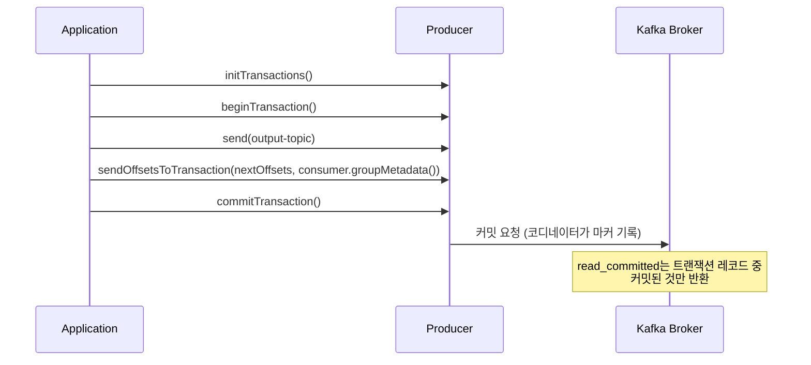

# 오프셋 관리와 정확히 한 번 처리

## 핵심 정의
오프셋(offset)은 파티션 내 각 메시지의 순번으로, 컨슈머가 "어디까지 읽었는지"를 나타내는 기준점이다. 커밋 값은 재개할 다음 위치이며 compaction·트랜잭션 마커 때문에 오프셋이 연속적이지 않을 수 있다. 오프셋 커밋(commit) 시점과 결과 저장의 원자성·멱등성에 따라 메시지가 최소 한 번(at-least-once), 최대 한 번(at-most-once), 또는 정확히 한 번(exactly-once) 처리되는지가 결정된다. Kafka는 프로듀서의 멱등성(idempotence)과 트랜잭션(transaction) API를 결합해 정확히 한 번 처리(exactly-once semantics, EOS)를 구현할 수 있게 지원한다.

## 동작 원리 / 구조

### 오프셋 저장 위치
컨슈머의 오프셋은 기본적으로 Kafka 내부 토픽인 `__consumer_offsets`에 저장된다(과거 ZooKeeper 저장 방식은 오래전에 폐기됨). 그룹 코디네이터가 이 토픽을 관리하며, 컨슈머는 `commitSync()` / `commitAsync()`로 커밋을 요청한다.

### 처리 방식과 오프셋 커밋 시점의 관계
| 방식 | 커밋 시점 | 특징 |
|---|---|---|
| At-most-once | 메시지 처리 전에 커밋 | 처리 중 장애 시 메시지 유실 가능 |
| At-least-once | 메시지 처리 후 커밋 | 커밋 전 장애 시 재처리(중복) 가능 |
| Exactly-once | 출력/상태 반영과 입력 진행 위치를 원자적으로 묶음 | Kafka 내 consume-transform-produce는 멱등성 + Kafka 트랜잭션; 외부 저장소는 별도 설계 |

### 멱등성 프로듀서(idempotent producer)
프로듀서에 `PID(Producer ID)`와 시퀀스 번호(sequence number)를 부여해, 네트워크 재시도로 인한 동일 메시지의 중복 append를 브로커가 감지해 걸러낸다. `enable.idempotence=true`가 Kafka 3.0부터 기본값이며, 이 경우 `acks=all`, `max.in.flight.requests.per.connection<=5`, `retries>0`이 필요한 조건이다. 명시적으로 멱등성을 켜고 충돌 설정을 주면 오류이며, 명시하지 않은 상태에서 충돌 설정을 주면 멱등성이 비활성화될 수 있다. 다만 멱등성은 "프로듀서 하나의 세션 내 단일 파티션 쓰기"에서의 중복만 막아주며, 여러 파티션에 걸친 원자적 쓰기는 보장하지 않는다.

### 트랜잭션과 정확히 한 번 처리
"컨슈머로 읽기 → 처리 → 프로듀서로 쓰기 → 오프셋 커밋"의 소비-생산 체인(consume-transform-produce)을 원자적으로 묶으려면 트랜잭션 API가 필요하다.

- `transactional.id`를 설정하면 프로듀서 재시작 시에도 이전 트랜잭션을 정리(fencing)할 수 있다. 동일 `transactional.id`로 새 프로듀서가 뜨면 이전 epoch의 요청이 브로커에서 거부되어 좀비 프로듀서(zombie producer) 문제를 방지한다.
- `sendOffsetsToTransaction()` 경로에서는 `enable.auto.commit=false`로 두고 `commitSync/commitAsync`를 별도로 호출하지 않는다. 컨슈머 오프셋 커밋 자체를 같은 트랜잭션에 포함시켜, 출력 메시지 쓰기와 입력 오프셋 커밋을 원자적으로 처리한다. 처리한 배치의 다음 오프셋(4.3에서는 `records.nextOffsets()` 활용)과 `consumer.groupMetadata()`를 전달한다. groupId 문자열을 받던 overload는 4.0에서 제거됐다.
- 다운스트림 컨슈머는 `isolation.level=read_committed`로 설정해야 커밋되지 않은(또는 abort된) 트랜잭션 메시지를 걸러내고 읽는다. 기본값은 `read_uncommitted`이므로 명시적으로 설정해야 한다. 비트랜잭션 레코드도 두 모드 모두에서 읽을 수 있다.

### 커밋된 트랜잭션과 poll 반환 묶음의 차이

`read_committed`는 미커밋·abort 레코드를 숨기는 조건이며 생산자의 트랜잭션을 한 번의 `poll()` 결과로 묶어 반환하는 조건이 아니다. Kafka 4.3 Java Consumer의 `max.poll.records`는 호출당 반환 수를 제한하고, 가져온 레코드를 여러 poll에 나눠 반환한다. 따라서 한 트랜잭션의 레코드가 여러 반환 묶음에 나뉘거나, 한 반환 묶음에 여러 커밋된 트랜잭션의 레코드가 섞일 수 있다. 트랜잭션 마커도 일반 레코드로 반환되지 않는다.

원천 DB의 한 트랜잭션을 싱크 DB에서도 하나로 적용해야 한다면 `poll` 배치를 그대로 업무 트랜잭션 경계로 사용하지 않는다. 커넥터가 원천 트랜잭션 식별·종료·기대 건수 정보를 제공하는지와 소비 측의 묶음 완성·복구 방식을 별도로 확인한다. Kafka 내 출력·오프셋의 원자적 커밋과 외부 DB에서 여러 행을 동시에 보이게 하는 요구는 구분한다.

## 실무 관점
- EOS는 "Kafka 토픽 → Kafka 토픽" 파이프라인(예: Kafka Streams)에서 가장 깔끔하게 적용된다. 외부 시스템(DB, 외부 API)에 결과를 쓰는 경우 Kafka 트랜잭션만으로는 exactly-once를 보장할 수 없고, 처리한 이벤트 ID와 비즈니스 변경을 같은 DB 트랜잭션에 저장하는 inbox/중복 제거 등이 필요하다. 이어서 발행할 이벤트가 있으면 아웃박스를 결합한다. 단순 upsert도 증가 연산·외부 부수 효과를 자동으로 멱등하게 만들지는 않는다.
- 외부 저장소를 포함하는 처리에서는 "at-least-once + 멱등한 처리 로직"을 검토한다. 트랜잭션 오버헤드(지연 증가, 처리량 감소)가 있고, Kafka 자체 트랜잭션의 원자성 범위가 Kafka에 한정되기 때문이다. 외부 DB에 결과와 입력 진행 위치를 같은 트랜잭션으로 저장하는 등 외부 저장소에 맞는 exactly-once 효과 설계도 가능하다.
- `enable.auto.commit=true`는 `auto.commit.interval.ms` 간격으로 소비 위치를 커밋하며 비즈니스 완료를 검사하지 않는다. 다음 poll/close 전에 반환된 배치를 전부 동기 처리하면 자동 커밋으로도 at-least-once가 가능하다. 비동기·버퍼링 처리에서는 수동 커밋으로 파티션별 연속 완료 지점만 전진시킨다.
- Spring Kafka 4.1 문서에서는 트랜잭션 가능한 `ProducerFactory`의 `transactionIdPrefix`와 `KafkaTransactionManager`를 구성한다. Boot는 `spring.kafka.producer.transaction-id-prefix`로 지원한다. DB 트랜잭션과 동기화해도 순차 커밋이므로 첫 커밋 후 두 번째 실패가 가능하며 보상·아웃박스가 필요하다. 폐기된 `ChainedKafkaTransactionManager`를 새 설계에 사용하지 않는다.
- 오프셋을 너무 자주 동기 커밋하면 처리량이 떨어지고, 너무 드물게 커밋하면 재처리 범위가 커진다. 배치 단위로 묶어 커밋하는 것이 일반적 절충안이다.

## 심화 Q&A

### Q. 멱등성 프로듀서만으로 exactly-once를 달성할 수 없는 이유는?
A. 멱등성은 PID+시퀀스 번호 기반으로 "같은 프로듀서 세션이 같은 파티션에 같은 메시지를 재전송"하는 경우만 중복 제거한다. 여러 파티션에 걸친 쓰기의 원자성(all-or-nothing)이나, 컨슈머 오프셋 커밋과 프로듀서 쓰기 사이의 원자성은 보장하지 않는다. 이 두 가지를 묶으려면 트랜잭션 API(`transactional.id`, `sendOffsetsToTransaction`)가 필요하다.

### Q. 트랜잭션이 커밋되기 직전에 브로커가 죽으면 어떻게 되는가?
A. 트랜잭션 커밋은 트랜잭션 코디네이터가 관리하는 2단계 절차(트랜잭션 로그에 커밋 의도 기록 → 각 파티션에 커밋 마커 기록)로 이뤄진다. 코디네이터나 파티션 리더가 죽어도 트랜잭션 로그(`__transaction_state` 내부 토픽)에 기록된 상태를 기준으로 새 리더/코디네이터가 트랜잭션을 이어서 완료하거나 abort 처리한다. 애플리케이션 입장에서는 커밋 요청에 대한 응답을 못 받을 수 있으나, 최종 상태는 내구성 있는 트랜잭션 로그로 복구된다. 이미 커밋 의도가 확정된 트랜잭션을 임의로 abort하는 것은 아니다. 애플리케이션은 예외별 재시도 가능성·fatal 여부에 따라 처리한다.

### Q. `read_committed` 격리 수준을 쓰면 컨슈머 지연(latency)이 늘어나는 이유는?
A. `read_committed` 컨슈머는 트랜잭션이 실제로 커밋(또는 abort) 마커가 기록될 때까지 가장 이른 미완료 트랜잭션이 정하는 LSO(last stable offset) 이후를 노출하지 않는다. 그 뒤의 다른 트랜잭션·비트랜잭션 레코드도 함께 기다릴 수 있으며 abort 레코드는 건너뛴다. 트랜잭션이 오래 걸리거나 좀비 트랜잭션이 방치되면 그만큼 컨슈머가 메시지를 늦게 보게 된다. `transaction.timeout.ms`로 트랜잭션 최대 지속 시간을 제한해 이 지연을 관리한다.

### Q. 좀비 프로듀서(zombie producer)란 무엇이고 어떻게 방지되는가?
A. 동일 `transactional.id`를 가진 프로듀서 인스턴스가 재시작되었는데 이전 인스턴스가 아직 살아서 메시지를 쓰고 있는 상황을 말한다. 예를 들어 GC pause나 네트워크 지연으로 이전 인스턴스가 죽은 것으로 오판되어 새 인스턴스가 뜬 경우다. 새 프로듀서가 `initTransactions()`를 호출하면 epoch 번호가 증가하고, 이전 epoch를 가진 프로듀서의 요청은 브로커가 거부(fencing)해 좀비가 데이터를 쓰지 못하게 막는다.

### Q. 오프셋을 리셋(reset)해서 메시지를 재처리하고 싶을 때 주의할 점은?
A. `--to-earliest`, `--to-datetime` 등으로 오프셋을 되돌리면 그 이후 메시지가 다시 소비되므로 다운스트림 처리가 멱등하지 않다면 중복 부작용(중복 결제, 중복 알림 등)이 발생할 수 있다. 또한 컨슈머 그룹이 활성 상태(active)일 때는 오프셋 리셋 명령이 거부되므로 그룹을 멈추고 실행해야 하며, 리셋 범위가 넓으면 처리 폭주로 인한 부하 급증도 함께 고려해야 한다.

### Q. commitTransaction이 타임아웃이면 abort한 뒤 같은 배치를 다시 보내면 되는가?
A. Kafka 4.3.1 `KafkaProducer.commitTransaction()`의 `TimeoutException`은 브로커가 커밋하지 않았다는 증거가 아니다. API는 같은 커밋 호출을 재시도할 수 있지만, 커밋이 이미 진행 중일 수 있으므로 `abortTransaction()`으로 바꾸는 것은 허용하지 않는다. 재시도하지 않으면 producer를 닫는다. `abortTransaction()`의 타임아웃도 같은 abort 재시도 또는 종료로 처리하며 반대로 commit하지 않는다. `ProducerFencedException` 같은 치명적 오류와 구분해야 한다.

Kafka 트랜잭션을 abort해도 `KafkaConsumer`의 메모리상 position까지 자동으로 되감기지는 않는다. 이미 poll한 입력을 다시 처리할 수 있도록 저장한 배치를 재사용하거나 소유 중인 파티션을 올바른 위치로 seek하는 등의 복구 절차가 필요하다. 리밸런스로 소유권을 잃었다면 이전 배치를 계속 처리·커밋하지 않는다.

## 관련 개념
- [[파티션과 컨슈머 그룹]]
- [[Kafka 아키텍처]]

## 참고 자료

확인일: 2026-09-08. 아래 적용 범위에서 본문·Q&A·예제를 재검증했다. 예제는 문서와 대조했으며 별도 실행 검증은 하지 않았다.

- [KafkaConsumer API](https://kafka.apache.org/43/javadoc/org/apache/kafka/clients/consumer/KafkaConsumer.html) — Kafka 4.3.1, 다음 오프셋·자동 커밋·외부 오프셋 저장.
- [KafkaProducer API](https://kafka.apache.org/43/javadoc/org/apache/kafka/clients/producer/KafkaProducer.html) — Kafka 4.3.1, EOS·epoch·ConsumerGroupMetadata.
- [Producer Configs](https://kafka.apache.org/43/configuration/producer-configs/) — Kafka 4.3, 멱등성 기본값·충돌 설정.
- [Consumer Configs](https://kafka.apache.org/43/configuration/consumer-configs/) — Kafka 4.3, isolation.level·LSO.
- [Spring Kafka Transactions](https://docs.spring.io/spring-kafka/reference/kafka/transactions.html) — 확인일 4.1 문서, ProducerFactory·트랜잭션 동기화 한계.
- [Kafka Upgrade Guide](https://kafka.apache.org/43/getting-started/upgrade/) — 4.0에서 groupId 문자열 overload 제거.

부분 재검증: 2026-09-23. Kafka 4.3.1 producer API의 오프셋 트랜잭션 전용 커밋과 commit/abort 타임아웃 처리, consumer의 position·커밋·seek 구분을 재확인했다. Spring Kafka 설정 등 노트 전체는 재검증하지 않았다.

- [KafkaProducer 4.3.1 commitTransaction](https://kafka.apache.org/43/javadoc/org/apache/kafka/clients/producer/KafkaProducer.html#commitTransaction()) — 커밋 응답 불확실성·동일 연산 재시도·다른 연산 전환 금지. sendOffsetsToTransaction의 별도 커밋 금지도 확인.
- [KafkaConsumer 4.3.1](https://kafka.apache.org/43/javadoc/org/apache/kafka/clients/consumer/KafkaConsumer.html) — position과 committed position·seek의 분리. abort 이후 입력 재처리 절차는 두 클라이언트 계약을 함께 적용한 설명이다.

부분 재검증: 2026-10-04. Kafka 4.3의 max.poll.records 반환 제한과 4.3.1 Java Consumer의 트랜잭션 마커 비노출을 확인했다. poll 경계를 원천 트랜잭션 경계로 사용하지 말라는 설명은 두 계약에서 도출한 설계 판단이다. 브로커·CDC·외부 싱크의 원자적 적용을 실행 검증한 결과가 아니며 전체 `verified`는 유지한다.

- [Kafka 4.3 max.poll.records](https://kafka.apache.org/43/configuration/consumer-configs/#max.poll.records) — fetch와 별개인 poll 반환 개수 제한.
- [KafkaConsumer 4.3.1 — Reading Transactional Messages](https://github.com/apache/kafka/blob/4.3.1/clients/src/main/java/org/apache/kafka/clients/consumer/KafkaConsumer.java#L411-L437) — read_committed 범위·트랜잭션 마커 필터링.
