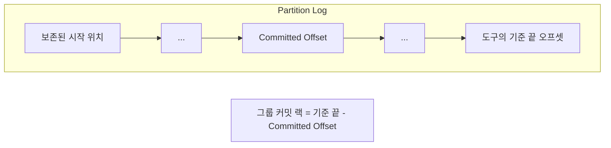
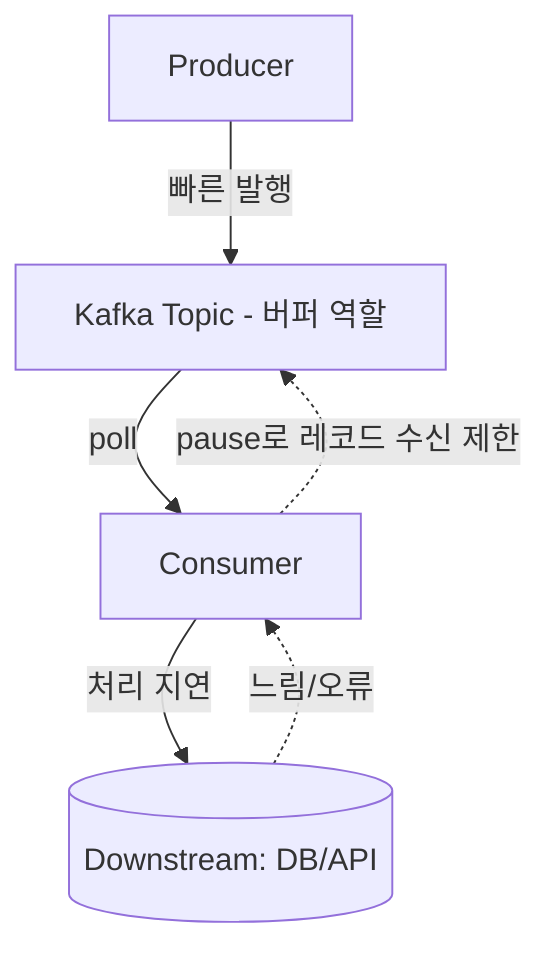

# 컨슈머 랙과 백프레셔

## 핵심 정의
컨슈머 랙(consumer lag)은 파티션의 기준 끝 오프셋과 소비 진행 위치의 차이로, 소비자가 얼마나 뒤처져 있는지 보여준다. 그룹 커밋 위치를 쓰는 운영 도구와 현재 소비 위치를 쓰는 클라이언트 지표는 서로 다르며, 기준 끝도 격리 수준·조회 API에 따라 달라진다. 물리 로그 끝(Log End Offset, LEO), 복제 완료 경계(High Watermark, HW), 트랜잭션 가시성 경계(Last Stable Offset, LSO)를 구분해야 한다.

백프레셔(backpressure)는 소비 측이 처리 속도를 넘어서는 유입을 감지했을 때 유입 속도를 의도적으로 조절하는 흐름 제어(flow control) 메커니즘이다. Kafka는 디스크 용량과 보존 정책 범위에서 버퍼링하므로 랙이 쌓여도 즉시 장애로 이어지지는 않지만, 방치하면 지연 누적·재처리 범위 확대·읽기 전 로그 삭제로 이어질 수 있다.

## 동작 원리 / 구조

### 랙 계산과 관측 지점

- 랙은 오프셋 차이 기준(compaction·트랜잭션 마커로 실제 메시지 수와 다를 수 있음)과 시간 기준(마지막 처리 레코드의 timestamp와 현재 시각의 차이) 두 가지로 볼 수 있다. 메시지 크기나 처리 시간 편차가 큰 워크로드에서는 시간 기준 지표가 유용하지만, timestamp의 의미와 새 메시지 유입 여부를 확인해야 실제 지연으로 해석할 수 있다.
- Kafka 4.3.1의 `kafka-consumer-groups.sh --describe`는 커밋 위치와 Admin `listOffsets(latest)` 결과의 차이를 표시한다. 이 경로는 기본 `READ_UNCOMMITTED`의 소비자용 조회이므로 브로커가 HW를 반환한다. 출력 이름 `LOG-END-OFFSET`을 브로커의 물리 LEO와 동일시하면 안 된다. Java `KafkaConsumer.endOffsets()`도 `read_uncommitted`에서는 HW, `read_committed`에서는 LSO를 반환한다.
- 컨슈머 JMX의 `records-lag-max`·`records-lag`는 커밋 위치가 아닌 현재 소비 위치 기준이다. `read_committed`의 fetch lag는 LSO 기준이며 열린 트랜잭션 때문에 HW까지 읽지 못할 수 있다. 컨슈머가 멈추면 클라이언트 메트릭이 갱신되지 않을 수도 있으므로 수집 시각·활성 멤버·업무 처리 지연을 함께 본다.
- 랙은 절대값 하나만으로 판단하기보다 추세(trend)로 봐야 한다. 순간적으로 증가했다가 스스로 줄어드는 것은 정상적인 버퍼링이고, 지속 증가하면 처리 능력·장애·재시도를 조사한다. 높은 랙이 일정하게 유지되어도 지연 목표를 위반할 수 있고 커밋 중단도 랙 증가 원인이다.

### 백프레셔가 발생하는 지점

Kafka 파이프라인에서 병목은 대개 컨슈머 자체가 아니라 다운스트림(DB, 외부 API, 다른 큐)에 있다. 컨슈머가 다운스트림 포화를 감지해 스스로 소비 속도를 늦추는 것이 Kafka 컨슈머의 백프레셔 구현 방식이다.

### 컨슈머 측 흐름 제어 수단
| 메커니즘 | 동작 |
|---|---|
| `pause()` / `resume()` | 특정 파티션의 레코드 반환을 일시 중단/재개. 그룹 유지를 위해 poll 호출 자체는 계속 수행 |
| `max.poll.records` | poll이 반환하는 최대 레코드 수 제한. 네트워크 fetch 크기·내부 버퍼를 제한하지 않으며 단일 레코드 실행 시간은 별도 관리 |
| `fetch.max.bytes` / `max.partition.fetch.bytes` | fetch 응답 크기 조절. 첫 비어 있지 않은 파티션의 큰 첫 배치는 진행 보장을 위해 한도를 초과해 반환 가능 |
| `max.poll.interval.ms` | poll 호출 간 최대 허용 시간. 백프레셔로 poll을 늦추다가 이 값을 넘기면 리밸런스가 트리거됨 |

### 시간 지연과 따라잡을 시간의 구분

Kafka 4.3의 `message.timestamp.type`은 CreateTime 또는 LogAppendTime을 선택하며 기본은 CreateTime이다. CreateTime은 생산자 측 시각과 과거 데이터 재발행의 영향을 받으므로, `현재 시각 - 레코드 timestamp`가 Kafka 내부 대기 시간만을 뜻하지 않는다. LogAppendTime도 브로커에 들어오기 전의 업무 지연은 측정하지 못한다. 생산자·브로커·처리 완료 시각의 기준과 시계 오차를 명시한다. 새 이벤트가 없는 유휴 토픽은 마지막 처리 이벤트의 나이만 계속 증가해도 미처리 건수는 0일 수 있다.

따라잡을 시간은 처리량 자체보다 순수 소진 속도로 추정한다. 실제 미처리 작업이 60,000건이고 유입이 초당 800건, 완료가 초당 1,000건으로 일정하다면 예상 소진 시간은 `60,000 / (1,000 - 800) = 300초`다. 완료 속도가 유입 이하이면 이 가정에서 소진되지 않는다. 오프셋 차이는 실제 건수와 다를 수 있으므로 단위를 섞지 않고 파티션별로 추정한다. 재시도·큰 레코드·다운스트림 포화가 생기면 이 값은 보장 시간이 아니므로 보존 창에 여유를 둔다.

## 실무 관점
- **보존 창까지 남은 여유를 본다.** `pause()`는 로그 삭제를 멈추지 않는다. 중단 시간과 따라잡을 시간을 합쳐 보존 기간 안에 들어오는지 확인한다. 커밋 위치가 이미 삭제되었을 때 기본 `auto.offset.reset=latest`로 넘어가면 랙만 낮아지고 미처리 기록은 복구되지 않는다([[Kafka 로그 보존과 컴팩션]]).
- 랙 알림 임계값을 고정 숫자(예: "랙 10,000 이상이면 알림")로만 잡으면 트래픽 스파이크마다 오탐이 발생한다. 슬라이딩 윈도우로 랙의 증가 추세를 보는 방식(예: Burrow류 접근)이나, 메시지 처리량 대비 상대적 랙 비율을 함께 보는 것이 오탐을 줄인다.
- 일반 컨슈머 그룹에서 소비 CPU가 병목이면 할당 파티션과 활성 컨슈머를 늘리는 방법을 검토한다. 파티션 수보다 컨슈머를 늘려봐야 초과분은 유휴 상태가 되어 효과가 없다([[파티션과 컨슈머 그룹]] 참고). 파티션이 부족하면 증설이 필요하지만, 키 기반 순서 보장이 걸려 있으면 재해싱 문제를 함께 고려해야 한다.
- 처리 시간이 다운스트림 병목 때문이라면 컨슈머/파티션을 늘리는 것보다 다운스트림 자체의 확장(커넥션 풀 크기, DB 인덱스, 외부 API 레이트 리밋 협의)이 근본 해결책인 경우가 많다. 컨슈머만 늘리면 다운스트림에 대한 동시 요청만 늘어 오히려 상황이 악화될 수 있다.
- `pause()`/`resume()` 기반 흐름 제어는 큐 적재량, 커넥션 풀 대기 시간, 회로 차단기(circuit breaker) 상태 등 명확한 신호를 기준으로 하고, 임계값 하나로 온오프하기보다 히스테리시스(예: 80%에서 pause, 40%에서 resume)를 둬서 진동(flapping)을 방지한다.
- 처리 시간이 긴 로직 때문에 `max.poll.interval.ms`를 초과해 불필요한 리밸런스가 반복되는 것은 흔한 장애 패턴이다. 무거운 처리는 별도 워커 스레드/큐로 위임하고 poll 루프는 가볍게 유지하되, 유한한 작업 큐·파티션별 순서·연속 완료 지점 커밋·반납 시 작업 중단을 구현하거나, 배치 크기(`max.poll.records`)를 줄여 poll 주기 안에 처리가 끝나도록 조정한다.
- Spring Kafka에서는 `ConcurrentKafkaListenerContainerFactory`의 `concurrency`와 리스너 컨테이너의 `pause`/`resume` API, 그리고 `RetryTopicConfiguration` 기반 재시도/DLT 조합으로 흐름 제어와 오류 격리를 다룬다. retry topic은 원본의 처리 순서를 바꿀 수 있으며 non-blocking retry는 컨테이너 트랜잭션·배치 리스너와 함께 사용할 수 없다.

## 심화 Q&A

### Q. 랙이 0인데도 실질적으로 데이터가 지연되어 처리되고 있는 경우가 있는가?
A. 있다. 현재 소비 위치 기준 랙은 이미 poll로 받은 뒤 처리 중인 레코드를 반영하지 않는다. 처리 후 커밋하는 그룹 커밋 랙에는 그 레코드가 남는다. 컨슈머가 레코드를 poll해서 오프셋을 먼저 커밋하고 비동기로 처리하는 구조라면, 오프셋 랙은 낮아도 실제 비즈니스 처리 지연은 클 수 있다. 이런 경우 처리 완료 시점 기준의 별도 지연 메트릭(예: 레코드 timestamp 대비 처리 완료 시각)을 함께 둬야 한다.

### Q. 컨슈머를 파티션 수 이상으로 늘렸는데도 랙이 줄지 않는다면 무엇을 의심해야 하는가?
A. 우선 초과 컨슈머는 애초에 파티션을 할당받지 못해 유휴 상태이므로 도움이 안 된다는 점을 확인해야 한다. 그다음으로 병목이 컨슈머 자체가 아니라 다운스트림(DB 커넥션 풀 고갈, 외부 API 레이트 리밋)에 있는지, 혹은 특정 파티션에 트래픽이 쏠리는 핫 파티션 문제인지, GC 정지 시간이 처리 시간을 잡아먹고 있는지를 순서대로 점검한다.

### Q. `pause()`로 특정 파티션의 poll을 멈추면 그 사이 브로커 쪽에서는 무슨 일이 일어나는가?
A. 브로커 입장에서는 해당 컨슈머로부터 fetch 요청이 오지 않을 뿐, 파티션 자체나 다른 컨슈머에는 영향이 없다. Java 컨슈머는 하트비트와 별개로 `max.poll.interval.ms` 안에 poll을 계속 호출해야 한다. 모든 파티션을 pause해도 빈 poll을 지속하면 pause 기간 자체로 리밸런스되지 않는다. pause는 이미 반환된 작업을 취소하지 않으며 토픽의 보존·삭제도 멈추지 않는다.

Kafka 4.3.1 Java Consumer의 pause/resume 상태는 리밸런스 후 보존되는 계약이 아니다. 다운스트림 장애가 계속되는데도 새로 할당된 파티션에서 소비를 재개하면 작업 큐가 다시 넘칠 수 있다. 애플리케이션의 과부하·회로 상태를 pause 목록과 별도로 유지하고, 할당 변경 후 현재 소유한 파티션에 조건을 다시 적용한다. 이미 반납한 파티션에 pause/resume을 호출하지 않으며, 이전 할당의 비동기 완료 콜백이 새 할당의 중단 상태를 임의로 풀지 않도록 소유권을 구분한다. Spring 컨테이너 등 상위 프레임워크의 추가 상태 관리와는 구분해 확인한다.

### Q. 백프레셔 없이 컨슈머가 계속 최대 속도로 poll만 하면 어떤 문제가 생기는가?
A. 다운스트림이 감당 못 하는 속도로 요청이 몰려 커넥션 풀 고갈, DB 락 경합, 외부 API 스로틀링(429) 등이 발생하고, 이는 처리 실패와 재시도 폭증으로 이어져 오히려 전체 처리량이 떨어지는 정체(thrashing) 상태에 빠질 수 있다. 백프레셔는 단기적으로 컨슈머 처리량을 낮추더라도 시스템 전체의 안정적인 처리량을 지키기 위한 장치다.

### Q. 재처리를 위해 오프셋을 되돌렸을 때 랙 지표가 갑자기 치솟는 것이 문제가 되는가?
A. 오프셋을 과거로 리셋하면 순간적으로 랙이 커지는 것은 정상이며 실제 장애는 아니다. 다만 알림 시스템이 이를 실제 처리 지연으로 오인해 불필요한 경보를 발생시킬 수 있으므로, 의도적인 재처리 작업 전에는 알림을 일시 억제하거나 별도 유지보수 태그를 남기는 절차가 필요하다. 동시에 재처리로 인한 다운스트림 부하 급증(중복 쓰기, API 폭주)도 함께 대비해야 한다.

## 관련 개념
- [[파티션과 컨슈머 그룹]]
- [[오프셋 관리와 정확히 한 번 처리]]
- [[Kafka Streams]]
- [[멱등성과 메시지 순서 보장]]
- [[Kafka 로그 보존과 컴팩션]]

## 참고 자료

부분 재확인: 2026-09-22. Kafka 4.3.1의 그룹 CLI 최신 오프셋 조회·Java Consumer HW/LSO와 Kafka 4.3 보존 만료 시 초기화 정책을 확인했다. 기존 전체 확인일은 유지한다.

- [ListOffsetsHandler 4.3.1](https://raw.githubusercontent.com/apache/kafka/4.3.1/clients/src/main/java/org/apache/kafka/clients/admin/internals/ListOffsetsHandler.java) · [Partition 4.3.1](https://raw.githubusercontent.com/apache/kafka/4.3.1/core/src/main/scala/kafka/cluster/Partition.scala) — 소비자용 ListOffsets 요청과 READ_UNCOMMITTED latest의 HW 반환.
- [ConsumerGroupCommand 4.3.1](https://raw.githubusercontent.com/apache/kafka/4.3.1/tools/src/main/java/org/apache/kafka/tools/consumer/group/ConsumerGroupCommand.java) — 커밋 위치와 최신 조회 결과의 차이로 CLI 랙 계산.
- [OffsetsUtils 4.3.1](https://raw.githubusercontent.com/apache/kafka/4.3.1/tools/src/main/java/org/apache/kafka/tools/OffsetsUtils.java) · [ListOffsetsOptions 4.3.1](https://raw.githubusercontent.com/apache/kafka/4.3.1/clients/src/main/java/org/apache/kafka/clients/admin/ListOffsetsOptions.java) — latest 조회와 기본 `READ_UNCOMMITTED` 경로.

확인일: 2026-09-08. 아래 적용 범위에서 본문·Q&A·예제를 재검증했다. 예제는 문서와 대조했으며 별도 실행 검증은 하지 않았다.

- [Kafka Monitoring](https://kafka.apache.org/43/operations/monitoring/) — Kafka 4.3, JMX 랙은 현재 위치 기준.
- [KafkaConsumer API](https://kafka.apache.org/43/javadoc/org/apache/kafka/clients/consumer/KafkaConsumer.html) — Kafka 4.3.1, pause·poll·비동기 작업과 커밋.
- [Consumer Configs](https://kafka.apache.org/43/configuration/consumer-configs/) — Kafka 4.3, fetch 크기 예외·max.poll.records·LSO.
- [Pausing Listener Containers](https://docs.spring.io/spring-kafka/reference/kafka/pause-resume.html) — Spring Kafka 4.1, pause 중 poll 유지.
- [Non-Blocking Retries](https://docs.spring.io/spring-kafka/reference/retrytopic.html) — Spring Kafka 4.1, 배치·컨테이너 트랜잭션 제약.
- [Retry Topic Pattern](https://docs.spring.io/spring-kafka/reference/retrytopic/how-the-pattern-works.html) — Spring Kafka 4.1, 처리 순서 변경.

부분 재검증: 2026-09-23. Kafka 4.3 토픽 timestamp 설정을 확인하고 시간 지연·유휴 상태·순수 소진 속도의 해석을 보강했다. 300초 계산은 일정 유입/처리율 가정의 산술 예시이며 실제 Kafka 처리량 측정이 아니다. 기존 전체 검증일은 유지한다.

- [Kafka 4.3 Topic Configs](https://kafka.apache.org/43/configuration/topic-configs/#message.timestamp.type) — CreateTime·LogAppendTime과 생산자 시각 허용 범위.

부분 재검증: 2026-10-04. Kafka 4.3.1 Java Consumer의 리밸런스 후 pause/resume 상태 미보존과 현재 할당에만 호출 가능한 제약을 고정 태그 소스로 확인했다. 상태 재적용·이전 콜백 분리는 이 계약에서 도출한 애플리케이션 설계 지침이다. 브로커·리밸런스·Spring 컨테이너 실행 시험은 하지 않았으며 전체 `verified`는 유지한다.

- [KafkaConsumer 4.3.1 — pause](https://github.com/apache/kafka/blob/4.3.1/clients/src/main/java/org/apache/kafka/clients/consumer/KafkaConsumer.java#L1494-L1506) — 리밸런스 상태 보존 제약 및 미할당 파티션 오류.
