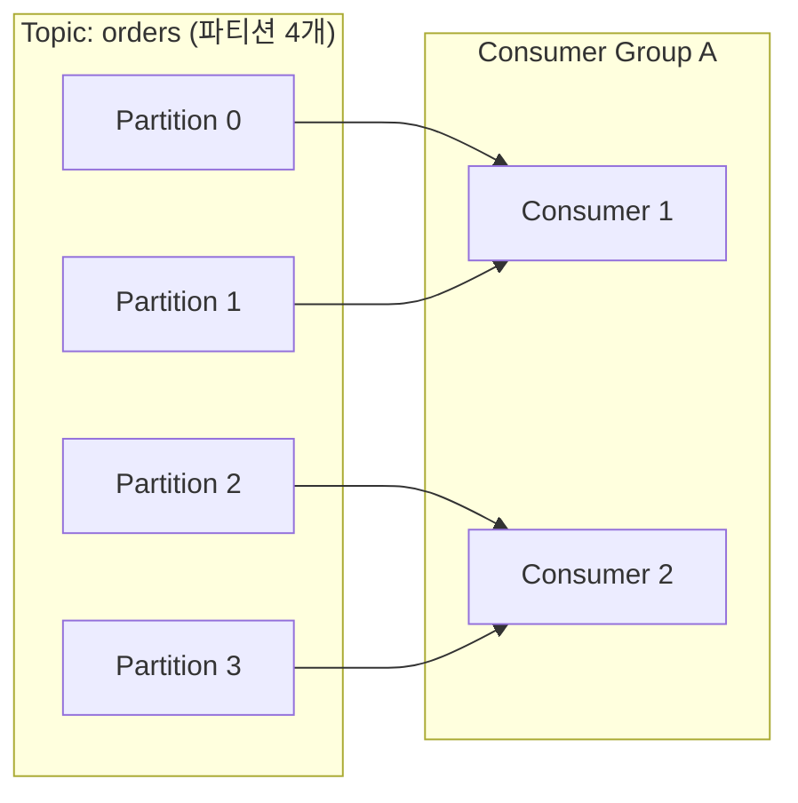

# 파티션과 컨슈머 그룹

## 핵심 정의
파티션(partition)은 토픽을 물리적으로 나눈 순서형 로그 단위이며, Kafka의 병렬 처리와 확장성의 기본 단위다. 컨슈머 그룹(consumer group)은 동일한 `group.id`를 공유하는 컨슈머 인스턴스들의 집합으로, 그룹 내에서 토픽의 파티션들을 나눠 가져(assign) 파티션 소유권을 나눠 병렬로 소비한다. 재처리까지 중복이 없다는 뜻은 아니다. 하나의 파티션은 같은 그룹 안에서 동시에 최대 한 컨슈머에게만 할당된다. 이 노트는 `KafkaConsumer`의 일반 컨슈머 그룹 범위다. Kafka 4.2부터 운영 지원되는 Share Groups는 같은 파티션의 레코드를 여러 소비자가 분담하고 개별 ACK하는 별도 모델이다.

## 동작 원리 / 구조

### 파티션 할당 규칙
- 그룹 내 컨슈머 수가 파티션 수보다 적으면 일부 컨슈머가 여러 파티션을 담당한다.
- 컨슈머 수가 파티션 수보다 많으면 초과분 컨슈머는 유휴(idle) 상태가 된다. 즉 파티션 수가 그룹의 최대 병렬도를 결정한다.
- 서로 다른 그룹은 독립적으로 동일 토픽을 각자 전부 읽을 수 있다(pub-sub의 broadcast 특성).

### 리밸런스(rebalance)
컨슈머의 추가/이탈, 토픽 파티션 수 변경 시 그룹 코디네이터(group coordinator, 브로커 중 하나)가 파티션 재할당을 트리거한다.

- **Eager rebalance**: 모든 컨슈머가 기존에 할당받은 파티션을 전부 반납한 뒤 재분배. 리밸런스 동안 그룹 전체가 일시 정지(stop-the-world)한다.
- **Cooperative(incremental) rebalance**: `CooperativeStickyAssignor` 등을 사용해 변경이 필요한 파티션만 반납/재할당하고 나머지는 유지. 정지 시간이 짧다.
- Kafka Streams는 KIP-1071(Kafka 4.x)로 도입된 새로운 리밸런스 프로토콜을 통해 유휴 시간을 더 줄이는 방향으로 발전하고 있다.

Kafka 4.0에서 GA가 된 KIP-848 `group.protocol=consumer`는 브로커가 증분 할당을 계산하며 클라이언트의 기본값은 4.3에서도 `classic`이다. 새 프로토콜의 heartbeat/session timeout은 브로커가 관리하고, `partition.assignment.strategy` 대신 서버 assignor를 사용한다. Streams의 KIP-1071과 구분한다.

### 파티션 할당 전략(assignor)
아래 클래스 설정은 `classic` 프로토콜 범위다.
- `RangeAssignor`: 토픽별로 범위 단위 할당. 여러 토픽에서 특정 컨슈머에 부하가 몰릴 수 있음.
- `RoundRobinAssignor`: 모든 토픽의 파티션을 한데 모아 라운드로빈 분배로 균형은 좋으나 stickiness 없음.
- `StickyAssignor` / `CooperativeStickyAssignor`: 재할당 시 기존 할당을 최대한 유지해 이동을 최소화.

### 처리를 작업 스레드로 넘길 때 필요한 제어

Kafka 4.3.1 `KafkaConsumer`는 일반 메서드의 스레드 안전성을 보장하지 않는다. poll·pause/resume·오프셋 커밋은 한 소비 스레드가 소유하고 작업 스레드는 완료 결과를 돌려주는 구조로 설계한다. 외부 스레드의 `wakeup()`은 소비 스레드를 깨우는 별도 허용 경로다.

처리만 무제한 작업 큐로 넘기면 poll이 정상이어도 메모리와 DB 부하가 계속 쌓인다. 처리 중인 파티션은 pause하고 소비 스레드는 계속 poll하며, 완료된 연속 구간까지만 커밋한다. pause는 재할당 자체를 일으키지 않지만 리밸런스 뒤 유지되지 않으므로 새 할당과 작업 상태를 다시 맞춘다. 소유권을 잃은 파티션의 늦은 완료 결과는 새 소유자의 진행 위치에 합치지 않는다.

## 실무 관점
- 병목이 컨슈머 처리 속도라면 파티션을 늘리고 컨슈머 인스턴스를 그만큼 늘려야 실질적인 병렬 처리 이득이 있다. 컨슈머만 늘려봐야 파티션 수를 넘는 순간부터는 효과가 없다.
- 리밸런스는 처리 지연(latency spike)을 유발하는 흔한 원인이다. classic의 `session.timeout.ms`(consumer 프로토콜은 브로커 `group.consumer.session.timeout.ms`)와 `max.poll.interval.ms`를 처리·장애 감지 목표에 맞게 조정하지 않으면 정상 컨슈머가 죽은 것으로 오판되어 불필요한 리밸런스가 반복될 수 있다.
- 파티션 키 설계가 편향(skew)되면 특정 파티션에 트래픽이 몰려 해당 컨슈머만 과부하되는 핫 파티션(hot partition) 문제가 생긴다. 키 분포를 사전에 점검해야 한다.
- Spring Kafka 등에서 `@KafkaListener`에 `concurrency` 옵션으로 리스너 컨테이너 스레드를 늘릴 때도, 실제 파티션 수 이상으로는 병렬도가 늘지 않는다는 점을 감안해야 한다.
- `CooperativeStickyAssignor`로 전환 시 그룹 내 모든 컨슈머가 같은 프로토콜을 지원해야 하므로 롤링 배포 시 호환성 문제가 생길 수 있다. 배포 순서를 계획해야 한다.

### 파티션 증설과 latest 초기화가 만드는 건너뜀

Kafka 4.3에서 `auto.offset.reset`은 유효한 기존 커밋 위치가 없을 때의 정책이다. 파티션을 늘리면 기존 그룹이라도 새 파티션에는 아직 커밋 위치가 없다. `latest` 상태에서 생산자가 새 파티션에 먼저 기록하고 소비자가 나중에 초기 위치를 잡으면, 그 사이 기록된 이벤트를 로그에 남겨 둔 채 소비 시작점 앞쪽으로 건너뛸 수 있다. 기존 파티션의 정상 커밋·낮은 lag가 새 파티션의 완전한 소비까지 증명하지 않는다.

증설 전에 신규 파티션의 시작 위치와 생산·소비 전환 순서를 정한다. 남아 있는 모든 이벤트를 처리해야 한다면 earliest 또는 검토한 명시적 위치를 사용하고, 예상하지 못한 reset을 실패로 드러내려면 none과 복구 절차를 검토한다. earliest도 보존 기간이 지난 레코드를 복구하지 않는다. 키 라우팅 변화에 따른 업무 순서 문제와 신규 파티션 초기 위치 문제를 각각 점검한다.

## 심화 Q&A

### Q. 컨슈머 그룹에 새 컨슈머가 조인하면 기존에 처리 중이던 메시지는 어떻게 되는가?
A. 리밸런스가 발생하면 파티션 소유권이 바뀌는데, 커밋되지 않은 오프셋 구간의 메시지는 새로 그 파티션을 할당받은 컨슈머가 마지막 커밋 지점부터 다시 읽게 된다. 즉 처리했지만 커밋 전이었던 메시지는 중복 처리될 수 있다. 이를 줄이려면 배치별 연속 처리 완료 지점을 커밋하거나, 리밸런스 리스너(`ConsumerRebalanceListener`)로 파티션 반납 직전에 커밋하는 로직을 넣는다. `onPartitionsLost`는 소유권을 이미 잃은 상황이므로 반납 전 커밋과 동일하게 취급할 수 없다. 외부 부수 효과에는 멱등성도 필요하다.

### Q. 파티션 수를 3에서 6으로 늘리면 기존 키 기반 라우팅은 어떻게 되나?
A. 기본 파티셔너는 키 해시값을 파티션 수로 나눈 나머지로 파티션을 결정하므로, 파티션 수가 바뀌면 같은 키라도 다른 파티션에 매핑될 수 있다. 이는 파티션 내 동일 키의 파티션 간 처리 순서를 더 이상 연결할 수 없게 한다. 기존 각 파티션 내부 로그 순서 자체는 유지된다. 순서가 중요한 키라면 파티션 증설 시 기존 토픽을 유지하며 늘리기보다 신규 토픽으로 전환하는 방식을 검토해야 한다.

### Q. Eager rebalance와 cooperative rebalance 중 무엇을 기본으로 써야 하는가?
A. 그룹 크기가 크거나 리밸런스가 빈번한 환경(오토스케일링 등)에서는 cooperative 방식이 유리하다. 그룹 전체 파티션을 일괄 반납하는 중단을 줄이기 때문이다. 이동하는 파티션과 리밸런스 콜백 처리에는 여전히 중단이 있다. 다만 cooperative는 리밸런스 로직이 더 복잡해 디버깅이 어려울 수 있고, 일부 오래된 클라이언트/프레임워크 버전과의 호환성을 확인해야 한다.

### Q. 컨슈머가 `max.poll.interval.ms`를 넘겨 처리하면 무슨 일이 일어나는가?
A. 동적 멤버는 poll 시간 초과로 그룹 이탈·재할당 대상이 된다. `group.instance.id`를 사용하는 정적 멤버는 즉시 재할당하지 않고 하트비트를 멈춘 뒤 session timeout 만료 시 재할당한다. 이때 컨슈머 스레드 자체는 살아있어도 하트비트(heartbeat)와 무관하게 poll 루프가 오래 걸리면 발생하는 문제이므로, 처리 시간이 긴 로직은 별도 스레드로 위임하거나 배치 크기(`max.poll.records`)를 줄이는 방식으로 대응한다.

### Q. 컨슈머 그룹 없이(구독 없이) 특정 파티션을 직접 지정해서 읽는 방식(`assign`)은 언제 쓰는가?
A. 그룹 코디네이터의 자동 파티션 관리를 원하지 않고, 애플리케이션이 직접 파티션-컨슈머 매핑을 제어해야 하는 경우(예: 특정 파티션만 별도 인스턴스가 전담, 또는 커스텀 로드밸런싱)에 `subscribe` 대신 `assign`을 사용한다. 이 경우 리밸런스가 발생하지 않으며 자동 파티션 재할당을 애플리케이션이 책임진다. `group.id`와 자동 커밋을 설정하면 수동 assign에서도 Kafka에 자동 커밋할 수 있다. 같은 group.id로 같은 파티션을 직접 assign한 여러 프로세스는 커밋을 덮어쓸 수 있으므로 충돌을 피한다.

## 관련 개념
- [[Kafka 아키텍처]]
- [[오프셋 관리와 정확히 한 번 처리]]

## 참고 자료

확인일: 2026-09-08. 아래 적용 범위에서 본문·Q&A·예제를 재검증했다. 예제는 문서와 대조했으며 별도 실행 검증은 하지 않았다.

- [KafkaConsumer API](https://kafka.apache.org/43/javadoc/org/apache/kafka/clients/consumer/KafkaConsumer.html) — Kafka 4.3.1, 일반 그룹·수동 assign·커밋.
- [Consumer Configs](https://kafka.apache.org/43/configuration/consumer-configs/) — Kafka 4.3, classic 기본값·정적 멤버·시간 제한.
- [Consumer Rebalance Protocol](https://kafka.apache.org/43/operations/consumer-rebalance-protocol/) — 4.0+ KIP-848 GA, 서버 할당과 classic 차이.
- [Kafka Upgrade Guide](https://kafka.apache.org/43/getting-started/upgrade/) — Kafka 4.2+ Share Groups 운영 지원과 일반 그룹 차이.

부분 재검증: 2026-09-23. Kafka 4.3.1 consumer API의 스레드 안전성·wakeup 예외·작업 분리·pause와 리밸런스 경계를 확인했다. 기존 프로토콜 기본값과 Streams·Share Groups 서술은 전체 재검증하지 않았다.

- [KafkaConsumer 4.3.1 Multi-threaded Processing](https://kafka.apache.org/43/javadoc/org/apache/kafka/clients/consumer/KafkaConsumer.html#multithreaded) — 소유 스레드·작업 분리·pause API 계약.
- [ConsumerRebalanceListener 4.3.1](https://kafka.apache.org/43/javadoc/org/apache/kafka/clients/consumer/ConsumerRebalanceListener.html) — revoked/lost의 소유권 경계와 완료 결과 처리.

부분 재검증: 2026-10-04. Kafka 4.3의 auto.offset.reset 적용 조건과 파티션 증설 시 latest의 건너뜀 경계를 확인했다. 증설 전환 순서·시작 위치 점검은 해당 계약에서 도출했다. 실제 브로커 파티션 증설·오프셋 초기화는 실행하지 않았고 기존 `verified`는 유지한다.

- [Kafka 4.3 auto.offset.reset](https://kafka.apache.org/43/configuration/consumer-configs/#auto.offset.reset) — 신규 파티션·초기 오프셋·latest 경고와 earliest/none 정책.
