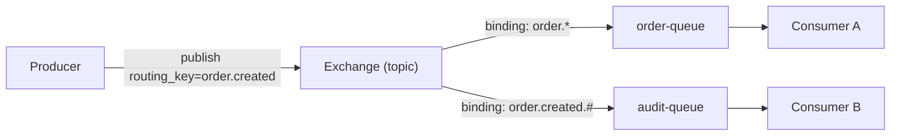

# Exchange와 Queue 바인딩

## 핵심 정의
이 노트는 RabbitMQ 4.3의 AMQP 0-9-1 모델을 다룬다. RabbitMQ는 AMQP 1.0·Stream 등도 지원하며 여기서는 프로듀서(producer)는 메시지를 큐(queue)에 직접 보내지 않고 항상 익스체인지(exchange)에 발행(publish)한다. 익스체인지는 메시지를 어느 큐로 보낼지 결정하는 라우터 역할만 하고, 메시지를 실제로 저장하는 것은 큐다. 바인딩(binding)은 "이 익스체인지의 메시지를 어떤 조건으로 이 큐(또는 다른 익스체인지)에 전달할지"를 정의하는 규칙이며, 익스체인지 타입에 따라 라우팅 키(routing key)를 그대로 매칭하거나, 패턴 매칭하거나, 아예 무시하고 헤더(header)로 매칭한다.

매칭되는 바인딩이 없는 메시지는 기본적으로 폐기되지만, `mandatory=true`면 발행자에게 반환되고 alternate exchange가 있으면 대체 라우팅을 시도한다. 이는 RabbitMQ 설계에서 자주 놓치는 부분으로, "발행에 성공했다"는 것이 "큐에 도착했다"를 의미하지 않는다는 점을 반드시 이해해야 한다.

## 동작 원리 / 구조

### 익스체인지 타입별 라우팅 규칙

| 타입 | 라우팅 기준 | 특징 |
|---|---|---|
| Direct | 라우팅 키가 바인딩 키와 정확히 일치(K = R) | 1:1 또는 동일 키를 가진 다수 큐로 유니캐스트/멀티캐스트 |
| Fanout | 라우팅 키 완전 무시 | 바인딩된 모든 큐에 브로드캐스트 |
| Topic | 라우팅 키를 `.`으로 구분한 세그먼트 패턴 매칭 (`*`=세그먼트 1개, `#`=0개 이상) | 가장 유연, `#` 단독 바인딩은 fanout과 동일하게 동작 |
| Headers | 라우팅 키 대신 메시지 헤더 속성으로 매칭 (`x-match: any/all`) | 다중 속성 기반 라우팅에 사용, 실무 사용 빈도 낮음 |



### 바인딩의 내구성(durability)
바인딩 자체는 소스(exchange)와 대상(queue/exchange)의 내구성을 물려받는다. durable 익스체인지와 durable 큐 사이의 바인딩은 완전 durable, 한쪽만 durable이면 semi-durable, 둘 다 transient면 fully transient로 분류된다. 브로커 재시작 시 durable 바인딩만 다시 복원되므로, 운영 환경에서는 지속 보관할 익스체인지·큐를 durable로 선언한다. 바인딩에는 별도 durable 플래그가 없다. 4.3 문서는 semi-durable/transient 바인딩의 향후 지원 제거를 예고하므로 일시적인 구독은 별도 생명주기로 설계한다.

### 기본 익스체인지(default exchange)
빈 문자열(`""`) 이름의 default 익스체인지는 direct 타입의 특수 케이스로, 모든 큐가 큐 이름과 동일한 라우팅 키로 암묵적으로 바인딩되어 있다. `basic.publish`에서 라우팅 키를 큐 이름과 동일하게 지정하면 별도 바인딩 선언 없이 해당 큐로 바로 전달된다.

### alternate exchange가 mandatory 반환을 대신하는 경우

RabbitMQ 4.3에서 대체 익스체인지(Alternate Exchange, AE)를 통해 어느 큐로든 라우팅되면 `mandatory` 관점에서도 라우팅 성공이다. 원래 주문 큐 바인딩이 빠져 모든 메시지가 AE의 미분류 큐로 들어가도 `basic.return`은 오지 않는다. 따라서 반환 오류가 0이라는 지표만으로 의도한 소비 경로가 정상이라고 판단하지 말고, AE 유입량·미분류 큐 적체와 업무 처리 완료를 함께 본다. `mandatory`는 의도한 모든 구독 큐의 존재나 업무 처리를 확인하는 기능도 아니다.

AE는 원래 익스체인지에서 어떤 큐에도 라우팅하지 못했을 때 사용하는 대체 경로다. 메시지가 이미 큐에 들어간 뒤 소비 실패·TTL 만료로 이동하는 DLX와 목적이 다르다. 빈 이름의 default exchange는 AE를 지원하지 않으므로, 큐 이름 직접 라우팅처럼 보이는 발행에도 AE 정책을 일괄 적용할 수 있다고 가정하지 않는다.

### Spring AMQP에서의 선언 예시
`RabbitAdmin`이 선언하는 Bean 예제다. `order.created.#`는 `order.created` 자체와 추가 세그먼트를 모두 매칭한다.
```java
@Bean
public TopicExchange orderExchange() {
    return new TopicExchange("order.exchange", true, false);
}

@Bean
public Queue orderQueue() {
    return QueueBuilder.durable("order.queue").build();
}

@Bean
public Binding orderBinding(Queue orderQueue, TopicExchange orderExchange) {
    return BindingBuilder.bind(orderQueue)
            .to(orderExchange)
            .with("order.created.#");
}
```

### 큐 선언 변경과 재시작 경계

RabbitMQ 4.3.0부터 비내구성(non-durable)·비독점(non-exclusive) classic queue 생성은 기본적으로 허용되지 않는다. 재시작 후 유지할 큐는 durable로, 연결 수명에 묶인 임시 큐는 exclusive로 설계하고, 공유 임시 큐가 필요하면 durable 큐에 TTL 등 명시적인 정리 정책을 검토한다. Exclusive·auto-delete 큐에 고정 이름을 재사용하면 재연결의 재선언과 이전 큐 삭제가 경합할 수 있어 서버 생성 이름이 적합하다.

같은 이름을 다시 선언해도 기존 큐의 durable 같은 속성이 변경되는 것은 아니다. 속성이 불일치하면 `406 PRECONDITION_FAILED`로 채널이 닫힐 수 있다. 큐 타입·내구성 변경을 애플리케이션 선언 코드만 바꾸는 배포로 처리하지 말고, 새 큐 준비 → 바인딩·소비 전환 → 잔여 메시지 처리 순서로 이전한다. 정책으로 변경 가능한 옵션과 선언 시 고정되는 속성도 구분한다.

Durable은 재시작 보존 속성이며 복제본 수를 뜻하지 않는다. RabbitMQ 4.x의 classic queue는 복제되지 않으므로 클러스터에 브로커가 여러 대라는 이유만으로 해당 큐의 노드 장애를 견딘다고 판단하면 안 된다. 복제 내구성이 필요하면 quorum queue 등 큐 타입을 선택하고 별도로 확인한다.

## 실무 관점
- **왜 direct 대신 topic을 기본값으로 많이 쓰는가**: 초기에는 direct로 충분해 보여도, 도메인 이벤트가 늘어나면 세분화된 라우팅 키(`order.created`, `order.cancelled`)가 필요해진다. 처음부터 topic으로 설계해두면 큐 추가 시 익스체인지나 발행 코드 변경 없이 바인딩만 추가하면 된다.
- **바인딩 누락은 조용한 장애다**: 바인딩이 없거나 라우팅 키 오타로 매칭되지 않으면 기본 설정에서는 메시지가 폐기될 수 있다. 존재하지 않는 익스체인지로 발행하는 경우는 별도로 채널 오류가 난다. 이를 막으려면 `mandatory` 플래그와 `ReturnCallback`(Spring AMQP의 `setMandatory(true)` + `setReturnsCallback`)을 설정해 라우팅 실패 메시지를 되돌려받도록 해야 한다.
- **Dead Letter Exchange(DLX) 조합**: 큐에 `x-dead-letter-exchange`를 지정해두면 TTL 만료, 큐 길이 초과, `basic.reject`/`basic.nack`의 `requeue=false`, quorum queue의 delivery-limit 초과 시 메시지가 DLX로 라우팅된다. 실무에서는 이 DLX에 별도 바인딩을 걸어 재처리 큐나 알림 큐로 보낸다.
- **fanout 오남용 주의**: 모든 큐에 무조건 뿌리는 fanout은 구독자가 늘어날수록 불필요한 트래픽과 저장 비용이 증가한다. 특정 조건의 큐만 받아야 한다면 처음부터 topic/headers로 설계하는 것이 낫다.
- **headers 익스체인지는 잘 안 쓴다**: 설정된 헤더 조건과 값의 타입을 비교하므로 라우팅 키 규약으로 표현하기 어려운 다중 속성 조건에 적합하다. 성능은 바인딩 수와 패턴·헤더 조건으로 측정한다. 다중 조건 AND/OR 라우팅이 꼭 필요한 특수 케이스에만 고려한다.
- **exchange-to-exchange 바인딩**: 큐뿐 아니라 익스체인지끼리도 바인딩할 수 있어, 공통 라우팅 로직을 상위 익스체인지에 두고 하위 익스체인지로 위임하는 계층 구조를 만들 수 있다(예: 감사 로그를 여러 도메인 익스체인지에서 공통 audit 익스체인지로 재라우팅).

## 심화 Q&A

### Q. 프로듀서가 큐 이름을 지정해서 발행하는 것처럼 보이는 코드(`rabbitTemplate.convertAndSend(queueName, message)`)는 실제로 어떻게 동작하는가?
`RabbitTemplate`의 기본 exchange 속성이 빈 문자열인 경우 default 익스체인지로 발행되는 것이며(템플릿에 다른 exchange를 설정했다면 그 값을 사용한다), 이때 첫 번째 인자는 사실 라우팅 키다. default 익스체인지는 모든 큐와 큐 이름=라우팅 키로 암묵적 바인딩되어 있어 마치 큐에 직접 쓰는 것처럼 보일 뿐, 내부적으로는 여전히 익스체인지를 거친다.

### Q. topic 익스체인지에서 `#` 단독 바인딩과 fanout 익스체인지의 차이는 실질적으로 있는가?
런타임 동작은 동일하게 모든 메시지를 받지만, 내부 라우팅 알고리즘 비용이 다르다. Fanout은 패턴 표현이 필요 없는 브로드캐스트 목적을 직접 드러낸다. 라우팅 성능 순위는 토폴로지·메시지·버전에 따라 측정해야 하며 가장 빠르다고 일반화할 수 없다.

### Q. 같은 큐에 동일한 라우팅 키로 바인딩을 두 번 걸면 메시지가 두 번 전달되는가?
아니다. 바인딩은 (익스체인지, 큐, 라우팅 키, 인자) 조합으로 식별되는 집합이므로 완전히 동일한 바인딩을 중복 선언해도 하나로 취급된다. 라우팅 키나 인자가 다른 여러 바인딩이 모두 매칭되어도 한 발행의 라우팅 결과에서 같은 큐는 메시지 사본 하나만 받는다. 발행 재시도·소비 재전달에 따른 중복은 별개다.

### Q. Direct 익스체인지와 라우팅 키가 같은 topic 익스체인지 바인딩(`order.created`처럼 와일드카드 없는 패턴)은 성능 차이가 있는가?
와일드카드 없는 topic 바인딩은 결과적으로 direct와 동일한 매칭 결과를 내지만, 라우팅 자료구조와 비용은 구현·토폴로지에 의존한다. 정확 매칭만 필요하면 direct가 의도를 잘 표현하고, 향후 패턴 구독이 필요하면 topic을 선택한다. 성능 차이는 동일한 바인딩 수·발행 조건에서 측정한다.

### Q. Headers 익스체인지에서 `x-match: any`와 `all`을 잘못 이해했을 때 생기는 흔한 실수는?
`all`을 의도했는데 `any`로 설정하면 바인딩에 걸어둔 여러 헤더 조건 중 하나만 맞아도 매칭되어, 의도하지 않은 큐로 메시지가 다중 전달되는 문제가 생긴다. 반대로 `any`를 의도했는데 `all`로 설정하면 모든 조건이 맞아야 하므로 메시지가 라우팅되지 않고 누락된다. 두 경우 모두 에러 없이 조용히 발생하므로 바인딩 인자를 코드 리뷰나 통합 테스트로 검증해야 한다.

### Q. 바인딩을 마이크로서비스 배포 파이프라인에서 관리할 때 유의할 점은?
바인딩은 스키마와 유사하게 서비스 간 계약(contract) 역할을 한다. 컨슈머 서비스가 바인딩 선언을 담당하는 구조(각 서비스가 자신이 구독할 큐와 바인딩을 직접 선언)로 가면 프로듀서는 익스체인지 존재 여부만 신경 쓰면 되어 결합도가 낮아진다. 반대로 프로듀서가 모든 바인딩을 미리 알고 선언하는 구조는 새 컨슈머 추가 시 프로듀서 코드/설정 변경이 필요해 배포 의존성이 생긴다.

## 관련 개념
- [[메시지 확인 ACK]]
- [[Dead Letter Queue]]
- [[캐시와 DB 정합성]]

## 참고 자료

확인일: 2026-09-08. 아래 적용 범위에서 본문·Q&A·예제를 재검증했다. 예제는 문서와 대조했으며 별도 실행 검증은 하지 않았다.

- [Exchanges](https://www.rabbitmq.com/docs/exchanges) — RabbitMQ 4.3, AMQP 0-9-1 타입·바인딩·내구성·기본 exchange.
- [Exchange-to-Exchange Bindings](https://www.rabbitmq.com/docs/e2e) — RabbitMQ 4.3, 복수 경로에서도 큐당 한 사본.
- [Consumer ACK and Publisher Confirms](https://www.rabbitmq.com/docs/confirms) — RabbitMQ 4.3, unroutable·mandatory·미존재 exchange.
- [Dead Letter Exchanges](https://www.rabbitmq.com/docs/dlx) — RabbitMQ 4.3, DLX 트리거.
- [Spring AMQP Broker Configuration](https://docs.spring.io/spring-amqp/reference/amqp/broker-configuration.html) — 확인일 공식 문서, 선언 Bean·RabbitAdmin.
- [AmqpTemplate](https://docs.spring.io/spring-amqp/reference/amqp/template.html) — 확인일 공식 문서, 기본 exchange·returns.

부분 재검증: 2026-09-23. RabbitMQ 4.3의 transient non-exclusive 큐 기본 금지, 큐 속성 동등성·재선언 경합·classic 비복제를 공식 큐 문서로 확인했다. Spring 선언 예제의 실행 검증은 하지 않았다. 기존 전체 검증일은 유지한다.

- [RabbitMQ 4.3 Queues](https://www.rabbitmq.com/docs/queues) — 큐 속성 동등성·durability·exclusive 수명·복제 지원.

부분 재검증: 2026-10-04. RabbitMQ 4.3의 AE 라우팅 성공과 mandatory 관계, default exchange의 AE 미지원을 공식 문서로 확인했다. AE 적체 관측은 라우팅 계약에서 도출한 운영 지침이다. 실제 RabbitMQ·Spring AMQP 실행과 나머지 큐 타입 전체는 이번 검증 범위가 아니며 전체 `verified`는 유지한다.

- [RabbitMQ 4.3 Alternate Exchanges](https://www.rabbitmq.com/docs/ae) — AE 적용 조건·체인 종료·mandatory 라우팅 성공 판정·default exchange 제약.
