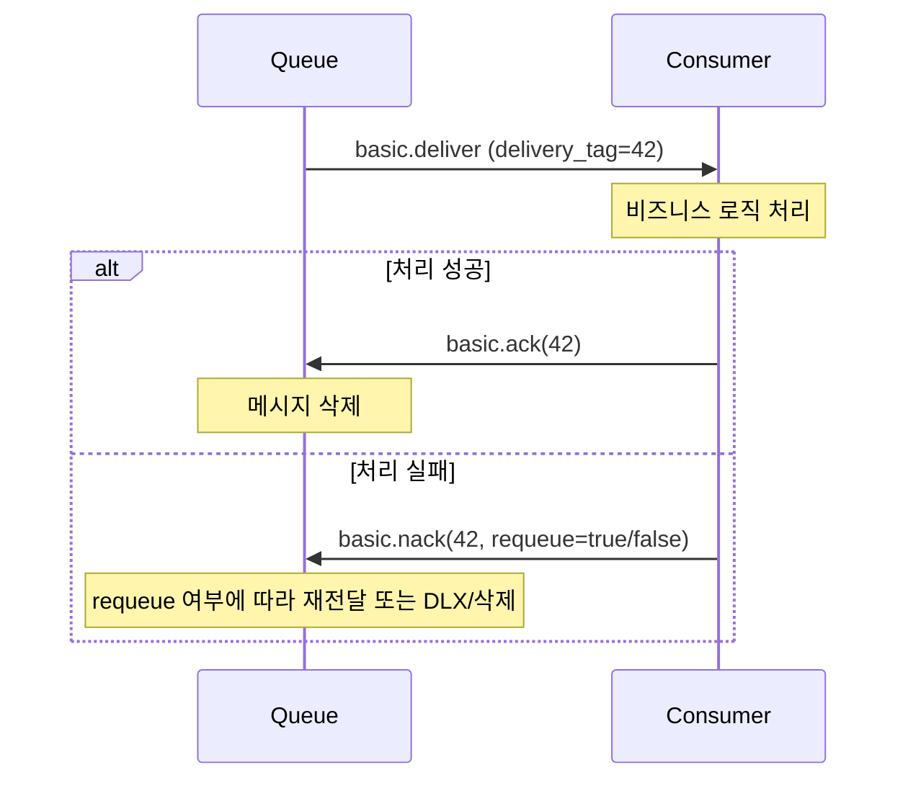
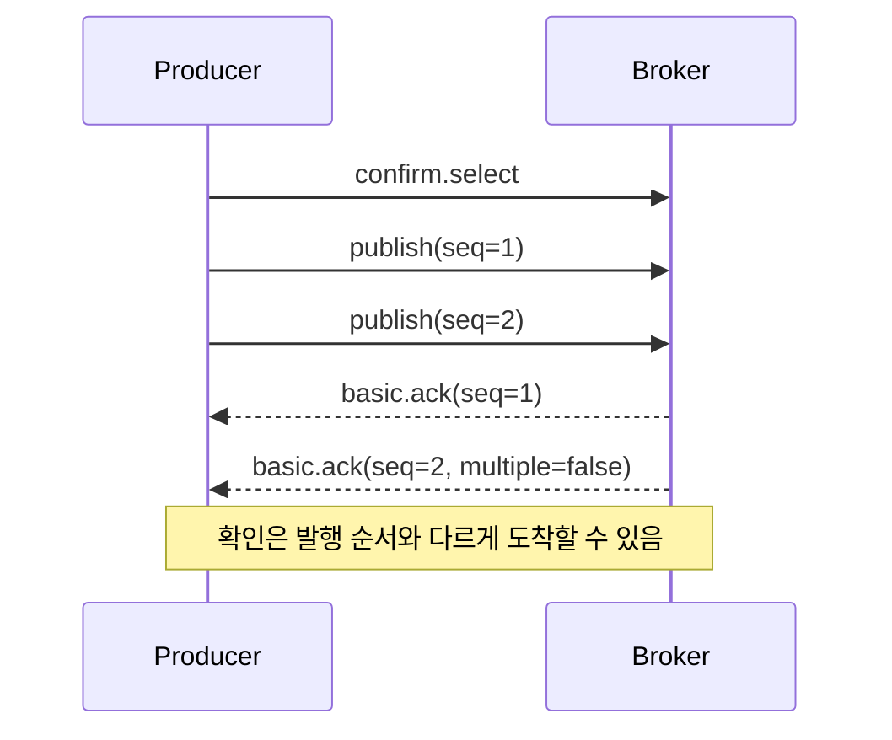

# 메시지 확인 ACK

## 핵심 정의
RabbitMQ는 분산 시스템이기 때문에 프로토콜 메시지가 상대편에 도달했는지, 정상 처리됐는지를 보장할 방법이 필요하다. 이를 위해 두 방향의 확인(acknowledgement) 메커니즘이 존재한다. 컨슈머(consumer)가 브로커에게 "이 메시지를 받아서 처리했다"고 알리는 것이 컨슈머 확인(consumer acknowledgement, 흔히 ACK), 브로커가 프로듀서(producer)에게 "이 메시지를 책임지고 받았다"고 알리는 것이 발행자 확인(publisher confirm)이다. 두 메커니즘은 이름은 비슷하지만 완전히 다른 구간(hop)을 책임진다. Publisher confirm은 프로듀서→브로커 구간을, 컨슈머 ACK는 브로커→컨슈머 구간을 보장하며, 엔드투엔드(end-to-end) 신뢰성을 확보하려면 둘 다 필요하다.

ACK는 단순한 수신 확인이 아니라 소유권 이전(transfer of ownership)의 의미를 갖는다. 브로커가 유효한 ACK를 처리하면 해당 메시지에 대한 책임을 완전히 내려놓고 큐에서 제거하므로, 애플리케이션이 실제로 필요한 처리를 끝내기 전에 ACK를 보내면 안 된다.

## 동작 원리 / 구조

### 컨슈머 ACK 흐름
컨슈머가 `basic.consume`으로 등록되면 브로커는 `basic.deliver`로 메시지를 전달하며, 이때 채널(channel) 단위로 유일한 delivery tag가 함께 부여된다. 컨슈머는 이 delivery tag를 이용해 `basic.ack`(성공), `basic.nack`/`basic.reject`(실패)를 응답한다.



- `requeue=true`: 가능하면 원래 위치, 동시 소비 등으로 불가능하면 큐 앞쪽에 가까운 위치로 되돌려 재전달을 시도한다. 재시도 로직 없이 무한 requeue를 걸면 poison message(계속 실패하는 메시지)가 무한 루프를 만든다.
- `requeue=false`: 큐에 Dead Letter Exchange(DLX)가 설정되어 있으면 그쪽으로 라우팅되고, 없으면 메시지가 그대로 폐기된다.

### Auto-ack와 Manual ack
`basic.consume`에 `no_ack=true`(auto-ack)를 주면 브로커는 네트워크로 전송하는 단계에서 처리 완료로 간주하고 큐에서 제거한다. 처리 속도는 빠르지만 컨슈머가 받은 직후 크래시하면 메시지가 유실된다. 신뢰성이 필요한 실무 코드는 거의 항상 manual ack를 쓴다.

### Prefetch(QoS)와 미확인 메시지
`basic.qos(prefetch_count=N)`는 `basic.consume` 구독에서 컨슈머가 ACK를 보내지 않은 상태로 동시에 받을 수 있는 미확인(unacknowledged) 메시지 수를 제한한다. 직접 가져오는 `basic.get`에는 수동 ACK 모드라도 prefetch가 적용되지 않으므로 애플리케이션이 미완료 작업 수를 제한해야 한다. AMQP 0-9-1에서 0은 무제한을 뜻하지만 RabbitMQ 4.3 quorum queue는 최대 2,000으로 제한한다. RabbitMQ의 기본 QoS 범위는 소비자별이며 global QoS는 quorum queue에서 지원하지 않는다. prefetch가 크면 미확인 작업과 클라이언트 메모리가 증가한다. prefetch를 너무 크게 잡으면 한 컨슈머가 메시지를 몰아 받은 채 느리게 처리해 다른 컨슈머는 굶는 불균형이 생기고, 너무 작게 잡으면(특히 1) 왕복 지연 때문에 처리량이 떨어진다.

### Publisher Confirm 흐름
채널에서 `confirm.select`를 호출하면 confirm 모드로 전환되고, 이후 발행되는 메시지마다 브로커와 클라이언트가 1부터 순차 증가하는 시퀀스 번호를 카운트한다. 브로커는 메시지를 큐에 라우팅(또는 디스크에 영속화)한 뒤 `basic.ack`(단건 또는 `multiple=true`로 구간 일괄)를 비동기로 돌려준다.



AMQP 트랜잭션(`tx.select`)은 계속 지원되지만 동기 트랜잭션 커밋 비용이 크다. 공식 문서의 약 250배 저하 언급은 특정 비교 결과이지 보편적 수치가 아니므로, 일반 발행 신뢰성에는 비동기 publisher confirm을 우선 검토한다.

### Spring AMQP에서의 설정
```java
CachingConnectionFactory cf = new CachingConnectionFactory();
cf.setPublisherConfirmType(CachingConnectionFactory.ConfirmType.CORRELATED);
cf.setPublisherReturns(true);

RabbitTemplate template = new RabbitTemplate(cf);
template.setMandatory(true);
template.setConfirmCallback((correlation, ack, cause) -> {
    if (!ack) { /* 재발행 또는 알림 */ }
});
template.setReturnsCallback(returned -> { /* 라우팅 실패 처리 */ });
```

컨슈머 측 acknowledge mode는 `SimpleMessageListenerContainer`(또는 `@RabbitListener` 설정)에서 `NONE`(auto-ack), `AUTO`(리스너가 예외 없이 반환하면 자동 ACK, 예외·오류 처리 정책에 따라 reject/nack·requeue·복구 결정), `MANUAL`(리스너 안에서 `Channel.basicAck`를 직접 호출) 중 선택한다. 실무에서는 `AUTO`로 두고 예외 처리 전략(재시도, DLX)을 `RetryTemplate`/`MessageRecoverer`에 위임하는 경우가 많다.

### 연결 복구와 발행 재전송은 별개다

RabbitMQ Java 클라이언트 5.x의 자동 연결 복구는 단절 중 `basicPublish`한 메시지를 내부에 쌓았다가 나중에 대신 전송하는 기능이 아니다. 발행자는 연결 실패와 미확인 발행을 추적하고, 재연결 후 업무 이벤트 ID를 유지해 재발행해야 한다. 업무 변경과 발행 의도를 함께 보존하려면 [[트랜잭셔널 아웃박스]] 같은 구조가 필요하다.

Confirm을 받기 전에 연결이 끊기면 브로커가 메시지를 저장하지 못했을 수도 있고, 저장했지만 confirm만 유실됐을 수도 있다. 재전송은 후자의 경우 새 발행 사본을 만들 수 있다. `redelivered` 플래그는 브로커의 해당 메시지 전달 이력에 대한 힌트이므로, 프로듀서가 같은 이벤트를 새 메시지로 재발행한 업무 중복까지 판별하지 못한다. `redelivered=false`라는 이유로 업무 ID의 멱등성 검사를 생략하면 안 된다.

## 실무 관점
- **ACK 위치가 핵심 실수 포인트**: 비즈니스 로직(DB 저장 등) 이전에 ACK를 먼저 보내면, 로직 실패 시 메시지가 이미 큐에서 사라져 유실된다. 반대로 ACK를 계속 누락하면 unacked 메시지가 쌓여 prefetch 한도에 걸리고 컨슈머가 새 메시지를 못 받는다.
- **Publisher confirm 없이 발행만 하면 "발행 성공 = 브로커 도착"이 아니다.** 네트워크 단절 중 발행된 메시지는 클라이언트도 브로커도 인지하지 못한 채 유실될 수 있다. 금전/주문처럼 유실이 치명적인 도메인은 confirm을 반드시 켠다.
- **성능 트레이드오프**: publisher confirm을 켜면 처리량이 다소 감소하지만(배치 발행 시 감소 폭은 크지 않은 편으로 보고됨) 신뢰성이 크게 올라간다. 동기 confirm(발행마다 대기)은 매우 느리므로, 배치 단위로 비동기 confirm 콜백을 모아 처리하는 방식을 쓴다.
- **requeue 무한 루프 주의**: 처리 중 예외가 나서 매번 `nack(requeue=true)`만 반복하면 같은 메시지가 무한히 재전달되며 CPU와 로그를 잠식한다. 재시도 횟수를 헤더에 기록하고 임계치를 넘으면 DLX로 보내는 패턴(DLX를 실제 거친 경우 `x-death` 활용)을 설계한다. 단순 requeue는 `x-death`를 늘리지 않는다. Quorum queue는 별도 delivery-limit을 제공하지만 4.3의 `basic.nack` 반환은 실패 delivery-count를 늘리지 않으므로 횟수 제한·지연 정책을 별도로 확인한다.
- **manual ack 컨슈머에서 채널을 스레드 간 공유하지 않는다.** delivery tag는 받은 채널에서만 유효하다. 원래 채널을 캡처하는 것만으로 동시성이 안전해지지는 않는다. Java 클라이언트에서 다른 스레드가 완료 ACK를 보낼 때 `multiple=false`로 개별 확인하고 중복 ACK·채널 수명·동시 발행을 통제하거나 컨테이너의 비동기 지원을 사용한다.
- **모니터링 포인트**: unacked 메시지 수(`rabbitmqctl list_queues messages_unacknowledged`)가 지속적으로 증가하면 컨슈머 처리 지연이나 ACK 누락 버그를 의심해야 한다. confirm 실패율과 반환(returned) 메시지 수도 함께 관찰한다.

### ACK 시간 초과의 채널 단위 영향

RabbitMQ 4.3부터 전달 확인 시간 제한(delivery acknowledgement timeout)은 quorum queue에서만 지원한다. 기본값은 30분이고 1분 간격으로 검사하므로 정확히 임계 시각에 발생하는 작업 취소 타이머가 아니다. 이 값은 메시지 TTL이나 연결 heartbeat와 목적이 다르다.

확인이 늦으면 `PRECONDITION_FAILED`로 채널이 닫히고 그 채널의 다른 consumer들에 전달된 미확인 항목도 재큐잉될 수 있다. 오래 걸리는 작업 하나가 공유 채널의 다른 작업까지 재전달하게 만드는 경계를 확인한다. 브로커의 채널 종료는 이미 실행 중인 DB·외부 API 작업을 취소하지 않으므로, 재전달 이후 늦은 원작업 완료에 대한 멱등성도 필요하다. 처리 시간 분포·prefetch·동시 작업 수와 채널 분리를 검토하고, timeout을 늘렸다는 이유로 ACK 누락이나 무제한 작업을 방치하지 않는다.

## 심화 Q&A

### Q. 컨슈머가 ACK를 보내기 전에 연결이 끊기면 무슨 일이 일어나는가?
해당 컨슈머의 채널/커넥션이 끊기면 브로커는 그 채널에서 미확인 상태였던 모든 메시지를 자동으로 다른(또는 재연결된) 컨슈머에게 재전달한다. 큐와 메시지가 보존되어 있다면 재전달 대상이지만, TTL·큐 삭제·복제 손실·delivery-limit 정책으로 폐기될 수도 있다. 또한 처리 로직이 멱등(idempotent)하지 않다면 같은 메시지가 두 번 처리될 위험이 있다.

### Q. Publisher confirm의 ACK가 발행 순서와 다르게 도착할 수 있다는데, 왜 이런 설계를 택했는가?
브로커 내부에서 메시지마다 라우팅 대상 큐 수, 영속화 여부, 큐의 부하가 달라 처리 완료 시점이 제각각이기 때문이다. 순서를 강제로 맞추려면 브로커가 내부적으로 직렬화(serialize)해야 해 처리량이 떨어진다. 대신 `multiple=true`가 붙은 ACK는 "이 시퀀스 번호까지 전부 확인됨"을 의미하므로, 애플리케이션은 개별 순서에 의존하지 않고 시퀀스 번호 범위로 처리하면 된다.

### Q. Auto-ack(no_ack=true)를 쓰면서도 안전하게 쓸 수 있는 상황이 있는가?
메시지 유실이 허용되는 로그 수집, 메트릭 전송처럼 최선 노력(best-effort) 전달로 충분한 경우에 한해 쓸 수 있다. 처리량이 중요하고 개별 메시지 유실의 비용이 낮을 때 prefetch/ACK 왕복 오버헤드를 없애는 트레이드오프다. 주문, 결제처럼 정확히 한 번(exactly-once에 가까운) 처리가 필요한 경로에서는 쓰지 않는다.

### Q. Consumer ACK와 Publisher Confirm을 둘 다 켰는데도 메시지가 유실될 수 있는 경우는?
Classic queue는 durable 선언과 persistent 메시지, publisher confirm이 재시작 보존의 기본 조합이다. Quorum queue는 delivery mode와 무관하게 메시지를 디스크에 기록하고 과반 복제 확인 후 confirm한다. 그래도 unroutable 메시지에도 confirm ACK가 가능하므로 mandatory/returns를 확인해야 하고, TTL·삭제 정책·복제 다수의 디스크 손실·처리 전 ACK는 별도 유실 원인이다. 두 ACK만으로 종단 exactly-once가 되지는 않는다.

### Q. `basic.reject`와 `basic.nack`의 차이는 언제 의미가 있는가?
`basic.reject`는 한 번에 메시지 하나만 거부할 수 있고, `basic.nack`은 `multiple` 플래그로 특정 delivery tag 이하의 여러 미확인 메시지를 한 번에 거부할 수 있다. 배치로 여러 메시지를 처리하다가 중간에 실패한 경우 처리된 만큼은 ack, 나머지는 nack(multiple)으로 한 번에 정리할 수 있지만 해당 tag 이하의 아직 미확인인 다른 작업까지 포함하므로 병렬 작업에서는 특히 주의한다. RabbitMQ 4.3 quorum queue에서 requeue하는 `basic.reject`는 실패 delivery-count를 증가시키고 `basic.nack`은 증가시키지 않는 차이도 있다.

### Q. prefetch_count를 1로 설정하는 것과 크게(예: 100) 설정하는 것의 실무적 판단 기준은?
prefetch=1은 컨슈머 간 작업 분배(work distribution)가 균등해져 느린 작업과 빠른 작업이 섞여 있을 때 유리하지만, 매 메시지마다 브로커와의 왕복(ACK 후 다음 메시지 수신)이 필요해 네트워크 지연이 큰 환경에서는 처리량 손해가 크다. 처리 시간이 균일하고 처리량이 중요하다면 prefetch를 높여 배치로 받아 처리하는 편이 유리하며, 실무에서는 워커별 처리 시간 편차를 보고 값을 튜닝한다.

## 관련 개념
- [[Exchange와 Queue 바인딩]]
- [[Dead Letter Queue]]
- [[캐시와 DB 정합성]]

## 참고 자료

부분 재확인: 2026-09-22. RabbitMQ 4.3 Consumer Acknowledgements and Publisher Confirms 문서에서 구독형 소비와 basic.get의 prefetch 적용 차이를 확인했다. 예제 전체의 실행 검증은 하지 않았고 기존 `verified`를 유지했다.

확인일: 2026-09-08. 아래 적용 범위에서 본문·Q&A·예제를 재검증했다. 예제는 문서와 대조했으며 별도 실행 검증은 하지 않았다.

- [Consumer ACK and Publisher Confirms](https://www.rabbitmq.com/docs/confirms) — RabbitMQ 4.3, ACK 범위·confirm 조건·prefetch 2000.
- [Quorum Queues](https://www.rabbitmq.com/docs/quorum-queues) — RabbitMQ 4.3, 영속화·delivery-count/nack/reject 차이.
- [Dead Letter Exchanges](https://www.rabbitmq.com/docs/dlx) — RabbitMQ 4.3, x-death는 dead-letter 이력.
- [Java Client API Guide](https://www.rabbitmq.com/client-libraries/java-api-guide) — Java 클라이언트 5.x, 채널 동시성·비동기 개별 ACK.
- [Spring AMQP Template](https://docs.spring.io/spring-amqp/reference/amqp/template.html) — 확인일 공식 문서, confirm·returns 설정.
- [Listener Container Configuration](https://docs.spring.io/spring-amqp/reference/amqp/containerAttributes.html) — 확인일 공식 문서, NONE/AUTO/MANUAL.

부분 재검증: 2026-09-23. RabbitMQ 4.3 신뢰성 문서와 Java 클라이언트 5.x 자동 복구 문서의 발행 손실·미확인 재전송·redelivered 의미를 재검증했다. 브로커 장애 실행 시험은 하지 않았다. 기존 전체 검증일은 유지한다.

- [RabbitMQ Reliability](https://www.rabbitmq.com/docs/reliability) — confirm 유실과 발행 재전송, redelivered의 전달 단위 의미.
- [Java Client Automatic Recovery](https://www.rabbitmq.com/client-libraries/java-api-guide#recovery) — 연결 단절 중 발행을 복구 후 자동 재전송하지 않는 경계.

부분 재검증: 2026-10-04. RabbitMQ 4.3 Consumers 문서에서 quorum 전용 전달 확인 timeout·기본 30분·1분 검사·채널 종료와 재큐잉 범위를 확인했다. 실제 브로커 timeout·Spring AMQP 컨테이너 복구는 시험하지 않았고 기존 `verified`는 유지한다.

- [RabbitMQ 4.3 Delivery Acknowledgement Timeout](https://www.rabbitmq.com/docs/consumers#acknowledgement-timeout) — 적용 큐 종류·시간 경계·채널에 속한 다른 전달의 영향.
