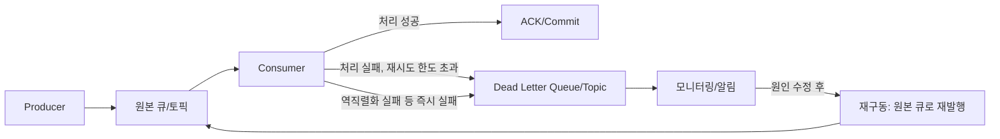

# Dead Letter Queue

## 핵심 정의

DLQ(Dead Letter Queue)는 정상적으로 처리할 수 없는 메시지를 원래 큐/토픽에서 분리해 별도로 보관하는 저장소다. 컨슈머(consumer)가 메시지 처리에 반복적으로 실패하거나, 메시지 자체가 처리 불가능한 형식(역직렬화 실패 등)일 때 해당 메시지를 무한 재시도하거나 그냥 버리는 대신 DLQ로 옮겨, 원래 큐의 처리 흐름을 막지 않으면서도 나중에 원인을 분석하고 재처리(redrive)할 수 있게 한다.

브로커마다 구현 방식과 용어가 다르다. RabbitMQ는 Dead Letter Exchange(DLX)를 큐 속성으로 지정하는 방식, Kafka의 일반 컨슈머 그룹은 브로커가 처리 실패를 인지해 DLQ로 옮기지 않으므로 애플리케이션(또는 Spring Kafka 같은 클라이언트 라이브러리)이 별도의 Dead Letter Topic(DLT)을 만들어 관례적으로 구현하는 방식, AWS SQS는 큐 속성에 재구동 정책(redrive policy)을 설정하는 방식을 쓴다. RabbitMQ의 DLX/ACK 흐름 자체는 [[메시지 확인 ACK]]에서 다룬다.

## 동작 원리 / 구조

대표적인 격리 계기는 다음과 같다. TTL 만료의 DLX 이동은 RabbitMQ 기능이며 Kafka retention 만료·SQS 보존 기간 만료는 자동 DLQ 이동이 아니다.

1. **재시도 횟수 초과**: 같은 메시지를 N번 재처리했는데도 계속 실패.
2. **처리 불가능한 메시지(poison message)**: 역직렬화 실패, 스키마 불일치 등 원인 수정 전 같은 처리 코드로 재시도해도 성공하기 어려운 메시지.
3. **TTL(Time-To-Live) 만료**: 큐에서 일정 시간 이상 처리되지 못하고 대기한 메시지.



### 브로커별 구현

**RabbitMQ (DLX)**: 큐에 `x-dead-letter-exchange` 인자를 지정하면, 메시지가 거부(`basic.nack`/`basic.reject`, `requeue=false`)되거나 TTL 만료, 큐 길이 초과(overflow)로 폐기될 때 지정된 DLX로 자동 라우팅된다. `x-death`는 dead-letter 발생 이력이며 단순 requeue 횟수가 아니다. Quorum queue는 `x-delivery-count`와 delivery-limit(4.0+ 기본 20)을 지원한다. 4.3에서는 `basic.reject`·연결 실패는 실패 횟수를 늘리지만 `basic.nack` 반환은 늘리지 않고 `x-acquired-count`로 할당 횟수를 추적한다. DLX는 정책으로 지정하면 재배포 없이 변경하기 쉽다. 기본 DLX 전송은 at-most-once이므로 대상 장애 시 유실 가능하며, 소스 quorum queue에 `dead-letter-strategy=at-least-once`, `overflow=reject-publish`, DLX와 필요한 feature flag를 갖춰야 확인 후 제거한다.

RabbitMQ 4.3 quorum queue는 네이티브 지연 재시도(delayed retry)도 지원한다. 기본값은 `delayed-retry-type=disabled`이며, 활성화할 때 최소 지연 `delayed-retry-min`(밀리초)이 필요하고 최대 지연은 선택이다. `all`은 모든 반환을, `failed`는 실패 횟수가 증가한 반환을, `returned`는 실패 횟수가 증가하지 않은 반환을 지연한다. 따라서 `basic.nack(requeue=true)` 반복을 늦추려면 `failed`만 설정해서는 부족하다. 지연은 선형 백오프이며, 반환 지연과 최대 실패 횟수는 별도 제어다. 낮은 `delivery-limit`만으로 무제한 nack 반환을 막는다고 가정하지 않는다.

**Kafka (DLT, 관례적 구현)**: Kafka 자체 큐 프로토콜에는 DLQ 개념이 없다. Spring Kafka는 `@RetryableTopic` 애노테이션으로 이를 프레임워크 차원에서 구현한다. 처리 실패 시 백오프(backoff) 지연을 담은 재시도 토픽으로 메시지를 재발행하고, 재시도 토픽 컨슈머는 지정된 시각이 될 때까지 해당 파티션 소비를 일시 정지(pause)했다가 재개한다. 모든 재시도가 소진되면 최종적으로 Dead Letter Topic으로 보낸다.

```java
@RetryableTopic(
    attempts = "4",
    backoff = @Backoff(delay = 1000, multiplier = 2.0, maxDelay = 10000),
    exclude = {DeserializationException.class, ClassCastException.class}
)
@KafkaListener(topics = "orders")
public void consume(OrderEvent event) {
    orderService.process(event);
}

@DltHandler
public void handleDlt(ConsumerRecord<?, ?> record, @Header(KafkaHeaders.EXCEPTION_MESSAGE) String exMsg) {
    // 알림, 별도 저장, 수동 재처리 대상 등록
}
```

역직렬화 자체가 실패하는 메시지(poison message)는 리스너 메서드까지 도달하지 못하므로, `ErrorHandlingDeserializer`와 `DefaultErrorHandler`의 조합으로 역직렬화 단계 실패도 DLT로 보내도록 별도 처리해야 한다. 위 예제의 DLT 처리기는 실패 원문 byte[]도 받을 수 있는 레코드 형식을 쓴다. DLT 발행 Serializer도 정상 객체와 원문 byte[]를 모두 지원해야 하며 non-blocking retry의 원본 순서 변경·배치/컨테이너 트랜잭션 제약을 확인한다.

**AWS SQS (redrive policy)**: 큐 속성에 `RedrivePolicy`로 `deadLetterTargetArn`과 `maxReceiveCount`(확인일 SetQueueAttributes API 문서는 기본값 10을 명시한다. 운영 정책에서는 원하는 값을 명시한다. 값이 낮을수록(예: 1) 일시적 오류에도 바로 DLQ로 이동하므로 충분한 재시도를 허용할 만큼 여유 있게 설정하는 것이 권장된다)를 지정한다. 메시지의 수신 횟수(`ApproximateReceiveCount`)가 `maxReceiveCount`를 초과하면 SQS가 자동으로 DLQ로 이동시킨다. Standard 큐의 DLQ는 Standard 큐여야 하고 FIFO 큐의 DLQ는 FIFO 큐여야 한다. 별도로 `RedriveAllowPolicy`를 설정해 어떤 소스 큐가 이 DLQ를 사용할 수 있는지 제한할 수 있다(`allowAll`/`denyAll`/`byQueue`). DLQ에 쌓인 메시지를 원본 큐로 되돌리는 것은 `StartMessageMoveTask` API(콘솔의 DLQ 재구동 기능)로 지원한다. 이동 속도는 `MaxNumberOfMessagesPerSecond`로 초당 최대 500건까지 제한할 수 있고 값을 비우면 SQS가 백로그 크기에 맞춰 속도를 자동 조절한다. 단, 하나의 큐(DLQ)당 동시에 활성화할 수 있는 이동 작업은 1개뿐이며, 진행 상태는 `ListMessageMoveTasks`로 조회하고 `CancelMessageMoveTask`로 중단할 수 있다.

## 실무 관점

- **언제/왜 쓰는가**: 컨슈머 장애 하나가 큐 전체의 헤드-오브-라인 블로킹(head-of-line blocking)을 유발하지 않도록 격리하기 위해서다. 특히 순서 보장이 있는 파티션/큐에서는 실패한 메시지 하나가 뒤에 있는 모든 메시지 처리를 막을 수 있으므로 격리를 검토한다. 다만 선행 이벤트를 건너뛰면 후속 이벤트의 업무적 순서가 깨지므로 같은 키 전체를 보류하거나 상태 버전 검사로 막을 수도 있다.
- **흔한 실수/장애 사례**:
  - DLQ로 보내기만 하고 모니터링/알림을 붙이지 않아, 메시지가 조용히 쌓이다가 몇 주 뒤에 발견되는 경우. DLQ 적재 건수는 반드시 알림(alert) 대상 메트릭으로 등록해야 한다.
  - 재시도 정책 없이 즉시 DLQ로 보내, 일시적 장애(순간적인 DB 커넥션 풀 고갈 등)로 충분히 복구 가능했던 메시지까지 DLQ로 밀어넣는 경우.
  - DLQ에서 원본 큐로 재구동할 때 실패 원인을 고치지 않고 그대로 되돌려 무한히 DLQ와 원본 큐를 오가는 경우.
  - Kafka에서 DLT 재발행 시 원본 키·토픽·파티션·오프셋·이벤트 버전을 잃는 경우. 키를 유지해도 이미 진행한 원본 스트림과 재처리의 시간 순서는 자동 복구되지 않는다.
- **설정/튜닝 포인트**: 재시도 횟수와 백오프 전략(고정/지수), poison message를 즉시 DLQ로 보낼 예외 타입 화이트리스트/블랙리스트, DLQ 자체의 보존 기간(retention), DLQ 적재량 임계치 알림, 재구동 시 배치 크기와 속도 제한(원본 시스템에 순간 부하를 주지 않도록).

## 심화 Q&A

### Q. SQS redrive 후 MessageId로 중복을 제거해도 되는가?
A. 2026-10-04 확인한 SQS 문서에 따르면 DLQ 재구동 메시지는 새 메시지로 취급되어 `messageID`와 `enqueueTime`이 새로 부여되고 보존 기간도 다시 시작한다. 따라서 최초 처리 때 저장한 SQS MessageId만으로는 재구동된 동일 업무를 식별하지 못한다. 본문 등에 안정적인 업무 이벤트 ID를 남기고 재구동에도 유지한다. 이는 원본 큐에서 DLQ로 처음 이동할 때의 Standard/FIFO 보존 시간 규칙과 다른 단계다.

기본 redrive 작업은 이동 중 메시지 필터링·수정을 지원하지 않는다. 특정 스키마나 실패 원인만 골라 보정해야 한다면 별도 재처리 절차를 설계해야 한다. `CancelMessageMoveTask`도 이미 목적지로 이동한 메시지를 되돌리지 않으므로 취소 이후 목적지의 처리와 재실패를 계속 관측한다. 재구동 성공은 메시지 이동의 성공이며 업무 처리 성공은 소비자 결과로 따로 확인한다.

### Q. Kafka는 왜 브로커 차원의 DLQ 기능을 자체 제공하지 않는가?
일반 컨슈머 그룹에서는 브로커가 업무 처리 예외나 재시도 성공 조건을 알지 못하고 로그·커밋 위치를 관리한다. 따라서 Connect의 sink DLQ, Streams의 예외 처리, Spring Kafka DLT 등 처리 계층이 격리를 결정한다. Kafka 4.2+ Share Groups의 개별 ACK·전달 횟수는 일반 그룹과 다른 모델이므로 “Kafka에는 메시지별 처리 상태가 전혀 없다”로 일반화하지 않는다.

### Q. RabbitMQ에서 재시도 횟수를 세지 않고 무한히 requeue하면 어떤 문제가 생기는가?
`basic.nack(requeue=true)`만 반복하면 컨슈머가 실패할 때마다 같은 메시지가 큐 앞쪽(또는 구현에 따라 즉시)으로 돌아와 다시 전달된다. 재시도 횟수 제한이 없으면 CPU와 네트워크, 로그를 계속 소모하는 무한 루프가 되고 다른 정상 메시지 처리까지 지연시킨다. 단순 requeue는 `x-death`를 증가시키지 않으므로 해당 헤더만 확인하면 무한 루프를 끊지 못한다. 애플리케이션 재시도 카운터, DLX 기반 retry queue 또는 quorum queue 버전에 맞는 delivery-count·지연 재시도 정책을 사용한다.

### Q. DLQ에 쌓인 메시지를 재구동(redrive)할 때 왜 순서 보장이 깨질 수 있는가?
DLQ는 보통 실패한 메시지들이 도착한 순서대로 쌓이지만, 원본이 여러 파티션/큐에서 왔거나 서로 다른 시점에 실패했다면 DLQ 안에서의 순서가 원본의 인과적 순서와 다를 수 있다. 재구동 시 이 순서 그대로 재발행하면 예를 들어 "주문 취소" 이벤트가 "주문 생성" 이벤트보다 먼저 재처리되는 상황이 생길 수 있다. aggregate/키 단위로 순서가 중요한 도메인이라면 이벤트 버전/시퀀스와 기대 상태를 검사하고 누락된 선행 이벤트를 복구하거나 해당 키 처리를 보류해야 한다. 키 정렬·키별 DLQ만으로 이미 처리된 후속 이벤트와 인과 순서를 복구할 수는 없다.

### Q. 재시도(retry)와 DLQ 전송 중 어느 것을 먼저 시도해야 하는가? 즉시 DLQ로 보내야 하는 경우는 언제인가?
일시적 오류(네트워크 타임아웃, 커넥션 풀 고갈, 외부 API 순간 장애)는 지수 백오프(exponential backoff)로 몇 차례 재시도한 뒤에도 실패하면 DLQ로 보내는 것이 맞다. 반면 역직렬화 실패, 스키마 불일치, `ClassCastException` 같은 결정적(deterministic) 오류는 재시도해도 결과가 달라지지 않으므로 즉시 DLQ로 보내는 것이 리소스 낭비를 줄인다. Spring Kafka의 `@RetryableTopic(exclude = {...})`처럼 예외 타입별로 재시도 여부를 분기하는 것이 실무 표준이다.

### Q. SQS의 `maxReceiveCount`와 가시성 제한 시간(visibility timeout)은 어떤 관계가 있는가?
메시지를 받은 컨슈머가 가시성 제한 시간 안에 삭제(delete)하지 않으면 다시 큐에 노출(visible)되며 실제로 다시 수신될 때 수신 횟수가 증가한다. 가시성 제한 시간을 실제 처리 시간보다 너무 짧게 잡으면 정상 처리 중인 메시지도 재노출되어 `ReceiveCount`가 불필요하게 쌓이고, `maxReceiveCount`에 금방 도달해 정상 메시지가 조기에 DLQ로 밀려날 수 있다. 처리 시간의 최댓값을 기준으로 가시성 제한 시간을 여유 있게 설정하거나 `ChangeMessageVisibility`로 처리 중 연장하는 방식이 필요하다. 한 수신의 가시성 제한은 최대 12시간이며 연장으로 이 상한이 초기화되지는 않는다.

SQS Standard 메시지의 보존 만료 기준은 DLQ 이동 후에도 원본 enqueue 시각이며 FIFO는 이동 시각으로 재설정된다. DLQ 보존 시간을 원본보다 길게 잡고 만료 전에 조사한다.

### Q. DLQ 자체가 장애를 일으킬 수 있는가?
DLQ도 결국 큐/토픽이므로 용량, 보존 기간, 파티션/샤드 한계를 가진다. 근본 원인을 방치한 채 실패가 계속 발생하면 DLQ 자체가 무한정 커져 디스크/스토리지 압박, 모니터링 조회 성능 저하로 이어질 수 있다. 또한 DLQ를 알림 없이 방치하다가 뒤늦게 대량 재구동을 시도하면 원본 시스템에 순간적으로 트래픽이 몰려 2차 장애(thundering herd)를 유발할 수 있으므로, 재구동은 속도 제한을 두고 점진적으로 수행해야 한다.

## 관련 개념

- [[메시지 확인 ACK]]
- [[멱등성과 메시지 순서 보장]]
- [[오프셋 관리와 정확히 한 번 처리]]
- [[Exchange와 Queue 바인딩]]

## 참고 자료

부분 재확인: 2026-09-22. RabbitMQ 4.3 quorum queue의 지연 재시도 설정, nack·reject별 카운터와 delivery-limit의 관계를 공식 Quorum Queues 문서로 확인했다. Spring Kafka·SQS 서술 전체의 재검증은 아니므로 기존 `verified`를 유지했다.

확인일: 2026-09-08. 아래 적용 범위에서 본문·Q&A·예제를 재검증했다. 예제는 문서와 대조했으며 별도 실행 검증은 하지 않았다.

- [Dead Letter Exchanges](https://www.rabbitmq.com/docs/dlx) — RabbitMQ 4.3, 트리거·x-death·전송 유실 범위.
- [Quorum Queues](https://www.rabbitmq.com/docs/quorum-queues) — RabbitMQ 4.3, delivery count·기본 한도·at-least-once DLX.
- [Non-Blocking Retries](https://docs.spring.io/spring-kafka/reference/retrytopic.html) — Spring Kafka 4.1, DLT 패턴·제약.
- [Handling Exceptions](https://docs.spring.io/spring-kafka/reference/kafka/annotation-error-handling.html) — Spring Kafka 4.1, 역직렬화 실패 원문·DLT Serializer.
- [SQS SetQueueAttributes](https://docs.aws.amazon.com/AWSSimpleQueueService/latest/APIReference/API_SetQueueAttributes.html) — 확인일 API, redrive·maxReceiveCount 기본 10·큐 타입.
- [SQS StartMessageMoveTask](https://docs.aws.amazon.com/AWSSimpleQueueService/latest/APIReference/API_StartMessageMoveTask.html) — 확인일 API, 이동 속도 500·동시 작업 1.
- [SQS Dead Letter Queues](https://docs.aws.amazon.com/AWSSimpleQueueService/latest/SQSDeveloperGuide/sqs-dead-letter-queues.html) — 확인일 서비스 문서, Standard/FIFO 보존 시간.
- [SQS Visibility Timeout](https://docs.aws.amazon.com/AWSSimpleQueueService/latest/SQSDeveloperGuide/sqs-visibility-timeout.html) — 확인일 서비스 문서, 재노출·12시간 제한.

부분 재검증: 2026-10-04. SQS의 DLQ 재구동 시 식별자·보존 시간 초기화, 필터링·수정 제한, 취소 범위를 확인했다. 업무 이벤트 ID 보존은 해당 계약에서 도출한 멱등성 설계다. AWS API 호출·실제 메시지 이동은 수행하지 않았으며 RabbitMQ·Spring Kafka 전체의 `verified`는 유지한다.

- [SQS Configuring Dead-Letter Queue Redrive](https://docs.aws.amazon.com/AWSSimpleQueueService/latest/SQSDeveloperGuide/sqs-configure-dead-letter-queue-redrive.html) — 2026-10-04 서비스 문서: 새 messageID/enqueueTime, 보존 기간 재시작, 필터링·수정 불가, 이미 이동한 메시지의 취소 제외.
