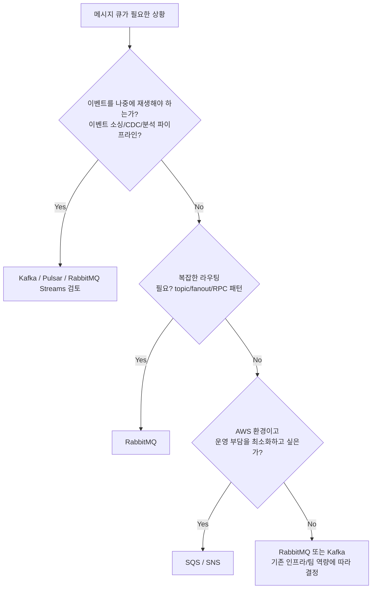

# 메시지 큐 선택 기준

## 핵심 정의

메시지 큐 선택은 "어떤 브로커가 더 빠른가"가 아니라 "어떤 워크로드 모델(전달 방식, 순서 보장 범위, 재생 가능 여부, 운영 부담)이 우리 문제에 맞는가"를 따지는 아키텍처 의사결정이다. 같은 "메시지 큐"라는 이름으로 묶이지만 Kafka는 분산 커밋 로그(commit log) 기반 이벤트 스트리밍 플랫폼, RabbitMQ는 라우팅이 유연한 전통적 메시지 브로커, Amazon SQS는 완전관리형 큐 서비스, Apache Pulsar는 스토리지와 서빙 계층을 분리한 클라우드 네이티브 스트리밍 플랫폼으로 설계 철학 자체가 다르다.

## 동작 원리 / 구조

### 전달 모델의 근본적 차이

| 구분 | Kafka | RabbitMQ | Amazon SQS | Pulsar |
|---|---|---|---|---|
| 저장 모델 | 파티션 단위 append-only 로그, 컨슈머가 오프셋으로 pull | 일반 큐는 ACK 후 제거, Streams는 보존 로그 | 큐(리전 분산), 소비 후 명시적 delete | 세그먼트 기반 로그, 스토리지(BookKeeper)와 브로커 분리 |
| 전달 방식 | Pull (컨슈머가 poll) | Push (브로커가 컨슈머로 전달) | Pull (long polling) | Pull/Push 혼합 |
| 재생(replay) | 오프셋을 되돌려 재생 가능 (보존 기간 내) | 기본적으로 불가(소비 후 삭제), Streams는 보존 범위에서 가능 | 불가(삭제된 메시지는 복구 불가) | 가능 (Kafka와 유사, 계층형 스토리지로 장기 보존) |
| 순서 보장 범위 | 파티션 내부만 | 큐 단위(단일 큐 내), 여러 컨슈머 경쟁 시 깨질 수 있음 | Standard: 보장 없음, FIFO: 메시지 그룹 단위 | 구독 타입에 의존: Exclusive/Failover는 파티션, Key_Shared는 키, Shared는 순서 없음 |
| 라우팅 유연성 | 토픽/파티션 키 기반, 단순 | Exchange 타입(direct/topic/fanout/headers)으로 매우 유연 ([[Exchange와 Queue 바인딩]]) | 없음(SNS와 조합해 팬아웃) | 토픽 기반, 네임스페이스로 멀티테넌시 |
| 운영 모델 | 자체 클러스터 운영 또는 관리형(Confluent, MSK) | 자체 클러스터 운영 또는 관리형 | 완전관리형(서버 관리는 위임, 용량·재시도·보안·모니터링은 필요) | 자체 클러스터 운영 또는 관리형(StreamNative) |

Kafka 4.0부터 ZooKeeper 없이 KRaft 합의 프로토콜만으로 동작하며(Kafka controller 역할이 메타데이터 쿼럼을 구성하며 운영에서는 broker와 프로세스 분리 권장), KIP-932(Queues for Kafka)로 컨슈머 그룹이 아닌 공유 그룹(share group) 기반의 메시지 단위 ACK(개별 메시지 확인)를 지원하기 시작했다. 4.0/4.1에서는 초기(early access) 단계였지만 4.2부터 공유 그룹이 프로덕션 준비(production-ready) 상태로 승격되어, 전통적으로 RabbitMQ/SQS의 영역이던 "작업 큐" 워크로드까지 Kafka 생태계 안으로 끌어오려는 방향으로 발전하고 있다. RabbitMQ는 쿼럼 큐(quorum queue, Raft 기반 복제)를 기본 권장 큐 타입으로 밀고 있고, 별도의 RabbitMQ Streams 기능으로 append-only 로그 방식의 재생 가능한 스트리밍도 지원한다.

### 의사결정 흐름

## 실무 관점

- **처리량/순서/재생 요구를 먼저 정의한다.** "빠른 것"을 고르는 게 아니라 우리 도메인이 이벤트 재생(감사, 장애 복구, 신규 컨슈머 온보딩 시 과거 데이터 재처리)을 필요로 하는지가 로그·보존형 모델과 처리 후 제거형 큐를 구분하는 기준이다. RabbitMQ Streams처럼 같은 제품 내 다른 저장 모델도 확인한다.
- **팀의 운영 역량을 과소평가하지 않는다.** Kafka 자체 클러스터 운영(파티션 재배치, 브로커 장애 대응, 컨슈머 랙 모니터링)은 상당한 운영 지식을 요구한다. 관리형 서비스(Confluent Cloud, Amazon MSK, CloudAMQP)를 쓰면 이 부담을 줄일 수 있지만 비용과 벤더 종속을 감수해야 한다.
- **하나의 브로커로 모든 워크로드를 억지로 통일하지 않는다.** 실무에서는 이벤트 스트리밍/CDC용 Kafka와, 간단한 작업 큐/알림용 RabbitMQ 또는 SQS를 함께 쓰는 경우가 흔하다. 스트리밍 요구가 없는 곳에 Kafka를 억지로 끌어오면 파티션/컨슈머 그룹 관리 오버헤드만 늘어난다.
- **AWS 네이티브 환경이면 SQS/SNS 조합의 단순함을 과소평가하지 않는다.** Lambda, S3 이벤트, EventBridge와의 통합이 매끄럽고 서버 운영이 전혀 없다. 다만 SQS Standard 큐는 순서를 보장하지 않고, FIFO 큐는 처리량 상한과 메시지 그룹 설계가 필요하며, 삭제된 메시지는 재생할 수 없다는 제약을 프로젝트 초기에 반드시 검토해야 한다.
- **흔한 실수**:
  - RPC성 요청-응답이나 복잡한 조건부 라우팅이 필요한데 Kafka를 선택해 애플리케이션 레벨에서 라우팅 로직을 직접 구현하느라 복잡도가 커지는 경우.
  - 이벤트 소싱/재생이 필요한데 ACK 후 삭제하는 RabbitMQ 일반 큐나 SQS만 선택해 나중에 "지난달 이벤트를 다시 처리해야 한다"는 요구가 생겼을 때 재구현해야 하는 경우.
  - 벤치마크 수치(초당 처리량 등)만 보고 결정하고, 실제 팀의 운영 인력/노하우, 기존 인프라(관리형 서비스 계약, 클라우드 벤더)를 고려하지 않는 경우.
- **설정/튜닝 포인트**: Kafka 일반 컨슈머 그룹은 파티션 수(병렬성 상한), 복제 계수(replication factor), 컨슈머 랙(lag); RabbitMQ는 큐 타입(classic vs quorum), prefetch, DLX([[Dead Letter Queue]]); SQS는 Standard vs FIFO 선택, 가시성 제한 시간(visibility timeout), 배치 크기.

## 심화 Q&A

### Q. 이벤트 소싱을 구현해야 한다면 왜 RabbitMQ보다 Kafka가 유리한가?
RabbitMQ classic/quorum queue는 ACK 후 삭제하지만 RabbitMQ Streams는 복제된 append-only 로그로 재생을 지원한다. Kafka도 보존·compaction 정책에 따라 과거 이벤트가 사라질 수 있으므로 필요한 전체 이력을 보존해야 한다. 이벤트 소싱의 원장으로 쓰려면 보존 외에 aggregate별 동시 갱신 제어·스키마 진화·조회 모델도 설계한다. [[이벤트 소싱]]이나 CQRS의 read model 재구축처럼 "이벤트를 여러 번, 여러 목적으로 재처리"해야 하는 요구에는 이 저장 모델 자체가 훨씬 자연스럽다.

### Q. 처리량과 지연만으로 Kafka와 RabbitMQ를 선택할 수 없는 이유는?
Kafka가 항상 처리량이 높거나 RabbitMQ가 항상 지연이 낮은 것은 아니다. 메시지 크기·배치·복제·ACK·부하 조건을 동일하게 놓고 측정해야 한다. RabbitMQ는 exchange의 라우팅 유연성(direct/topic/fanout/headers)으로 복잡한 조건부 분배를 브로커 레벨에서 처리할 수 있다. Kafka는 배치·fetch 대기 설정으로 지연과 처리량을 조절하며 라우팅은 주로 토픽/파티션 키에 의존한다. 순수 작업 큐(work queue) 패턴, RPC 스타일 통신, 세밀한 라우팅이 필요한 경우 RabbitMQ가 여전히 더 적합하다.

### Q. SQS Standard 큐와 FIFO 큐 중 어떤 기준으로 선택하는가?
순서 없는 확장형 작업은 Standard, 특정 그룹(예: 주문 ID) 내 전달 순서와 전송 중복 제거가 필요하면 FIFO를 검토한다. FIFO의 전송 중복 제거 창은 5분이며 가시성 만료 후 재수신·업무 중복까지 막지 않으므로 소비자 멱등성은 여전히 필요하다. FIFO는 메시지 그룹 ID(MessageGroupId) 단위로만 순서를 보장하므로, 처리량을 늘리려면 그룹을 잘게 나눠 병렬성을 확보해야 하며 그룹 설계가 곧 성능 설계다.

### Q. Kafka의 KIP-932(Queues for Kafka)는 기존 RabbitMQ/SQS를 대체할 수 있는가?
KIP-932는 컨슈머 그룹의 파티션 단위 오프셋 커밋 모델 대신, 공유 그룹(share group)을 통해 메시지 단위로 ACK/재시도를 할 수 있게 해, 전통적인 작업 큐처럼 여러 컨슈머가 하나의 파티션 메시지를 경쟁적으로 나눠 갖는 패턴을 Kafka 안에서 지원하려는 시도다. Kafka 4.2부터 공유 그룹이 프로덕션 준비 상태로 승격되었지만, 그렇다고 RabbitMQ가 오랫동안 성숙시켜온 세밀한 라우팅(exchange 타입별 조건부 분배)이나 낮은 지연시간 특성을 곧바로 대체한다고 보기는 이르다. 공유 그룹은 파티션 단위 순서 보장을 포기하는 대신 메시지 단위 ACK·재전달 한도(예: `group.share.delivery.count.limit`)를 얻는 절충이다. 전달 횟수 제한만으로 다른 DLQ 토픽으로 자동 발행되지는 않는다. "하나의 플랫폼으로 스트리밍과 큐잉을 통합"하려는 방향성으로 이해하고 워크로드 특성(순서 보장 필요 여부, 라우팅 복잡도)에 따라 도입 여부를 판단하는 것이 안전하다.

### Q. 멀티 리전(geo-distributed) 서비스에서 브로커 선택에 영향을 주는 요인은?
Kafka는 리전 간 복제를 MirrorMaker 2 같은 별도 도구로 처리해야 하고 토픽 이름 충돌 등 운용 복잡도가 있다. Pulsar는 지리적 복제(geo-replication)를 브로커 계층에서 네임스페이스 단위로 기본 지원해 로컬에 기록한 메시지를 다른 클러스터로 비동기 복제한다. 4.1 문서의 동기 geo-replication은 BookKeeper를 여러 데이터센터에 걸쳐 배치하는 별도 구성으로, 일반 네임스페이스 비동기 복제와 구분한다. 멀티 리전·멀티 테넌트 요구가 크고 스토리지-서빙 분리 아키텍처의 탄력적 확장이 중요하다면 Pulsar를 후보로 검토할 가치가 있다.

### Q. 브로커를 여러 개 혼용하는 것(polyglot messaging)의 장단점은?
장점은 워크로드별로 최적의 도구를 쓸 수 있다는 것이다(이벤트 스트리밍은 Kafka, 알림/작업 큐는 SQS). 단점은 운영해야 할 인프라 종류가 늘어나고, 장애 대응 시 신뢰성 모델(전달 보장, 순서 보장)이 브로커마다 달라 팀 전체가 여러 모델을 동시에 이해해야 한다는 점, 그리고 트랜잭셔널 아웃박스 같은 신뢰성 패턴을 브로커별로 각각 구현해야 한다는 점이다. 워크로드 종류가 명확히 다르고 각 브로커의 운영 부담을 감당할 수 있는 팀 규모일 때만 폴리글랏 구성을 권장한다.

## 관련 개념

- [[Kafka 아키텍처]]
- [[Exchange와 Queue 바인딩]]
- [[Pub-Sub와 Point-to-Point]]
- [[Dead Letter Queue]]

## 참고 자료

확인일: 2026-09-08. 아래 적용 범위에서 본문·Q&A·예제를 재검증했다. 예제는 문서와 대조했으며 별도 실행 검증은 하지 않았다.

- [Kafka Design](https://kafka.apache.org/43/design/design/) — Kafka 4.3, pull·배치·로그 보존.
- [KafkaShareConsumer](https://kafka.apache.org/43/javadoc/org/apache/kafka/clients/consumer/KafkaShareConsumer.html) — Kafka 4.3.1, Share Groups ACK·순서 경계.
- [RabbitMQ Streams](https://www.rabbitmq.com/docs/streams) — RabbitMQ 4.3, 재생 가능한 복제 로그.
- [RabbitMQ Quorum Queues](https://www.rabbitmq.com/docs/quorum-queues) — RabbitMQ 4.3, 큐 복제와 보존 모델.
- [SQS Standard Queues](https://docs.aws.amazon.com/AWSSimpleQueueService/latest/SQSDeveloperGuide/standard-queues.html) — 확인일 서비스 문서, 순서·중복·복제.
- [SQS FIFO Deduplication](https://docs.aws.amazon.com/AWSSimpleQueueService/latest/SQSDeveloperGuide/FIFO-queues-exactly-once-processing.html) — 확인일 서비스 문서, 5분 전송 중복 제거.
- [SQS Visibility Timeout](https://docs.aws.amazon.com/AWSSimpleQueueService/latest/SQSDeveloperGuide/sqs-visibility-timeout.html) — 확인일 서비스 문서, FIFO 포함 재수신.
- [Pulsar Architecture](https://pulsar.apache.org/docs/4.1.x/concepts-architecture-overview/) — Pulsar 4.1.x, BookKeeper·broker 분리.
- [Pulsar Messaging](https://pulsar.apache.org/docs/4.1.x/concepts-messaging/) — Pulsar 4.1.x, 구독 타입별 순서.
- [Pulsar Geo Replication](https://pulsar.apache.org/docs/4.1.x/concepts-replication/) — Pulsar 4.1.x, broker 비동기와 BookKeeper 동기 구성 차이.
