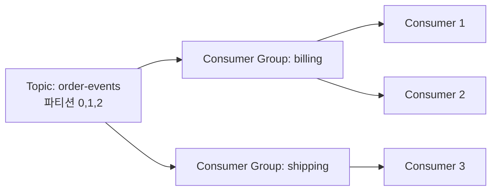

# Pub-Sub와 Point-to-Point

## 핵심 정의
Point-to-Point(P2P)는 하나의 메시지를 한 논리적 소비자 집합 안에서 한 소비자(consumer)에게 작업을 배분하는 모델이다. 여러 워커가 같은 큐를 바라보고 있어도 정상 전달에서는 그중 한 명이 담당하지만 장애 후 다른 소비자에게 재전달될 수 있으며, 주로 작업 분산(work distribution)에 쓰인다. Pub-Sub(Publish-Subscribe)는 하나의 메시지를 일치하는 각 논리적 구독에 전달하는 모델로, 이벤트를 여러 서비스에 동시에 알려야 할 때 쓰인다.

두 모델은 메시징 시스템의 근본적인 라우팅 방식 차이이며, 실제로는 브로커(broker)가 제공하는 토폴로지 요소(exchange, topic, consumer group 등)를 어떻게 구성하느냐에 따라 하나의 시스템에서 두 패턴을 모두 구현할 수 있다.

## 동작 원리 / 구조

**RabbitMQ 기준**
- P2P(Work Queue): producer가 default 또는 지정 exchange를 통해 큐로 라우팅하고, 여러 consumer가 같은 큐를 구독한다. 동일 우선순위의 소비자는 사용 가능한 prefetch 여유에 따라 대체로 라운드로빈으로 분담한다. default exchange(direct)를 통해 큐 이름으로 라우팅하는 구조다.
- Pub-Sub(Fanout/Topic exchange): producer는 exchange에만 메시지를 발행하고, fanout은 모든 바인딩 큐에, topic은 매칭되는 큐에 라우팅한다. 서비스별 독립 구독은 서비스마다 큐를 두고 그 서비스의 여러 워커가 함께 소비한다. 익명 exclusive 큐는 연결 동안만 필요한 일시 구독에 적합하다.

```
[Producer] -> [Queue] -> Consumer A  (P2P: 메시지는 A 또는 B 중 하나로)
                      -> Consumer B

[Producer] -> [Fanout Exchange] -> [Queue A] -> Consumer A
                                 -> [Queue B] -> Consumer B  (Pub-Sub: 둘 다 받음)
```

**Kafka 기준**
Kafka는 토픽(topic)에 파티션(partition) 단위로 메시지를 저장하고, consumer group이라는 개념으로 두 모델을 동시에 지원한다.
- 같은 consumer group에 속한 consumer들은 파티션을 나눠 가지므로, 그룹 내에서는 P2P처럼 동작한다(한 파티션의 메시지는 그룹 내 한 consumer만 소비).
- 서로 다른 consumer group은 동일 토픽을 각자의 시작 오프셋과 보존 범위 내에서 독립적으로 읽으므로, 그룹 간에는 Pub-Sub처럼 동작한다.


billing 그룹과 shipping 그룹은 같은 메시지를 각자 전부 받는다(Pub-Sub). billing 그룹 안의 C1, C2는 파티션을 나눠가져 소유권을 나눈다(P2P). 커밋 전 장애에 따른 중복 처리는 별개다.

## 실무 관점
- 작업 분산(이미지 리사이즈, 이메일 발송 등 동일한 처리를 여러 워커가 나눠 하는 경우)에는 P2P가 적합하다. 처리량을 늘리려면 처리 병목과 파티션·큐·다운스트림 한도 내에서 워커를 늘린다.
- 이벤트 브로드캐스트(주문 생성 이벤트를 결제, 배송, 알림 서비스가 각각 알아야 하는 경우)에는 Pub-Sub이 적합하다. 서비스 간 결합도를 낮추는 이벤트 기반 아키텍처(event-driven architecture)의 기본 패턴이다.
- 흔한 실수: Kafka에서 소비자를 늘려 처리량을 올리려다 같은 consumer group으로 묶지 않고 서로 다른 group.id를 부여해버리는 경우. 이러면 스케일 아웃이 아니라 각자 전체 메시지를 중복 소비하는 Pub-Sub이 되어버린다.
- 흔한 실수: Kafka에서 파티션 수보다 consumer 수를 늘려도 유휴(idle) 상태 consumer가 생길 뿐 처리량이 늘지 않는다. 이는 일반 KafkaConsumer 그룹 범위이며 4.2+ Share Groups는 같은 파티션을 여러 소비자가 분담하는 별도 모델이다.
- RabbitMQ에서 Pub-Sub을 쓸 때 consumer가 재시작되면 exclusive 큐가 삭제되어 그 사이 발행된 메시지를 놓칠 수 있다. 재시작 중에도 메시지를 보존해야 하면 durable하고 이름이 고정된 큐 + 명시적 바인딩을 쓰거나, Kafka처럼 로그 기반(log-based) 시스템으로 옮겨야 한다.
- 튜닝 포인트: Kafka는 파티션 수와 consumer group 설계, RabbitMQ는 exchange 타입(direct/fanout/topic/headers) 선택과 큐의 durable/exclusive 속성이 핵심 설계 지점이다.

## 심화 Q&A

### Q. Kafka에서 같은 토픽을 여러 consumer group이 구독할 때와 RabbitMQ에서 fanout exchange로 여러 큐에 브로드캐스트할 때, 저장 구조 차이 때문에 생기는 실무 차이는?
Kafka는 로그를 일정 기간(retention) 보관하고 각 consumer group이 자신의 오프셋(offset)만 관리하므로, 늦게 붙은 consumer group도 처음부터(또는 원하는 시점부터) 다시 읽을 수 있다. RabbitMQ 일반 큐에서는 발행 시 매칭된 큐에 저장되고 ACK 후 제거된다. 소비자가 당시 오프라인이어도 큐·바인딩과 메시지가 유지되면 나중에 받을 수 있다. 당시 구독 큐가 없었다면 과거 메시지를 받을 수 없다(Streams는 별도 모델). 즉 Kafka는 "재생(replay) 가능한 Pub-Sub", RabbitMQ 기본 큐는 "일회성 Pub-Sub"에 가깝다.

### Q. 한 consumer group 안에서 특정 consumer가 느리게 처리하면 전체 P2P 파이프라인에 어떤 영향이 있는가?
Kafka는 파티션 단위로 consumer를 배정하므로, 느린 consumer가 담당한 파티션의 컨슈머 랙(consumer lag)만 커지고 독립적인 다른 소비자의 파티션은 직접 영향이 적지만 같은 소비자의 다른 파티션·공유 DB·스레드 자원은 함께 지연될 수 있다. 다만 해당 consumer가 max.poll.interval.ms를 넘기면 그룹에서 제외되고 리밸런싱(rebalancing)이 발생해 순간적으로 전체 그룹의 처리가 멈출 수 있다. RabbitMQ Work Queue는 prefetch(QoS) 설정이 낮으면 느린 consumer가 메시지를 쌓아두지 않고 ack 전까지 새 메시지를 받지 않아, 자연스럽게 다른 consumer로 부하가 분산된다.

### Q. Pub-Sub 구조에서 특정 구독자 하나가 장애로 오래 다운되면 메시지 유실 위험이 있는가?
Kafka는 로그 기반이라 다운된 consumer group의 오프셋이 멈춰있을 뿐 메시지 자체는 retention 기간 동안 보존되므로, 복구 후 이어서 읽으면 된다(단, retention을 초과하면 유실). RabbitMQ는 durable 큐 + 영속 메시지(persistent message)로 설정했다면 브로커가 재시작되어도 소비되지 않은 메시지는 남아있지만, exclusive 큐는 소유 연결 종료 시 삭제된다. auto-delete 큐는 소비자가 붙은 적이 있고 마지막 소비자가 없어질 때 삭제되므로 두 속성의 조건은 다르다. 그래서 반드시 살아있어야 하는 구독자는 이름이 고정된 durable 큐를 쓰는 것이 필수다.

### Q. P2P인데도 메시지 순서를 보장해야 하는 요구사항이 있다면 어떻게 설계하는가?
Kafka는 같은 파티션 안에서만 순서를 보장하므로, 순서가 중요한 단위(예: 특정 주문 ID)를 파티션 키로 묶어 항상 같은 파티션에 가도록 해야 한다. 이 경우 그 키에 대한 처리량은 파티션 하나의 소비 속도로 제한된다. RabbitMQ는 큐 하나에 순차 처리하는 소비자 하나를 두고 우선순위·재전달·다중 발행 채널 영향을 통제하면 로그 전달 순서를 유지하기 쉽지만 병렬 처리를 포기하는 셈이다. 결국 순서 보장과 병렬 처리량은 트레이드오프 관계다.

### Q. Pub-Sub과 P2P 중 어느 쪽이 "적어도 한 번(at-least-once)" 전달을 더 보장하기 쉬운가?
모델 자체보다는 내구성·복제·보존 정책과 처리 후 ACK 방식에 달려 있다. 두 모델 모두 consumer가 처리를 끝낸 뒤 명시적으로 ack하고, ack 전에 장애가 나면 재전달(redelivery)되도록 구성하면 at-least-once가 된다. 다만 Pub-Sub은 여러 구독자가 각자 독립적으로 ack 상태를 관리해야 하므로 구현이 더 복잡하고, 한 구독자의 재처리가 다른 구독자에 영향을 주지 않도록 격리해야 한다.

## 관련 개념
- [[멱등성과 메시지 순서 보장]]
- [[파티션과 컨슈머 그룹]]
- [[메시지 큐 선택 기준]]

## 참고 자료

확인일: 2026-09-08. 아래 적용 범위에서 본문·Q&A·예제를 재검증했다. 예제는 문서와 대조했으며 별도 실행 검증은 하지 않았다.

- [KafkaConsumer API](https://kafka.apache.org/43/javadoc/org/apache/kafka/clients/consumer/KafkaConsumer.html) — Kafka 4.3.1, 논리 구독·파티션 소유권·재처리.
- [KafkaShareConsumer API](https://kafka.apache.org/43/javadoc/org/apache/kafka/clients/consumer/KafkaShareConsumer.html) — Kafka 4.3.1, 공유 소비 모델.
- [RabbitMQ Exchanges](https://www.rabbitmq.com/docs/exchanges) — RabbitMQ 4.3, fanout/topic 라우팅.
- [RabbitMQ Queues](https://www.rabbitmq.com/docs/queues) — RabbitMQ 4.3, exclusive/auto-delete·순서.
- [RabbitMQ ACK and Confirms](https://www.rabbitmq.com/docs/confirms) — RabbitMQ 4.3, prefetch·처리 후 ACK·재전달.
