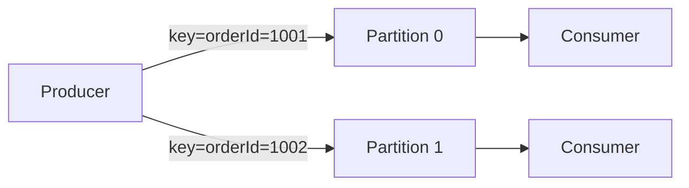

# 멱등성과 메시지 순서 보장

## 핵심 정의
멱등성(idempotency)이란 동일한 메시지를 두 번 이상 처리해도 결과가 한 번 처리한 것과 같아야 한다는 성질이다. 대부분의 메시지 큐는 네트워크 장애나 재시도(retry) 상황에서 "정확히 한 번(exactly-once)" 전달을 완벽히 보장하기 어렵기 때문에, 실무에서는 "적어도 한 번(at-least-once)" 전달을 기본으로 하고 소비자 측에서 멱등하게 처리해 중복을 흡수하는 전략을 쓴다.

메시지 순서 보장(message ordering)은 producer가 보낸 순서대로 consumer가 메시지를 처리하도록 보장하는 것이다. 분산 시스템에서는 파티션/샤드 분산, 병렬 consumer, 재시도 등이 순서를 깨뜨릴 수 있어, 순서가 중요한 도메인(예: 계좌 잔액 변경, 상태 전이)에서는 별도의 설계가 필요하다.

## 동작 원리 / 구조

**멱등성 확보 방식**
1. Producer 측 멱등성: Kafka는 Kafka 3.0부터 `enable.idempotence`가 기본값 `true`로 바뀌었다(KIP-679). Producer마다 PID(Producer ID)와 시퀀스 번호(sequence number)를 부여해, 브로커가 같은 PID·시퀀스의 메시지를 중복으로 감지하면 버린다. 이는 "producer 재시도로 인한 브로커 측 중복 저장"만 막아주며, 애플리케이션 로직상의 중복 발행이나 consumer 측 중복 처리까지 막아주지는 않는다.
2. Consumer 측 멱등성: 외부 DB 반영에 사용하는 방식. 메시지에 고유 ID(idempotency key)를 부여하고, 유니크 제약으로 중복 ID 등록을 원자적으로 판정하고 비즈니스 변경과 같은 트랜잭션에 기록한다. SELECT 후 INSERT를 분리하면 경쟁 조건이 생긴다.

```sql
-- PostgreSQL 18, PRIMARY KEY (subscriber_id, message_id) 전제
-- :name은 애플리케이션 바인딩 변수이며 psql 문법 자체는 아니다.
BEGIN;
INSERT INTO processed_message (subscriber_id, message_id, processed_at)
VALUES (:subscriberId, :messageId, now())
ON CONFLICT (subscriber_id, message_id) DO NOTHING
RETURNING message_id;
-- 애플리케이션: 반환 행이 있을 때만 같은 연결/트랜잭션에서 업무 SQL 실행
-- 실패하면 ROLLBACK, 전부 성공한 경우에만 COMMIT 후 ACK
COMMIT;
```

3. 비즈니스 로직 자체를 멱등하게 설계: 상태 설정은 같은 값을 반복 적용하는 데 멱등할 수 있지만, 오래된 이벤트가 새 상태를 덮어쓰지 않도록 버전 조건도 필요하다. 증감 연산은 이벤트 ID와 반영을 원자적으로 묶는다. UPSERT만 추가한다고 모든 업무 부수 효과가 멱등해지는 것은 아니다.

**순서 보장 방식**

Kafka는 토픽 전체가 아니라 파티션 단위로만 순서를 보장한다. 같은 직렬화 키·파티셔너·파티션 수를 유지하면 같은 키는 같은 파티션에 들어간다. 보장되는 것은 파티션 로그 오프셋 순서이며, 여러 프로듀서의 업무 발생 시각이나 비동기 처리 완료 순서까지 같지는 않다. 증설·명시적 파티션 지정은 키 라우팅을 바꿀 수 있다.



주의할 점은 재시도가 순서를 깨뜨릴 수 있다는 것이다. `max.in.flight.requests.per.connection`이 1보다 크면, 먼저 보낸 배치가 실패해서 재시도하는 동안 나중에 보낸 배치가 먼저 성공해 순서가 뒤바뀔 수 있다. Kafka는 idempotent producer가 활성화되면 이 값이 최대 5까지 허용되면서도 시퀀스 검증·중복 거절과 클라이언트 재시도로 순서를 보장하지만(브로커가 임의 배치를 받아 정렬해 주는 모델은 아니다), idempotence를 끄고 재시도 병렬도를 높이면 순서가 깨질 수 있다.

RabbitMQ는 기본적으로 큐 하나에 대해 발행 순서대로 전달하지만, 여러 consumer가 동시에 붙어 있으면(각 prefetch가 1이어도) 처리 완료 순서가 뒤섞일 수 있다. 엄격한 순서가 필요하면 consumer를 하나로 제한하거나, 순서가 중요한 단위별로 별도 큐를 두는 방식을 쓴다.

## 실무 관점
- 언제 멱등성 처리가 필요한가: consumer가 메시지를 처리한 뒤 ack하기 전에 크래시가 나면, 브로커는 ack를 못 받았으니 재전달한다. 이 재전달로 인한 중복 처리를 막으려면 반드시 멱등 처리가 필요하다. "at-least-once + 멱등 처리"가 사실상 업계 표준 조합이다.
- 트레이드오프: exactly-once semantics(Kafka의 트랜잭션 API 등)는 강력하지만 처리량 저하와 구현 복잡도 증가를 감수해야 한다. 소비자 멱등 키 확인만으로 충분한지는 원자적 반영 범위·외부 API 지원·중복 기록 보존 기간에 따라 판단한다.
- 흔한 장애 패턴: 멱등 키 저장과 실제 비즈니스 로직 수행을 하나의 트랜잭션으로 묶지 않아서, 비즈니스 로직은 성공했는데 멱등 키 기록이 실패(또는 그 반대)하는 경우가 생긴다. 반드시 같은 트랜잭션(또는 DB의 유니크 제약 + 후속 로직을 하나의 원자적 단위)으로 묶어야 한다.
- 흔한 장애 패턴: 재시도 로직에서 파티션 키를 잘못 설정해(예: 시간 기반 랜덤 키) 순서가 중요한 이벤트가 여러 파티션에 흩어지는 경우. orderId, userId처럼 순서가 의미 있는 단위를 키로 써야 한다.
- 튜닝 포인트: Kafka는 `enable.idempotence`, `max.in.flight.requests.per.connection`, `acks`, 파티션 키 설계. RabbitMQ는 consumer 수와 prefetch count, 큐 분할 전략이 핵심이다.
- Kafka Streams나 Spring Kafka에서 소비자 측 재처리 방지를 위해 Redis TTL 기반 dedup 캐시를 쓰는 경우도 많다. 다만 캐시는 유실 가능성이 있으므로 최종 방어선은 DB 유니크 제약이어야 한다.

## 심화 Q&A

### Q. Kafka의 idempotent producer가 켜져 있어도 애플리케이션 레벨에서 중복 메시지가 발생할 수 있는 경우는?
Producer 프로세스가 재시작되면 비트랜잭션 프로듀서는 보통 새 PID로 시작하므로, 재시작 전에 브로커에 실제로는 도착했지만 ack를 못 받아 애플리케이션이 실패로 착각하고 재시작 후 다시 발행하면 중복이 생긴다. 또한 애플리케이션 로직에서 같은 이벤트를 두 번 만들어 발행하는 경우(예: 재시도 로직이 이미 발행 성공한 메시지를 다시 발행)는 producer의 멱등성 메커니즘이 잡아주지 못한다. 이는 메시지에 비즈니스 레벨의 고유 ID를 심고 consumer 측에서 dedup해야 막을 수 있다.

### Q. Kafka 트랜잭션(transactional producer)을 쓰면 exactly-once가 완전히 보장되는가?
Kafka 내부(토픽 간, consume-transform-produce 패턴)에서는 트랜잭션과 `read_committed` 격리 수준을 조합하면 exactly-once semantics를 달성할 수 있다. 하지만 Kafka 바깥의 외부 시스템(DB, 외부 API 호출 등)과의 연동까지 포함하면 얘기가 다르다. 외부 부수효과(side effect)를 트랜잭션에 포함시킬 수 없으므로, "메시지 처리 + 외부 시스템 반영"의 원자성은 여전히 별도로(예: 같은 DB 트랜잭션의 inbox/멱등 키 기록, 후속 발행에는 Transactional Outbox) 보장해야 한다.

### Q. 파티션 키를 이용한 순서 보장 방식에서, 리밸런싱(rebalancing)이 발생하면 순서가 깨질 수 있는가?
리밸런싱은 파티션을 어떤 consumer가 담당하느냐를 바꿀 뿐, 파티션 내부의 메시지 순서 자체를 바꾸지는 않는다. 다만 리밸런싱 도중 커밋되지 않은 오프셋이 있으면, 새로 파티션을 넘겨받은 consumer가 이전 consumer가 이미 처리했지만 커밋 못한 메시지를 다시 처리하게 되어 로그 재생 순서는 유지되어도 이미 처리한 메시지 이후 과거 메시지가 다시 적용될 수 있다. 이전 소비자의 비동기 작업이 계속 실행되면 새 소비자와 부수 효과가 경합하므로 소유권 상실 시 작업 중단·버전 검사·fencing도 검토한다. 그래서 순서 보장과 멱등성 처리는 항상 세트로 다뤄야 한다.

### Q. 순서를 보장하기 위해 파티션을 1개로 줄이면 어떤 문제가 생기는가?
전체 토픽의 처리량이 파티션 하나를 소비하는 consumer 하나의 속도로 제한된다. 즉 일반 컨슈머 그룹에서 파티션 소비 병렬도를 늘릴 수 없다. 순서 제약이 없는 외부 계산은 별도 병렬화할 수 있으나 커밋·부수 효과 순서는 추가 제어가 필요하다. 그래서 실무에서는 토픽 전체 순서 대신 "키 단위 순서"만 보장하고, 서로 다른 키는 병렬로 처리되도록 파티션을 충분히 늘리는 것이 일반적인 절충안이다. 정말 전역 순서가 필요한 경우는 드물고, 대개는 특정 엔티티(주문, 계좌) 단위의 순서만 있으면 충분하다.

### Q. 멱등 키를 어느 범위(scope)로 잡아야 하는지 판단 기준은?
멱등 키는 "같다고 판단해야 하는 재시도"를 정확히 식별할 수 있는 최소 단위여야 한다. 너무 넓게 잡으면(예: 사용자 ID 단위) 서로 다른 정당한 이벤트까지 중복으로 오인해 유실시킬 수 있고, 너무 좁게 잡으면(예: 매번 새로 생성되는 UUID) 실제 재시도된 같은 이벤트를 다른 이벤트로 착각해 중복 처리를 막지 못한다. 보통은 producer가 이벤트 생성 시점에 발급하는 고정 이벤트 ID를 메시지에 실어 보내고, 각 논리 소비자의 처리 범위와 그 이벤트 ID를 묶는 것이 안전하다. 서로 다른 서비스가 같은 중복 테이블을 공유한다면 `(subscriberId, eventId)`처럼 범위를 분리한다. 동일 키에 다른 payload가 오면 충돌을 감지하고, 기록 보존은 최대 재전달·백필 기간에 맞춘다.

### Q. 소비자 측 멱등 처리와 브로커 측 중복 제거(dedup) 중 어느 쪽을 우선해야 하는가?
브로커 측 중복 제거(Kafka의 producer 멱등성 등)는 "네트워크 재시도로 인한 중복"이라는 좁은 범위만 막아주고, 브로커나 프로토콜에 종속적이다. 반면 소비자 측 멱등 처리는 producer 재시작, 애플리케이션 버그, 브로커 교체 등 더 넓은 범위의 중복까지 방어할 수 있고 브로커 종류에 의존하지 않는다. 따라서 브로커 측 기능은 있으면 켜두는 보조 수단으로 두고, 최종 방어선은 항상 소비자 측(비즈니스 로직 레벨) 멱등 처리로 가져가는 것이 안전하다.

### Q. 더 큰 버전의 이벤트만 반영하면 순서가 뒤바뀌어도 안전한가?
A. 이벤트가 전체 최신 상태를 담는지, 이전 상태에 적용할 변화량을 담는지에 따라 다르다. 전체 상태를 대체하는 이벤트라면 버전 12 반영 후 도착한 11을 무시하는 정책을 설계할 수 있다. 반면 입금 +100인 버전 11을 건너뛰고 출금 -20인 12만 반영하면 잔액이 틀린다. 변화량·상태 전이 이벤트는 기대 버전과 실제 버전을 비교하고 누락된 선행 이벤트를 기다리거나 재조회·재처리해야 한다.

예를 들어 `UPDATE projection SET balance = balance + :delta, version = :nextVersion WHERE id = :id AND version = :expectedVersion`의 영향 행 수가 1일 때만 같은 트랜잭션에서 이벤트를 처리 완료로 기록한다. 0은 이미 처리됨·선행 이벤트 누락·대상 없음 중 하나일 수 있으므로 분류해야 한다. inbox 등록을 먼저 했다면 버전 불일치 시 그 등록도 롤백하거나 별도의 미처리 상태로 남겨야 한다. 등록만 커밋한 뒤 ACK하면 재전달을 중복으로 버려 복구할 기회를 잃는다.

## 관련 개념
- [[Pub-Sub와 Point-to-Point]]
- [[파티션과 컨슈머 그룹]]
- [[트랜잭셔널 아웃박스]]

## 참고 자료

확인일: 2026-09-08. 아래 적용 범위에서 본문·Q&A·예제를 재검증했다. 예제는 문서와 대조했으며 별도 실행 검증은 하지 않았다.

- [Kafka Producer Configs](https://kafka.apache.org/43/configuration/producer-configs/) — Kafka 4.3, 멱등성·in-flight·파티셔닝.
- [KafkaProducer API](https://kafka.apache.org/43/javadoc/org/apache/kafka/clients/producer/KafkaProducer.html) — Kafka 4.3.1, 세션 중복 제거·트랜잭션 경계.
- [RabbitMQ Queue Ordering](https://www.rabbitmq.com/docs/queues) — RabbitMQ 4.3, 다중 소비자·순서.
- [Idempotent Consumer Pattern](https://microservices.io/patterns/communication-style/idempotent-consumer.html) — 패턴 저자 Chris Richardson, subscriber/event ID·DB 트랜잭션.
- [PostgreSQL INSERT](https://www.postgresql.org/docs/18/sql-insert.html) — PostgreSQL 18, ON CONFLICT·RETURNING 예제.

부분 재검증: 2026-09-23. PostgreSQL 18 조건부 UPDATE의 영향 행 수와 Idempotent Consumer 패턴의 처리 기록·업무 변경 원자성을 확인했다. 전체 상태 이벤트와 변화량 이벤트의 예시는 그 계약을 적용한 설계 분석이며 SQL 실행 검증은 하지 않았다.

- [PostgreSQL 18 UPDATE](https://www.postgresql.org/docs/18/sql-update.html) — WHERE 조건과 변경 행 수. 위 Idempotent Consumer 원문도 동일 트랜잭션 범위에서 재확인.
